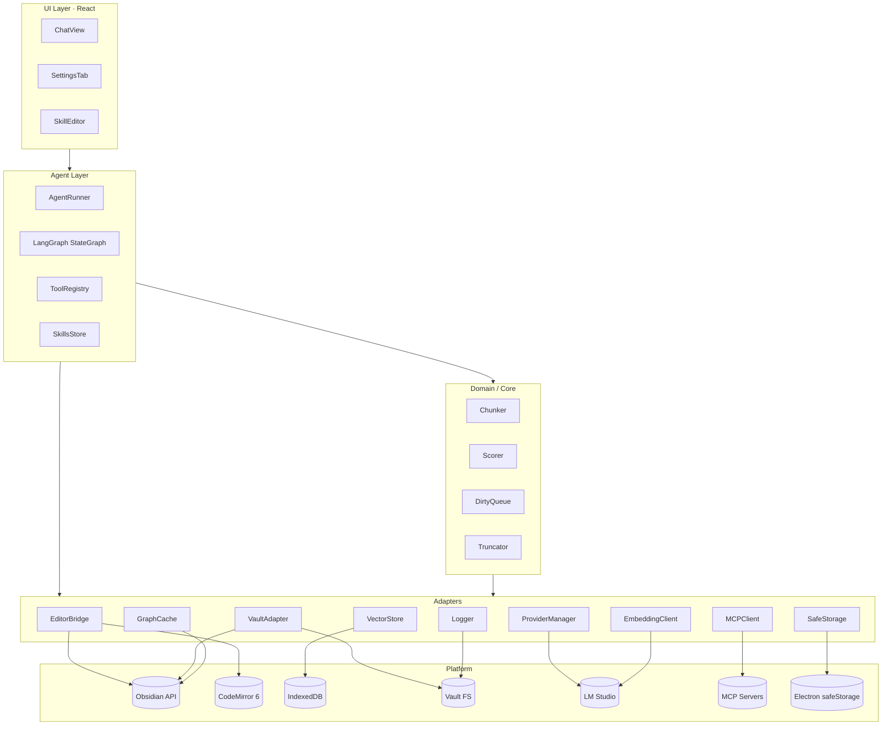
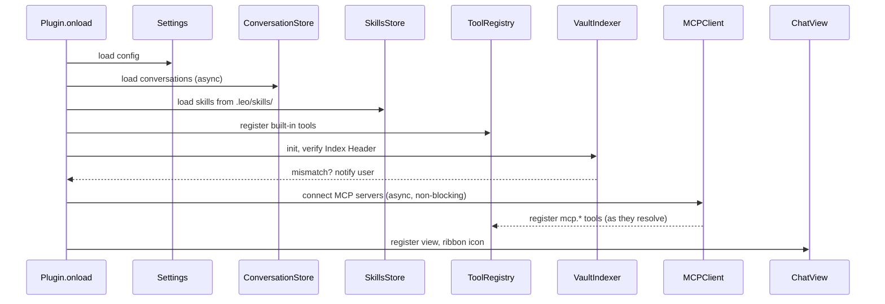
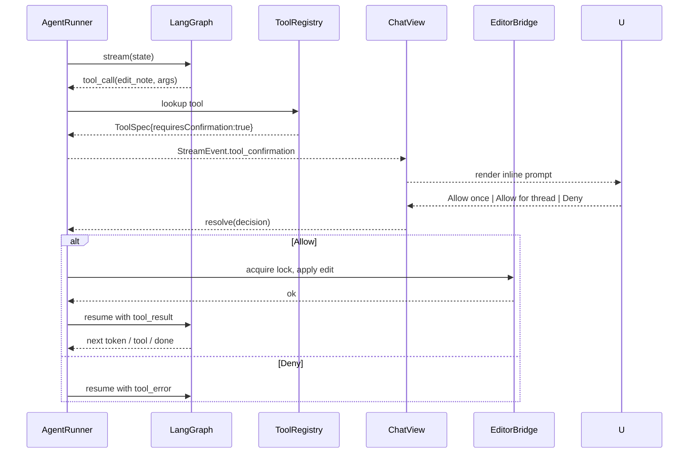
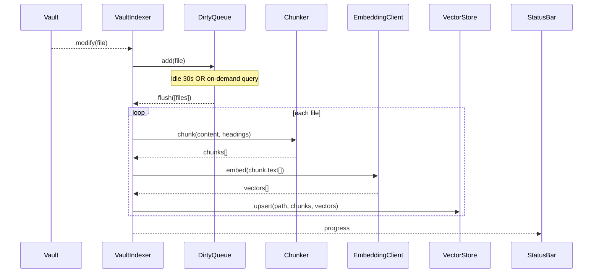
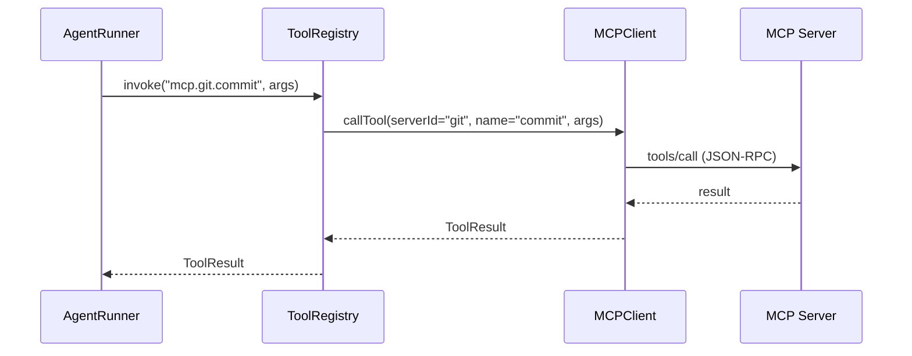
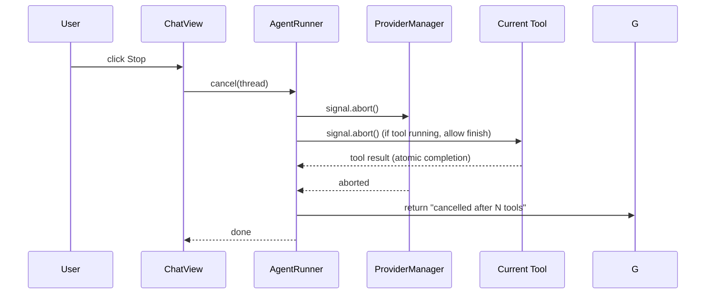

# Leo - Architecture

Companion to `srs.md` and `tech-stack.md`. Maps SRS requirements to concrete modules, contracts, and data flows.

## 1. Architectural Principles

| Principle | Implication |
|---|---|
| **Local-first** | No network egress except user-configured providers / MCP servers. Embeddings + index on disk. |
| **Layered, unidirectional deps** | UI → Agent → (Tools, RAG, Provider) → Platform. No upward calls. Events only bubble up via observer pattern. |
| **Pure core, IO at edges** | Chunking, scoring, graph math, truncation, queue — pure functions, unit-testable. Obsidian/LM Studio/IndexedDB calls isolated in adapters. |
| **One in-flight agent request** | Global `AgentRunner` singleton enforces FR-AGENT-07. All UI messaging goes through its FIFO queue. |
| **Interrupt-driven tool flow** | LangGraph `interrupt()` pauses graph before `requiresConfirmation` tools; ChatView resumes on user approval. No ad-hoc event buses. |
| **Registry pattern for tools** | All tools (built-in, user-defined, MCP) funnel through `ToolRegistry`. Agent never imports tool implementations directly. |
| **Fail-safe editor ops** | Every EditorBridge edit is try/finally wrapped to guarantee edit lock release (NFR-REL-04). |

---

## 2. Layer Diagram



**Rule:** arrow direction only. No back-edges.

---

## 3. Modules

### 3.1 UI Layer (React, mounted inside Obsidian views)

| Module | Responsibility | Owns |
|---|---|---|
| `ChatView` (`ItemView`) | Sidebar chat. Hosts Assistant UI runtime. Skill picker. Tool-confirmation prompts. Context indicator. | `AssistantRuntime`, thread state, confirmation promises |
| `SettingsTab` (`PluginSettingTab`) | Provider config, paths, logLevel, MCP servers, exclude globs | Settings form state |
| `SkillEditor` (`ItemView`, phase 5) | GUI for creating/editing skills | Skill draft state |

**No direct Obsidian FS / Vault calls from UI.** Routes everything through `AgentRunner` or adapters via a typed context (`LeoContext`).

### 3.2 Agent Layer

| Module | Responsibility |
|---|---|
| `AgentRunner` | Singleton. Owns in-flight state. Accepts user messages from ChatView; dispatches through LangGraph; emits stream events. Enforces FIFO queue (FR-CHAT-10), cancellation (FR-AGENT-09), one-in-flight (FR-AGENT-07). |
| `GraphBuilder` | Constructs the LangGraph `StateGraph` from {provider, tools, skill, RAG}. Returns a compiled graph per thread. |
| `ToolRegistry` | Aggregates built-in + user + MCP tools. Provides `listFor(thread)` honoring `Skill.allowedTools`. |
| `SkillsStore` | Loads skills from `.leo/skills/`. Watches FS events for hot reload. Applies skill to thread state. |
| `ConversationStore` | Persists threads to `.leo/conversations/<id>.json`. Load on startup. Save debounced on mutation. |
| `Truncator` | Pure. Given messages + context budget → trimmed messages preserving priority (active note > RAG > history > skill examples). |

### 3.3 Domain / Core (pure)

| Module | Responsibility |
|---|---|
| `Chunker` | Split markdown by headings or fixed-token windows. Returns `Chunk[]` with metadata. |
| `Scorer` | Cosine similarity + graph/tag boost math. Pure input → score. |
| `DirtyQueue` | Set-backed queue with debounced flush. Pure state machine; IO wired externally. |
| `ContextAssembler` | Builds system prompt from {activeNote, focusedContext, RAGHits, skill, history}. Pure. |
| `GraphTraversal` | k-hop neighborhood computation over adjacency map. Pure. |

### 3.4 Adapters

| Module | Responsibility | Platform |
|---|---|---|
| `EditorBridge` | CM6 extension. Tracks Focused Context. Applies edits under edit lock with decorations. Try/finally ensures lock release. | CM6 + Obsidian `Editor` |
| `VaultAdapter` | Thin wrapper over `app.vault`: `read/create/modify/append/delete/rename`. Exposes typed events. | Obsidian `Vault` |
| `ProviderManager` | LLM chat calls. FIFO queue, retry, timeout, `AbortController`. Returns `AsyncIterable<StreamEvent>`. | LM Studio (HTTP) |
| `EmbeddingClient` | `embed(texts: string[]): number[][]` with batching and retry. | LM Studio `/v1/embeddings` |
| `VectorStore` | `upsert / delete / query(topK)`. v1 naive in-memory + IndexedDB persist. `hnswlib-wasm` later. | IndexedDB |
| `GraphCache` | Symmetric adjacency map + tag index from `metadataCache`. Incremental updates on `resolved`. | `MetadataCache` |
| `MCPClient` | Connects to MCP servers. Discovers tools/resources/prompts. Reconnect with backoff. | `@modelcontextprotocol/sdk` |
| `SafeStorage` | Wraps Electron `safeStorage.encryptString/decryptString`. Fallback obfuscation. | Electron |
| `Logger` | Leveled logs. Rotating file writer at `.leo/logs/leo.log`. | Vault FS |

---

## 4. Key Contracts

TypeScript signatures. Enforced at module boundaries.

```typescript
// Focused context pushed from EditorBridge into AgentRunner
interface FocusedContext {
  file: string | null;            // vault-relative path
  cursor: { line: number; ch: number } | null;
  selection: { text: string; from: Pos; to: Pos } | null;
  viewport: { from: number; to: number; text: string } | null;
}

// Tool registration (uniform for built-in, user-defined, MCP)
interface ToolSpec {
  id: string;                     // e.g. "read_note" or "mcp.github.create_issue"
  description: string;
  schema: z.ZodType;              // zod input schema
  requiresConfirmation: boolean;  // default true for write/destructive
  invoke(input: unknown, ctx: ToolCtx): Promise<ToolResult>;
  source: "builtin" | "user" | "mcp";
  mcpServerId?: string;           // when source === "mcp"
}

interface ToolCtx {
  thread: ThreadRef;
  abort: AbortSignal;
  logger: Logger;
  vault: VaultAdapter;
  editor: EditorBridge;           // for active-note edits
}

// Skill
interface Skill {
  id: string;
  name: string;
  description: string;
  systemPrompt: string;
  allowedTools?: string[];        // tool ids; undefined = all
  examples?: Array<{ user: string; assistant: string }>;
  defaultModel?: string;
  source: "builtin" | "user" | "mcp";
}

// Provider event stream
type StreamEvent =
  | { type: "token"; text: string }
  | { type: "tool_call"; call: { id: string; name: string; args: unknown } }
  | { type: "tool_confirmation"; call: ToolCall; resolve: (d: Decision) => void }
  | { type: "tool_result"; id: string; result: ToolResult }
  | { type: "usage"; input: number; output: number }
  | { type: "done" }
  | { type: "error"; error: Error };

// Agent entry point
interface AgentRunner {
  send(msg: UserMessage, thread: ThreadRef): AsyncIterable<StreamEvent>;
  cancel(thread: ThreadRef): void;
  queueLength(): number;
}
```

---

## 5. Data Flows

### 5.1 Plugin Startup



All async steps kicked in parallel. `onload` returns fast.

### 5.2 Chat Turn (no tools)

```mermaid
sequenceDiagram
    participant U as User
    participant CV as ChatView
    participant AR as AgentRunner
    participant RAG as RAGEngine
    participant CA as ContextAssembler
    participant PM as ProviderManager

    U->>CV: type message, send
    CV->>AR: send(msg, thread)
    AR->>AR: enqueue; if busy → pending
    AR->>RAG: query(msg + activeNote)
    RAG-->>AR: top-K chunks
    AR->>CA: assemble(skill, focused, rag, history)
    CA-->>AR: prompt
    AR->>PM: stream(prompt, signal)
    PM-->>AR: token stream
    AR-->>CV: StreamEvent.token (each)
    PM-->>AR: usage, done
    AR-->>CV: usage, done
```

### 5.3 Chat Turn (with tool call + confirmation)



### 5.4 Lazy Indexing



### 5.5 MCP Tool Call

MCP tools behave identically to built-in tools from the agent's perspective. Difference lives in `ToolSpec.invoke`:



Namespace `mcp.<serverId>.<toolName>` keeps ids collision-free.

### 5.6 Cancellation



Active edit locks released in `finally` on every exit path.

---

## 6. State Ownership

| State | Owner | Persistence |
|---|---|---|
| Open threads | `ConversationStore` | `.leo/conversations/<id>.json` |
| Active thread id, per-thread allowlist | `ConversationStore` | Thread JSON |
| Plugin settings | Obsidian `loadData()` | `data.json` in plugin dir |
| Skills | `SkillsStore` | `.leo/skills/*.md` or `.json` |
| MCP server configs | `SettingsTab` → `data.json` (non-secret) + `SafeStorage` (secrets) | mixed |
| Index Header | `VaultIndexer` | IndexedDB + mirror at `.leo/index/header.json` |
| Embeddings | `VectorStore` | IndexedDB |
| Graph adjacency | `GraphCache` | in-memory, rebuildable from `metadataCache` |
| Focused Context | `EditorBridge` | in-memory only |
| In-flight request, queue, abort controllers | `AgentRunner` | in-memory only |
| Logs | `Logger` | `.leo/logs/leo.log*` |

---

## 7. Error Handling Strategy

| Failure | Handling |
|---|---|
| LM Studio unreachable | Status bar red; Notice; queued requests fail fast; indexing paused. Reconnect probe every 15s. |
| MCP server crash | Tool call returns `ToolResult{ ok:false }`; agent receives tool-error; user sees error bubble. Client reconnects with backoff. |
| Tool throws | Caught; converted to tool-error; edit lock released; agent continues. |
| Graph invariant broken (e.g. unknown tool id) | Log + throw; request aborts with user-visible error. |
| IndexedDB corruption | Detected via header parse; user prompted to rebuild. |
| CM6 edit rejected | Lock released; edit reverted; Notice. |
| User denies tool | Tool-error "user denied <toolId>" fed back to model. |
| AbortController signal | Providers and tools surface abort as non-error termination. |
| safeStorage unavailable | Fall back to XOR-obfuscated storage + persistent warning banner. |

---

## 8. Extension Points

| Point | Mechanism |
|---|---|
| New LLM provider | Implement `Provider` interface, register in `ProviderManager`. |
| New tool (built-in) | Define `ToolSpec`, register in `ToolRegistry` on load. |
| User tool (phase 5) | Declarative JSON in `.leo/tools/<name>.json` loaded by `ToolRegistry`. |
| New skill | Drop file in `.leo/skills/`. Hot-reloaded by `SkillsStore`. |
| MCP server (phase 6) | Add config via settings → `MCPClient` auto-connects. |
| New chunking strategy | Implement `Chunker` interface; select in settings. |
| Vector store swap | Implement `VectorStore` interface; swap at construction. |
| Graph boost tuning | Config values in settings; `Scorer` reads them. |

---

## 9. Project File Layout (proposed)

```
leo/
├── manifest.json
├── package.json
├── esbuild.config.mjs
├── tsconfig.json
├── src/
│   ├── main.ts                       # Plugin entrypoint
│   ├── context.ts                    # LeoContext wiring (DI root)
│   ├── ui/
│   │   ├── ChatView.tsx              # ItemView + React mount
│   │   ├── chat/
│   │   │   ├── ChatRoot.tsx          # Assistant UI runtime host
│   │   │   ├── ContextIndicator.tsx
│   │   │   ├── SkillPicker.tsx
│   │   │   └── ToolConfirm.tsx
│   │   ├── SettingsTab.ts
│   │   ├── SkillEditor.tsx           # phase 5
│   │   └── styles.css
│   ├── agent/
│   │   ├── AgentRunner.ts
│   │   ├── graph.ts                  # LangGraph build
│   │   ├── ContextAssembler.ts
│   │   ├── Truncator.ts
│   │   └── types.ts
│   ├── tools/
│   │   ├── ToolRegistry.ts
│   │   ├── builtin/
│   │   │   ├── readNote.ts
│   │   │   ├── createNote.ts
│   │   │   ├── editNote.ts
│   │   │   ├── appendToNote.ts
│   │   │   └── searchVault.ts
│   │   └── user/                     # phase 5 loader
│   ├── skills/
│   │   ├── SkillsStore.ts
│   │   └── builtin/                  # bundled skill files
│   ├── rag/
│   │   ├── RAGEngine.ts
│   │   ├── Chunker.ts
│   │   ├── Scorer.ts
│   │   └── GraphTraversal.ts
│   ├── indexer/
│   │   ├── VaultIndexer.ts
│   │   ├── DirtyQueue.ts
│   │   └── IndexHeader.ts
│   ├── providers/
│   │   ├── ProviderManager.ts
│   │   ├── LMStudioProvider.ts
│   │   └── EmbeddingClient.ts
│   ├── editor/
│   │   ├── EditorBridge.ts
│   │   ├── focusedContext.ts         # CM6 StateField
│   │   ├── editLock.ts               # CM6 decoration/readonly
│   │   └── highlights.ts
│   ├── vault/
│   │   └── VaultAdapter.ts
│   ├── graph/
│   │   └── GraphCache.ts
│   ├── mcp/                          # phase 6
│   │   ├── MCPClient.ts
│   │   ├── transports.ts
│   │   └── tools.ts                  # wraps MCP tools into ToolSpec
│   ├── storage/
│   │   ├── VectorStore.ts
│   │   ├── ConversationStore.ts
│   │   └── SafeStorage.ts
│   ├── platform/
│   │   ├── Logger.ts
│   │   └── StatusBar.ts
│   └── util/
│       ├── fifoQueue.ts
│       ├── debounce.ts
│       └── paths.ts
├── tests/
│   ├── unit/
│   │   ├── chunker.test.ts
│   │   ├── scorer.test.ts
│   │   ├── truncator.test.ts
│   │   ├── dirtyQueue.test.ts
│   │   └── skillAssembly.test.ts
│   └── integration/
│       ├── provider.test.ts          # msw LM Studio fixture
│       ├── agent.test.ts             # LangGraph + mocks
│       └── mcp.test.ts               # fixture MCP server (phase 6)
└── .leo/                             # runtime, created in vault (docs only here)
    ├── config.json
    ├── conversations/
    ├── skills/
    ├── tools/                        # phase 5
    ├── index/
    └── logs/
```

---

## 10. Concurrency & Lifecycle Rules

- **Single `AgentRunner`** per plugin instance. UI must not bypass it.
- **FIFO queue** inside `AgentRunner`; at most one graph invocation active.
- **Indexer runs off-path**: own `DirtyQueue` + idle loop. Never shares a worker with the chat path.
- **MCP stdio children**: tracked in `MCPClient._procs`. `plugin.onunload` → `SIGTERM` each, 2s grace → `SIGKILL`.
- **Editor lock**: acquired via `EditorBridge.withLock(range, fn)` — guaranteed release in `finally`.
- **AbortController**: one per in-flight request; wired into provider `fetch` and tool `invoke(ctx)`.
- **Plugin unload**: cancel in-flight request, flush logger, close IndexedDB, disconnect MCP, unmount React roots.

---

## 11. Mapping: SRS FR → Modules

| FR | Module(s) |
|---|---|
| FR-CHAT-* | `ChatView`, `ChatRoot`, `ToolConfirm`, `SkillPicker`, `ContextIndicator`, `AgentRunner` |
| FR-EDIT-* | `EditorBridge`, `editLock`, `focusedContext`, `highlights` |
| FR-AGENT-* | `AgentRunner`, `graph.ts`, `ToolRegistry`, `ContextAssembler`, `Truncator` |
| FR-IDX-* | `VaultIndexer`, `DirtyQueue`, `Chunker`, `IndexHeader`, `VectorStore`, `GraphCache`, `VaultAdapter` |
| FR-RAG-* | `RAGEngine`, `Scorer`, `GraphTraversal`, `EmbeddingClient` |
| FR-PROV-* | `ProviderManager`, `LMStudioProvider`, `SafeStorage` |
| FR-SKILL-* | `SkillsStore`, `SkillPicker`, `SkillEditor` |
| FR-MCP-* | `MCPClient`, `mcp/tools.ts`, `ToolRegistry`, `SettingsTab` |

Every FR maps to at least one module. Any orphan FR is a gap.
