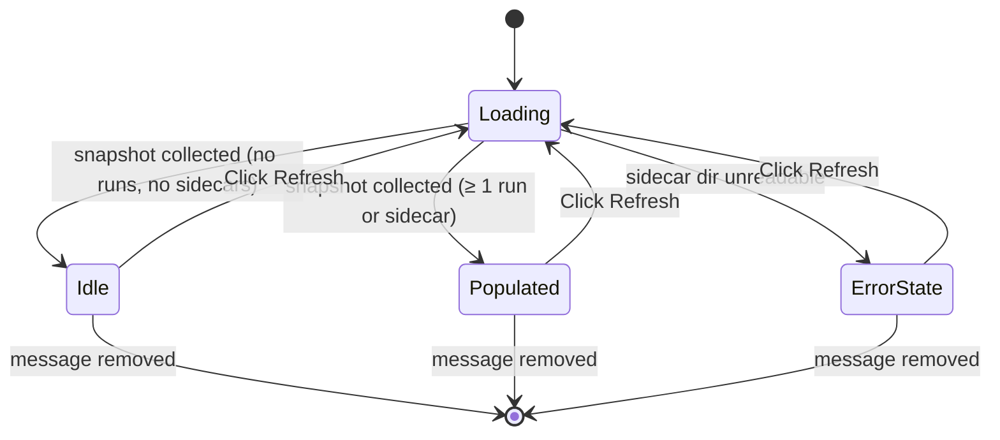

# F22 · canvas-slash-commands — UI

## Layout

Three composer slash commands. `/canvas-create` and `/canvas-edit` are pass-through entry points (composer prose → tool); they have no UI of their own beyond the slash-picker entries. `/canvas-status` mounts an inline read-only widget — `CanvasStatusWidget` — analogous to `WikiStatusWidget`.

### `/canvas-status` widget — populated

```
+---------------------------------------------------------------+
| ◯ Canvas — status                              [ Refresh ]    |
+---------------------------------------------------------------+
| Active runs (1)                                               |
|  · canvases/conf-2026-q1.canvas · planning · 20260505-101433 |
|                                                               |
| Recent canvases (3)                                           |
|  · canvases/people.canvas         last run 2 min ago          |
|  · canvases/projects.canvas       last run 1 hour ago         |
|  · canvases/conf-2026-q1.canvas   last run 3 days ago         |
+---------------------------------------------------------------+
```

### `/canvas-status` widget — empty

```
+---------------------------------------------------------------+
| ◯ Canvas — status                              [ Refresh ]    |
+---------------------------------------------------------------+
| No active canvas runs.                                        |
| No canvas sidecars found.                                     |
+---------------------------------------------------------------+
```

### `/canvas-status` widget — error reading sidecar dir

```
+---------------------------------------------------------------+
| ◯ Canvas — status                              [ Refresh ]    |
+---------------------------------------------------------------+
| Could not read .leo/canvas/runs/ — <error message>            |
| Active runs:                                                  |
|  (none)                                                       |
+---------------------------------------------------------------+
```

## State machine



## Event flow

| User action / system event           | Component reaction                                                        | State change                  |
|--------------------------------------|---------------------------------------------------------------------------|-------------------------------|
| Type `/canvas-create <ask>` + Enter  | Composer dispatches `delegate_canvas_create({ ask })`                     | none (tool layer takes over)  |
| Type `/canvas-edit @path <instr>`    | Composer parses mention to `path`, dispatches `delegate_canvas_content_edit` | none (tool layer)             |
| Type `/canvas-status` + Enter        | `canvasStatusCommand` mounts `CanvasStatusWidget`; collector starts        | `Loading`                     |
| Snapshot resolves                    | `Idle` / `Populated` / `ErrorState` per content                            | → terminal-of-snapshot         |
| Click `Refresh`                      | Re-runs `collectCanvasStatus(deps, signal)`                                | → `Loading`                   |
| Click an active-run row              | Dispatches `reveal_in_canvas({path})` (read-only OK in plan mode)         | none                          |

## Component mapping

| Block                     | Component                                                                                | Notes                                                                                                                                                |
|---------------------------|------------------------------------------------------------------------------------------|------------------------------------------------------------------------------------------------------------------------------------------------------|
| Slash picker entries      | Existing `SlashPicker` (`src/ui/chat/SlashPicker.tsx`)                                    | Add three rows; descriptions: "build a new canvas", "edit a canvas", "show canvas status". [../../../../standards/code-style.md#react-18](../../../../standards/code-style.md#react-18) |
| `/canvas-create` arg-parsing | `slashCommands.ts` registry entry — prose → `ask`                                       |                                                                                                                                                      |
| `/canvas-edit` arg-parsing  | Mention-aware parser splitting `@<path>` from instruction                                  | Reuses `MentionPicker.tsx` + composer mention infra.                                                                                                |
| `/canvas-status` widget   | `<CanvasStatusWidget>` registered in `src/ui/chat/widgets/registry.ts`                    | Read-only; allowed in plan mode.                                                                                                                     |
| Active-run row            | `<button>` (clickable; navigates via `reveal_in_canvas`)                                  | Lucide Activity icon.                                                                                                                                |
| Recent-canvases row       | `<button>`                                                                                | Lucide File icon.                                                                                                                                    |
| Refresh button            | `<button>` calling `canvasStatusCommand.refresh()`                                        | Mirrors `wikiStatusCommand` precedent.                                                                                                               |

## Storybook

| Component                                                | Story file                                | Variants                                                                                                            | Mocks                                                                            |
|----------------------------------------------------------|-------------------------------------------|---------------------------------------------------------------------------------------------------------------------|----------------------------------------------------------------------------------|
| `src/ui/chat/widgets/CanvasStatusWidget.tsx`             | `CanvasStatusWidget.stories.tsx`          | `loading`, `idle-empty`, `populated-one-active-run`, `populated-mixed-runs-and-sidecars`, `error-sidecar-dir-unreadable` | New: `mocks/canvasStatusSnapshots.ts` (one snapshot per state).                  |
| Slash-picker entries (smoke)                             | Reuses existing `SlashPicker.stories.tsx` | Add a Storybook example showing the three new commands listed.                                                       | Reuses existing slash-command mocks.                                             |

Every state in the State machine maps to ≥ 1 variant: `Loading`→`loading`, `Idle`→`idle-empty`, `Populated`→`populated-one-active-run` + `populated-mixed-runs-and-sidecars`, `ErrorState`→`error-sidecar-dir-unreadable`. Terminal `[*]` after `message removed` is the absence-of-block state (no story).

Stories use the existing Obsidian theme decorator from `.storybook/preview.ts`. No new decorators required.

## Back-link

[./feature.md](./feature.md)
