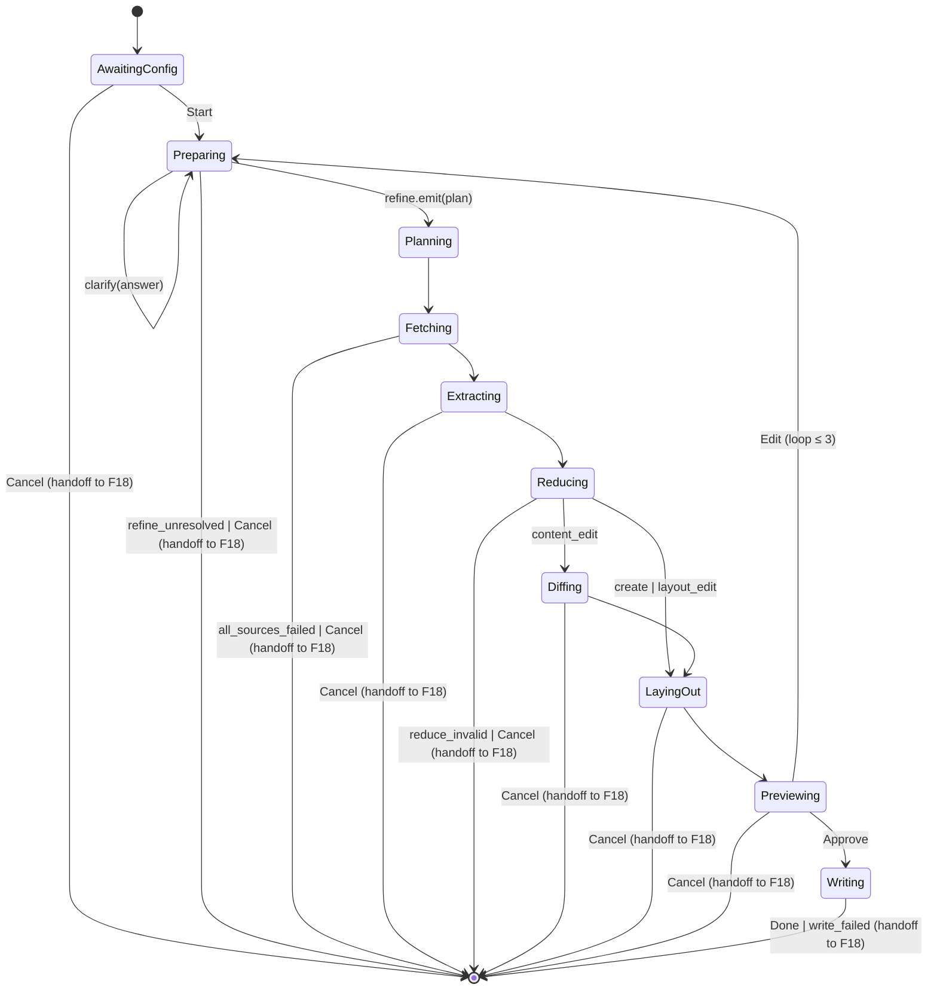

# F17 · canvas-widget-live — UI

## Layout

`CanvasLiveBlock` is an inline assistant message block. Phase-dispatched within a single panel container (mirrors `WikiWidget`). Width: full chat-bubble width (no fixed pixel cap).

```
+---------------------------------------------------------------+
| ⤬ Canvas · <op> · <runId-short>                <elapsed-mm:ss>|
+---------------------------------------------------------------+
| <phase-body>                                                  |
+---------------------------------------------------------------+
| <phase-actions>                                               |
+---------------------------------------------------------------+
```

### AWAITING_CONFIG body

```
+---------------------------------------------------------------+
| Provider:  [LM Studio       v]   Model: [qwen3:30b      v]    |
| Preset:    [auto            v]                                |
| Path:      [canvases/_______________________.canvas]          |
+---------------------------------------------------------------+
|                                          [ Start ]  [ Cancel ]|
+---------------------------------------------------------------+
```

### PREPARING body (refining + clarification)

```
+---------------------------------------------------------------+
| Refining run plan…                                            |
| > you said "events and people who attended"                   |
| > clarifying: should I include past events only, or future?   |
| [____________________________________________] [ Send ]       |
+---------------------------------------------------------------+
```

### PLANNING / FETCHING body

```
+---------------------------------------------------------------+
| Fetching 12 sources…                       [ 8 / 12  ✓ ✓ … ]  |
+---------------------------------------------------------------+
```

### EXTRACTING body

```
+---------------------------------------------------------------+
| Extracting entities                              [ 4 / 12 ]   |
| people/alice.md   ✓                                            |
| people/bob.md     · running                                    |
| events/q1.md      ⚠ extract_invalid                            |
+---------------------------------------------------------------+
```

### REDUCING body (insights peek)

```
+---------------------------------------------------------------+
| Resolving aliases · 18 entities · 22 edges                    |
| Top hubs: [Alice 6] [Bob 4] [Q1 3]                            |
+---------------------------------------------------------------+
```

### DIFFING body (content_edit only)

```
+---------------------------------------------------------------+
| Diff: 14 kept (3 locked) · 4 added · 2 removed                |
+---------------------------------------------------------------+
```

### LAYING_OUT body

```
+---------------------------------------------------------------+
| Laying out (preset: tree) …                                   |
+---------------------------------------------------------------+
```

### PREVIEWING body

```
+---------------------------------------------------------------+
| Preview ready · 18 nodes · 22 edges · preset: tree            |
| Failed sources: 1 (events/q1.md — extract_invalid)            |
| [ Open preview ]                                              |
+---------------------------------------------------------------+
| Edit instruction: [_______________________________]           |
| [ Approve ]   [ Edit ]   [ Cancel ]                           |
+---------------------------------------------------------------+
```

### WRITING body

```
+---------------------------------------------------------------+
| Writing canvas…                                               |
+---------------------------------------------------------------+
```

## State machine

F17 owns the in-component (non-terminal) states only. On any terminal transition (DONE / CANCELLED / ERROR), `CanvasLiveBlock` unmounts and `CanvasTerminalBlock` (F18) takes over — terminal-state UI is owned exclusively by F18's state machine and variants. The `[*]` sink below denotes that handoff.



## Event flow

| User action / system event | Component reaction | State change |
|----------------------------|--------------------|--------------|
| Slash `/canvas-create <ask>` | Tool dispatch + confirm prompt | none (tool layer) |
| Confirm "Prepare canvas create" | Orchestrator.start; widget mounts | `AwaitingConfig` |
| Provider/model/preset/path changes | controller updates `configDraft` | none |
| Click `Start` | Validate path; subgraph enters `Preparing` | → `Preparing` |
| Refine asks clarifying question | View shows question + textarea | none |
| Submit clarification | controller appends to refine history; subgraph re-enters refine step | none |
| Refine emits `RunPlan` | controller transitions UI | → `Planning` |
| Source fetched / extracted | per-source row updates | none |
| Reducer done | insights peek populates | → `Diffing` (edit) or `LayingOut` |
| Layout done | preview-link populates | → `Previewing` |
| Click `Open preview` | Dispatches `reveal_in_canvas({path: previewPath})` | none |
| Click `Approve` | Subgraph resumes via `interrupt()` | → `Writing` → `Done` |
| Click `Edit` (with text) | Subgraph re-enters `Preparing` with appended instruction | → `Preparing` |
| Click `Cancel` | `RunHandle.abort()` | → `Cancelled` ≤ 2s |
| Done / Cancelled / Error | Live block unmounts; terminal block (F18) takes over | terminal |

## Component mapping

| Block                   | Component                                                    | Notes                                                                                          |
|-------------------------|--------------------------------------------------------------|------------------------------------------------------------------------------------------------|
| Outer panel             | `<CanvasLiveBlock>` registered via [../../../../standards/tech-stack.md#ui-layer](../../../../standards/tech-stack.md#ui-layer) Assistant UI block kind | Wraps phase-dispatched body.                                                                   |
| Provider/model selects  | Native `<select>` (matches `WikiWidget` ConfigBody)          | [../../../../standards/tech-stack.md#ui-layer](../../../../standards/tech-stack.md#ui-layer)                                                          |
| Preset select           | Native `<select>` with literal-union options                 |                                                                                                |
| Path text input         | `<input>` validated via F01 helpers                          |                                                                                                |
| Action buttons          | `<button>` styled via `.leo-canvas-*` (Tailwind + Obsidian vars) | [../../../../standards/code-style.md#styling-tailwind--obsidian](../../../../standards/code-style.md#styling-tailwind--obsidian) |
| Per-source row          | Plain `<div role="listitem">` with status icon               | Lucide icons.                                                                                  |
| Insights peek chips     | Inline chips reusing `.leo-tool-status-*` style              |                                                                                                |
| Open-preview button     | `<button>` calling `reveal_in_canvas` via tool dispatch hook | Mirrors `WikiTerminalBlock` Open button.                                                        |
| Elapsed timer           | 1Hz `useEffect` interval; cleared on terminal phase           | [../../../../standards/code-style.md#react-18](../../../../standards/code-style.md#react-18)                                                          |

## Storybook

| Component                                          | Story file                              | Variants                                                                                                                                                                                                  | Mocks                                                                 |
|----------------------------------------------------|-----------------------------------------|----------------------------------------------------------------------------------------------------------------------------------------------------------------------------------------------------------|-----------------------------------------------------------------------|
| `src/ui/chat/blocks/CanvasWidget.tsx`              | `CanvasWidget.stories.tsx`              | `awaiting_config-idle`, `awaiting_config-models-loading`, `awaiting_config-models-error`, `awaiting_config-validation-error-bad-path`, `preparing-refining`, `preparing-clarifying`, `planning-fetching`, `extracting-progress`, `extracting-with-errors`, `reducing-insights-peek`, `diffing-summary`, `laying_out-progress`, `previewing-approve-edit-cancel`, `previewing-edit-iteration-2`, `writing-progress` | New: `mocks/canvasController.ts` (canned `CanvasViewModel` per phase). |
| `src/ui/chat/blocks/CanvasLiveBlock.tsx`           | `CanvasLiveBlock.stories.tsx`           | `mounted-with-controller`, `mounted-without-controller-shows-reload-error`                                                                                                                                | Reuses `mocks/canvasController.ts`.                                   |

Every state in the State machine maps to ≥ 1 variant: `AwaitingConfig`→`awaiting_config-idle`, `Preparing`→`preparing-refining` + `preparing-clarifying`, `Planning`→`planning-fetching`, `Fetching`→`planning-fetching`, `Extracting`→`extracting-progress` + `extracting-with-errors`, `Reducing`→`reducing-insights-peek`, `Diffing`→`diffing-summary`, `LayingOut`→`laying_out-progress`, `Previewing`→`previewing-approve-edit-cancel` + `previewing-edit-iteration-2`, `Writing`→`writing-progress`, terminal states are owned by F18.

Stories use the existing Obsidian theme decorator from `.storybook/preview.ts`. No new decorators required.

## Back-link

[./feature.md](./feature.md)
