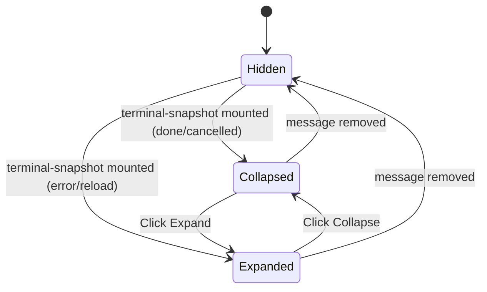

# F18 · canvas-widget-terminal — UI

## Layout

`CanvasTerminalBlock` replaces `CanvasLiveBlock` once the run reaches a terminal state (DONE / CANCELLED / ERROR). Default-collapsed for DONE / CANCELLED, default-expanded for ERROR.

### Collapsed (default)

```
+---------------------------------------------------------------+
| ✓ Canvas create · canvases/conf-2026-q1.canvas                |
|   18 nodes · 22 edges · 12 sources             ▾ Expand        |
+---------------------------------------------------------------+
```

### Expanded

```
+---------------------------------------------------------------+
| ✓ Canvas create · canvases/conf-2026-q1.canvas      ▴ Collapse|
+---------------------------------------------------------------+
| Insights                                                      |
|  · Hubs:        Alice (6) · Bob (4) · Q1 (3)                  |
|  · Components:  3 (sizes: 12, 4, 2)                            |
|  · Orphans:     0                                              |
|  · Per-type:    person 8 · event 6 · org 4                    |
|                                                               |
| Failed sources (1)                                            |
|  · events/q1.md  — extract_invalid                            |
|                                                               |
| [ Open canvas ]                                               |
+---------------------------------------------------------------+
```

### Error variant (default-expanded)

```
+---------------------------------------------------------------+
| ✗ Canvas create · canvases/conf-2026-q1.canvas      ▴ Collapse|
+---------------------------------------------------------------+
| Error: reduce_invalid                                         |
| Reducer LLM emitted invalid output twice. Run aborted.        |
|                                                               |
| Partial:                                                      |
|  · 12 sources fetched · 11 extracted · 0 written              |
+---------------------------------------------------------------+
```

### Reload variant (FR-CANVAS-62)

```
+---------------------------------------------------------------+
| ⟲ Canvas <op> · <runId-short>                       ▾ Expand  |
|   Plugin reloaded — run state lost                            |
+---------------------------------------------------------------+
```

## State machine



## Event flow

| User action / system event             | Component reaction                                      | State change            |
|----------------------------------------|---------------------------------------------------------|-------------------------|
| Subgraph reaches DONE                  | `persistSnapshot` writes Zod-valid `CanvasTerminalSnapshot`; live block unmounts; terminal block mounts | `Hidden → Collapsed`    |
| Subgraph reaches ERROR                 | snapshot written with `outcome: 'error'`                 | `Hidden → Expanded`     |
| Plugin reload mid-run                  | Live `runId` not in registry → renderer flips to reload error | `Hidden → Expanded` (reload variant) |
| Click `▾ Expand`                        | Local component state `expanded = true`                  | `Collapsed → Expanded`  |
| Click `▴ Collapse`                      | Local component state `expanded = false`                 | `Expanded → Collapsed`  |
| Click `Open canvas`                     | Tool dispatch `reveal_in_canvas({path: targetPath})`     | none                    |

## Component mapping

| Block                     | Component                                                                           | Notes                                                                                            |
|---------------------------|-------------------------------------------------------------------------------------|--------------------------------------------------------------------------------------------------|
| Outer panel               | `<CanvasTerminalBlock>` registered via [../../../../standards/tech-stack.md#ui-layer](../../../../standards/tech-stack.md#ui-layer) | Renderer kind = `CANVAS_TERMINAL_KIND`.                                                          |
| Collapse trigger          | `<button aria-expanded>` inside header row                                          | Reuses CSS `.leo-*-body-wrap` grid-rows trick from `styles.css`.                                 |
| Insights bullet list      | `<ul role="list">` with terse rows                                                  | Lucide icons per category.                                                                       |
| Open-canvas button        | `<button>` dispatching `reveal_in_canvas`                                            | Same wiring as F17 preview-link button.                                                          |
| Failed-source list        | `<details>` if length > 5; otherwise inline                                          | Avoid runaway block height.                                                                      |
| Reload variant            | Reuses outer-panel layout with `outcome: 'reload'` icon + sub-text                   | No `Open canvas` button (path may have moved post-reload).                                       |

## Storybook

| Component                                              | Story file                                  | Variants                                                                                                                                                                                                      | Mocks                                                                       |
|--------------------------------------------------------|---------------------------------------------|--------------------------------------------------------------------------------------------------------------------------------------------------------------------------------------------------------------|-----------------------------------------------------------------------------|
| `src/ui/chat/blocks/CanvasTerminalBlock.tsx`           | `CanvasTerminalBlock.stories.tsx`           | `done-collapsed`, `done-expanded`, `done-with-failed-sources`, `done-empty-graph`, `cancelled-collapsed`, `error-reduce-invalid-expanded`, `error-target-path-exists`, `error-canvas-parse-failed`, `reload-variant` | New: `mocks/canvasTerminalSnapshots.ts` (one snapshot per outcome variant). |

Every state in the State machine maps to ≥ 1 variant: `Collapsed`→`done-collapsed` + `cancelled-collapsed`, `Expanded`→`done-expanded` + `done-with-failed-sources` + `error-*` + `reload-variant`. `Hidden` is the absence-of-block state and does not require a story. The `Hidden → Expanded` transition (auto-expand-on-error) is exercised in `error-reduce-invalid-expanded` (story renders the post-mount state).

Stories use the existing Obsidian theme decorator from `.storybook/preview.ts`. No new decorators required.

## Back-link

[./feature.md](./feature.md)
