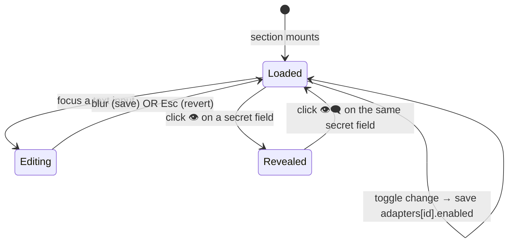

# UI — F11 External Agents Settings Section

Companion to [`./feature.md`](./feature.md). Specifies layout, state machine, event flow, component mapping, and Storybook coverage. UI binds to the `AdapterRegistry` and to the persisted `externalAgents` settings tree under `data.json`.

## Layout

### Default — two adapters registered (illustrative; actual v1 plan has zero registered)

```
┌─ External Agents ─────────────────────────────────────────────────────────┐
│ Configure adapters that the assistant can call when no built-in tool fits │
│ a request. Concrete adapters are added in code — see SRS §13.             │
│                                                                           │
│ Default adapter: ⌄ claude-code                                            │
│                                                                           │
│ ─────────────────────────────────────────────────────────────────────  ▾  │
│ ▼ claude-code  ·  ☑ Enabled                                               │
│   binaryPath        [ claude                                  ]           │
│   extraArgs         [ --no-banner                             ]           │
│   workingDirectory  [ <vault root>                            ]           │
│                                                                           │
│ ─────────────────────────────────────────────────────────────────────  ▾  │
│ ▼ openai-compatible  ·  ☑ Enabled                                         │
│   baseUrl           [ https://api.perplexity.ai               ]           │
│   model             [ sonar-pro                               ]           │
│   apiKey  🔒        [ ••••••••••••••••••••                ] 👁          │
│   extraHeaders      [ key=value, key=value                    ]           │
└───────────────────────────────────────────────────────────────────────────┘
```

### Empty registry — no adapters (v1 default state)

```
┌─ External Agents ─────────────────────────────────────────────────────────┐
│ No adapters are registered. v1 ships the contract + UI only; concrete     │
│ adapter implementations land in a follow-up phase.                        │
│                                                                           │
│ Default adapter: (none available)                                         │
│                                                                           │
│ See SRS §13 for the planned adapter additions.                            │
└───────────────────────────────────────────────────────────────────────────┘
```

### Default-disabled state

```
┌─ External Agents ─────────────────────────────────────────────────────────┐
│ Default adapter: ⌄ claude-code  ⚠ disabled — falling back to              │
│                                  openai-compatible at runtime              │
│                                                                           │
│ ▼ claude-code  ·  ☐ Enabled                                               │
│   …                                                                       │
│ ▼ openai-compatible  ·  ☑ Enabled                                         │
│   …                                                                       │
└───────────────────────────────────────────────────────────────────────────┘
```

### Secret-revealed state

```
│   apiKey  🔒        [ pplx-abc123def456ghi789…                ] 👁‍🗨        │
```

(Toggle 👁 → 👁‍🗨 reveals plaintext; click again to re-mask. Reveal does not change persistence.)

## State machine

The settings section is mostly stateless from the user's perspective — each control writes through to `data.json` immediately on commit (toggles/dropdowns) or on blur (text inputs). Per-control reveal/mask state is local to the input.



Out-of-range or invalid values are rejected at input commit with an inline error message under the field; previous valid value is retained in `data.json`.

## Event flow

```
SettingsTab.display()
  └─► externalAgentsSection.render(containerEl, { registry, settings, safeStorage })
        └─► reads registry.list() + settings.externalAgents
              └─► renders header + dropdown + per-adapter blocks

User picks new default in dropdown
  └─► settings.externalAgents.defaultAdapterId = newId
        └─► plugin.saveData() (debounced)
              └─► next widget instance reads effectiveDefaultAdapterId() and selects newId

User toggles adapter `enabled`
  └─► settings.externalAgents.adapters[id].enabled = checked
        └─► plugin.saveData()
              └─► registry.notify('adapter-enabled-changed', id)
                    └─► any open widget picker excludes/includes the adapter immediately

User edits non-secret field, blurs
  └─► validate via configSchema field rule
        └─► on success: settings.externalAgents.adapters[id].config[field] = newValue → saveData
        └─► on failure: render inline error under the field; do not persist

User edits secret field, blurs
  └─► safeStorage.encrypt(newValue) → store under safeStorage:externalAgents.<id>.<field>
        └─► settings.externalAgents.adapters[id].config[field] = 'safeStorage:externalAgents.<id>.<field>' (indirection)
              └─► saveData

User clicks reveal on secret field
  └─► safeStorage.decrypt(indirection) → render plaintext in the input (not persisted change)
        └─► flip toggle icon

Subgraph (F05) needs config to call adapter
  └─► resolveAdapterConfig(id) reads stored config, replaces every safeStorage: indirection with decrypted value
        └─► returns resolved object → adapter.start({config: resolved, …})
```

## Component mapping

| UI block | Component | File | Storybook |
|---|---|---|---|
| Section root | `ExternalAgentsSection` | `src/settings/externalAgentsSection.ts` | `ExternalAgentsSection.stories.tsx` (colocated) |
| Header + description | inline | same | covered by Default story |
| Default-adapter dropdown | inline `<select>` | same | covered by Default + DefaultAdapterDisabled stories |
| Per-adapter collapsible block | `AdapterConfigBlock` (internal) | same | covered by all populated stories |
| Enabled toggle | inline `<input type=checkbox>` | same | covered by Default story |
| Auto-generated form field | `AdapterConfigField` (internal — type-dispatches on Zod kind) | same | covered by Default + WithSecretsHidden + WithSecretsRevealed stories |
| Secret reveal toggle | inline `<button>` with `<input type=password>` ↔ `<input type=text>` | same | covered by WithSecretsHidden + WithSecretsRevealed stories |
| Empty-state panel | inline | same | `NoAdaptersRegistered` story |
| Inline validation error | inline | same | covered by `Default` story (with one invalid field fixture) |

`SettingsTab` integration: the existing `src/settings/SettingsTab.ts` calls `externalAgentsSection.render(containerEl, deps)` from its `display()` method. Pattern matches existing per-feature sections referenced in [`.agent/architecture/architecture.md`](../../../../architecture/architecture.md) §3.1 (UI Layer — `SettingsTab` row) and the project layout in [`.agent/standards/project-structure.md`](../../../../standards/project-structure.md).

Tailwind utility usage scoped under `.leo-root` per [`.agent/standards/code-style.md`](../../../../standards/code-style.md) §Styling. Obsidian theme variables for borders, text, backgrounds.

### Storybook story matrix (mandatory per Constraint **C-06**)

| Story name | Variant | Notes |
|---|---|---|
| `Default` | Two `MockAdapter` stubs registered, both enabled, default = first | Demonstrates a populated section |
| `WithSecretsHidden` | Same registry; `apiKey` field with masked value | Verifies secret rendering |
| `WithSecretsRevealed` | Same as above; reveal-toggle pre-clicked | Verifies plaintext render path |
| `DefaultAdapterDisabled` | Configured default disabled; fallback warning visible | Honors FR-EXT-34 fallback |
| `NoAdaptersRegistered` | Empty registry (matches v1 default state) | **Mandatory v1 fixture** — Storybook must show the empty-state copy |
| `WithValidationError` | Valid registry; one field has an invalid value | Shows inline error rendering |

All stories use `MockAdapter` stubs from F03's test harness — concrete adapters are deferred per the v1 scope; Storybook must demonstrate that the section operates against the contract alone.

## Back-link

[`./feature.md`](./feature.md)
