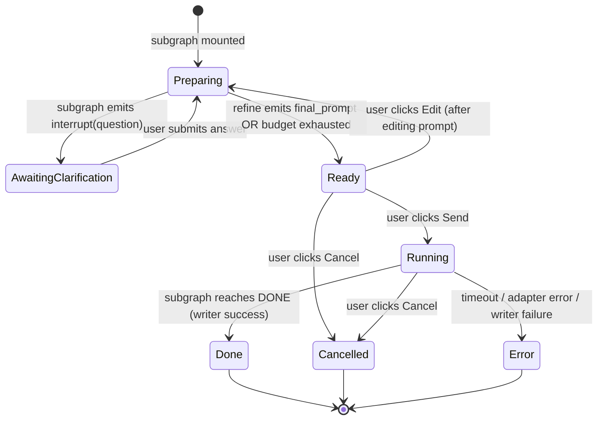

# UI — F08 External Agent Widget

Companion to [`./feature.md`](./feature.md). Specifies layout, state machine, event flow, component mapping, and Storybook coverage. UI behavior tracks the subgraph state via the F07 controller.

## Layout

### Preparing — idle (no clarifying question pending)

```
┌─ External Agent ────────────────────── ⚙ adapter: claude-code · budget: 3 ─┐
│ Refining your request…                                                     │
│                                                                            │
│ Original ask:                                                              │
│   ┌──────────────────────────────────────────────────────────────────────┐ │
│   │ research about games theory                                          │ │
│   └──────────────────────────────────────────────────────────────────────┘ │
│                                                                            │
│ Refine transcript (1 turn so far):                                         │
│   ▸ assistant: thinking through what to ask…                               │
│                                                                            │
│                                                              [ Cancel ]    │
└────────────────────────────────────────────────────────────────────────────┘
```

### Preparing — awaiting clarification

```
┌─ External Agent · Clarifying question (turn 2/3) ──────────────────────────┐
│ ❓ What specific area of game theory do you want me to research?           │
│    (e.g. cooperative vs non-cooperative, Nash equilibria, evolutionary…)   │
│                                                                            │
│   ┌──────────────────────────────────────────────────────────────────────┐ │
│   │ <user types answer here>                                             │ │
│   └──────────────────────────────────────────────────────────────────────┘ │
│                                                                            │
│                                            [ Cancel ]   [ Send answer ]    │
└────────────────────────────────────────────────────────────────────────────┘
```

### Ready

```
┌─ External Agent · Ready to send ───────────────────────────────────────────┐
│                                                                            │
│ Adapter:  ⌄ claude-code                Timeout: [ 1800 ] s   Budget: [3]   │
│                                                                            │
│ Refined prompt (editable):                                                 │
│   ┌──────────────────────────────────────────────────────────────────────┐ │
│   │ Please research evolutionary game theory: ESS, replicator dynamics,  │ │
│   │ examples in biology and economics. Provide a 1500-word overview.     │ │
│   │ Include 5 academic references with DOIs.                             │ │
│   └──────────────────────────────────────────────────────────────────────┘ │
│                                                                            │
│                            [ Cancel ]   [ Edit ]   [ Send ]                │
└────────────────────────────────────────────────────────────────────────────┘
```

### Running

```
┌─ External Agent · claude-code · 00:42 elapsed ─────────────────────────────┐
│                                                                            │
│ Response (streaming):                                                      │
│   ┌──────────────────────────────────────────────────────────────────────┐ │
│   │ Evolutionary game theory studies strategy frequencies in populations │ │
│   │ over time, drawing on the replicator dynamics framework introduced…  │ │
│   │ ▏                                                                    │ │
│   └──────────────────────────────────────────────────────────────────────┘ │
│                                                                            │
│ Files: ⏳ overview.md (pending write), ⏳ refs.bib (pending write)         │
│                                                                            │
│ ▸ Event log (3)                                       [ Cancel ]           │
└────────────────────────────────────────────────────────────────────────────┘
```

### Terminal — done (collapsed default)

```
┌─ ✓ External Agent · claude-code · 03:12 · externalAgentResults/2026… ▾ ──┐
└──────────────────────────────────────────────────────────────────────────┘
```

Click ▾ → expand:

```
┌─ ✓ External Agent · claude-code · 03:12 ────────────────────── collapse ▴ ─┐
│ Folder:  externalAgentResults/20260427-141503-a1b2c3 ↗                     │
│ Files:   request.md · response.md · overview.md · refs.bib                 │
│                                                                            │
│ ▸ Refine transcript                                                        │
│ ▸ Final prompt                                                             │
└────────────────────────────────────────────────────────────────────────────┘
```

### Terminal — error

```
┌─ ⚠ External Agent · claude-code · 00:08 · error: timeout ▾ ──────────────┐
└──────────────────────────────────────────────────────────────────────────┘
```

### Terminal — reload (after plugin reload during run)

```
┌─ ⚠ External Agent · was running · interrupted by plugin reload ▾ ────────┐
└──────────────────────────────────────────────────────────────────────────┘
```

### Empty registry (no adapters configured)

```
┌─ External Agent · Ready to send ───────────────────────────────────────────┐
│                                                                            │
│ ⚠ No adapters configured. Open Settings → External Agents to add one,      │
│   then re-issue this request.                                              │
│                                                                            │
│                                                          [ Cancel ]        │
└────────────────────────────────────────────────────────────────────────────┘
```

(Send is hidden when no adapter is selectable.)

## State machine

States and transitions track the subgraph state from [`./feature.md`](./feature.md) §3 and the SRS §5; UI is a passive projection.



Terminal UI states (`Done`, `Cancelled`, `Error`) are sticky — collapsed by default, expandable on user click.

The `Reload` flavor of `Error` (carrying `error.code='reload'`) renders distinct copy but is a normal `Error` state from the state-machine's perspective.

## Event flow

User actions flow into `controller.on*` handlers (F07); subgraph events flow back as new `WidgetViewModel`s.

```
User opens chat thread containing a delegate_external tool call
  └─► ChatRoot renders external_agent_widget block
        └─► <ExternalAgentWidget controller={…} /> mounts
              └─► useSyncExternalStore subscribes to controller's store
                    └─► initial render = projection(state)

User clicks Send (in Ready state)
  └─► controller.onSend(promptText, adapterId, timeoutMs)
        └─► subgraph.transition('send', payload)
              └─► subgraph emits state {phase: 'running', startedAt: now}
                    └─► store update → component re-renders Running view

Adapter emits text events
  └─► subgraph appends to textBuffer
        └─► store update (debounced) → response panel re-renders streaming text

User clicks Cancel (in Running state)
  └─► controller.onCancel()
        └─► subgraph.cancel() → AbortSignal fires
              └─► subgraph reaches Cancelled within ≤ 2 s (NFR-EXT-01)
                    └─► store update → component renders collapsed terminal

Subgraph emits interrupt(question)  [Preparing → AwaitingClarification]
  └─► viewModel.phase becomes 'awaitingClarification'
        └─► component re-renders clarification layout

User answers clarification, clicks Send answer
  └─► controller.onAnswerClarification(text)
        └─► subgraph.resumeInterrupt({answer: text})
              └─► subgraph re-enters Preparing → next refine LLM turn

Plugin reload occurs while Running
  └─► onunload writes terminal snapshot {phase: 'error', code: 'reload'}
        └─► next thread open: messageStore loads snapshot
              └─► widget mounts in collapsed Error (reload) state
```

## Component mapping

| UI block | Component | File | Storybook |
|---|---|---|---|
| Top-level widget shell | `ExternalAgentWidget` | `src/ui/chat/blocks/ExternalAgentWidget.tsx` | `ExternalAgentWidget.stories.tsx` |
| Preparing (idle + transcript) | `ExternalAgentWidgetPreparing` | `src/ui/chat/blocks/ExternalAgentWidget.tsx` | shared stories file |
| Awaiting-clarification panel | `ExternalAgentWidgetClarify` | same | shared stories file |
| Ready phase form | `ExternalAgentWidgetReady` | same | shared stories file |
| Running phase | `ExternalAgentWidgetRunning` | same | shared stories file |
| Streaming response panel | `ExternalAgentResponseStream` | same | shared stories file (sub-story) |
| Event log collapsible | `ExternalAgentEventLog` | same | shared stories file (sub-story) |
| Terminal collapsed | `ExternalAgentWidgetTerminalCollapsed` | same | shared stories file |
| Terminal expanded | `ExternalAgentWidgetTerminalExpanded` | same | shared stories file |
| Adapter picker dropdown | reuse Obsidian-themed `<select>` | inline | covered by Ready story |
| Buttons (Send / Edit / Cancel / Send answer) | plain `<button>` with Tailwind utility classes | inline | covered by per-phase stories |
| Folder link in terminal view | `<a>` calling `openNote(<folder>/response.md)` | inline | terminal-done story asserts the link target |

Component conventions match existing block components in [`src/ui/chat/blocks/`](../../../../standards/project-structure.md) (e.g. `PlanApprovalDialog`, `DiffView`, `GroupedToolUses`, `ToolResultBlockView` — each colocated with `.stories.tsx`). Tailwind utility usage and Obsidian CSS variable scoping per [`.agent/standards/tech-stack.md`](../../../../standards/tech-stack.md) §"UI Layer" + §"Styling".

### Storybook story matrix (mandatory per Constraint **C-06**)

| Story name | Phase / variant | Notes |
|---|---|---|
| `Preparing.Idle` | Preparing, no clarification yet | Shows refine transcript with one assistant turn |
| `Preparing.AwaitingClarification` | AwaitingClarification | Shows the question + answer textarea |
| `Ready.Default` | Ready | Two adapters in mock registry; default selected |
| `Ready.EditDirty` | Ready | User edited the textarea; Edit enabled, Send re-enabled |
| `Ready.EmptyRegistry` | Ready (no adapters) | Empty-state copy + hidden Send |
| `Running.EarlyStream` | Running | First few chunks rendered, no files yet |
| `Running.WithFiles` | Running | Two pending file placeholders |
| `Running.WithLog` | Running | Log expanded showing 3 events |
| `Terminal.Done.Collapsed` | Done | Default collapsed view |
| `Terminal.Done.Expanded` | Done | Expanded view with refine transcript + final prompt |
| `Terminal.Cancelled` | Cancelled | Collapsed |
| `Terminal.Error.Timeout` | Error | `error.code='timeout'` |
| `Terminal.Error.AdapterError` | Error | `error.code='http_429'` from a mock OpenAI-compatible adapter stub |
| `Terminal.Error.Reload` | Error | `error.code='reload'` — distinct copy |

All stories use canned `WidgetViewModel`s (no real subgraph) per [`./feature.md`](./feature.md) §Scope. Storybook config follows the existing `.storybook/` setup referenced in [`.agent/standards/project-structure.md`](../../../../standards/project-structure.md).

## Back-link

[`./feature.md`](./feature.md)
