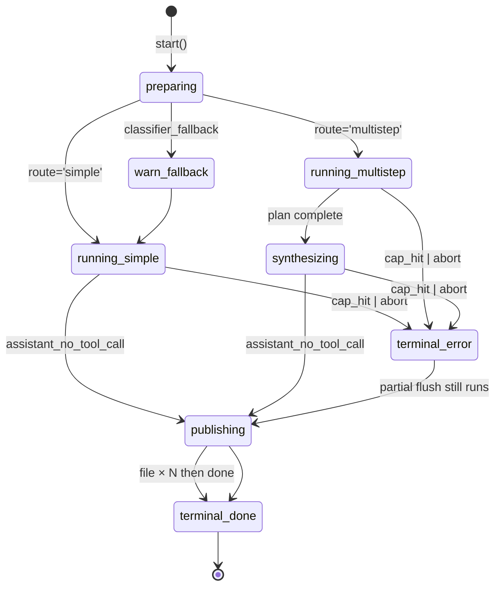

# F18 UI — Storybook fixtures for inline-agent runs

These fixtures script `ExternalEvent` streams into the existing `ExternalAgentWidget` (and, where terminal, `ExternalAgentTerminalBlock`). No new component is added — the goal is to provide reproducible visual scenarios for the four inline-agent runtime variants and to back the cross-cutting tests (F18 acceptance criteria).

## Layout

### Scenario 1 — `inline-agent / simple`

```
┌────────────────────────────────────────────────────────────┐
│ Inline Agent  •  running                          ⏵ stop   │
├────────────────────────────────────────────────────────────┤
│ route: simple    iter: 4/12    elapsed: 00:08              │
├────────────────────────────────────────────────────────────┤
│ assistant (streaming)                                      │
│ ▮ "I scanned the requested page and extracted the …"       │
├────────────────────────────────────────────────────────────┤
│ tool calls                                                 │
│ ▶ fetch_url   GET https://example.com   200  3.2 KB        │
│ ▶ publish_artifact  notes.md                               │
└────────────────────────────────────────────────────────────┘
       ↓ on terminal `done`
┌────────────────────────────────────────────────────────────┐
│ Inline Agent  •  done                              ▼      │
│ artifacts: 1   iter: 6/12   tokens: 1.4k   elapsed: 00:14 │
└────────────────────────────────────────────────────────────┘
```

### Scenario 2 — `inline-agent / multistep`

```
┌────────────────────────────────────────────────────────────┐
│ Inline Agent  •  running   route: multistep  iter: 14/32   │
├────────────────────────────────────────────────────────────┤
│ classify_task  ✓ route=multistep  plan=3                  │
│ planner        ✓ planLength=3                             │
│                                                            │
│ Plan                                                       │
│  1. find primary source                       step 1 ✓ n2 │
│  2. compare against secondary                 step 2 ✓ n4 │
│  3. summarise contradictions                  step 3 …    │
├────────────────────────────────────────────────────────────┤
│ tool calls (step 3)                                       │
│ ▶ search_web  "contradictions in study X"   3 results      │
│ ▶ extract_note  → n5                                       │
└────────────────────────────────────────────────────────────┘
       ↓ synthesize
┌────────────────────────────────────────────────────────────┐
│ assistant (streaming)                                      │
│ ▮ "Across the five notes (n1..n5), three patterns…"       │
│ ▶ publish_artifact  summary.md                             │
│ ▶ publish_artifact  citations.md                           │
└────────────────────────────────────────────────────────────┘
```

### Scenario 3 — `inline-agent / classifier-fallback`

```
┌────────────────────────────────────────────────────────────┐
│ Inline Agent  •  running   route: simple  iter: 1/12       │
├────────────────────────────────────────────────────────────┤
│ ⚠ classifier_fallback  reason=schema_mismatch              │
│ → routed to simple                                         │
└────────────────────────────────────────────────────────────┘
```

### Scenario 4 — `inline-agent / iteration-limit`

```
┌────────────────────────────────────────────────────────────┐
│ Inline Agent  •  error   code: iteration_limit             │
├────────────────────────────────────────────────────────────┤
│ partial artifacts flushed: 1                              │
│ ▶ file  draft.md                                           │
│ ✗ iteration_limit (cap=12)                                │
└────────────────────────────────────────────────────────────┘
```

## State machine



## Event flow

For each scenario the storybook fixture replays a fixed sequence of `ExternalEvent`s into the widget controller:

1. `preparing` snapshot — runId, adapterId, refinedAsk fixed.
2. **simple**: `text*` (token deltas) → `log info {tool: 'fetch_url'}` → `log info {tool: 'publish_artifact'}` → `file` → `done`.
3. **multistep**: `log info {node: 'classify_task', route: 'multistep', planLength: 3}` → `log info {node: 'planner', planLength: 3}` → for each step: `log info {node: 'researchStep', stepIndex: i, status: 'ok'}` interleaved with `log info {tool: 'search_web' | 'fetch_url' | 'extract_note'}` → `text*` (synthesize) → `log info {tool: 'publish_artifact'} × 2` → `file × 2` → `done`.
4. **classifier-fallback**: `log warn {node: 'classify_task', reason: 'classifier_fallback'}` → simple flow as above.
5. **iteration-limit**: simple flow truncated; `log info {tool: 'publish_artifact'}` → `error {code: 'iteration_limit'}` → `file × 1` (partial flush) → terminal frame.

Stream pacing is faked via `setTimeout` so visual progression matches a real ~10 s run. Each story exposes a Storybook `play` function that asserts at least one frame of each expected event type was rendered.

## Component mapping

| Block | Component | Source |
|---|---|---|
| Live header (status, route, iter, elapsed) | `ExternalAgentWidget` | [`src/ui/chat/blocks/ExternalAgentWidget.tsx`](../../../../src/ui/chat/blocks/ExternalAgentWidget.tsx) |
| Live tree (steps, tool calls) | `AgentProgressTree` (rendered inside widget) | [`src/ui/chat/blocks/AgentProgressTree.tsx`](../../../../src/ui/chat/blocks/AgentProgressTree.tsx) |
| Streaming assistant text | `TextBlockView` | [`src/ui/chat/blocks/TextBlockView.tsx`](../../../../src/ui/chat/blocks/TextBlockView.tsx) |
| Tool call rows | `ToolUseBlockView` | [`src/ui/chat/blocks/ToolUseBlockView.tsx`](../../../../src/ui/chat/blocks/ToolUseBlockView.tsx) |
| Tool result rows | `ToolResultBlockView` | [`src/ui/chat/blocks/ToolResultBlockView.tsx`](../../../../src/ui/chat/blocks/ToolResultBlockView.tsx) |
| Terminal collapsed summary | `ExternalAgentTerminalBlock` | [`src/ui/chat/blocks/ExternalAgentTerminalBlock.tsx`](../../../../src/ui/chat/blocks/ExternalAgentTerminalBlock.tsx) |
| Storybook entry point | `ExternalAgentWidget.stories.tsx` | [`src/ui/chat/blocks/ExternalAgentWidget.stories.tsx`](../../../../src/ui/chat/blocks/ExternalAgentWidget.stories.tsx) |

Storybook configuration + Obsidian CSS-variable theme: see [`.storybook/preview-obsidian-vars.css`](../../../../.storybook/preview-obsidian-vars.css). Tech-stack rationale for keeping styles scoped under plugin root: [`.agent/standards/tech-stack.md`](../../../../.agent/standards/tech-stack.md) "Styling" row + [`.agent/standards/code-style.md`](../../../../.agent/standards/code-style.md) §"Styling (Tailwind + Obsidian)".

## Back-link

[← feature.md](./feature.md)
