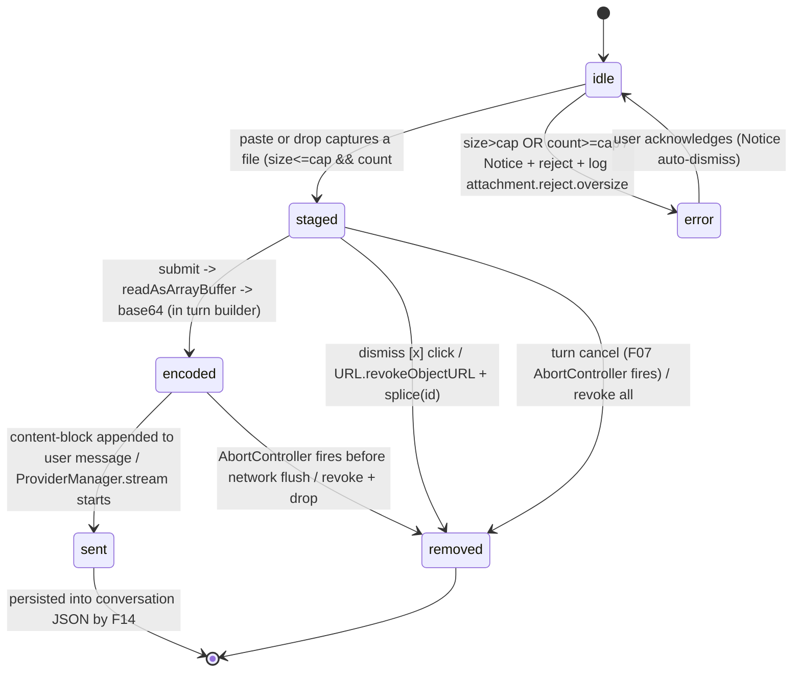
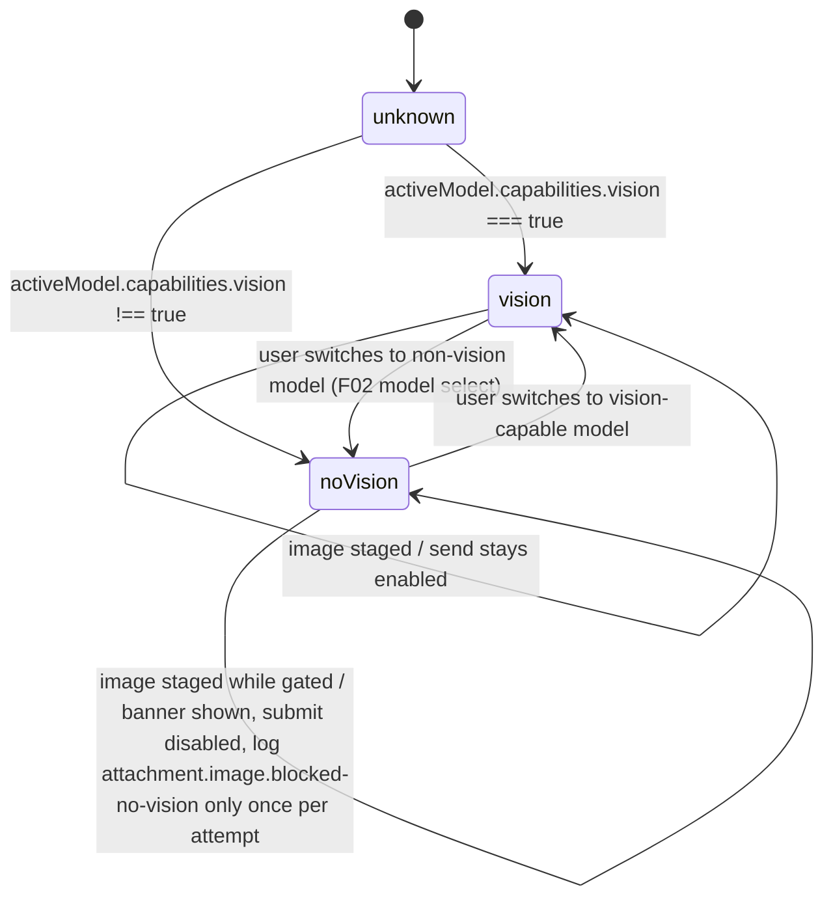
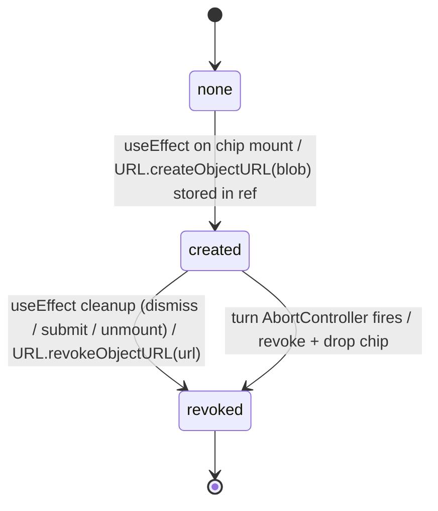

# F49 — Image & file attachments · UI

All wireframes render inside the `ComposerInput` region reserved by [F04](../chat-sidebar-view/feature.md) and augment the composer surface owned by [F06](../chat-composer-input/feature.md); only the composer column plus an attachment tray above the textarea is drawn here. Icons come from Obsidian's bundled Lucide set via [`setIcon`](../../../../standards/tech-stack.md#platform-apis--interop) per [UI Layer -> Icons](../../../../standards/tech-stack.md#ui-layer); colours, borders, and focus rings resolve through Obsidian CSS variables per [UI Layer -> Styling](../../../../standards/tech-stack.md#ui-layer) and [Code style -> Styling (Tailwind + Obsidian)](../../../../standards/code-style.md#styling-tailwind--obsidian).

## Layout

### Wireframe 1 — Empty composer with paste/drop zone (no pending attachments)

```
 0        10        20        30        40        50
 |---------|---------|---------|---------|---------|
+-------------------------------------------------+
| ComposerInput                                   |   region, rendered by ChatView
+-------------------------------------------------+
|  (attachment tray: hidden when                  |
|   pendingAttachments.length === 0)              |
| +-----------------------------------------+ +--+|
| | Type a message... (placeholder, muted)  | |> ||   <- send icon, disabled
| |                                         | |..||
| +-----------------------------------------+ +--+|
|  hint (sr-only): "Paste or drop images and       |
|   files to attach; vault notes drop as links"   |
+-------------------------------------------------+
     ^ textarea doubles as paste/drop zone
       (dragover.preventDefault() per feature.md scope)
```

- The textarea itself is the paste/drop surface; no separate drop-target is drawn — matches AC#1/#2 from [feature.md#acceptance-criteria](./feature.md#acceptance-criteria) and the [HTML drag-drop API](../../../../standards/tech-stack.md#platform-apis--interop) convention in [Platform APIs & Interop](../../../../standards/tech-stack.md#platform-apis--interop).
- The hint line is visually hidden but exposed to screen readers via `aria-describedby` on the textarea ([UI Layer -> Framework](../../../../standards/tech-stack.md#ui-layer)).

### Wireframe 2 — Drag-over highlight (drop target armed)

```
+-------------------------------------------------+
| #=========================================#    |
| #  (dashed ring: var(--interactive-accent))#    |   <- :has([data-dragover="true"])
| #                                           #   |      paints the dashed ring on
| # +-----------------------------------------#+  |      the composer root
| # | Drop files to attach...                 #|  |
| # |                                         #|  |
| # +-----------------------------------------#+  |
| #===========================================#   |
+-------------------------------------------------+
```

- Only a CSS data-attribute (`data-dragover="true"`) is flipped on `dragenter`/`dragleave`; the ring colour and dash pattern resolve through Obsidian CSS variables per [Code style -> Styling (Tailwind + Obsidian)](../../../../standards/code-style.md#styling-tailwind--obsidian).
- `dragover` is `preventDefault()`-ed so `drop` fires, per feature scope ([feature.md#in-scope](./feature.md#in-scope)).

### Wireframe 3 — Attachment chip previews (two images + one PDF staged)

```
 0        10        20        30        40        50
 |---------|---------|---------|---------|---------|
+-------------------------------------------------+
| attachment tray (role="list" aria-label=         |
|   "Pending attachments")                        |
| +-----------+ +-----------+ +-----------+       |
| | [IMG 96x] | | [IMG 96x] | | [file-text|       |
| |  thumb    | |  thumb    | |   icon]   |       |
| |           | |           | |           |       |
| | chart.png | | map.jpg   | | spec.pdf  |       |
| | 412 KB [x]| | 1.2 MB [x]| | 3.4 MB [x]|       |
| +-----------+ +-----------+ +-----------+       |
|   ^ thumb via URL.createObjectURL(blob)         |
|     revoked on dismiss/submit/abort             |
| +-----------------------------------------+ +--+|
| | Summarise these and compare to the...   | |> ||   <- send enabled
| |                                         | |  ||      (draft non-empty OR
| +-----------------------------------------+ +--+|       attachments present)
+-------------------------------------------------+
     ^ chips are role="listitem"; [x] = dismiss button
       (Lucide "x" via setIcon, aria-label="Remove <name>")
```

- Image chips render a thumbnail via `URL.createObjectURL(blob)` wrapped in a React `useEffect` that revokes on cleanup per [Code style -> React 18](../../../../standards/code-style.md#react-18) and [Architecture §10 Concurrency & Lifecycle Rules](../../../../architecture/architecture.md#10-concurrency--lifecycle-rules).
- Document chips render a Lucide `file-text` glyph via [`setIcon`](../../../../standards/tech-stack.md#platform-apis--interop); name + human-readable size are plain text under the glyph.
- Each chip is Tab-reachable (DOM order: tray chips -> textarea -> send) so keyboard users can dismiss without a pointer; dismiss is a native `<button type="button">` so Enter/Space activate.

### Wireframe 4 — Removed attachment (dismiss click) + tray collapse

```
Before dismiss on chip #2:                        After dismiss:
+-----------+ +-----------+ +-----------+        +-----------+ +-----------+
| chart.png | | map.jpg   | | spec.pdf  |   ->   | chart.png | | spec.pdf  |
|   [x]     | |   [x] <-- | |   [x]     |        |   [x]     | |   [x]     |
+-----------+ +-----------+ +-----------+        +-----------+ +-----------+
   (URL.revokeObjectURL(map.jpg blob)
    called synchronously on click;
    ChatStore.pendingAttachments removes
    exactly this entry by id)
```

- Synchronous revoke on dismiss matches AC#7 ([feature.md#acceptance-criteria](./feature.md#acceptance-criteria)) and the React-18 cleanup rule in [Code style -> React 18](../../../../standards/code-style.md#react-18).
- When the tray empties after dismiss (no more pending entries), the tray row is unmounted so no empty strip lingers above the textarea.

### Wireframe 5 — Non-vision-model fallback indicator (submit blocked)

```
+-------------------------------------------------+
| attachment tray                                 |
| +-----------+                                   |
| | [IMG]     |                                   |
| | diagram.png                                   |
| | 256 KB [x]|                                   |
| +-----------+                                   |
| +-------------------------------------------+   |   <- inline error banner from
| | ! This model does not support images.     |   |      F13 (role="alert", muted
| |   Remove the image or switch to a vision- |   |      red via Obsidian variables)
| |   capable model to send.                  |   |
| +-------------------------------------------+   |
| +-----------------------------------------+ +--+|
| | Explain this diagram|                   | |> ||   <- send disabled while an
| |                                         | |..||      image is staged and the
| +-----------------------------------------+ +--+|      active model lacks vision
+-------------------------------------------------+
     ^ Notice toast (Obsidian) also surfaces the
       same message on submit attempt; log event
       attachment.image.blocked-no-vision fires
       via F01 per feature.md AC#5
```

- Banner is painted by [F13 ui-visual-states-notifications](../ui-visual-states-notifications/feature.md); copy text and severity tier live in that feature — this wireframe only shows the slot.
- Send is `disabled` (pure derivation: `hasImage && !activeModel.capabilities.vision`); no provider call is ever attempted, matching AC#5 on [feature.md#acceptance-criteria](./feature.md#acceptance-criteria).
- `document` attachments with a non-vision model remain submittable because the guard only inspects image entries ([feature.md#in-scope](./feature.md#in-scope)).

### Wireframe 6 — Vault-internal drop inserts a wikilink (no attachment created)

```
Drop payload: text/plain = "Notes/Arch/Overview.md"
(resolves to a TFile in the active vault)

+-------------------------------------------------+
| attachment tray (still empty - no entry added)  |
| +-----------------------------------------+ +--+|
| | See [[Notes/Arch/Overview.md]]|         | |> ||   <- wikilink inserted at caret
| |                                         | |  ||      via composer textarea
| +-----------------------------------------+ +--+|      (F06 controlled value)
+-------------------------------------------------+
     ^ vault-drop branch: feature.md AC#3
       (context.md Phase 5 "file drop -> quote path")
```

- The drop handler inspects `DataTransfer.getData("text/plain")`; if the value resolves to a vault `TFile`, the composer inserts `[[<path>]]` at the current caret via [F06](../chat-composer-input/feature.md)'s controlled textarea surface and returns early, never touching `pendingAttachments` ([feature.md#acceptance-criteria](./feature.md#acceptance-criteria) item 3).
- Resolution is delegated through Obsidian's native APIs (`app.metadataCache.getFirstLinkpathDest` / `app.vault.getAbstractFileByPath`) per [Code style -> Obsidian Plugin Patterns](../../../../standards/code-style.md#obsidian-plugin-patterns); we never touch `app.vault.adapter` directly.

## State machine

Four coupled machines describe the attachment lifecycle: per-attachment capture state, per-turn tray state, the vision-capability gate, and the blob-URL lifecycle. All transitions respect the turn-scoped `AbortController` established by [F07 chat-streaming-stop](../chat-streaming-stop/feature.md) per [Architecture §5.6 Cancellation](../../../../architecture/architecture.md#56-cancellation).

### Per-attachment lifecycle: `idle → staged → encoded → sent | removed | error`



- The `idle -> staged` transition also runs the vision-capability pre-check: if the captured entry is `kind:'image'` and the active model lacks the `vision` flag, staging still succeeds (the chip appears in the tray) but the `Submit` derivation evaluates `blocked = true` (see gate machine below) so no network IO is ever attempted — matches AC#5 on [feature.md#acceptance-criteria](./feature.md#acceptance-criteria).
- `staged -> encoded` is pure in-memory; no network, no disk. The base64 encoding happens inside [F10 agent-controller-core](../agent-controller-core/feature.md)'s turn builder at `AgentRunner.send` per [Architecture §3.2 Agent Layer](../../../../architecture/architecture.md#32-agent-layer) and [Architecture §5.2 Chat Turn (no tools)](../../../../architecture/architecture.md#52-chat-turn-no-tools).
- `encoded -> removed` covers the Esc-during-submit branch: the `AbortController` teardown empties `pendingAttachments` and revokes every outstanding object URL in the same synchronous pass per [Architecture §10](../../../../architecture/architecture.md#10-concurrency--lifecycle-rules).

### Tray state: `empty ↔ populated ↔ submitting`

```mermaid
stateDiagram-v2
    [*] --> empty
    empty --> populated: pendingAttachments.length becomes 1
    populated --> populated: add/remove while count>0
    populated --> empty: last entry removed OR submit resolves
    populated --> submitting: onSubmit() && (draft || attachments)
    submitting --> empty: AgentRunner.send resolves -> pendingAttachments cleared
    submitting --> populated: Esc (stop intent forwarded to F07); attachments restored OR dropped per AC#7
    empty --> [*]: unmount -> listeners removed, no dangling blobs
    populated --> [*]: unmount -> revoke all object URLs + clear ChatStore
    submitting --> [*]: unmount while in-flight -> abort + revoke + clear
```



- Tray render is a pure derivation of `ChatStore.pendingAttachments` per [Architecture §6 State Ownership](../../../../architecture/architecture.md#6-state-ownership); no local mirror.
- `submitting -> empty` is the happy path from AC#7 ([feature.md#acceptance-criteria](./feature.md#acceptance-criteria)); `submitting -> populated` on Esc follows the F07 cancel semantics established in [Architecture §5.6](../../../../architecture/architecture.md#56-cancellation).

### Vision-capability gate: `unknown → vision | noVision`



- The capability source is a boolean flag on [F02 provider-lmstudio-core](../provider-lmstudio-core/feature.md)'s model-capability metadata (default `false` on LM Studio per the feature Open Question); future cloud adapters in [F38](../cloud-providers-safestorage/feature.md) set it from model-card lookup.
- The gate reads, never writes, that flag — single writer per [Code style -> TypeScript](../../../../standards/code-style.md#typescript) discipline.

### Blob-URL lifecycle: `none → created → revoked`



- One `createObjectURL` <-> one `revokeObjectURL` is enforced by a Vitest spy in AC#7 on [feature.md#acceptance-criteria](./feature.md#acceptance-criteria); matched call counts are asserted per [Code style -> Testing (Vitest + msw)](../../../../standards/code-style.md#testing-vitest--msw).
- Document chips never allocate a blob URL (they render a glyph, not a thumbnail) — the machine only applies to image entries.

## Event flow

### 1. Paste image -> stage attachment

1. User presses Ctrl/Cmd+V on the focused textarea; browser dispatches `paste` with a `ClipboardEvent` on the `HTMLTextAreaElement` per [UI Layer -> Framework](../../../../standards/tech-stack.md#ui-layer) and [Platform APIs & Interop](../../../../standards/tech-stack.md#platform-apis--interop).
2. Handler iterates `event.clipboardData.items[]`; for each entry where `item.kind === 'file' && item.type.startsWith('image/')` it calls `item.getAsFile()` and checks the size cap.
3. If under cap and the per-turn count cap is respected, a new entry `{id, kind:'image', name, mimeType, bytes: Uint8Array(await file.arrayBuffer()), size}` is appended to `ChatStore.pendingAttachments` per [Architecture §6 State Ownership](../../../../architecture/architecture.md#6-state-ownership); `attachment.capture.paste` is logged via [F01 Logger](../plugin-bootstrap-logging/feature.md).
4. If over cap, the entry is rejected, a `Notice` fires via [F13](../ui-visual-states-notifications/feature.md), and `attachment.reject.oversize` is logged; the textarea value is unchanged.
5. The textarea's default paste is preserved for any text portion of the same clipboard payload (the handler does not call `event.preventDefault()` unless every item in the payload was a file), matching AC#1 on [feature.md#acceptance-criteria](./feature.md#acceptance-criteria).
6. Tray re-renders because `pendingAttachments` changed; the new chip mounts and creates its object URL via the `useEffect` described in the blob-URL machine above.

### 2. Drop file(s) -> stage each; vault-drop -> wikilink inserted

1. User drags one or more files over the textarea; browser dispatches `dragenter` then repeated `dragover` on the composer root. The `dragover` handler calls `event.preventDefault()` so `drop` fires later; the `data-dragover="true"` attribute flips for the ring rendering in Wireframe 2.
2. On release, `drop` fires with a `DragEvent` carrying a `DataTransfer`.
3. The handler first reads `event.dataTransfer.getData("text/plain")`. If the resolved path is a `TFile` in the active vault, it inserts `[[<path>]]` at the current caret in the [F06](../chat-composer-input/feature.md) textarea via a controlled-value splice, logs `attachment.drop.quoted-path`, and returns early — no `pendingAttachments` mutation. This satisfies AC#3 on [feature.md#acceptance-criteria](./feature.md#acceptance-criteria) and the [Phase 5 "file drop -> quote path"](../context.md#scope) behaviour.
4. Otherwise the handler iterates `event.dataTransfer.files[]`, classifies each as `kind:'image'` (when `type.startsWith('image/')`) or `kind:'document'`, runs the same per-attachment + per-turn size / count caps as the paste path, and appends accepted entries to `ChatStore.pendingAttachments`; `attachment.capture.drop` is logged once per accepted entry with `{kind, mimeType, size, attachmentCount}`.
5. Rejected entries surface the same `Notice` + `attachment.reject.oversize` log as the paste path; accepted entries flow through the same tray-mount + object-URL-create sequence.
6. `dragleave` (with relatedTarget outside the composer root) flips `data-dragover="false"`; `drop` resets it to `"false"` synchronously.

### 3. Send turn -> multimodal content blocks posted to provider

1. User clicks Send (or presses Enter with `!shiftKey && !isComposing` on a non-empty composer). [F06](../chat-composer-input/feature.md)'s composer callback `submit(text)` fires; [F10 agent-controller-core](../agent-controller-core/feature.md)'s `AgentRunner.send` reads `ChatStore.pendingAttachments` at the turn boundary per [Architecture §5.2 Chat Turn (no tools)](../../../../architecture/architecture.md#52-chat-turn-no-tools).
2. Pre-flight: if any staged entry is `kind:'image'` and the active model's capability flag lacks `vision`, `AgentRunner.send` aborts the submit before the network call, paints the banner (Wireframe 5) via [F13](../ui-visual-states-notifications/feature.md), logs `attachment.image.blocked-no-vision` via [F01](../plugin-bootstrap-logging/feature.md), and leaves `pendingAttachments` untouched so the user can remove the image or switch models (AC#5).
3. Otherwise, the turn builder constructs the user message as a content-block array in capture order: `[{type:"text", text}, ...images.map(a => ({type:"image", source:{type:"base64", media_type: a.mimeType, data: base64(a.bytes)}})), ...documents.map(a => ({type:"document", source:{type:"base64", media_type: a.mimeType, data: base64(a.bytes)}}))]` — matching the OpenAI-compatible multimodal surface [F02 provider-lmstudio-core](../provider-lmstudio-core/feature.md) ingests and the structured shape [F43](../compaction-autocompact/feature.md)'s `stripImagesFromMessages` expects per [compact.md §15](../../../../srs/compact.md#15-api-invariant-preservation). AC#4 asserts byte-identical shape.
4. `attachment.submit.count` is logged with `{attachmentCount}`; no byte payload ever reaches the logger per [Code style -> Logging](../../../../standards/code-style.md#logging).
5. [F41 token-estimator-3tier](../token-estimator-3tier/feature.md) credits each `image` / `document` block at `IMAGE_MAX_TOKEN_SIZE = 2000` per [compact.md §4](../../../../srs/compact.md#4-token-estimation); the turn is dispatched through [F02](../provider-lmstudio-core/feature.md).
6. Once the request is on the wire, `ChatStore.pendingAttachments` is cleared and every outstanding `URL.createObjectURL` is revoked in the same pass (AC#7). The tray collapses (`populated -> empty`).
7. Esc during submit forwards the stop intent to [F07 chat-streaming-stop](../chat-streaming-stop/feature.md)'s `AbortController`; cancel-before-network-flush drops the encoded blocks and revokes URLs with the same teardown.

### 4. Summarization placeholder substitution (end-to-end round-trip through F43)

1. When [F43 compaction-autocompact](../compaction-autocompact/feature.md)'s threshold trips, it pulls the live message list from the conversation store; messages with multimodal content blocks (from step 3 above) arrive untouched.
2. F43's pre-summary `stripImagesFromMessages` step walks each user message's content array and replaces every `{type:"image", ...}` block with `{type:"text", text:"[image]"}` and every `{type:"document", ...}` block with `{type:"text", text:"[document]"}`, leaving text blocks and block order byte-identical per [compact.md §15](../../../../srs/compact.md#15-api-invariant-preservation). This feature ships no stripper code — it only ensures the content-block discriminants are spelled correctly so F43 matches them.
3. The stripped body is sent to the summarization API; the Vitest integration test at AC#8 ([feature.md#acceptance-criteria](./feature.md#acceptance-criteria)) captures the outbound request via `msw` and asserts the content-block array is byte-identical to the expected stripped form per [Code style -> Testing (Vitest + msw)](../../../../standards/code-style.md#testing-vitest--msw).
4. The resulting summary message is persisted alongside the original content-block-carrying user messages by [F14 conversation-persistence-v1](../conversation-persistence-v1/feature.md); on-disk shape remains the same content-block JSON the provider consumed.

## Component mapping

| UI block | Obsidian / React component | Standards reference |
|---|---|---|
| Paste/drop target | Native [`HTMLTextAreaElement`](../../../../standards/tech-stack.md#ui-layer) from [F06](../chat-composer-input/feature.md); `paste` / `drop` / `dragover` / `dragenter` / `dragleave` handlers attached via React `onPaste` / `onDrop` / `onDragOver` / `onDragEnter` / `onDragLeave` | [UI Layer -> Framework](../../../../standards/tech-stack.md#ui-layer); [Platform APIs & Interop](../../../../standards/tech-stack.md#platform-apis--interop); [Code style -> React 18](../../../../standards/code-style.md#react-18) |
| Drag-over ring | CSS `outline` + `outline-style: dashed` driven by `data-dragover` attribute; colour from `var(--interactive-accent)` | [UI Layer -> Styling](../../../../standards/tech-stack.md#ui-layer); [Code style -> Styling (Tailwind + Obsidian)](../../../../standards/code-style.md#styling-tailwind--obsidian) |
| Attachment tray container | React `<ul role="list" aria-label="Pending attachments">` mounted above the composer textarea inside the [F04](../chat-sidebar-view/feature.md) ComposerInput slot; hidden when list empty | [UI Layer -> Framework](../../../../standards/tech-stack.md#ui-layer); [Architecture §3.1 UI Layer](../../../../architecture/architecture.md#31-ui-layer-react-mounted-inside-obsidian-views) |
| Attachment chip (image) | React `<AttachmentChip>` presentational component; thumbnail `` allocated + revoked in `useEffect`; name + formatted size below | [Code style -> React 18](../../../../standards/code-style.md#react-18); [Architecture §10 Concurrency & Lifecycle Rules](../../../../architecture/architecture.md#10-concurrency--lifecycle-rules); [Platform APIs & Interop](../../../../standards/tech-stack.md#platform-apis--interop) |
| Attachment chip (document) | Same `<AttachmentChip>` component; kind icon via [`setIcon("file-text")`](../../../../standards/tech-stack.md#platform-apis--interop); no blob URL allocated | [UI Layer -> Icons](../../../../standards/tech-stack.md#ui-layer); [Platform APIs & Interop](../../../../standards/tech-stack.md#platform-apis--interop) |
| Dismiss button | Native `<button type="button" aria-label="Remove <name>">` with [`setIcon("x")`](../../../../standards/tech-stack.md#platform-apis--interop); synchronous `URL.revokeObjectURL` + `ChatStore.removeAttachment(id)` on click | [Code style -> React 18](../../../../standards/code-style.md#react-18); [UI Layer -> Icons](../../../../standards/tech-stack.md#ui-layer) |
| Vision-capability gate | Pure derivation `blocked = attachments.some(a => a.kind==='image') && !activeModel.capabilities.vision`; no local state | [Code style -> TypeScript](../../../../standards/code-style.md#typescript); [Code style -> React 18](../../../../standards/code-style.md#react-18) |
| Non-vision inline banner | Rendered by [F13 ui-visual-states-notifications](../ui-visual-states-notifications/feature.md) with `role="alert"`; copy + tier owned by F13 | [Architecture §3.1 UI Layer](../../../../architecture/architecture.md#31-ui-layer-react-mounted-inside-obsidian-views) |
| Oversize rejection | `Notice` toast via [`Notice`](../../../../standards/tech-stack.md#platform-apis--interop); structured log via [F01](../plugin-bootstrap-logging/feature.md) | [Platform APIs & Interop](../../../../standards/tech-stack.md#platform-apis--interop); [Code style -> Logging](../../../../standards/code-style.md#logging); [Code style -> Error Handling](../../../../standards/code-style.md#error-handling) |
| Vault-drop wikilink insertion | Caret-splice into [F06](../chat-composer-input/feature.md)'s controlled textarea value; vault resolution via `app.metadataCache.getFirstLinkpathDest` / `app.vault.getAbstractFileByPath` — never `app.vault.adapter` | [Platform APIs -> `MetadataCache` / `Vault`](../../../../standards/tech-stack.md#platform-apis--interop); [Code style -> Obsidian Plugin Patterns](../../../../standards/code-style.md#obsidian-plugin-patterns) |
| Content-block encoding | [F10 agent-controller-core](../agent-controller-core/feature.md) `AgentRunner.send` builds the array at turn boundary; base64 encoding pure + synchronous | [Architecture §3.2 Agent Layer](../../../../architecture/architecture.md#32-agent-layer); [Architecture §4 Key Contracts](../../../../architecture/architecture.md#4-key-contracts); [Architecture §5.2 Chat Turn (no tools)](../../../../architecture/architecture.md#52-chat-turn-no-tools) |
| Provider ingest (multimodal) | [F02 provider-lmstudio-core](../provider-lmstudio-core/feature.md) `ChatOpenAI` binding; `configuration.baseURL` points at LM Studio per [Agent Layer -> LLM bindings](../../../../standards/tech-stack.md#agent-layer) | [Agent Layer](../../../../standards/tech-stack.md#agent-layer) |
| Summarization placeholder step | Reused unchanged from [F43 compaction-autocompact](../compaction-autocompact/feature.md); content-block discriminants must be `"image"` / `"document"` for the stripper to match | [Agent Layer](../../../../standards/tech-stack.md#agent-layer); [compact.md §15](../../../../srs/compact.md#15-api-invariant-preservation) |
| Token estimator hook | Reused unchanged from [F41 token-estimator-3tier](../token-estimator-3tier/feature.md); recognises the same discriminants | [Agent Layer](../../../../standards/tech-stack.md#agent-layer); [compact.md §4](../../../../srs/compact.md#4-token-estimation) |
| Turn cancel teardown | Single `AbortController` threaded from [F07 chat-streaming-stop](../chat-streaming-stop/feature.md) through `AgentRunner.send`; fires revoke + clear on abort | [Agent Layer -> Cancel](../../../../standards/tech-stack.md#agent-layer); [Architecture §5.6 Cancellation](../../../../architecture/architecture.md#56-cancellation); [Code style -> Async & Concurrency](../../../../standards/code-style.md#async--concurrency) |
| Listener teardown on unmount | `useEffect` cleanup removes `paste` / `drop` / `dragover` / `dragenter` / `dragleave` listeners and revokes every outstanding object URL | [Architecture §10 Concurrency & Lifecycle Rules](../../../../architecture/architecture.md#10-concurrency--lifecycle-rules); [Code style -> Obsidian Plugin Patterns](../../../../standards/code-style.md#obsidian-plugin-patterns) |
| Structured logging | `attachment.capture.paste` / `attachment.capture.drop` / `attachment.drop.quoted-path` / `attachment.reject.oversize` / `attachment.image.blocked-no-vision` / `attachment.submit.count` via [F01 Logger](../plugin-bootstrap-logging/feature.md); payload `{kind, mimeType, size, attachmentCount}` only | [Code style -> Logging](../../../../standards/code-style.md#logging) |
| Assistant UI integration | Messages rendered by [`@assistant-ui/react`](../../../../standards/tech-stack.md#ui-layer) via the [LangGraph adapter](../../../../standards/tech-stack.md#ui-layer); multimodal content-block arrays flow through the adapter's message store unchanged — this feature never touches Assistant UI's rendering tree, only the composer region above it | [UI Layer -> Chat UI](../../../../standards/tech-stack.md#ui-layer); [UI Layer -> Assistant UI runtime](../../../../standards/tech-stack.md#ui-layer) |
| Styling surface | Tailwind utilities gated by Obsidian CSS variables (`--background-primary`, `--background-modifier-border`, `--text-normal`, `--text-muted`, `--interactive-accent`); no hardcoded colours | [UI Layer -> Styling](../../../../standards/tech-stack.md#ui-layer); [Code style -> Styling (Tailwind + Obsidian)](../../../../standards/code-style.md#styling-tailwind--obsidian) |
| Unit tests (paste / drop / vault-drop / oversize / vision-gate / blob-lifecycle / content-block shape / F43 round-trip / F41 token credit) | Vitest + jsdom + `msw`; synthesized `ClipboardEvent` / `DragEvent` fixtures | [Tech stack -> Testing](../../../../standards/tech-stack.md#testing); [Code style -> Testing (Vitest + msw)](../../../../standards/code-style.md#testing-vitest--msw) |

Accessibility invariants for this feature ([feature.md#purpose](./feature.md#purpose) and the shell-wide invariants established by [F04 ui.md](../chat-sidebar-view/ui.md) and [F06 ui.md](../chat-composer-input/ui.md)):

- Every attachment chip is Tab-reachable (DOM order: tray chips in capture order -> textarea -> send button); dismiss buttons are native `<button>` so Enter/Space activate ([Code style -> React 18](../../../../standards/code-style.md#react-18)).
- Dismiss buttons carry `aria-label="Remove <name>"` so screen readers identify the target attachment, not just a generic "Remove" ([UI Layer -> Framework](../../../../standards/tech-stack.md#ui-layer)).
- The attachment tray is a `role="list"` with `aria-label="Pending attachments"`; each chip is `role="listitem"` so assistive tech can count/traverse the list ([UI Layer -> Framework](../../../../standards/tech-stack.md#ui-layer)).
- Non-vision banner uses `role="alert"` so the message is announced when it appears; copy repeats the actionable fix (remove or switch model) so colour is never the sole signal ([Code style -> Styling (Tailwind + Obsidian)](../../../../standards/code-style.md#styling-tailwind--obsidian)).
- The `data-dragover` ring is purely decorative — the drop behaviour works identically without the ring for users who have pointer events but not CSS animations, satisfying `prefers-reduced-motion: reduce` with no transition ([Code style -> Styling (Tailwind + Obsidian)](../../../../standards/code-style.md#styling-tailwind--obsidian)).
- Focus ring on dismiss buttons uses Obsidian's focus-ring variables (`var(--interactive-accent)`, `2px` width) — same rule as [F06 ui.md](../chat-composer-input/ui.md) ([UI Layer -> Styling](../../../../standards/tech-stack.md#ui-layer)).

## Back-link

[<- feature.md](./feature.md)
