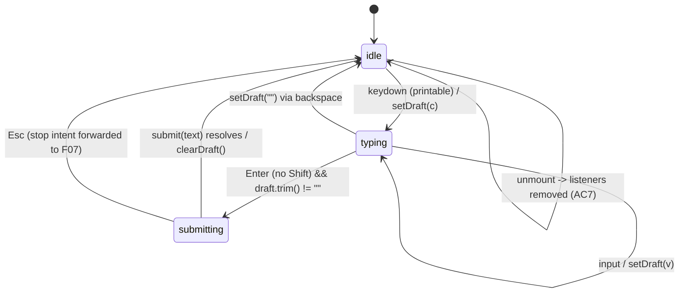
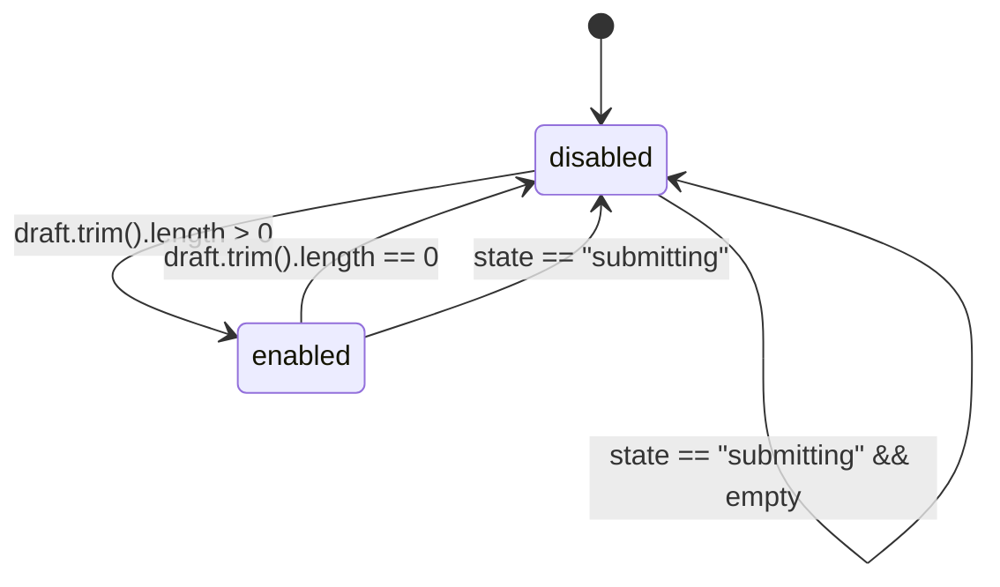
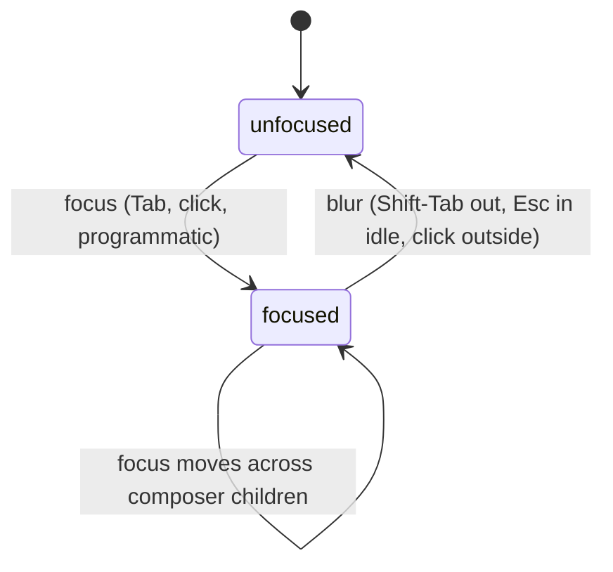
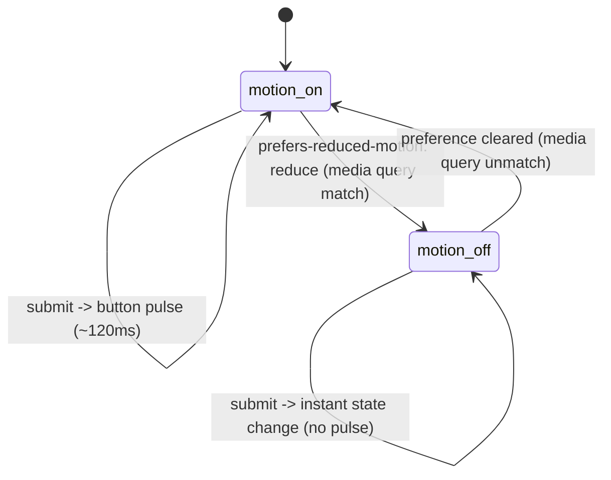

# F06 — Composer input with keyboard UX · UI

## Layout

All wireframes render inside the `ComposerInput` region reserved by [F04](../chat-sidebar-view/feature.md); only the composer footer is drawn here to keep focus on this feature. Icons are painted by [`setIcon`](../../../../standards/tech-stack.md#platform-apis) from Obsidian's bundled Lucide set ([UI Layer -> Icons](../../../../standards/tech-stack.md#ui-layer)); colours, borders, and focus rings resolve through Obsidian CSS variables ([UI Layer -> Styling](../../../../standards/tech-stack.md#ui-layer), [Code style -> Styling (Tailwind + Obsidian)](../../../../standards/code-style.md#styling-tailwind--obsidian)).

### Wireframe 1 — Empty composer (draft is whitespace, send disabled)

```
 0        10        20        30        40        50
 |---------|---------|---------|---------|---------|
+-------------------------------------------------+
| ComposerInput                                   |   region, rendered by ChatView
+-------------------------------------------------+
| +-----------------------------------------+ +--+|
| | Type a message... (placeholder, muted)  | |> ||   <- [>] = send icon, disabled
| |                                         | |..||
| +-----------------------------------------+ +--+|
|  (helper line, hidden: "Enter to send,            |
|   Shift+Enter for newline")                      |
+-------------------------------------------------+
```

- Textarea is a single-row [`HTMLTextAreaElement`](../../../../standards/tech-stack.md#ui-layer) with `rows=1`; auto-resize driven by a `ResizeObserver` + `scrollHeight` read inside a React effect ([Code style -> React 18](../../../../standards/code-style.md#react-18)).
- Placeholder text uses Obsidian's `var(--text-muted)`; the send button is rendered with [`setIcon("send")`](../../../../standards/tech-stack.md#platform-apis) and gets `aria-disabled="true"` + `disabled` until the draft has non-whitespace characters (AC matches [feature.md#acceptance-criteria](./feature.md#acceptance-criteria) item 1).

### Wireframe 2 — Multi-line expanded (Shift+Enter three times, still growing)

```
 0        10        20        30        40        50
 |---------|---------|---------|---------|---------|
+-------------------------------------------------+
| +-----------------------------------------+ +--+|
| | Summarise the highlighted section and   | |> ||   <- send now enabled
| | turn it into a bullet list.             | |  ||
| |                                         | |  ||
| | Keep terminology consistent with the    | |  ||
| | style guide.|                           | |  ||   <- | = caret
| +-----------------------------------------+ +--+|
|  (height grows up to max ~40% of leaf;            |
|   beyond that textarea scrolls internally)       |
+-------------------------------------------------+
```

- Growth is bounded by a `max-height` CSS custom property; once exceeded, the textarea scrolls internally and the outer layout stays stable ([Architecture §3.1 UI Layer](../../../../architecture/architecture.md#31-ui-layer-react-mounted-inside-obsidian-views)).
- Shift+Enter inserts `"\n"` into the controlled value; auto-resize re-measures on each `input` event ([Code style -> React 18](../../../../standards/code-style.md#react-18)).

### Wireframe 3 — Send button enabled (draft has content, ready to submit)

```
+-------------------------------------------------+
| +-----------------------------------------+ +--+|
| | Draft ready to send.                    | |> ||   <- send: setIcon("send"),
| |                                         | |  ||      aria-disabled="false",
| +-----------------------------------------+ +--+|      tabindex=0
+-------------------------------------------------+
    ^ textarea                                ^ send button (Tab stop #2)
    | (Tab stop #1)                           |
```

- Send toggles `disabled` via `draft.trim().length > 0`; the icon does not change shape, only its `aria-disabled` and `:disabled` styling (opacity shift through `var(--text-muted)` overlay) ([Code style -> Styling (Tailwind + Obsidian)](../../../../standards/code-style.md#styling-tailwind--obsidian)).
- Button is a native `<button type="button">` so Enter/Space activation is inherited from the browser; React handles `onClick` ([Code style -> React 18](../../../../standards/code-style.md#react-18)).

### Wireframe 4 — Focused (visible focus ring on textarea)

```
+-------------------------------------------------+
| #=========================================# +--+|
| # Typing here...|                          # |> ||   <- focus ring on textarea,
| #                                          # |  ||      2px outline, colour
| #=========================================# +--+|      var(--interactive-accent)
+-------------------------------------------------+
     ^ `#` = 2px ring rendered via CSS outline
       sourced from Obsidian's focus-ring variables
       (no custom colour values)
```

```
+-------------------------------------------------+
| +-----------------------------------------+ #==#|
| | Draft ready to send.                    | #> #|   <- focus ring on send btn
| +-----------------------------------------+ #==#|      (Tab from textarea)
+-------------------------------------------------+
```

- Focus ring is a CSS `outline` on the focused element using `outline-color: var(--interactive-accent)` and `outline-width: 2px`; no `outline: none` is permitted anywhere in the composer stylesheet — enforced by the style audit unit test ([Code style -> Styling (Tailwind + Obsidian)](../../../../standards/code-style.md#styling-tailwind--obsidian)).
- Matches accessibility invariants established by [F04 ui.md](../chat-sidebar-view/ui.md) for the whole shell.

### Wireframe 5 — Disabled while another request is in-flight (queue hint)

```
+-------------------------------------------------+
| +-----------------------------------------+ +--+|
| | (readonly; next turn queues)            | |[]||   <- setIcon("square"): stop
| |                                         | |  ||      glyph signals "Esc stops"
| +-----------------------------------------+ +--+|
|  hint: "Waiting for reply - press Esc to stop;  |
|         your next message will queue" (muted)    |
+-------------------------------------------------+
```

- While `state === "submitting"` the textarea stays focusable and keystrokes still reach it, but the `submit(text)` callback is gated (actual FIFO queuing lands with F11 per [feature.md#out-of-scope](./feature.md#out-of-scope)); this wireframe shows the visual affordance this feature ships.
- The send button swaps to a stop glyph via [`setIcon("square")`](../../../../standards/tech-stack.md#platform-apis); Esc forwards the stop intent (actual `AbortController` wiring lands with F07 per [Architecture §5.6 Cancellation](../../../../architecture/architecture.md#56-cancellation)).
- Hint line renders with `var(--text-muted)`; screen readers get the same text via `aria-describedby` on the textarea ([Architecture §3.1 UI Layer](../../../../architecture/architecture.md#31-ui-layer-react-mounted-inside-obsidian-views)).

## State machine

Three parallel machines describe composer behaviour: the composer draft lifecycle, the send-button enablement, and the focus-ring visibility. A reduced-motion variant collapses all transition animations to instant state changes.

### Composer draft lifecycle: `idle → typing → submitting → idle`



- `submit(text)` is the callback the feature emits; the agent-runner wiring of later features consumes it ([Architecture §5.2 Chat Turn (no tools)](../../../../architecture/architecture.md#52-chat-turn-no-tools)).
- `typing -> submitting` happens synchronously on Enter without Shift; the textarea is cleared immediately ([feature.md acceptance criteria 1](./feature.md#acceptance-criteria)).
- `submitting -> idle` via Esc only forwards the stop intent; the abort completes inside F07 per [Architecture §5.6 Cancellation](../../../../architecture/architecture.md#56-cancellation).

### Send-button enablement: `disabled ↔ enabled`



- The button's `disabled` prop is a pure derivation of `draft` and composer state; no local flag ([Code style -> React 18](../../../../standards/code-style.md#react-18)).
- `aria-disabled` mirrors `disabled` so assistive tech announces the state change.

### Focus ring: `unfocused ↔ focused`



- `:focus-visible` drives ring rendering so pointer-only clicks do not paint a ring on the button; keyboard focus always paints one ([Code style -> Styling (Tailwind + Obsidian)](../../../../standards/code-style.md#styling-tailwind--obsidian)).
- Ring colour/width are sourced exclusively from Obsidian's focus-ring CSS variables ([UI Layer -> Styling](../../../../standards/tech-stack.md#ui-layer)).

### Reduced-motion variant



- The media query `(prefers-reduced-motion: reduce)` is listened to via `window.matchMedia(...).addEventListener("change", ...)`; toggling without reload is required ([feature.md acceptance criteria 6](./feature.md#acceptance-criteria)).
- When reduced, every composer-originated transition (send-button pulse, focus-ring fade-in, textarea auto-resize ease) collapses to instant end-state ([Code style -> Styling (Tailwind + Obsidian)](../../../../standards/code-style.md#styling-tailwind--obsidian)).

## Event flow

### 1. User types printable character -> auto-resize -> enable send

1. Browser dispatches `keydown` then `input` on the `HTMLTextAreaElement` ([UI Layer -> Framework](../../../../standards/tech-stack.md#ui-layer)).
2. React `onChange` updates controlled `draft` state ([Code style -> React 18](../../../../standards/code-style.md#react-18)).
3. An effect gated by a `useLayoutEffect` reads `textarea.scrollHeight`, sets `textarea.style.height = "auto"` then `= scrollHeight + "px"` up to the `max-height` cap; overflow scrolls internally ([Architecture §3.1 UI Layer](../../../../architecture/architecture.md#31-ui-layer-react-mounted-inside-obsidian-views)).
4. Derived `sendEnabled = draft.trim().length > 0` flips the button's `disabled` and `aria-disabled`.
5. Machine moves `idle -> typing`.

### 2. Enter (no Shift) -> submit + clear

1. `keydown` fires with `event.key === "Enter" && !event.shiftKey && !event.isComposing` ([Code style -> React 18](../../../../standards/code-style.md#react-18)).
2. Handler calls `event.preventDefault()` to stop the default newline insertion, then (if `sendEnabled`) calls the component's `submit(draft)` callback ([Architecture §5.2 Chat Turn (no tools)](../../../../architecture/architecture.md#52-chat-turn-no-tools)).
3. `setDraft("")` clears the textarea; the auto-resize effect collapses the height back to one row.
4. Focus remains on the textarea so the user can type the next turn without a pointer move ([NFR-USE-05 per feature.md](./feature.md#purpose)).
5. Machine moves `typing -> submitting -> idle`.

### 3. Shift+Enter -> literal newline

1. `keydown` sees `event.shiftKey === true`; the handler does **not** call `preventDefault`.
2. Browser default inserts `"\n"` at the caret; React controlled `onChange` updates `draft` normally.
3. Auto-resize effect increases the textarea height; if the cap is reached, internal scroll begins.
4. No submit is fired; send button remains enabled or disabled per the trim rule.

### 4. Esc during streaming -> stop intent

1. `keydown` with `event.key === "Escape"` is routed through a precedence ladder ([feature.md acceptance criteria 3](./feature.md#acceptance-criteria)):
   - If `InlineConfirmation` slot (from [F04](../chat-sidebar-view/feature.md)) reports open, Esc closes only the confirmation — F04 owns the handler; the composer yields.
   - Else if `state === "submitting"`, Esc forwards the stop intent (wired into an `AbortController` by F07 per [Architecture §5.6 Cancellation](../../../../architecture/architecture.md#56-cancellation)); the composer stays in `submitting` until F07 resolves it.
   - Else (idle), Esc blurs the textarea (`textarea.blur()`); no submit occurs.
2. In every branch, `event.stopPropagation()` prevents Esc from escaping the view and closing unrelated Obsidian surfaces (matches F04's Esc invariant in [ui.md](../chat-sidebar-view/ui.md)).

### 5. Cmd/Ctrl+K -> opens in-chat palette

1. `keydown` with `event.key === "k"` and (`event.metaKey` on macOS or `event.ctrlKey` elsewhere) fires on the composer root.
2. Handler calls `event.preventDefault()` + `event.stopPropagation()` so the underlying editor never receives the chord ([feature.md acceptance criteria 4](./feature.md#acceptance-criteria)).
3. Plugin calls its own command-palette entry point via [`Plugin.addCommand`](../../../../standards/tech-stack.md#platform-apis) / Obsidian's `Commands.executeCommandById` for the chat-scoped palette command registered by the plugin ([Code style -> Obsidian Plugin Patterns](../../../../standards/code-style.md#obsidian-plugin-patterns)).
4. Focus transfers to Obsidian's palette modal; on close, focus returns to the textarea (Obsidian handles the return).

### 6. Focus traversal with Tab / Shift-Tab

1. Tab order inside the composer: **textarea -> send button -> (next composer-owned affordance, if any) -> exits composer into surrounding `ChatView` slots** ([feature.md acceptance criteria 5](./feature.md#acceptance-criteria)).
2. Shift-Tab reverses the order; no element has `tabindex > 0` so DOM order is authoritative ([Code style -> React 18](../../../../standards/code-style.md#react-18)).
3. Each focus stop paints the focus ring defined above; a Vitest style audit asserts zero custom outline colours and at least `2px` outline width ([Testing (Vitest + msw)](../../../../standards/code-style.md#testing-vitest--msw)).
4. On unmount (pane close, plugin disable, thread switch), all `keydown` listeners, the palette binding, and the `matchMedia` change listener are removed inside the `useEffect` cleanup ([Architecture §10 Concurrency & Lifecycle Rules](../../../../architecture/architecture.md#10-concurrency--lifecycle-rules)); no dangling global handlers survive (AC7).

## Component mapping

| UI block | Obsidian / React component | Standards reference |
|---|---|---|
| Textarea element | Native [`HTMLTextAreaElement`](../../../../standards/tech-stack.md#ui-layer) wrapped by a controlled React component | [UI Layer -> Framework](../../../../standards/tech-stack.md#ui-layer); [Code style -> React 18](../../../../standards/code-style.md#react-18) |
| Auto-resize | `useLayoutEffect` reading `scrollHeight`, writing `style.height`; bounded by CSS `max-height` | [Code style -> React 18](../../../../standards/code-style.md#react-18); [Architecture §3.1 UI Layer](../../../../architecture/architecture.md#31-ui-layer-react-mounted-inside-obsidian-views) |
| Send / stop button glyph | Obsidian [`setIcon`](../../../../standards/tech-stack.md#platform-apis) with Lucide names `send` (idle) and `square` (stop while submitting) | [UI Layer -> Icons](../../../../standards/tech-stack.md#ui-layer); [Platform APIs](../../../../standards/tech-stack.md#platform-apis) |
| Send button element | Native `<button type="button">` so Enter/Space activation is inherited | [Code style -> React 18](../../../../standards/code-style.md#react-18) |
| Focus ring | CSS `outline` sourced from Obsidian focus-ring variables (`var(--interactive-accent)`, `2px` width) — no hardcoded colours | [UI Layer -> Styling](../../../../standards/tech-stack.md#ui-layer); [Code style -> Styling (Tailwind + Obsidian)](../../../../standards/code-style.md#styling-tailwind--obsidian) |
| Keyboard events (Enter, Shift+Enter, Esc, Tab, Cmd/Ctrl+K) | React `onKeyDown` on the composer root with `event.preventDefault` / `stopPropagation` per branch; IME composition respected via `event.isComposing` | [Code style -> React 18](../../../../standards/code-style.md#react-18) |
| Cmd/Ctrl+K palette route | [`Plugin.addCommand`](../../../../standards/tech-stack.md#platform-apis) entry dispatched via Obsidian's command API; no default hotkey leaks to the editor | [Platform APIs -> `Plugin`](../../../../standards/tech-stack.md#platform-apis); [Code style -> Obsidian Plugin Patterns](../../../../standards/code-style.md#obsidian-plugin-patterns) |
| Reduced-motion gate | `window.matchMedia("(prefers-reduced-motion: reduce)")` listener inside `useEffect`; removed on unmount | [Code style -> Styling (Tailwind + Obsidian)](../../../../standards/code-style.md#styling-tailwind--obsidian); [Architecture §10 Concurrency & Lifecycle Rules](../../../../architecture/architecture.md#10-concurrency--lifecycle-rules) |
| Submit callback contract | React prop `submit(text: string): void` consumed by agent-runner wiring in later features | [Architecture §5.2 Chat Turn (no tools)](../../../../architecture/architecture.md#52-chat-turn-no-tools); [Architecture §11 SRS FR -> Modules](../../../../architecture/architecture.md#11-mapping-srs-fr--modules) |
| Esc precedence read of `InlineConfirmation` open-state | Read-only prop supplied by `ChatView` (owned by [F04](../chat-sidebar-view/feature.md)); composer never writes it | [Architecture §3.1 UI Layer](../../../../architecture/architecture.md#31-ui-layer-react-mounted-inside-obsidian-views) |
| Esc stop-intent forwarding (while submitting) | Callback `onStopIntent(): void`; the `AbortController` wiring lives in F07 | [Architecture §5.6 Cancellation](../../../../architecture/architecture.md#56-cancellation) |
| Listener teardown on unmount | `useEffect` returns a cleanup that removes `keydown`, palette binding, `matchMedia` change handler | [Architecture §10 Concurrency & Lifecycle Rules](../../../../architecture/architecture.md#10-concurrency--lifecycle-rules); [Code style -> Obsidian Plugin Patterns](../../../../standards/code-style.md#obsidian-plugin-patterns) |
| Styling surface | Tailwind utilities gated by Obsidian CSS variables (`--background-primary`, `--background-modifier-border`, `--text-normal`, `--text-muted`, `--interactive-accent`); no hardcoded colours | [UI Layer -> Styling](../../../../standards/tech-stack.md#ui-layer); [Code style -> Styling (Tailwind + Obsidian)](../../../../standards/code-style.md#styling-tailwind--obsidian) |
| Unit tests (Enter vs Shift+Enter, Esc precedence, Cmd-K, focus order, disabled rule, style audit, motion gate) | Vitest + jsdom | [Testing (Vitest + msw)](../../../../standards/code-style.md#testing-vitest--msw); [Tech stack -> Testing](../../../../standards/tech-stack.md#testing) |

Accessibility invariants for this feature ([feature.md#purpose](./feature.md#purpose) and the shell-wide invariants established by [F04 ui.md](../chat-sidebar-view/ui.md)):

- Every interactive element (textarea, send button) is Tab/Shift-Tab reachable; no element is keyboard-trapped ([Code style -> React 18](../../../../standards/code-style.md#react-18)).
- Focus ring is always rendered via Obsidian's focus-ring CSS variables; a style-audit test asserts zero `outline: none` rules and zero hardcoded outline colours ([Code style -> Styling (Tailwind + Obsidian)](../../../../standards/code-style.md#styling-tailwind--obsidian)).
- `prefers-reduced-motion: reduce` suppresses send-button pulse and any composer-originated transition; state changes still apply, just instantly ([Code style -> Styling (Tailwind + Obsidian)](../../../../standards/code-style.md#styling-tailwind--obsidian)).
- Send-button state is announced through `aria-disabled`, not colour alone; stop state is communicated by both icon and label so colour is never the sole signal ([UI Layer -> Framework](../../../../standards/tech-stack.md#ui-layer)).
- IME composition is respected: Enter during composition (`event.isComposing === true`) does **not** submit ([Code style -> React 18](../../../../standards/code-style.md#react-18)).

## Back-link

[<- feature.md](./feature.md)
