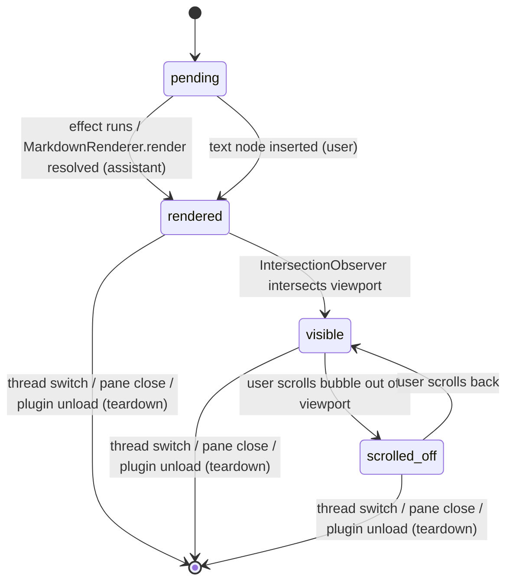
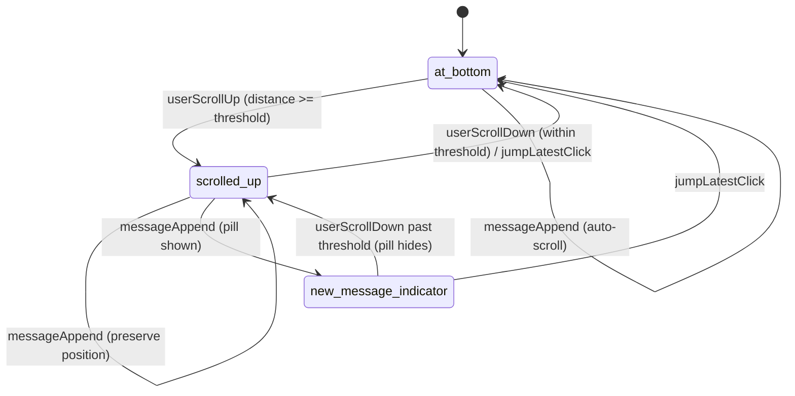
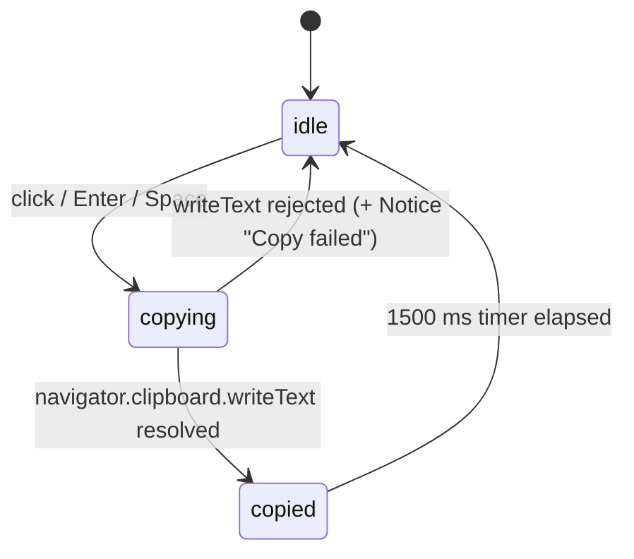

# F05 — Message list with markdown rendering · UI

## Layout

### Wireframe 1 — Scrollable transcript at bottom (width >= 280 px)

```
 0        10        20        30        40        50
 |---------|---------|---------|---------|---------|    min-width marker: 280 px
+--------------------------------------------------+
|  ChatView chrome above (HeaderBar, ContextInd.)  |   (F04 regions, not this feature)
+--------------------------------------------------+ <- MessageList region starts
|                                                 ^|   <- native scrollbar track
| +--------------------------------------------+  ||
| |  user  2026-04-19 09:12                   |  ||   <- user bubble
| |  summarise the weekly notes please         |  ||      role="listitem"
| +--------------------------------------------+  ||      align=end, plain-text
|                                                  ||
| +----------------------------------------------+||
| | assistant  2026-04-19 09:12                  |||   <- assistant bubble
| |                                               |||      role="listitem"
| |  ## Highlights                                |||      markdown subtree
| |   - shipped F01 logging                       |||
| |   - drafted F04 view shell                    |||
| |                                               |||
| |  See the >note about retrospectives<.         |||   inline link/em/strong
| |                                               |||
| |  Inline code: `MarkdownRenderer.render`.      |||   inline code chip
| |                                               |||
| |  +---- ts ----------------------- [copy] ---+ |||   <- fenced code block
| |  | function hello(name: string) {           | |||      pre/code subtree
| |  |   return `hi, ${name}`;                  | |||      syntax-highlighted
| |  | }                                         | |||      copy button top-right
| |  +-------------------------------------------+ |||
| |                                               |||
| |  > blockquote reply                            |||
| +----------------------------------------------+||
|                                                  v|   <- thumb near bottom
+--------------------------------------------------+ <- MessageList region ends
|  ComposerInput below (F06)                       |
+--------------------------------------------------+
```

Outer wrapper is the `MessageList` region scaffolded by [F04](../chat-sidebar-view/feature.md) with `role="log"` `aria-live="polite"`. Each child `role="listitem"` bubble is keyed by message id ([Code style -> React 18](../../../../standards/code-style.md#react-18)). Assistant bubbles host an isolated DOM subtree populated via [`MarkdownRenderer.render`](../../../../standards/tech-stack.md#platform-apis). Bubble surface/border/alignment use only Obsidian CSS variables ([Code style -> Styling (Tailwind + Obsidian)](../../../../standards/code-style.md#styling-tailwind--obsidian); [UI Layer -> Styling](../../../../standards/tech-stack.md#ui-layer)).

### Wireframe 2 — Scrolled up, "Jump to latest" affordance

```
 0        10        20        30        40        50
 |---------|---------|---------|---------|---------|    width marker: >= 280 px
+--------------------------------------------------+ <- MessageList region starts
| +--------------------------------------------+  |^|   <- thumb mid-track
| |  assistant  2026-04-19 08:55               |  |||      (older turn)
| |  paragraph rendered as markdown...          |  |||
| +--------------------------------------------+  |||
|                                                  |||
| +--------------------------------------------+  |||
| |  user  2026-04-19 08:56                    |  |||
| |  follow-up                                  |  |||
| +--------------------------------------------+  |||
|                                                  |||
|                                                  |||
|                  +---------------------+         |||
|                  |  v  Jump to latest  |         |||   <- new-message pill
|                  +---------------------+         |||      role="button"
|                  (3 new messages since last)     |||      floats above content
+--------------------------------------------------+ <- MessageList region ends
```

Pill appears when `scroll state = scrolled-up` AND `pendingNew > 0`. Icon painted via [`setIcon("chevron-down")`](../../../../standards/tech-stack.md#platform-apis). Keyboard-reachable via Tab; Enter/Space scrolls the list to the latest turn. Slide-in animation is suppressed when `prefers-reduced-motion: reduce` is set ([Code style -> Styling (Tailwind + Obsidian)](../../../../standards/code-style.md#styling-tailwind--obsidian)).

### Wireframe 3 — Fenced code block with copy button (zoom in)

```
 0        10        20        30        40        50
 |---------|---------|---------|---------|---------|
+--------------------------------------------------+
| +---- ts ----------------------------+ [ copy ] +|   <- language label (left)
| |                                    +----------+|      copy button (right)
| | function hello(name: string) {                ||      aria-label="Copy code"
| |   return `hi, ${name}`;                       ||      tabIndex=0
| | }                                              ||
| +-------------------------------------------------+
+--------------------------------------------------+

state: idle           button: [  copy  ]      icon: setIcon("copy")
state: copying        button: [ ...    ]      icon: setIcon("loader")
state: copied (1.5s)  button: [ copied ]      icon: setIcon("check")
                      + Obsidian Notice "Copied to clipboard"
```

Code-fence body is left to Obsidian's native pre/code render path inside the `MarkdownRenderer.render` subtree; the copy button is a sibling injected per code block. Button glyph via [`setIcon`](../../../../standards/tech-stack.md#platform-apis); success toast via [`Notice`](../../../../standards/tech-stack.md#platform-apis). Icon-only buttons must meet 3:1 non-text contrast through `var(--interactive-accent)` focus ring and `var(--text-muted)` default stroke ([Code style -> Styling (Tailwind + Obsidian)](../../../../standards/code-style.md#styling-tailwind--obsidian)).

### Wireframe 4 — Long thread, scrollbar detail

```
 0        10        20        30        40        50
 |---------|---------|---------|---------|---------|
                                                 +-+
+--------------------------------------------------+^+    <- up-arrow (native)
|  ... scrolled-off: 2 oldest messages             |#|    <- filled thumb
|  (DOM-retained; off-screen; no visibility hit)   |#|       position indicates
|                                                  | |       scroll-progress
|  +----------------------------------------+      | |
|  | assistant ...                          |      | |
|  +----------------------------------------+      | |
|                                                  |v|    <- down-arrow
+--------------------------------------------------+-+
```

Scrollbar is the native Obsidian sidebar scrollbar (theme-styled through `var(--scrollbar-bg)` / `var(--scrollbar-thumb-bg)`; no custom scrollbar CSS). List stays virtualisation-free at v1 because the transcript sits inside an `ItemView` already bounded by the sidebar's own overflow. Messages that leave the viewport enter the `scrolled-off` lifecycle state but remain in the DOM so stable keys and `MarkdownRenderer` subtrees survive ([Architecture §10](../../../../architecture/architecture.md#10-concurrency--lifecycle-rules); [Code style -> React 18](../../../../standards/code-style.md#react-18)).

## State machine

Three machines run in parallel per `MessageList` instance.

### `MessageLifecycleMachine` (per message)



Invariants:
- `pending -> rendered` runs inside a React effect; the markdown subtree is owned by a `ref` and torn down in the effect's cleanup ([Code style -> React 18](../../../../standards/code-style.md#react-18); [Architecture §10](../../../../architecture/architecture.md#10-concurrency--lifecycle-rules)).
- `scrolled_off` never unmounts the bubble — keeps stable keys per AC7.

### `ScrollStateMachine` (per list)



Threshold: last 24 px sentinel tracked by `IntersectionObserver`. Smooth-scroll honours `prefers-reduced-motion: reduce` by degrading to `scrollIntoView({ behavior: "auto" })` ([Code style -> Styling (Tailwind + Obsidian)](../../../../standards/code-style.md#styling-tailwind--obsidian)).

### `CopyButtonMachine` (per code block)



`copied` flash also fires an Obsidian [`Notice`](../../../../standards/tech-stack.md#platform-apis) (AC6). No `setTimeout` leaks on unmount: the timer handle lives on the React ref and is cleared in effect cleanup ([Code style -> React 18](../../../../standards/code-style.md#react-18)).

## Event flow

### 1. New message appended (at-bottom path)

1. `AgentRunner` resolves a completed turn and the thread model emits `messages.appended` ([Architecture §5.2](../../../../architecture/architecture.md#52-chat-turn-no-tools)).
2. React re-renders; the new bubble mounts with state `pending`.
3. For user role: plain text node inserted; bubble transitions to `rendered`.
4. For assistant role: `useEffect` invokes [`MarkdownRenderer.render(app, text, container, sourcePath, component)`](../../../../standards/tech-stack.md#platform-apis) inside the bubble's `ref` container; on resolve, bubble transitions to `rendered` ([Architecture §5.2](../../../../architecture/architecture.md#52-chat-turn-no-tools)).
5. The copy-button injector walks `container.querySelectorAll("pre > code")` and mounts a `<button>` per block (keyboard-reachable, Tab order, aria-labelled "Copy code") — listeners tracked for cleanup per [Architecture §10](../../../../architecture/architecture.md#10-concurrency--lifecycle-rules).
6. `ScrollStateMachine` is in `at_bottom`: effect calls `scrollIntoView` on the tail sentinel. If `prefers-reduced-motion: reduce` is set, uses `behavior: "auto"`; else `"smooth"` ([Code style -> Styling (Tailwind + Obsidian)](../../../../standards/code-style.md#styling-tailwind--obsidian)).

### 2. New message appended (scrolled-up path)

1. Steps 1-5 identical.
2. `ScrollStateMachine` is in `scrolled_up`: no auto-scroll; increment `pendingNew` counter; transition to `new_message_indicator`.
3. The "Jump to latest" pill renders above the list content; pill receives focus target but not focus ([NFR-USE-07 via Architecture §3.1](../../../../architecture/architecture.md#31-ui-layer-react-mounted-inside-obsidian-views)).
4. `role="log"` + `aria-live="polite"` on the region (owned by [F04](../chat-sidebar-view/feature.md)) ensures screen readers are notified without stealing focus.

### 3. Jump to latest

1. User clicks / presses Enter on the pill.
2. `jumpLatestClick` fires; list scrolls the tail sentinel into view; machine transitions `new_message_indicator -> at_bottom`.
3. Pill unmounts; `pendingNew = 0`.
4. Scroll animation respects `prefers-reduced-motion: reduce`.

### 4. Code-block copy click

1. User clicks the copy button or focuses it with Tab + presses Enter/Space ([Code style -> Obsidian Plugin Patterns](../../../../standards/code-style.md#obsidian-plugin-patterns)).
2. `CopyButtonMachine` transitions `idle -> copying`; button glyph swaps via [`setIcon`](../../../../standards/tech-stack.md#platform-apis).
3. Handler reads `codeEl.textContent` (exact fence contents, no DOM decoration text) and calls `navigator.clipboard.writeText(text)`.
4. On resolve: transition `copying -> copied`; fire [`new Notice("Copied to clipboard")`](../../../../standards/tech-stack.md#platform-apis); start 1500 ms timer.
5. On reject: transition back to `idle`; fire `new Notice("Copy failed")` (soft failure, no throw) — matches [Code style -> Obsidian Plugin Patterns](../../../../standards/code-style.md#obsidian-plugin-patterns).
6. On timer: transition `copied -> idle`; restore original icon.

### 5. Teardown (unmount, thread switch, plugin unload)

1. React cleanup runs on every bubble effect.
2. `MarkdownRenderer.render`'s owning `Component` is `unload()`-ed so Obsidian detaches its inner children and listeners.
3. Copy-button click listeners are removed; pending `setTimeout` handles are cleared.
4. `IntersectionObserver` for bubble visibility and for the tail sentinel are disconnected.
5. No dangling nodes, observers, or listeners remain (AC7; [Architecture §10](../../../../architecture/architecture.md#10-concurrency--lifecycle-rules)).

## Component mapping

| UI block | Component / API | Standards reference |
|---|---|---|
| `MessageList` region | React `<section role="log" aria-live="polite" aria-relevant="additions">` reused from [F04](../chat-sidebar-view/feature.md) | [Architecture §3.1](../../../../architecture/architecture.md#31-ui-layer-react-mounted-inside-obsidian-views) |
| Message ordered children | React `<ol role="list">` keyed by message id, each child `role="listitem"` | [Code style -> React 18](../../../../standards/code-style.md#react-18) |
| User bubble | React `<li>` with plain-text node; whitespace preserved via `white-space: pre-wrap` | [UI Layer -> Framework](../../../../standards/tech-stack.md#ui-layer) |
| Assistant bubble markdown subtree | [`MarkdownRenderer.render(app, text, container, sourcePath, component)`](../../../../standards/tech-stack.md#platform-apis) invoked inside `useEffect`; owning `Component` `unload()`-ed on cleanup | [Platform APIs -> `MarkdownRenderer`](../../../../standards/tech-stack.md#platform-apis); [Architecture §10](../../../../architecture/architecture.md#10-concurrency--lifecycle-rules) |
| Fenced code-block body | Native Obsidian pre/code render inside the `MarkdownRenderer` subtree (syntax highlighting included) | [Platform APIs -> `MarkdownRenderer`](../../../../standards/tech-stack.md#platform-apis) |
| Copy button icon | [`setIcon(buttonEl, "copy")`](../../../../standards/tech-stack.md#platform-apis); swaps to `"check"` on `copied`, `"loader"` on `copying` | [UI Layer -> Icons](../../../../standards/tech-stack.md#ui-layer) |
| Copy button element | `<button type="button" aria-label="Copy code">` with visible focus ring, Tab-reachable in listing order | [Code style -> Obsidian Plugin Patterns](../../../../standards/code-style.md#obsidian-plugin-patterns); [Code style -> Styling (Tailwind + Obsidian)](../../../../standards/code-style.md#styling-tailwind--obsidian) |
| Copy success feedback | [`new Notice("Copied to clipboard")`](../../../../standards/tech-stack.md#platform-apis) | [Code style -> Obsidian Plugin Patterns](../../../../standards/code-style.md#obsidian-plugin-patterns) |
| Clipboard write | `navigator.clipboard.writeText(codeEl.textContent)` (Electron renderer) | [Platform APIs](../../../../standards/tech-stack.md#platform-apis) |
| "Jump to latest" pill | React `<button role="button" aria-label="Jump to latest message">` with [`setIcon("chevron-down")`](../../../../standards/tech-stack.md#platform-apis) glyph | [UI Layer -> Icons](../../../../standards/tech-stack.md#ui-layer) |
| Scroll anchor / tail sentinel | Empty `<div ref={tailRef} />` at list end; `IntersectionObserver` drives `ScrollStateMachine` | [UI Layer -> Framework](../../../../standards/tech-stack.md#ui-layer) |
| Bubble theming | Obsidian CSS variables only: `--background-primary`, `--background-secondary`, `--background-modifier-border`, `--text-normal`, `--text-muted`, `--interactive-accent`, `--radius-m` — zero colour literals | [UI Layer -> Styling](../../../../standards/tech-stack.md#ui-layer); [Code style -> Styling (Tailwind + Obsidian)](../../../../standards/code-style.md#styling-tailwind--obsidian) |
| Scrollbar | Native Obsidian scrollbar via theme variables (`--scrollbar-bg`, `--scrollbar-thumb-bg`) on the region's overflow container; no custom scrollbar CSS | [UI Layer -> Styling](../../../../standards/tech-stack.md#ui-layer) |
| Reduced-motion handling | CSS `@media (prefers-reduced-motion: reduce)` disables pill slide-in and forces `scrollIntoView({ behavior: "auto" })` | [Code style -> Styling (Tailwind + Obsidian)](../../../../standards/code-style.md#styling-tailwind--obsidian) |
| React mount / unmount symmetry | `createRoot` / `root.unmount()` inherited from [F04](../chat-sidebar-view/feature.md); per-bubble effect cleanup releases markdown subtrees, copy listeners, observers, timers | [Architecture §10](../../../../architecture/architecture.md#10-concurrency--lifecycle-rules); [Code style -> React 18](../../../../standards/code-style.md#react-18) |
| Unit tests (order, roles, markdown invocation, copy click, style audit) | Vitest + jsdom | [Testing -> Unit](../../../../standards/tech-stack.md#testing) |

Accessibility invariants ([Architecture §3.1](../../../../architecture/architecture.md#31-ui-layer-react-mounted-inside-obsidian-views)):

- Copy button is keyboard-reachable through Tab/Shift-Tab in listing order, activates on Enter and Space, and shows a visible focus ring using `var(--interactive-accent)`.
- "Jump to latest" pill is keyboard-reachable, activates on Enter/Space, and is announced via its `aria-label`.
- Role/alignment/colour never carry status alone: the copy button swaps icon AND emits a `Notice`; the new-message indicator shows both a glyph and a counted label.
- `prefers-reduced-motion: reduce` suppresses scroll smoothing and pill slide animations; the state transitions still fire.
- User vs assistant distinction is carried by surface, border, and alignment using Obsidian CSS variables — a style audit asserts zero colour literals in bubble styles ([Code style -> Styling (Tailwind + Obsidian)](../../../../standards/code-style.md#styling-tailwind--obsidian)).

## Back-link

[<- feature.md](./feature.md)
