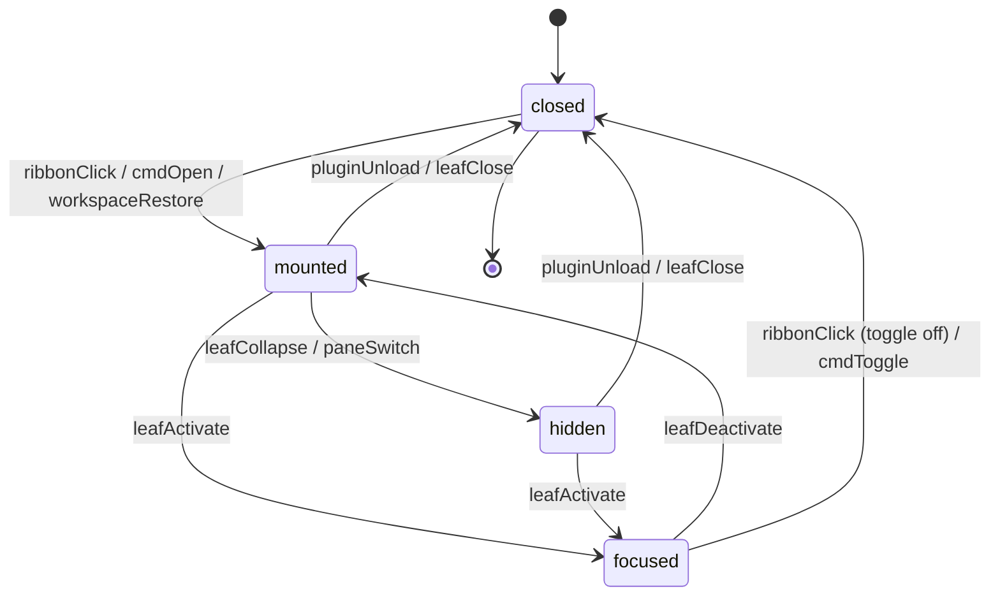
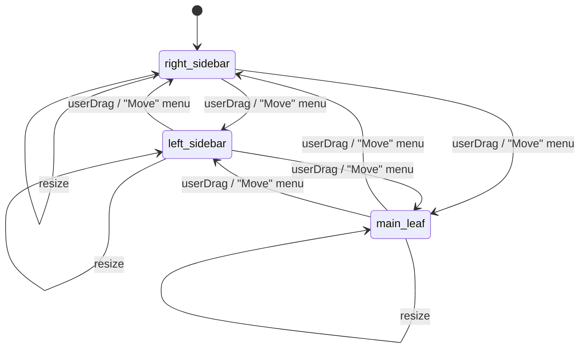

# F04 — Chat sidebar ItemView shell · UI

## Layout

### Wireframe 1 — Chat sidebar full (width >= 280px, default right-sidebar leaf)

```
 0        10        20        30        40        50
 |---------|---------|---------|---------|---------|     min-width marker: 280px
+------------------------------------------------+
| [leo] Leo                           [-] [o] [x] |   <- HeaderBar  (region)
|  active-skill   [ status: idle ]     [...menu]  |      role=banner
+------------------------------------------------+
| ContextIndicator                                |   <- ContextIndicator
|  note: (none)  range: --  selection: --         |      region
+------------------------------------------------+
|                                                 |
|   MessageList                                   |   <- MessageList
|   role="log"  aria-live="polite"                |      region
|                                                 |
|   (empty — messages mount here via F05)         |
|                                                 |
|                                                 |
|                                                 |
|                                                 |
+------------------------------------------------+
| InlineConfirmation slot (hidden by default)     |   <- InlineConfirmation
|   role="dialog"  aria-modal="true"              |      region  (F17/F25)
+------------------------------------------------+
| InlineDialog slot (hidden by default)           |   <- InlineDialog
|   role="dialog"  aria-modal="true"              |      region  (F20)
+------------------------------------------------+
| ComposerInput placeholder                       |   <- ComposerInput
|  [ type a message ...                ] [send]  |      region  (F06)
+------------------------------------------------+
```

Width markers show the shell holds at 280 px; every region is a named wrapper rendered by [`ChatView`](../../../../architecture/architecture.md#31-ui-layer-react-mounted-inside-obsidian-views). `[leo]`, `[-]`, `[o]`, `[x]` are Lucide glyphs painted via [`setIcon`](../../../../standards/tech-stack.md#platform-apis) from Obsidian's bundled icon set ([UI Layer -> Icons](../../../../standards/tech-stack.md#ui-layer)).

### Wireframe 2 — Collapsed (width < 280px)

```
 0        10        20        30
 |---------|---------|---------|          width marker: < 280px
+-----------------------------+
| [leo] Leo          [...]    |   <- HeaderBar collapsed: title + overflow
+-----------------------------+
| note.md · 1..140 · sel 0    |   <- ContextIndicator: one-line summary
+-----------------------------+
|                             |
|   MessageList               |
|   role="log"                |
|                             |
|                             |
+-----------------------------+
| InlineConfirmation          |
+-----------------------------+
| InlineDialog                |
+-----------------------------+
| [                     ][>]  |   <- ComposerInput (send shrinks to icon)
+-----------------------------+
```

Collapse is driven by a `ResizeObserver` on the view's `containerEl` (see Event flow). The `[...]` overflow button reveals every action the full `HeaderBar` held, wired through an Obsidian [`Menu`](../../../../standards/tech-stack.md#platform-apis) instance; the `ContextIndicator` compresses its three fields into one `·`-joined line. Transition between full and collapsed honours `prefers-reduced-motion: reduce` ([Code style -> Styling (Tailwind + Obsidian)](../../../../standards/code-style.md#styling-tailwind--obsidian)).

### Wireframe 3 — Ribbon + command palette affordances

```
Obsidian ribbon (left gutter)                Obsidian command palette
+------+                                     +---------------------------------+
|  ... |                                     |  > leo                          |
|  []  |                                     |---------------------------------|
|  /\  | <- Leo ribbon icon (toggle)         |  Leo: Open chat           Enter |
|  []  |    tooltip: "Leo: Open chat"        |  (more Leo: * come with         |
|  ... |    setIcon("bot") or theme icon     |   later features)               |
+------+                                     +---------------------------------+
```

Ribbon entry registered via [`Plugin.addRibbonIcon`](../../../../standards/tech-stack.md#platform-apis); palette entry registered via [`Plugin.addCommand`](../../../../standards/tech-stack.md#platform-apis) with no hardcoded hotkey so users can bind it through Obsidian's native Hotkeys UI ([Code style -> Obsidian Plugin Patterns](../../../../standards/code-style.md#obsidian-plugin-patterns)).

### Z-index layering (highest on top)

```
 +-----------------------------------------+
 |  Obsidian Notice           z: top       |   (Obsidian-owned, we only defer)
 +-----------------------------------------+
 |  Obsidian Modal            z: 1000      |   (Obsidian-owned)
 +-----------------------------------------+
 |  InlineDialog / InlineConfirmation      |   plugin z-token: 900
 +-----------------------------------------+
 |  Tooltips (Obsidian-native)             |   z: ~800
 +-----------------------------------------+
 |  Edit-lock decorations (CM6)            |   z: ~100  (applies in editor)
 +-----------------------------------------+
 |  MessageList content                    |   z: 0 (baseline inside leaf)
 +-----------------------------------------+
```

The plugin writes its own z-token CSS custom properties scoped to the view root so later features consume them without re-deciding order; all tokens resolve through Obsidian CSS variables where possible (per [UI Layer -> Styling](../../../../standards/tech-stack.md#ui-layer)). This satisfies the mandated Notice > Modal > InlineDialog > Tooltip > EditLock > Content ordering called out in [Architecture §3.1](../../../../architecture/architecture.md#31-ui-layer-react-mounted-inside-obsidian-views).

## State machine

Two machines run in parallel: `ViewLifecycleMachine` for mount/unmount, and `LeafPlacementMachine` for sidebar ↔ main-leaf moves.





Lifecycle invariants:

- `closed -> mounted` runs [`ItemView.onOpen`](../../../../standards/tech-stack.md#platform-apis) which mounts the React tree via `createRoot` ([UI Layer -> Framework](../../../../standards/tech-stack.md#ui-layer)); AC10 requires the matching unmount in `onClose` per [Architecture §10](../../../../architecture/architecture.md#10-concurrency--lifecycle-rules).
- Ribbon toggle: if no leaf hosts `VIEW_TYPE_LEO_CHAT`, open one in the right sidebar; if exactly one exists, reveal and focus it; if already focused, detach it.
- Leaf move: Obsidian tears down and re-creates the `ItemView`, so `onClose` + `onOpen` fire again — React re-mounts cleanly, no plugin code blocks relocation (FR-UI-02).
- `prefers-reduced-motion: reduce` suppresses any fade-in on mount; only the final opacity applies.

## Event flow

### 1. Ribbon click -> ChatView open -> focus first child

1. User clicks the Leo ribbon icon registered through [`Plugin.addRibbonIcon`](../../../../standards/tech-stack.md#platform-apis).
2. Plugin-owned `openChatView()` runs: looks up leaves of `VIEW_TYPE_LEO_CHAT` via [`Workspace.getLeavesOfType`](../../../../standards/tech-stack.md#platform-apis); if none, calls `Workspace.getRightLeaf(false)` and `leaf.setViewState({ type: VIEW_TYPE_LEO_CHAT, active: true })` ([Platform APIs -> `WorkspaceLeaf`](../../../../standards/tech-stack.md#platform-apis)).
3. Obsidian instantiates `ChatView`; `onOpen` runs; React `createRoot` mounts the six-region tree inside `containerEl.children[1]` ([UI Layer -> Framework](../../../../standards/tech-stack.md#ui-layer)).
4. `Workspace.revealLeaf(leaf)` is called, ensuring the sidebar expands if collapsed.
5. The view calls `leaf.setFocus()` (or `containerEl.focus()` fallback), then imperatively focuses the first Tab-reachable child inside `HeaderBar` (today the overflow button; later features can override via the skill picker's focus ref).
6. `Logger.info("view.open")` is emitted through the shared logger from F01 ([Architecture §5.1](../../../../architecture/architecture.md#51-plugin-startup)).

### 2. Command palette "Leo: Open chat" -> same

1. User triggers the command through Cmd/Ctrl-P or a user-bound hotkey.
2. The callback registered with [`Plugin.addCommand`](../../../../standards/tech-stack.md#platform-apis) calls the same `openChatView()` entry point; if already focused, the command toggles (matches ribbon parity).
3. On open, focus flow mirrors step 5 above so palette and ribbon leave the user in the same state (AC2).

### 3. Workspace leaf move (drag or "Move" menu)

1. User drags the chat tab from the right sidebar header to the main workspace (or invokes the right-click "Move to -> Main area" menu), which is a native Obsidian path with no plugin interception.
2. Obsidian calls `ChatView.onClose` on the old leaf; the React root is unmounted; listeners (`ResizeObserver`, workspace events) are torn down in the registered cleanup (AC10).
3. Obsidian creates a new leaf, instantiates a fresh `ChatView`, calls `onOpen`; the React tree is re-created with the same six regions and the last-known container width triggers the collapse check below.
4. `LeafPlacementMachine` transitions to the new parent; no plugin code asserts a particular placement, satisfying FR-UI-02 (AC3).

### 4. Resize below 280px -> header collapse

1. `onOpen` attaches a `ResizeObserver` to `containerEl`; the handler reads `contentRect.width`.
2. When width crosses below 280, it sets a React state flag `collapsed=true`; `HeaderBar` swaps to the overflow-menu layout and `ContextIndicator` swaps to its single-line template; when width crosses back above 280, the flag clears ([Best practices -> Planning & Design](../../../../standards/best-practices.md#planning--design)).
3. If `prefers-reduced-motion: reduce` is set, no transition animation runs ([Code style -> Styling (Tailwind + Obsidian)](../../../../standards/code-style.md#styling-tailwind--obsidian)); otherwise, layout width changes may animate subtly.
4. Esc inside an open `InlineConfirmation` or `InlineDialog` closes only that slot (focus returns to the element that opened it); Esc on the empty shell is a no-op (matches Obsidian's native behaviour for sidebar views).

## Component mapping

| UI block | Obsidian / React component | Standards reference |
|---|---|---|
| `ChatView` class | Obsidian [`ItemView`](../../../../standards/tech-stack.md#platform-apis) subclass with `getViewType()`, `getDisplayText()`, `getIcon()` | [Platform APIs -> `ItemView`](../../../../standards/tech-stack.md#platform-apis) |
| View leaf + placement | Obsidian [`WorkspaceLeaf`](../../../../standards/tech-stack.md#platform-apis) via `Workspace.getRightLeaf` / `getLeavesOfType` / `revealLeaf` | [Platform APIs -> `WorkspaceLeaf`](../../../../standards/tech-stack.md#platform-apis) |
| Ribbon toggle | `Plugin.addRibbonIcon("bot", "Leo: Open chat", onClick)` | [Platform APIs -> `Plugin`](../../../../standards/tech-stack.md#platform-apis) |
| Command palette entry | `Plugin.addCommand({ id: "leo-open-chat", name: "Leo: Open chat", callback })` (no default hotkey) | [Code style -> Obsidian Plugin Patterns](../../../../standards/code-style.md#obsidian-plugin-patterns) |
| Icon painting on ribbon, header, overflow | [`setIcon`](../../../../standards/tech-stack.md#platform-apis) with Lucide names (`bot`, `more-horizontal`, `send`, `chevron-down`) | [UI Layer -> Icons](../../../../standards/tech-stack.md#ui-layer) |
| React mount / unmount | `createRoot(containerEl.children[1])` in `onOpen`; `root.unmount()` in `onClose`; hooks follow React-18 rules | [UI Layer -> Framework](../../../../standards/tech-stack.md#ui-layer); [Code style -> React 18](../../../../standards/code-style.md#react-18) |
| `HeaderBar` region | React `<header role="banner">` wrapper with title, skill-picker slot, streaming-status slot, overflow-menu button | [UI Layer -> Framework](../../../../standards/tech-stack.md#ui-layer) |
| Streaming status slot inside `HeaderBar` | `<span role="status" aria-live="polite">` (hidden by default; F07 populates) | [UI Layer -> Framework](../../../../standards/tech-stack.md#ui-layer) |
| `ContextIndicator` region | React `<section aria-label="context">` with responsive layout; data ships with F09 | [Architecture §3.1](../../../../architecture/architecture.md#31-ui-layer-react-mounted-inside-obsidian-views) |
| `MessageList` region | React `<section role="log" aria-live="polite" aria-relevant="additions">`; body filled by F05 | [UI Layer -> Chat UI](../../../../standards/tech-stack.md#ui-layer) |
| `ComposerInput` region | React `<section>` placeholder; full textarea + behaviour land with F06 | [UI Layer -> Framework](../../../../standards/tech-stack.md#ui-layer) |
| `InlineConfirmation` region | React wrapper `<div role="dialog" aria-modal="true" aria-labelledby=...>`; body filled by F17/F25 | [Architecture §11](../../../../architecture/architecture.md#11-mapping-srs-fr--modules) |
| `InlineDialog` region | React wrapper `<div role="dialog" aria-modal="true" aria-labelledby=...>`; body filled by F20 | [Architecture §11](../../../../architecture/architecture.md#11-mapping-srs-fr--modules) |
| Responsive collapse | `ResizeObserver` on `containerEl`; React state toggles layout at 280 px | [Best practices -> Planning & Design](../../../../standards/best-practices.md#planning--design) |
| Theming | Tailwind utilities gated by Obsidian CSS variables (`--background-primary`, `--background-secondary`, `--text-normal`, `--text-muted`, `--interactive-accent`, `--background-modifier-border`, `--shadow-s`) on every surface; focus ring uses `var(--interactive-accent)` | [UI Layer -> Styling](../../../../standards/tech-stack.md#ui-layer); [Code style -> Styling (Tailwind + Obsidian)](../../../../standards/code-style.md#styling-tailwind--obsidian) |
| Z-index tokens | Plugin-scoped CSS custom properties (`--leo-z-inline-dialog`, `--leo-z-tooltip`, `--leo-z-editlock`, `--leo-z-content`) with Notice / Modal stacking left to Obsidian's own z-index | [Architecture §3.1](../../../../architecture/architecture.md#31-ui-layer-react-mounted-inside-obsidian-views) |
| Overflow menu when collapsed | Obsidian [`Menu`](../../../../standards/tech-stack.md#platform-apis) populated at click time from the same actions `HeaderBar` renders full-size | [Platform APIs](../../../../standards/tech-stack.md#platform-apis) |
| Unit tests (lifecycle, mount symmetry, ARIA, collapse, style audit) | Vitest + jsdom | [Testing -> Unit](../../../../standards/tech-stack.md#testing) |
| Logger for lifecycle events | Logger from F01 (per [Architecture §5.1](../../../../architecture/architecture.md#51-plugin-startup)) | [Architecture §5.1](../../../../architecture/architecture.md#51-plugin-startup) |

Accessibility invariants applied across the shell ([NFR-USE-07](../../context.md#nfr-use-07), [NFR-USE-10](../../context.md#nfr-use-10), [NFR-USE-11](../../context.md#nfr-use-11)):

- Every interactive element (ribbon button, overflow menu button, composer send button, placeholders) is Tab/Shift-Tab reachable in visual order; nothing is reached only via mouse.
- Focus ring is rendered via `outline` using `var(--interactive-accent)` at >= 2 px, never removed — WCAG AA non-text contrast (>= 3:1) holds against default light and dark themes.
- `role="log"` on `MessageList`, `role="status"` on the streaming slot inside `HeaderBar`, `role="dialog"` + `aria-modal="true"` on both `InlineConfirmation` and `InlineDialog` wrappers are asserted in unit tests.
- Esc closes the currently open `InlineConfirmation` or `InlineDialog` and returns focus to the invoker; Esc with nothing open is a no-op; Esc does not close the `ChatView` itself (Obsidian owns leaf lifecycle).
- `prefers-reduced-motion: reduce` suppresses any opacity / width transition; state changes still apply, just without animation.
- Color is never the sole status signal — the streaming slot uses both icon and text; the collapse boundary changes layout, not only size.

## Back-link

[<- feature.md](./feature.md)
