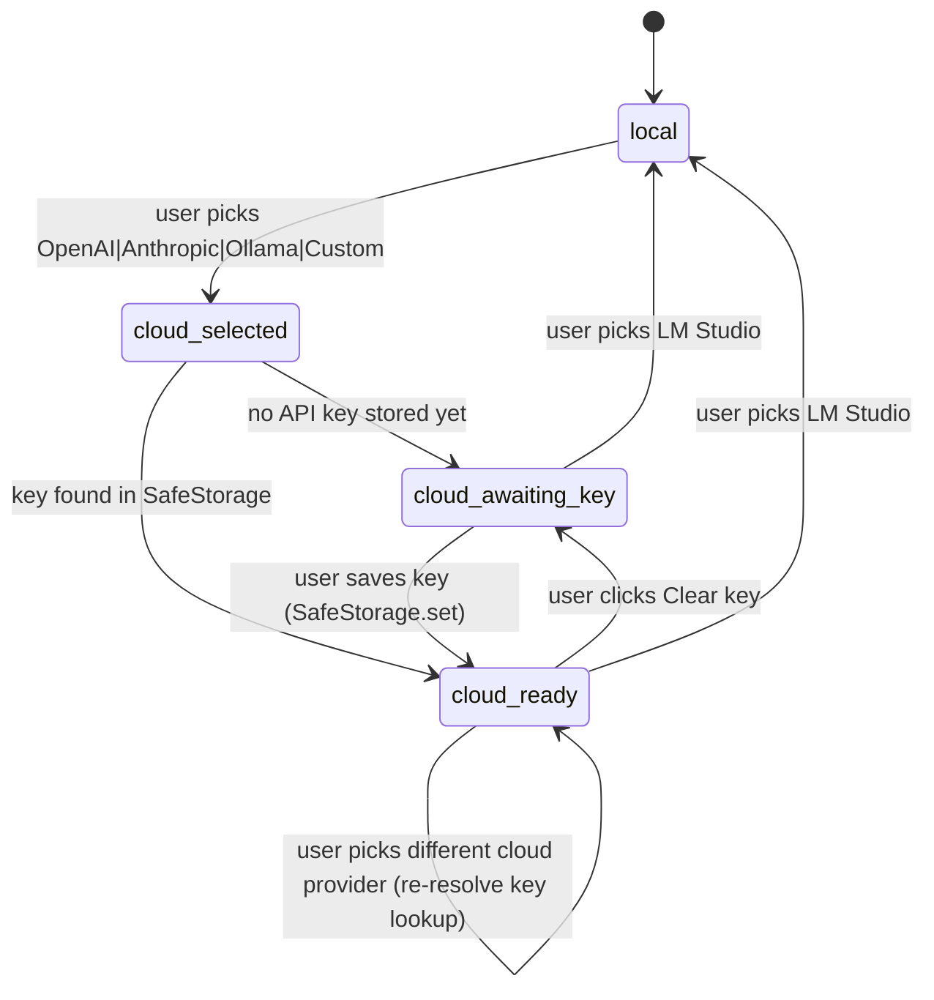
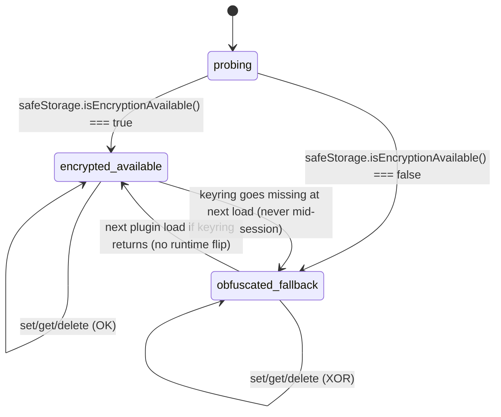
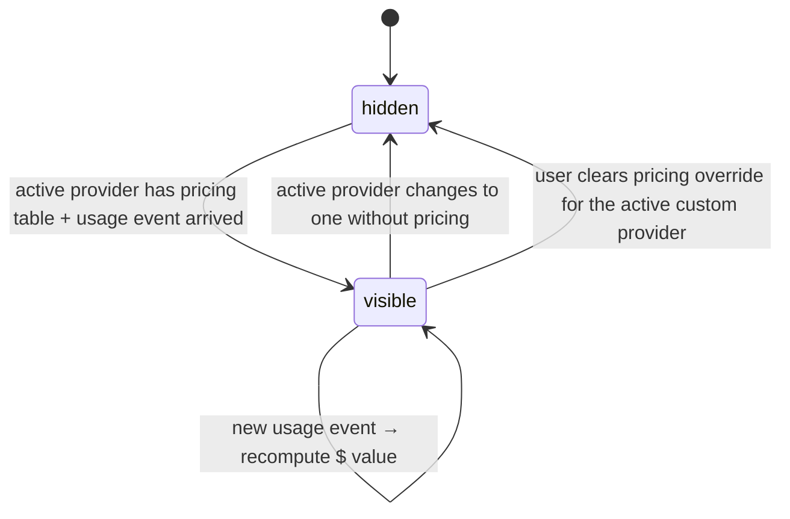

# F38 — Cloud provider adapters + safeStorage keys · UI

Back-link: [./feature.md](./feature.md)

This document specifies the UI surface for F38 — the cloud-provider settings section that mounts into the existing [F03 Provider section](../settings-tab-scaffold/ui.md), the `safeStorage`-unavailable fallback banner, the per-first-write `Notice`, and the `$N.NN` cost slot that lights up in the [F12 token-usage footer](../token-usage-indicator/feature.md) when a cloud provider is active. Every block is a thin extension of F03's `PluginSettingTab` skeleton and F12's footer — this feature introduces **no new windows**, **no native `Modal`** (per [FR-UI-08](../../context.md#fr-ui-08)), and **no new top-level Settings section**; it only adds controls, banners, and an indicator to surfaces already owned by F03 and F12.

## Layout

### Wireframe 1 — Provider section populated with a cloud provider selected (OpenAI), safeStorage available

```
 0        10        20        30        40        50        60        70        80
 |---------|---------|---------|---------|---------|---------|---------|---------|
+------------------------------------------------------------------------------+
| Obsidian Settings                                                        [x] |
+----------------+-------------------------------------------------------------+
| > Leo          | Leo                                                         |
|                |-------------------------------------------------------------|
|                | [v] Provider                                  (collapse)    |
|                |                                                             |
|                |   Active provider                                           |
|                |   [ OpenAI                        v ]  (select)             |
|                |   LM Studio is the default; cloud providers require         |
|                |   explicit opt-in and a stored API key before any call.     |
|                |                                                             |
|                |   API key                                                   |
|                |   [ ••••••••••••••••••••••••••• ]  [(o) Show] [Clear key]  |
|                |   Stored through Electron safeStorage (OS keyring).         |
|                |   Masked after save; plaintext never leaves this field.     |
|                |                                                             |
|                |   Chat model                                                |
|                |   [ gpt-4o-mini                   v ]  [Refresh]            |
|                |                                                             |
|                |   Embedding model   (kept on LM Studio by default)          |
|                |   [ nomic-embed-text-v1.5         v ]                       |
|                |                                                             |
|                |   Pricing overrides  (optional)                             |
|                |    Input  $ [0.00015] / 1K tokens                           |
|                |    Output $ [0.00060] / 1K tokens                           |
|                |   Leave blank to use bundled defaults.                      |
|                |                                                             |
|                | [>] Indexing                                   (expand)     |
|                | [>] Skills                                     (expand)     |
|                | [>] MCP Servers                                (expand)     |
|                | [>] Plan / Todos                               (expand)     |
|                | [>] Appearance                                 (expand)     |
|                | [>] Advanced                                   (expand)     |
+----------------+-------------------------------------------------------------+
```

Notes on wireframe 1:

- Provider select is a native `<select>` styled by Obsidian; five options `LM Studio (local) | OpenAI | Anthropic | Ollama | Custom…` (Custom expands into a nested group — wireframe 3).
- API-key field is an `<input type="password">`. The `Show` toggle flips `type` between `password` and `text` only while the pointer/focus is on it (reverts on blur, per standard settings UX). Toggle is an `<button aria-pressed>` with `setIcon("eye")` / `setIcon("eye-off")` — the ASCII `(o)` is the eye glyph placeholder.
- `Clear key` calls `SafeStorage.delete(providerId)` and refreshes the masked state to empty.
- Refresh fetches `provider.listModels()` via the user-supplied key. Failure surfaces as a `Notice` error via [F13](../ui-visual-states-notifications/feature.md); field state is unchanged.

### Wireframe 2 — safeStorage unavailable (keyring missing), persistent warning banner + one-shot Notice

```
 0        10        20        30        40        50        60        70        80
 |---------|---------|---------|---------|---------|---------|---------|---------|
+------------------------------------------------------------------------------+
| Leo                                                                          |
|------------------------------------------------------------------------------|
| ┌──────────────────────────────────────────────────────────────────────────┐ |
| │ ⚠ OS keyring not available                                               │ |
| │ API keys are only lightly obfuscated (XOR), not encrypted. Treat this   │ |
| │ machine as if anyone with file access can read your cloud keys.          │ |
| │ [Learn more]                                                             │ |
| └──────────────────────────────────────────────────────────────────────────┘ |
|                                                                              |
| [v] Provider                                                (collapse)       |
|                                                                              |
|     Active provider                                                          |
|     [ OpenAI                           v ]                                   |
|                                                                              |
|     API key                                                                  |
|     [ ••••••••••••••••••••••••••••• ]  [(o) Show]  [Clear key]              |
|     ⚠ Stored with XOR obfuscation (keyring unavailable).                    |
|                                                                              |
|     (… rest of section identical to wireframe 1 …)                           |
+------------------------------------------------------------------------------+

                                                        +---------------------+
                                                        |  Notice (top-right) |
                                                        |  ⚠ Leo saved your   |
                                                        |  API key with XOR   |
                                                        |  obfuscation — the  |
                                                        |  OS keyring is      |
                                                        |  unavailable on     |
                                                        |  this machine.      |
                                                        |  [Open settings]    |
                                                        +---------------------+
```

Notes on wireframe 2:

- The banner is a `<div role="alert" data-visual-state="warning">` mounted as the first child of the Settings tab body, above every section header. It stays mounted until `safeStorage.isEncryptionAvailable()` flips `true` on next load or every stored key is cleared (the `SafeStorage` adapter emits an event the banner subscribes to; banner unmounts when the store reports "no secrets present").
- The `Notice` is fired **once per session per secret** on the first degraded `SafeStorage.set`. It uses the [F13 Notice API](../ui-visual-states-notifications/feature.md) with timeout = `10_000 ms` and an inline `[Open settings]` button that calls `app.setting.open(); app.setting.openTabById("leo")`.
- Per-field inline warning (`⚠ Stored with XOR obfuscation…`) renders under the key field while the banner is up; it is `<p role="note">` with `aria-describedby` on the input.

### Wireframe 3 — Custom provider expanded (declarative adapter)

```
     Active provider
     [ Custom…                          v ]

     Base URL
     [ https://api.example.com/v1                                  ]

     Auth header
     Name   [ Authorization              ]
     Prefix [ Bearer                     ]   (blank for none; e.g. x-api-key)

     API key
     [ ••••••••••••••••••••••••• ]  [(o) Show]  [Clear key]

     Chat model id     [ example-model-7b                           ]
     Embedding model   [ example-embed-v1                           ]  (optional)

     Pricing (optional, lights $ slot when set)
      Input  $ [        ] / 1K   |  Output  $ [        ] / 1K
```

Notes on wireframe 3:

- Custom spec follows `{baseURL, authHeader: {name, prefix?}, model, embeddingModel?, pricing?}` per feature.md Open-question #2 landed shape.
- All Custom keys flow through the same `SafeStorage.set(providerId, plaintext)` path — no divergence from OpenAI/Anthropic/Ollama on the storage seam.

### Wireframe 4 — Cost-in-$ slot in the F12 token-usage footer

```
   +----------------------------------------------------------------+
   | ... message body above ...                                     |
   +----------------------------------------------------------------+
   | in 124 · out 316 · total 440  |  $0.0032                       |
   +----------------------------------------------------------------+
```

Notes on wireframe 4:

- The `$` slot is rendered by the F12 `TokenUsageFooter` when-and-only-when
  `ProviderManager.active().pricing !== undefined` (i.e. the active provider has a `pricePerInputToken` / `pricePerOutputToken` from the bundled table or a user override). LM Studio / Ollama-local omit `pricing` and the slot stays hidden.
- Value format: `$<computed.toFixed(4)>` for values below `$0.0100`, `$<computed.toFixed(2)>` above. Computed via `input * pricePerInputToken + output * pricePerOutputToken` against the final `StreamEvent.usage` counts (not intermediate).
- Screen-reader label: `aria-label="Estimated cost this message, <value> US dollars"`.

## State machine

The UI state surface owns three coupled machines — `ProviderSelectionMachine`, `SafeStorageMachine`, and `CostSlotMachine`. Each is pure (no side effects inside transitions) so Vitest can drive them deterministically.

### Mermaid — ProviderSelectionMachine



Adjacency list form (for tests):

- `local` → `cloud_selected` (on `provider.changed` to cloud id)
- `cloud_selected` → `cloud_awaiting_key` (on `SafeStorage.has(id) === false`)
- `cloud_selected` → `cloud_ready` (on `SafeStorage.has(id) === true`)
- `cloud_awaiting_key` → `cloud_ready` (on `SafeStorage.set(id, …) resolved`)
- `cloud_ready` → `cloud_awaiting_key` (on `Clear key` → `SafeStorage.delete(id)`)
- `cloud_ready | cloud_awaiting_key` → `local` (on `provider.changed` to `"lmstudio"`)
- `cloud_ready` → `cloud_ready` (on `provider.changed` to another cloud id — fresh key lookup)

Invariants enforced:

- No cloud fetch is possible from any state other than `cloud_ready` (AC 6 / AC 7).
- `ProviderManager.select(id)` is called only on the edge into `cloud_ready` or `local`, so a half-configured cloud selection never becomes the active provider.

### Mermaid — SafeStorageMachine



Adjacency list form:

- `probing` → `encrypted_available` (on boot if `isEncryptionAvailable()`)
- `probing` → `obfuscated_fallback` (otherwise — triggers banner mount + arms one-shot Notice)
- `obfuscated_fallback` → `obfuscated_fallback` (every set/get/delete stays on XOR path)
- First `set` from `obfuscated_fallback` fires the one-shot `Notice` (flag `noticeShownThisSession` flips `true` and persists for the session only — a fresh load re-fires once).
- All transitions out of fallback happen only at the next `Plugin.onload` — the machine never flips encryption mode mid-session (no silent privilege change).

### Mermaid — CostSlotMachine



Adjacency list form:

- `hidden` → `visible` (on `provider.active.pricing !== undefined && StreamEvent.usage received`)
- `visible` → `visible` (on every subsequent `StreamEvent.usage` for the same message → re-render `$` value)
- `visible` → `hidden` (on `provider.changed` to a pricing-less provider, or on pricing-override cleared)

Invariants:

- Cost slot never renders when active provider is LM Studio or Ollama-local (no pricing entry).
- Cost value is computed against the final `StreamEvent.usage` counts only; transient streaming deltas do not tick the `$` display.

## Event flow

### EF-1 — Saving a cloud API key for the first time (safeStorage available)

1. User opens Settings → Leo → Provider.
2. User selects `OpenAI` in the `Active provider` dropdown.
   - `onChange` fires `ProviderSettingsController.setProvider("openai")`.
   - `ProviderSelectionMachine`: `local → cloud_selected`.
   - `SafeStorage.has("openai") === false` → state becomes `cloud_awaiting_key`.
   - `ProviderManager.select()` is **not** called yet (AC 7: cloud requires both opt-in and key).
3. User pastes the key into the `API key` field and tabs away / presses `Save`.
   - `SafeStorage.set("openai", plaintext)`: `electron.safeStorage.encryptString(plaintext)` → ciphertext → `Plugin.saveData({secrets: {openai: cipherBase64}})`.
   - `ProviderSelectionMachine`: `cloud_awaiting_key → cloud_ready`.
   - `ProviderManager.select("openai")` is now called; from this moment cloud fetches are possible (chat stream, listModels).
   - Structured log `provider.cloud.selected {providerId, hasPricing}` + `safestorage.set {providerId, mode: "encrypted"}` via the [F01 Logger](../plugin-bootstrap-logging/feature.md) (no key material).
4. The field re-masks (`type="password"`); the stored plaintext never re-enters the DOM.
5. Reloading the plugin restores the `cloud_ready` state via `SafeStorage.has("openai") === true`; field shows masked placeholder without ever decrypting the ciphertext into the DOM.

### EF-2 — First save on a machine without a keyring (safeStorage unavailable)

1. Boot: `SafeStorageMachine` transitions `probing → obfuscated_fallback`.
   - Banner mounts above the Settings tab (wireframe 2).
   - Log `safestorage.fallback {reason: "isEncryptionAvailable=false"}`.
2. User picks OpenAI and pastes a key (same as EF-1 step 2–3).
3. `SafeStorage.set("openai", plaintext)` → XOR-obfuscate → `saveData({secrets: {openai: obfBase64}})`.
   - One-shot `Notice` fires (wireframe 2 top-right panel) with a 10 s timeout + `[Open settings]` button.
   - Log `safestorage.set {providerId, mode: "obfuscated"}` + `safestorage.warning-shown {surface: "notice"}`.
4. Subsequent saves in the same session do **not** re-fire the Notice, but the banner persists on every visit to Settings until the stored key is cleared or the keyring comes back on next load.

### EF-3 — Clearing a stored key

1. User clicks `[Clear key]`.
2. `SafeStorage.delete("openai")` → removes the `openai` entry from the `secrets` subtree via `loadData` → `saveData`.
3. In-memory plaintext cache (a `WeakMap<ProviderSpec, string>` cached only during the current session for the active provider) is invalidated.
4. `ProviderSelectionMachine`: `cloud_ready → cloud_awaiting_key`.
5. `ProviderManager.select("lmstudio")` is **not** auto-called — the user's explicit selection is preserved, but with no key the machine blocks any cloud fetch (AC 6).
6. Log `safestorage.delete {providerId}`.

### EF-4 — Cost slot lighting up as a message streams

1. User sends a message while `ProviderSelectionMachine` is in `cloud_ready` for OpenAI.
2. Token usage footer (F12) subscribes to `StreamEvent` via `AgentRunner`.
3. On terminal `StreamEvent.usage {input, output}`, `CostSlotMachine` transitions `hidden → visible` and renders `$<value>`.
4. If the user then switches to LM Studio mid-session (e.g. local offline test), `CostSlotMachine` transitions `visible → hidden` on the next rendered message; no residual `$` slot from the previous provider.

### EF-5 — Switching from OpenAI to Anthropic (already-stored keys)

1. User selects `Anthropic` in the dropdown.
2. `ProviderSelectionMachine`: `cloud_ready[OpenAI] → cloud_selected[Anthropic]`.
3. `SafeStorage.has("anthropic") === true` → `cloud_ready[Anthropic]`.
4. `ProviderManager.select("anthropic")` fires; next chat uses Anthropic.
5. `CostSlotMachine` stays `visible` — both providers carry pricing — but the slot re-computes from Anthropic's `pricePerInputToken` / `pricePerOutputToken` on the next usage event.

### EF-6 — safeStorage goes missing between sessions

1. Plugin unload with key stored under `"encrypted"` mode.
2. Next boot: `safeStorage.isEncryptionAvailable() === false` → `SafeStorageMachine` enters `obfuscated_fallback`.
3. Existing ciphertext is still decryptable **only if the machine persisted the encryption mode in the stored record** — per the architecture-§7 contract, each secret record carries `{mode: "encrypted"|"obfuscated", value}`. On mode mismatch at read, `SafeStorage.get` returns `undefined` and surfaces a banner that additionally prompts the user to re-enter the key.
4. Log `safestorage.fallback {reason: "isEncryptionAvailable=false"}` + `safestorage.read.mode-mismatch {providerId}` (one per stored key).

## Component mapping

All entries below are explicit about (a) **which Assistant UI / React / Obsidian primitive** renders the block and (b) **which [tech-stack.md](../../../../standards/tech-stack.md) row** governs it.

| UI block | Primitive | tech-stack.md row | Notes |
|---|---|---|---|
| Active-provider select | `<select>` rendered inside a `Setting.addDropdown` callback | [Platform APIs — `PluginSettingTab`](../../../../standards/tech-stack.md#platform-apis) | Five options hard-coded; `Custom…` reveals the nested Custom group. |
| API-key input | `<input type="password">` inside `Setting.addText`, with `onChange` routing to `SafeStorage.set` on blur / Save | [Platform APIs — `PluginSettingTab`, `loadData` / `saveData`](../../../../standards/tech-stack.md#platform-apis) + [Platform APIs — Electron `safeStorage`](../../../../standards/tech-stack.md#platform-apis) | Controlled via React 18 state; plaintext never re-renders after blur. |
| Show/hide toggle | `<button aria-pressed>` with `setIcon("eye" / "eye-off")` | [UI Layer — Icons (`lucide-react`)](../../../../standards/tech-stack.md#ui-layer) + [Platform APIs — `setIcon`](../../../../standards/tech-stack.md#platform-apis) | Toggles the `type` attribute only while focused/hovered. |
| `[Clear key]` button | `<button>` rendered inside `Setting.addButton` | [Platform APIs — `PluginSettingTab`](../../../../standards/tech-stack.md#platform-apis) | Calls `SafeStorage.delete`. |
| Chat-model picker | `Setting.addDropdown` populated from `provider.listModels()`; disabled until `cloud_ready` | [Agent Layer — LLM bindings](../../../../standards/tech-stack.md#agent-layer) | Refresh button re-calls `listModels()`; errors surface via F13 `Notice`. |
| Pricing overrides | Two `Setting.addText` rows with `inputmode="decimal"` | [Platform APIs — `PluginSettingTab`, `loadData` / `saveData`](../../../../standards/tech-stack.md#platform-apis) | Empty → use bundled defaults; non-empty → override feeds F12 cost slot. |
| safeStorage-unavailable banner | `<div role="alert" data-visual-state="warning">` prepended to tab root via React 18 subtree mounted by `PluginSettingTab.display()` | [UI Layer — React 18](../../../../standards/tech-stack.md#ui-layer) + [F13 `Notifications`](../ui-visual-states-notifications/feature.md) | Persists until keyring returns or every secret is cleared; colour from Obsidian `--color-orange` + icon, never colour-only. |
| One-shot fallback Notice | Obsidian `Notice` with inline `[Open settings]` button (DOM-injected into Notice root) | [Platform APIs — `Notice`](../../../../standards/tech-stack.md#platform-apis) | Armed by `SafeStorageMachine`, fired only on first `set` in `obfuscated_fallback`. |
| Cost-in-$ slot | React 18 `<span class="leo-usage-cost">` appended to [F12 `TokenUsageFooter`](../token-usage-indicator/feature.md) when `CostSlotMachine.visible` | [UI Layer — React 18](../../../../standards/tech-stack.md#ui-layer) + [UI Layer — Styling](../../../../standards/tech-stack.md#ui-layer) | `aria-label` describes value for SR; zero hardcoded colours (Obsidian `--text-muted`). |
| Custom-provider group | `<details>` expanded when Active provider === `Custom`; rows use same `Setting.addText` primitive | [Platform APIs — `PluginSettingTab`](../../../../standards/tech-stack.md#platform-apis) | Collapses when switching away to bundled providers. |

### Non-UI primitives that back the UI

- `SafeStorage` adapter — pure TypeScript module; wraps `electron.safeStorage.encryptString`/`decryptString` via the `electron` global per [Platform APIs — Electron `safeStorage`](../../../../standards/tech-stack.md#platform-apis).
- `ProviderManager` — registered-provider map + active-id selector per [Agent Layer — LLM bindings](../../../../standards/tech-stack.md#agent-layer).
- `PricingTable` — bundled record with user-override merge; feeds the cost slot; not a UI component.
- `Logger` seam — [F01](../plugin-bootstrap-logging/feature.md); every handler above logs through it, never `console.*`.

### Accessibility + reduced-motion

- Every text input has an associated `<label>` rendered by `Setting.setName`; descriptions go through `Setting.setDesc` for `aria-describedby` wiring.
- Banner and one-shot Notice both use `role="alert"`; the banner adds a `⚠` glyph so status is not colour-only (WCAG 1.4.1 / [NFR-USE-04](../../context.md#nfr-use-04)).
- All motion (banner fade-in, Notice slide) respects `prefers-reduced-motion: reduce` by dropping to immediate paint.
- Focus is never trapped — this feature adds no modal dialog, no overlay, no focus ring disruption (per [FR-UI-08](../../context.md#fr-ui-08)).

### Forbidden per this feature

- **No native Obsidian `Modal`** for any action (save, clear, confirm) — all confirmations are inline in the section per [FR-UI-08](../../context.md#fr-ui-08).
- **No new top-level settings section** — every control is an addition to the existing Provider section owned by [F03](../settings-tab-scaffold/ui.md).
- **No plaintext key** rendered to the DOM after `save` / on plugin reload — only the masked placeholder.
- **No logged key material** above `debug` — asserted by a Vitest logger-stub scan on every `provider.cloud.*` and `safestorage.*` event, per [F01](../plugin-bootstrap-logging/feature.md) rules.

## Back-link

- [F38 cloud-providers-safestorage feature.md](./feature.md)
