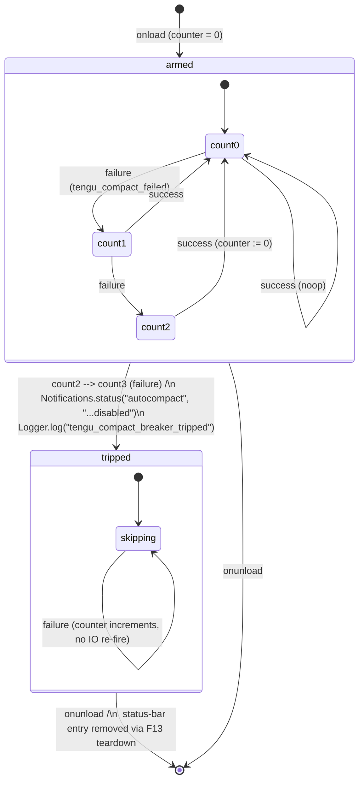

# F45 — Autocompact circuit breaker · UI

## Layout

This feature owns no chat-region chrome of its own — the only user-visible surface is a single keyed entry in the Obsidian status bar, routed through [F13](../ui-visual-states-notifications/feature.md)'s `Notifications.status("autocompact", …)` channel (see [F13 UI — Wireframe 3](../ui-visual-states-notifications/ui.md)). Message-list content, toasts, and inline modals are intentionally untouched: the auto path stays `Notice`-free per [compact.md §20 "Error Behavior"](../../../../srs/compact.md#20-error-handling) and the acceptance rule in [feature.md](./feature.md) AC#7. Copy resolves through the [F13](../ui-visual-states-notifications/feature.md) copy contract; wording here is illustrative only (see Open questions in [feature.md](./feature.md#open-questions)).

### Wireframe 1 — Status-bar entry painted at the `2 → 3` trip edge

```
 0        10        20        30        40        50        60        70
 |---------|---------|---------|---------|---------|---------|---------|

Obsidian desktop window — bottom status bar (native addStatusBarItem lane)

+-------------------------------------------------------------------------+
| ChatView content region (unaffected — no banner, no toast, no modal)    |
|                                                                         |
|   [ MessageList continues rendering turns normally                 ]    |
|   [ ComposerInput remains enabled                                  ]    |
|                                                                         |
+-------------------------------------------------------------------------+
| [LM Studio: connected] [index: 42%] [Leo: autocompact disabled]        |
+-------------------------------------------------------------------------+
                                           ^
                                           |
                    keyed entry "autocompact"  (Notifications.status)
                    replace-in-place; torn down on plugin unload
                    tooltip slot owned by F13 (see F13 UI — Wireframe 3)
```

- The status-bar entry is mounted by the single call `Notifications.status("autocompact", "Leo: autocompact disabled for this session")` fired once when `consecutiveFailures` transitions `2 → 3` (see [feature.md](./feature.md) AC#6). Subsequent failures past the threshold do **not** re-emit, honouring the call-count invariant.
- Placement, z-index, keyed-replace semantics, and teardown contract are inherited from [F13 UI — Wireframe 3, Channel 2](../ui-visual-states-notifications/ui.md) and [F13 UI — Component mapping](../ui-visual-states-notifications/ui.md#component-mapping) — this feature adds a new keyed entry but does **not** introduce a new channel.
- `MessageList`, `ComposerInput`, `HeaderBar`, and the `InlineDialog` region from [F04](../chat-sidebar-view/feature.md) are all untouched; the breaker never writes a `Notice` toast, never mounts an inline modal, and never drives `VisualStateMachine` (no `data-visual-state` attribute is set by this feature).

### Wireframe 2 — Forbidden surfaces (asserted by Vitest)

```
 0        10        20        30        40        50        60
 |---------|---------|---------|---------|---------|---------|

FORBIDDEN — no toast on the auto path
+---------------------------------------------------------------+
|                                          +------------------+ |
|                                          | (X)  Never:      | |
|                                          | new Notice(...)  | |  <- vitest spies
|                                          +------------------+ |     Notice ctor;
+---------------------------------------------------------------+     must not fire
                                                                      on any auto-
                                                                      path failure
                                                                      (feature.md AC#7)

FORBIDDEN — no banner inside MessageList
+---------------------------------------------------------------+
| MessageList                                                   |
|                                                               |
|   +-------------------------------------------------------+   |
|   | (X) autocompact disabled  [Retry] [Dismiss]           |   |  <- never painted;
|   +-------------------------------------------------------+   |     no error bubble
|                                                               |     is emitted from
+---------------------------------------------------------------+     this feature

FORBIDDEN — no inline blockingError modal
+---------------------------------------------------------------+
|     +-----------------------------------------------+         |
|     | (X) Autocompact disabled.  [OK]              |         |  <- never mounted;
|     +-----------------------------------------------+         |     breaker stays
+---------------------------------------------------------------+     silent on-screen
                                                                      outside the
                                                                      status bar
```

- The three "FORBIDDEN" panels encode the negative surface rules asserted by Vitest per [feature.md](./feature.md) AC#7: `Notice` is never constructed, no error banner is painted in `MessageList`, and no `Notifications.blockingError` mount occurs on any auto-path failure.
- The status-bar row from Wireframe 1 is the entire user-visible surface; it is deliberately terse to avoid alarming users who never hit the threshold, and to keep the breaker aligned with the "swallow-and-telemeter" auto-path rule at [Architecture §7 Error Handling Strategy](../../../../architecture/architecture.md#7-error-handling-strategy).

## State machine

The breaker has two coupled machines: a numeric counter (`consecutiveFailures` ∈ ℕ) and a derived ternary surface state (`armed` / `tripped` / `cleared`). Only surface-state edges trigger IO; the counter itself is a pure field on `AutoCompactTrackingState`.



Plain adjacency list (equivalent to the diagram above):

```
onload                  -> armed{count=0}
armed{count=n<2} + fail -> armed{count=n+1}
armed{count=2}   + fail -> tripped{count=3}          [emits status + log, once]
armed{count=n}   + ok   -> armed{count=0}            [reset; noop if already 0]
tripped          + fail -> tripped{count++}          [no status re-emit, no log]
tripped          + call -> tripped (returns null)    [short-circuit; no stream]
armed            + call -> armed  (delegates to F43 shouldAutoCompact)
onunload                -> [*]                       [F13 status-bar teardown]
```

- The `armed → tripped` edge is the **only** IO edge; it fires `Notifications.status` exactly once and `Logger.log("tengu_compact_breaker_tripped")` exactly once per plugin session (feature.md AC#6). The `tripped → tripped` self-loop intentionally has no IO.
- The `tripped → armed` transition is deliberately absent in v1 — there is no in-session reset path (feature.md Open questions "User re-enable control"); the only exit from `tripped` is plugin `onunload` / reload, which collapses to `[*]` per [feature.md](./feature.md) AC#8.
- `shouldSkipForCircuitBreaker(tracking)` is the pure predicate gating the `armed | tripped → skipping` decision per [Architecture §3.3 Domain / Core (pure)](../../../../architecture/architecture.md#33-domain--core-pure); it has no side effects and is Vitest-covered independently.

## Event flow

The breaker is a passive observer of [F43](../compaction-autocompact/feature.md) outcomes; it neither starts nor cancels streams itself. All IO rides the [F13](../ui-visual-states-notifications/feature.md) and [F01](../plugin-bootstrap-logging/feature.md) seams.

```
plugin.onload():
  tracking = { compacted:false, turnCounter:0, turnId:null, consecutiveFailures:0 }
  -> no status-bar entry; breaker is armed but silent

F43.autoCompactIfNeeded(state) on every turn:
  pre-check:
    if (shouldSkipForCircuitBreaker(tracking))
        -> return null           // zero ProviderManager.stream() calls
        -> no log, no status-bar mutation (already emitted at trip edge)
    else
        -> delegate to F43 shouldAutoCompact + summarization

  on F43 success (non-null CompactionResult):
    tracking.consecutiveFailures = 0
    -> no status-bar mutation (entry was already absent; v1 has no un-trip)
    -> no log from this feature (F43 emits its own success event)

  on F43 failure (tengu_compact_failed, any reason):
    prev = tracking.consecutiveFailures
    tracking.consecutiveFailures = prev + 1
    if (prev === 2 && tracking.consecutiveFailures === 3):
        F13.Notifications.status("autocompact",
                                  "Leo: autocompact disabled for this session")
        F01.Logger.log("tengu_compact_breaker_tripped",
                        { consecutiveFailures: 3 })
    // else: no IO — counter is internal state only

plugin.onunload():
  F13.Notifications.dispose("autocompact")   // removes keyed entry, no DOM residue
  tracking = null                            // session state released; no persist
```

- The pre-check runs **before** `shouldAutoCompact` and **before** any `ProviderManager.stream` call per [feature.md](./feature.md) AC#4; Vitest asserts zero outbound stream invocations across 10 attempted turns past the threshold via `msw`.
- The `prev === 2 && next === 3` edge guard is the single IO trigger; subsequent failures past 3 take the `else` branch and emit nothing — asserted by the `call-count === 1 across five consecutive failures` Vitest case in [feature.md](./feature.md) AC#6.
- Teardown is symmetric with mount per [Code style — React 18](../../../../standards/code-style.md#react-18) and registered via `Plugin.register(() => entry.remove())` per [Code style — Obsidian Plugin Patterns](../../../../standards/code-style.md#obsidian-plugin-patterns), inherited from the [F13](../ui-visual-states-notifications/feature.md) `Notifications.status` contract.
- Manual `/compact` and PTL retries from [F44](../compaction-ptl-retry/feature.md) feed this counter only via the `tengu_compact_failed` emission path from [F43](../compaction-autocompact/feature.md); no direct call site exists in the breaker (see [feature.md](./feature.md) Open questions "Reset on manual compact success").

## Component mapping

| Concern | Module / primitive | Standards anchor |
|---|---|---|
| Session-scoped `AutoCompactTrackingState` owner | Plain TypeScript object held inside the autocompact module from [F43](../compaction-autocompact/feature.md); initialised on `Plugin.onload`, released on `onunload` | [Tech stack — Agent Layer](../../../../standards/tech-stack.md#agent-layer), [Architecture §6 State Ownership](../../../../architecture/architecture.md#6-state-ownership) |
| Pure gate `shouldSkipForCircuitBreaker(tracking)` predicate | TypeScript pure function `(tracking) => tracking.consecutiveFailures >= MAX_CONSECUTIVE_AUTOCOMPACT_FAILURES` in the domain/core layer; no IO, no imports of `obsidian` | [Tech stack — Runtime & Build](../../../../standards/tech-stack.md#runtime--build), [Architecture §3.3 Domain / Core (pure)](../../../../architecture/architecture.md#33-domain--core-pure), [Code style — TypeScript](../../../../standards/code-style.md#typescript) |
| Counter increment / reset hooks into [F43](../compaction-autocompact/feature.md) | Plain function calls on the failure + success branches of `autoCompactIfNeeded`; no LangGraph node of its own (runs inside F43's graph step) | [Tech stack — Agent Layer (LangGraph.js)](../../../../standards/tech-stack.md#agent-layer), [Code style — LangGraph / Agent Layer](../../../../standards/code-style.md#langgraph--agent-layer) |
| Status-bar entry at the `2 → 3` trip edge | [F13](../ui-visual-states-notifications/feature.md) `Notifications.status("autocompact", message)` — keyed replace-in-place on Obsidian `addStatusBarItem()`; keyed-teardown via `Plugin.register(() => entry.remove())` | [Tech stack — Platform APIs (`addStatusBarItem`)](../../../../standards/tech-stack.md#platform-apis), [Code style — Obsidian Plugin Patterns](../../../../standards/code-style.md#obsidian-plugin-patterns), [Architecture §10 Concurrency & Lifecycle Rules](../../../../architecture/architecture.md#10-concurrency--lifecycle-rules) |
| Structured log `tengu_compact_breaker_tripped` at the trip edge | [F01](../plugin-bootstrap-logging/feature.md) `Logger.log(eventName, payload)` | [Tech stack — Tooling & Quality](../../../../standards/tech-stack.md#tooling--quality), [Code style — Logging](../../../../standards/code-style.md#logging) |
| Constant binding `MAX_CONSECUTIVE_AUTOCOMPACT_FAILURES = 3` | Single `export const` in the compaction module, pinned by Vitest constant-binding test | [Tech stack — Runtime & Build (TypeScript strict)](../../../../standards/tech-stack.md#runtime--build), [Code style — TypeScript](../../../../standards/code-style.md#typescript) |
| Abort / cancellation plumbing (inherited) | `AbortController` signal threaded through from [F43](../compaction-autocompact/feature.md) → [F07](../chat-streaming-stop/feature.md); the breaker does not own its own controller | [Tech stack — Agent Layer (Cancel row)](../../../../standards/tech-stack.md#agent-layer), [Code style — Async & Concurrency](../../../../standards/code-style.md#async--concurrency) |
| Forbidden surfaces — no `Notice`, no `MessageList` banner, no `blockingError` modal | Negative assertions via Vitest spies (`Notice` constructor spy; `Notifications.blockingError` call-count spy); inline-confirmation channel from [F13](../ui-visual-states-notifications/feature.md) is not imported by this feature | [Tech stack — Testing (Vitest + `msw`)](../../../../standards/tech-stack.md#testing), [Code style — Testing (Vitest + msw)](../../../../standards/code-style.md#testing-vitest--msw), [Code style — Error Handling](../../../../standards/code-style.md#error-handling) |
| Status-bar copy / tooltip ownership | Deferred to [F13](../ui-visual-states-notifications/feature.md) copy contract (see [F13 UI — Wireframe 3, Channel 2](../ui-visual-states-notifications/ui.md)); this feature passes the message string through unchanged | [Tech stack — UI Layer (Styling via Obsidian CSS vars)](../../../../standards/tech-stack.md#ui-layer), [Code style — Styling (Tailwind + Obsidian)](../../../../standards/code-style.md#styling-tailwind--obsidian) |
| Teardown symmetry on `onunload` | `Plugin.register(() => Notifications.dispose("autocompact"))`; Vitest asserts DOM-detached entry after unload per [feature.md](./feature.md) AC#8 | [Tech stack — Platform APIs (`Plugin`)](../../../../standards/tech-stack.md#platform-apis), [Code style — Obsidian Plugin Patterns](../../../../standards/code-style.md#obsidian-plugin-patterns), [Architecture §10 Concurrency & Lifecycle Rules](../../../../architecture/architecture.md#10-concurrency--lifecycle-rules) |
| Vitest test matrix driver | `vitest` + `msw` stream-mock to fire `tengu_compact_failed` on each F43 failure branch and assert counter + IO call-count invariants | [Tech stack — Testing](../../../../standards/tech-stack.md#testing), [Code style — Testing (Vitest + msw)](../../../../standards/code-style.md#testing-vitest--msw) |

## Back-link

- Feature spec: [./feature.md](./feature.md)
