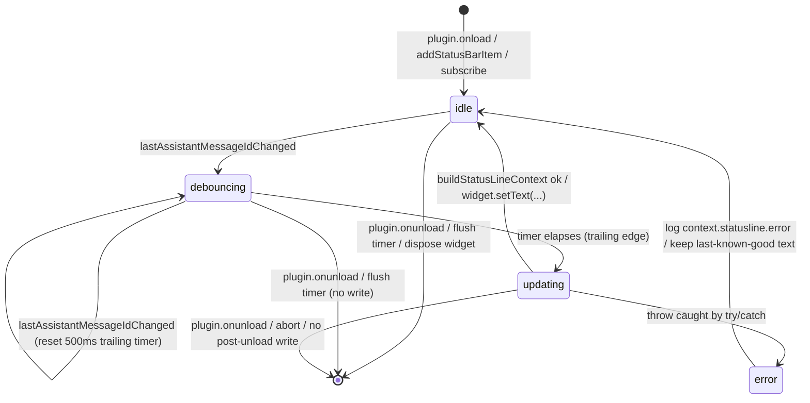
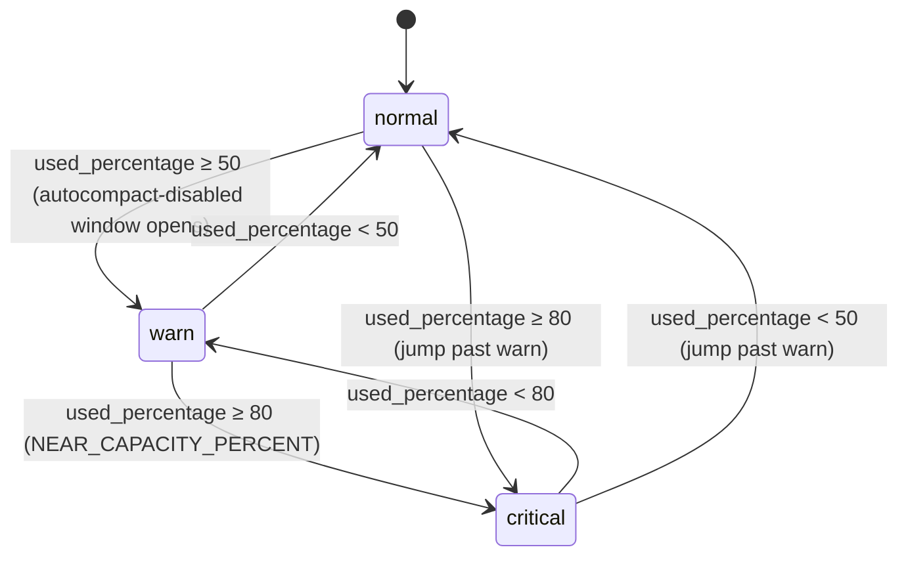

# F48 context-suggestions-statusline — UI

Companion UI design for [./feature.md](./feature.md). All behaviour, thresholds, check order, sort rule, and status-line fields are linked-only to [context.md §12](../../../../srs/context.md#12-context-suggestions) / [§14](../../../../srs/context.md#14-status-line-integration) / [§16](../../../../srs/context.md#16-constants-reference); not restated here.

## Layout

### A. Status-bar widget (Obsidian `Plugin.addStatusBarItem()`)

Compact, one-line, right-aligned in the Obsidian status bar. Renders `{used_percentage}% · <formatTokens(current_usage)> / <formatTokens(context_window_size)>` per [context.md §14](../../../../srs/context.md#14-status-line-integration). Tooltip (`title` attribute) carries the remaining triple.

Nominal state (`used_percentage = 47`, `current_usage = 93_824`, `context_window_size = 200_000`):

```
┌──────────────────────────── Obsidian status bar (right edge) ────────────────────────────┐
│ ...            [sync ok]   [vault 1.2k]   [Leo · 47% · 94k / 200k]                       │
└──────────────────────────────────────────────────────────────────────────────────────────┘
                                                   └── tooltip on hover ───────────────┐
                                                       total_input_tokens  : 93 824    │
                                                       total_output_tokens :  4 512    │
                                                       remaining_percentage: 53%       │
                                                       (source: last API response)     │
                                                   └────────────────────────────────────┘
```

Sentinel state (no API usage yet, `buildStatusLineContext` returned `null` per [feature.md AC#8](./feature.md) + [Open questions](./feature.md)):

```
[Leo · —% · — / 200k]                       tooltip: "No usage yet"
```

Near-capacity visual tier (see `## State machine` §"Threshold tiers" below — colour via Obsidian CSS variables only, no inline hex; tier class toggled on the status-bar `HTMLElement`):

```
used_percentage < 50   → tier=normal   class="leo-ctx--ok"    (var(--text-muted))
50 ≤ used < 80         → tier=warn     class="leo-ctx--warn"  (var(--text-warning))
used ≥ 80              → tier=critical class="leo-ctx--crit"  (var(--text-error))
```

### B. Suggestions panel (mounted in [F47](../context-command-grid/feature.md) right-column bottom slot)

Header + ordered list. Rendering rules per [context.md §12.4](../../../../srs/context.md#124-suggestion-rendering): glyph by severity (warning → `setIcon('alert-triangle')`, info → `setIcon('info')`), bold title, optional `→ save ~<formatTokens(savings)>` tail, indented dimmed detail line. List is already sorted warnings-first then `savingsTokens` desc per [§12.3](../../../../srs/context.md#123-sorting); the UI preserves array order without re-sorting.

Populated example (two warnings then three info entries):

```
┌──────────────────────────────── Suggestions ──────────────────────────────────┐
│                                                                               │
│  ⚠  Context near capacity (82%)              → save ~12k                      │
│       Use /compact now to control what gets kept                              │
│                                                                               │
│  ⚠  Large Bash tool results                  → save ~9k                       │
│       17 300 tokens in Bash output — consider narrower commands               │
│                                                                               │
│  ℹ  Large Read tool results                  → save ~5k                       │
│       16 800 tokens in Read output — use offset/limit or earlier reads        │
│                                                                               │
│  ℹ  Memory file bloat                        → save ~7k                       │
│       Top files: projects/alpha.md, journal/2026-04.md, notes/refs.md         │
│                                                                               │
│  ℹ  Autocompact disabled                                                      │
│       Enable autocompact in settings or run /compact manually                 │
│                                                                               │
└───────────────────────────────────────────────────────────────────────────────┘
```

Empty state (suggestion engine returned `[]` — no threshold crossed):

```
┌──────────────────────────────── Suggestions ──────────────────────────────────┐
│                                                                               │
│   No suggestions — context is within thresholds.                              │
│                                                                               │
└───────────────────────────────────────────────────────────────────────────────┘
```

Degraded state (engine ran but `messageBreakdown` absent — large-tool-results check skipped per [feature.md Open questions](./feature.md)):

```
┌──────────────────────────────── Suggestions ──────────────────────────────────┐
│                                                                               │
│  ℹ  Autocompact disabled                                                      │
│       Enable autocompact in settings or run /compact manually                 │
│                                                                               │
│   (per-tool advice unavailable — message breakdown missing)                   │
│                                                                               │
└───────────────────────────────────────────────────────────────────────────────┘
```

Sort order invariant — warnings-first, then `savingsTokens` desc (stable for ties, `undefined` sorts as `0`):

```
  index │ severity │ savingsTokens │ title
  ──────┼──────────┼───────────────┼──────────────────────────────────
    0   │ warning  │ 12 000        │ Context near capacity
    1   │ warning  │  9 000        │ Large Bash tool results
    2   │ info     │  7 000        │ Memory file bloat
    3   │ info     │  5 000        │ Large Read tool results
    4   │ info     │  —            │ Autocompact disabled
```

## State machine

Two coupled machines: (A) the status-line widget update lifecycle, (B) the threshold-tier classifier driven by `used_percentage`.

### A. `StatusLineUpdateMachine` — update/debounce/error lifecycle



Adjacency list (for non-Mermaid renderers):

```
idle        → debouncing (on: lastAssistantMessageIdChanged)
idle        → [*]        (on: plugin.onunload)
debouncing  → debouncing (on: lastAssistantMessageIdChanged, effect: reset timer)
debouncing  → updating   (on: 500ms trailing timer)
debouncing  → [*]        (on: plugin.onunload, effect: flush timer, no write)
updating    → idle       (on: buildStatusLineContext ok, effect: widget.setText)
updating    → error      (on: throw, caught)
updating    → [*]        (on: plugin.onunload, effect: abort, no write)
error       → idle       (effect: log context.statusline.error, keep last-known-good)
```

Invariants (per [feature.md AC#9, AC#10](./feature.md) + [Architecture §10](../../../../architecture/architecture.md#10-concurrency--lifecycle-rules)):
- exactly one `widget.setText` per 500ms window regardless of event burst;
- zero `widget.setText` after `plugin.onunload`;
- `error → idle` never mutates widget text (last-known-good preserved).

### B. `ThresholdTierMachine` — visual tier classifier over `used_percentage`

Drives the status-bar CSS class and the set of `/context` suggestions emitted by the engine. Thresholds sourced by link from [context.md §12.1](../../../../srs/context.md#121-thresholds) and [§16](../../../../srs/context.md#16-constants-reference) — not restated.



Tier → UI effect table:

```
tier       │ used_percentage │ status-bar class     │ suggestion checks that can fire
───────────┼─────────────────┼──────────────────────┼──────────────────────────────────────
normal     │ < 50            │ leo-ctx--ok          │ large-tool-results, read-bloat, memory-bloat
warn       │ 50 ≤ x < 80     │ leo-ctx--warn        │ + autocompact-disabled (if flag off)
critical   │ ≥ 80            │ leo-ctx--crit        │ + near-capacity warning (severity=warning)
```

Tier boundaries are pure functions of `used_percentage`; no per-tier state is stored — the class is recomputed on each write in state A's `updating → idle` edge.

## Event flow

Trigger sources, subscription fan-in, and render fan-out. All IO runs through the owning `Component` so teardown is atomic per [Architecture §10](../../../../architecture/architecture.md#10-concurrency--lifecycle-rules).

```
┌─ Trigger sources ──────────────────────────────────────────────────────────┐
│                                                                            │
│  [F07 chat-streaming-stop]   stream-terminal event                         │
│  [F14 conversation-persistence-v1]   store mutation                        │
│                 │                                                          │
│                 ▼                                                          │
│   "lastAssistantMessageId changed" event (single channel)                  │
│                                                                            │
└─────────────────────────┬──────────────────────────────────────────────────┘
                          │
                          ▼
┌─ Agent layer — StatusLineSubscription (Component-scoped) ──────────────────┐
│                                                                            │
│   onEvent():                                                               │
│     clearTimeout(pending)                                                  │
│     pending = setTimeout(fire, 500)            // trailing edge, no maxWait│
│                                                                            │
│   fire():                                                                  │
│     queueMicrotask(() => {                                                 │
│       try {                                                                │
│         const apiUsage = store.lastApiUsage()                              │
│         const rec = buildStatusLineContext(apiUsage, ctxWindow)  // pure   │
│         if (rec === null) widget.setText("Leo · —% · — / "+fmt(ctxWindow)) │
│         else              widget.setText(render(rec))                      │
│         widget.setAttribute("title", renderTooltip(rec))                   │
│         widget.classList.toggle("leo-ctx--ok"|"--warn"|"--crit", …)        │
│       } catch (e) {                                                        │
│         logger.error("context.statusline.error", { message: e.message })   │
│         // widget text unchanged (last-known-good)                         │
│       }                                                                    │
│     })                                                                     │
│                                                                            │
│   Component.register(() => clearTimeout(pending))                          │
│   Plugin.register(() => widget.remove())                                   │
│                                                                            │
└─────────────────────────┬──────────────────────────────────────────────────┘
                          │
                          ▼
┌─ UI render ────────────────────────────────────────────────────────────────┐
│                                                                            │
│   Obsidian status-bar <div> (imperative DOM, no React)                     │
│   text : "Leo · 47% · 94k / 200k"                                          │
│   title: "input 93 824 · output 4 512 · remaining 53%"                     │
│   class: leo-ctx--ok | --warn | --crit  (via ThresholdTierMachine B)       │
│                                                                            │
└────────────────────────────────────────────────────────────────────────────┘

┌─ Suggestions panel (mounted in F47's right column) ────────────────────────┐
│                                                                            │
│  [F46 analyzeContextUsage] → ContextData                                   │
│                 │                                                          │
│                 ▼                                                          │
│   generateContextSuggestions(data)  // pure, domain/core                   │
│                 │                                                          │
│                 ▼                                                          │
│   ContextSuggestion[]  (warnings-first, savingsTokens-desc, stable)        │
│                 │                                                          │
│                 ▼                                                          │
│   <SuggestionsList suggestions={…} />  (React 18 subtree in F47 slot)      │
│     ├─ <SuggestionRow severity="warning" icon="alert-triangle" …/>         │
│     └─ <SuggestionRow severity="info"    icon="info"           …/>         │
│                                                                            │
└────────────────────────────────────────────────────────────────────────────┘
```

Flow invariants (verified by the Vitest fixtures listed in [feature.md Scope](./feature.md)):
- five events in 100 ms → exactly one widget write 500 ms after the last event;
- `apiUsage === null` → `buildStatusLineContext` returns `null` → widget renders `—%` sentinel, does not throw;
- throw inside `fire()` → caught → one `context.statusline.error` log → widget text unchanged;
- `plugin.onunload()` → pending timer cleared → zero writes after teardown;
- suggestions panel re-renders purely from the `ContextData` handed to it by F47; no independent fetch.

## Component mapping

| UI element | Platform / binding | Standards reference |
|---|---|---|
| Status-bar `<div>` host | Obsidian `Plugin.addStatusBarItem()` — imperative DOM node, no React subtree | [tech-stack.md — Platform APIs](../../../../standards/tech-stack.md#platform-apis) |
| Status-bar widget teardown | `Plugin.register(() => el.remove())` — auto-disposed on `onunload` | [tech-stack.md — Platform APIs](../../../../standards/tech-stack.md#platform-apis), [code-style.md — Obsidian Plugin Patterns](../../../../standards/code-style.md#obsidian-plugin-patterns) |
| Event subscription | `Component.registerEvent(workspace.on("leo:last-assistant-message-id-changed", …))` — timer handle `Component.register(() => clearTimeout(…))` | [tech-stack.md — Agent Layer](../../../../standards/tech-stack.md#agent-layer), [code-style.md — Async & Concurrency](../../../../standards/code-style.md#async--concurrency) |
| 500ms trailing-edge debounce | `setTimeout` handle cleared on re-entry and on teardown; no `setInterval` | [code-style.md — Async & Concurrency](../../../../standards/code-style.md#async--concurrency) |
| Background execution | `queueMicrotask` inside `try/catch`; never awaits network | [code-style.md — Async & Concurrency](../../../../standards/code-style.md#async--concurrency), [Architecture §10](../../../../architecture/architecture.md#10-concurrency--lifecycle-rules) |
| Tier class toggling | `HTMLElement.classList.toggle("leo-ctx--ok"\|"--warn"\|"--crit", boolean)` using Obsidian CSS variables only | [code-style.md — Styling](../../../../standards/code-style.md#styling) |
| Suggestions panel root | React 18 function component `<SuggestionsList>` — presentational, pure render over `ContextSuggestion[]` prop | [tech-stack.md — UI Layer](../../../../standards/tech-stack.md#ui-layer), [code-style.md — React 18](../../../../standards/code-style.md#react-18) |
| Suggestion row | `<SuggestionRow>` — icon via `setIcon('alert-triangle' \| 'info')`, bold title, optional savings tail, dimmed detail | [tech-stack.md — Platform APIs](../../../../standards/tech-stack.md#platform-apis), [code-style.md — Obsidian Plugin Patterns](../../../../standards/code-style.md#obsidian-plugin-patterns) |
| Token formatting | shared `formatTokens()` helper from [F47](../context-command-grid/feature.md) | [code-style.md — TypeScript](../../../../standards/code-style.md#typescript) |
| Error surface | `logger.error("context.statusline.error", …)` via [F01](../plugin-bootstrap-logging/feature.md); no `Notice` (status-bar failures are silent, matches [F45](../compaction-circuit-breaker/feature.md) precedent) | [code-style.md — Logging](../../../../standards/code-style.md#logging), [code-style.md — Error Handling](../../../../standards/code-style.md#error-handling) |
| Pure engine module | `generateContextSuggestions`, `buildStatusLineContext`, `CONTEXT_SUGGESTION_THRESHOLDS` in domain/core; no Obsidian/React/fetch imports | [Architecture §3.3](../../../../architecture/architecture.md#33-domain--core-pure), [tech-stack.md — Agent Layer](../../../../standards/tech-stack.md#agent-layer) |
| Test harness | Vitest fake timers for 500 ms debounce; threshold-boundary fixtures; per-tool advice table; sort stability; teardown-safety | [tech-stack.md — Testing](../../../../standards/tech-stack.md#testing), [code-style.md — Testing (Vitest + msw)](../../../../standards/code-style.md#testing-vitest--msw) |

Accessibility notes:
- status-bar widget: `role` inherited from Obsidian default; tooltip via `title` attribute is screen-reader accessible; tier colour is redundant with text (`—%`, `47%`, `82%`) so colour-blind / high-contrast users do not lose information.
- suggestions panel: each row is a `<li>` within a `<ul aria-label="Context suggestions">`; severity is conveyed by both icon (`alert-triangle` vs `info`) and a visually hidden prefix (`<span class="sr-only">Warning:</span>` / `Info:`), satisfying WCAG 1.4.1.
- reduced-motion: no animations introduced; matches [F47](../context-command-grid/feature.md) baseline.

## Back-link

- [./feature.md](./feature.md)
