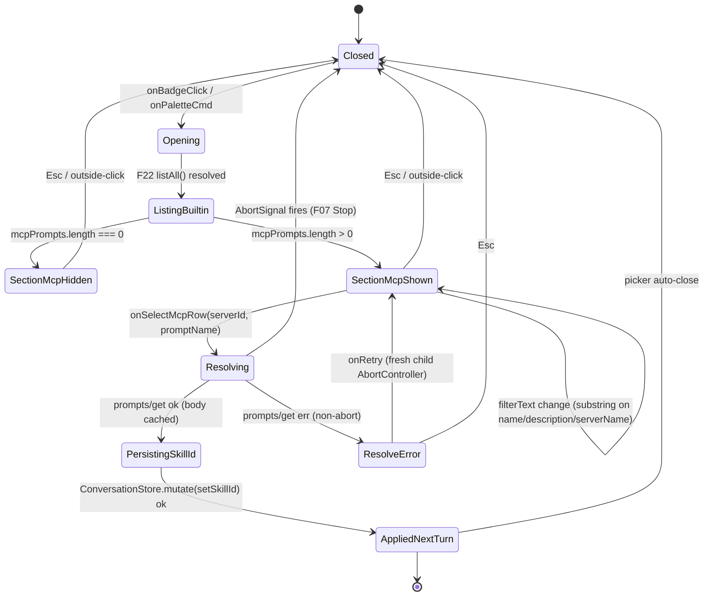

# F54 — MCP prompts in skill picker — UI

Back-link: [feature.md](./feature.md).

UI layer, Obsidian + React conventions, and platform-API wiring come from [tech-stack — UI Layer](../../../../standards/tech-stack.md#ui-layer), [tech-stack — Platform APIs](../../../../standards/tech-stack.md#platform-apis), [tech-stack — Agent / Tool / Skill / MCP Wiring](../../../../standards/tech-stack.md#agent--tool--skill--mcp-wiring), [architecture §3.1](../../../../architecture/architecture.md#31-ui-layer-react-mounted-inside-obsidian-views), [architecture §3.2](../../../../architecture/architecture.md#32-agent-layer), [architecture §4](../../../../architecture/architecture.md#4-key-contracts), [architecture §5.2](../../../../architecture/architecture.md#52-chat-turn-no-tools), [architecture §5.5](../../../../architecture/architecture.md#55-mcp-tool-call), [architecture §6](../../../../architecture/architecture.md#6-state-ownership), [architecture §10](../../../../architecture/architecture.md#10-concurrency--lifecycle-rules).

This doc adds layout / state / event / component extensions to the [F22](../skills-picker-active-skill/feature.md) SkillPicker — it does not replace F22's baseline picker, badge, listbox, or keyboard semantics. Everything new here lives in a second, visually separated section labelled **"From MCP"** rendered after the built-in / user-skill list per [FR-MCP-09](../../context.md#fr-mcp-09), plus the per-thread binding overlay on selection.

## Layout

### 1. HeaderBar picker — "From MCP" section appended (two servers, four prompts)

```
┌──────────────────────────────────────────────────────────────────────────┐
│ Leo  ·  thread-2026-04-20  ·  [⚙ General ▾]                 [⋯]  [✕]     │
│                               └─┐                                         │
│  ┌──────────────────────────────┴──────────────────────────────────────┐ │
│  │ role="listbox"  aria-label="Select skill for this thread"           │ │
│  │ ┌────────────────────────────── F22 baseline ─────────────────────┐ │ │
│  │ │ ✓  General                                 [builtin]            │ │ │
│  │ │    Default assistant — no allowlist, all tools on.              │ │ │
│  │ ├─────────────────────────────────────────────────────────────────┤ │ │
│  │ │    Write assistant                         [builtin]            │ │ │
│  │ │    Clear, concise prose. Read-only tools.                       │ │ │
│  │ ├─────────────────────────────────────────────────────────────────┤ │ │
│  │ │    My research skill                                            │ │ │
│  │ │    Custom scaffold for literature reviews.                      │ │ │
│  │ └─────────────────────────────────────────────────────────────────┘ │ │
│  │                                                                     │ │
│  │ ── From MCP ─────────────────────────────────────────────  [  🔌 ]  │ │
│  │  role="group"  aria-label="MCP prompts"                             │ │
│  │                                                                     │ │
│  │  filesystem-srv · Filesystem MCP                                    │ │
│  │  role="group" aria-label="Prompts from Filesystem MCP"              │ │
│  │  ┌─────────────────────────────────────────────────────────────────┐│ │
│  │  │    Summarize directory                          [mcp]           ││ │
│  │  │    One-paragraph summary of listed files.                       ││ │
│  │  ├─────────────────────────────────────────────────────────────────┤│ │
│  │  │    Audit permissions                            [mcp]           ││ │
│  │  │    Flag world-writable entries, explain why.                    ││ │
│  │  └─────────────────────────────────────────────────────────────────┘│ │
│  │                                                                     │ │
│  │  notes-srv · Notes MCP                                              │ │
│  │  role="group" aria-label="Prompts from Notes MCP"                   │ │
│  │  ┌─────────────────────────────────────────────────────────────────┐│ │
│  │  │    Daily reflection                             [mcp]           ││ │
│  │  │    Structured journaling scaffold for today.                    ││ │
│  │  ├─────────────────────────────────────────────────────────────────┤│ │
│  │  │    Meeting synthesis                            [mcp]           ││ │
│  │  │    Extract decisions + owners + next steps.                     ││ │
│  │  └─────────────────────────────────────────────────────────────────┘│ │
│  │                                                     [Esc = close]   │ │
│  └─────────────────────────────────────────────────────────────────────┘ │
└──────────────────────────────────────────────────────────────────────────┘
```

- Section header `── From MCP ──` is a pure render branch in the existing [F22](../skills-picker-active-skill/feature.md) listbox — a `role="presentation"` divider row. Header icon via `setIcon("plug")` from the Obsidian Lucide bundle per [FR-UI-11](../../context.md#fr-ui-11) and [tech-stack — UI Layer](../../../../standards/tech-stack.md#ui-layer).
- Per-server sub-header (`<serverId> · <displayName>`) is a `role="presentation"` label; the rows underneath live in their own `role="group"` wrapper so assistive tech hears "Prompts from Filesystem MCP, 2 options". Source disambiguation (serverId prefix) follows the feature.md AC-1 collision rule.
- Each MCP row keeps the F22 row shape: `role="option"`, `aria-describedby` pointing at the `description` span, checkmark `✓` prefix only when `id === thread.metadata.skillId`. Tag `[mcp]` replaces F22's `[builtin]` — same slot, same styling, different label.
- If every connected server contributes zero prompts, the entire "From MCP" section (header + groups) is suppressed so the picker is visually identical to F22's baseline (Open question — empty-list visibility; verifier to confirm).
- Row id shown in DOM `data-skill-id="mcp.filesystem-srv.summarize-directory"` so the Vitest selection test can match without screen text.

### 2. Picker — disconnected server + resolution error chip

```
│  ── From MCP ──────────────────────────────────────────────────────── │
│                                                                       │
│  notes-srv · Notes MCP                                                │
│  ┌───────────────────────────────────────────────────────────────────┐│
│  │    Daily reflection                         [mcp]                 ││
│  │    Structured journaling scaffold for today.                      ││
│  │    ⚠  Resolution failed — [Retry]                                 ││  ← F13 error chip
│  └───────────────────────────────────────────────────────────────────┘│
│                                                                       │
│  legacy-srv · Legacy MCP  (disconnected)                              │
│  ┌───────────────────────────────────────────────────────────────────┐│
│  │  (no prompts — server disconnected)                               ││  ← dimmed, not focusable
│  └───────────────────────────────────────────────────────────────────┘│
```

- Error chip palette + `⚠` glyph + caption via [F13 ui-visual-states-notifications](../ui-visual-states-notifications/feature.md) never colour-only per [NFR-USE-04](../../context.md#nfr-use-04). Feature.md AC-6 fixes that the thread's active skill is **not** changed when resolution fails; the chip is row-scoped, and `[Retry]` re-runs `getPrompt` under a fresh `AbortController` child.
- Disconnected-server branch shows a dimmed, non-focusable note (`aria-disabled="true"`). If `thread.metadata.skillId` pointed at that server, the missing-id fallback from feature.md AC-5 already switched it to `"general"` and logged `skill.mcp.resolve.miss` via [F01](../plugin-bootstrap-logging/feature.md) before the picker opened.

### 3. Thread — picker closes, next-turn-only binding

```
After selecting "Filesystem MCP · Summarize directory":

┌──────────────────────────────────────────────────────────────────────────┐
│ Leo  ·  thread-2026-04-20  ·  [🔌 Summarize directory ▾]   [⋯]  [✕]      │ ← badge swaps
└──────────────────────────────────────────────────────────────────────────┘

Persisted turn N       (built with prior skill — byte-identical per F22 rule)
Persisted turn N+1     (built with resolved MCP systemPrompt — applied here only)
```

- Badge icon swaps to `setIcon("plug")` when `thread.metadata.skillId` starts with `"mcp."`; name = the MCP prompt's `title || name`; tooltip (native `title=`) = `<serverName>: <promptName>` for disambiguation.
- Next-turn-only rule is [F22](../skills-picker-active-skill/feature.md)'s existing rule — feature.md AC-3 pins turn N byte-identical, turn N+1 carries the new `systemPrompt` resolved by `prompts/get`.
- Stop mid-resolution ([F07](../chat-streaming-stop/feature.md)) keeps the previous badge (never a half-resolved MCP skill) per feature.md AC-6.

## State machine

### PickerMcpSectionMachine (coupled to F22's `SkillPickerMachine`)

This machine describes only the MCP overlay; F22's `closed ↔ open ↔ selected` skeleton is the outer layer and is consumed unchanged. `mcpListReady` / `mcpListEmpty` / `mcpListPopulated` are derived from `SkillsStore.listAll()` each render (no independent subscription per [code-style — React 18](../../../../standards/code-style.md#react-18)).



Adjacency-list form (same edges, for skim-review):

- `Closed → Opening` on badge click or palette command.
- `Opening → ListingBuiltin` when `SkillsStore.listAll()` resolves (synchronous in practice; F51's prompts are observed, not fetched here).
- `ListingBuiltin → SectionMcpHidden` when `mcpPrompts.length === 0` (header + groups suppressed).
- `ListingBuiltin → SectionMcpShown` when `mcpPrompts.length > 0`.
- `SectionMcpShown → SectionMcpShown` on filter text change (pure substring match on `{name, description, serverName}` following F22's filter contract).
- `SectionMcpShown → Resolving` on row selection (`onSelectMcpRow(serverId, promptName)`).
- `Resolving → PersistingSkillId` on `prompts/get` success — resolved body cached per `(serverId, promptName)` per feature.md scope bullet 4.
- `Resolving → ResolveError` on non-abort error — inline chip, active skill preserved.
- `Resolving → Closed` on `AbortSignal` (Stop pressed — [F07](../chat-streaming-stop/feature.md)).
- `ResolveError → SectionMcpShown` on `[Retry]` (fresh child controller under the turn controller).
- `PersistingSkillId → AppliedNextTurn` after `ConversationStore.mutate(setSkillId)` via [F14](../conversation-persistence-v1/feature.md).
- `AppliedNextTurn → Closed` (picker auto-closes); the `AgentRunner` re-reads `skillId` on its next `send(msg, thread)` — next-turn-only rule from [F22](../skills-picker-active-skill/feature.md).

Invariants (Vitest asserts these):

- `Resolving → *` is reachable only from `SectionMcpShown`; selecting a built-in/user row skips this entire machine and falls through to F22's direct-persist path.
- On `Closed` from any state, no partial `skillId` write has happened; the thread's bound skill only changes on the `PersistingSkillId → AppliedNextTurn` edge.
- `ResolveError` never flips the badge — the previous skill remains visibly active per feature.md AC-6.

## Event flow

### Open → list → select → apply

```
┌───────────────────┐
│  User clicks      │
│  skill badge /    │
│  palette "Select  │
│  skill…"          │
└──────┬────────────┘
       │ (F22 handler — unchanged)
       ▼
┌───────────────────────────────────────────┐
│ SkillPicker.open()                        │
│  a. SkillsStore.list()        → builtin/user
│  b. MCPClient.listPrompts()   → F51 snapshot (zero-cost observation;
│                                  servers already discovered at plugin onload)
│  c. compose via MCPPromptSkillAdapter →   │
│     Skill[] with id = "mcp.<srvId>.<prompt>"
│  d. log("skill.mcp.list", {               │
│       serverCount, promptCount })         │
│       via F01 (no prompt bodies)          │
└──────┬────────────────────────────────────┘
       │
       ▼
┌───────────────────────────────────────────┐
│ Render listbox                            │
│  • F22 baseline section (unchanged)       │
│  • "── From MCP ──" divider               │
│  • per-server group headers + rows        │
│    (if mcpPrompts.length > 0)             │
└──────┬────────────────────────────────────┘
       │ (User arrows / clicks an MCP row)
       ▼
┌───────────────────────────────────────────┐
│ onSelectMcpRow(serverId, promptName)      │
│  ctl = new AbortController()              │
│    linked to AgentRunner's turn ctl       │
│    (F10 AbortController → F07 Stop)       │
│                                           │
│  log("skill.mcp.select",                  │
│      {threadId, fromId, toId})            │
│  // toId = "mcp." + serverId + "." + name │
└──────┬────────────────────────────────────┘
       │
       ├────────────┬────────────────────────┐
       ▼            ▼                        ▼
   Resolve       Persist                 Close picker
   body          skillId                 after both settle
       │            │
       ▼            ▼
┌─────────────┐ ┌───────────────────────────────────┐
│ MCPClient.  │ │ ConversationStore.mutate(         │
│ getPrompt(  │ │   setSkillId(toId))               │
│  serverId,  │ │   → F14 persists                  │
│  promptName,│ │   → emits thread.skill.changed    │
│  ctl.signal │ └───────────────────────────────────┘
│ )           │
│ → messages[]│
│ → flatten   │
│   to single │
│   systemPrmt│
│ → cache per │
│   (srvId,   │
│    name)    │
└──────┬──────┘
       │ ok
       ▼
┌───────────────────────────────────────────┐
│ log("skill.mcp.resolve.ok",               │
│   {serverId, promptName,                  │
│    durationMs, bytes})                    │
│ (bytes allowed; body itself only at debug)│
└──────┬────────────────────────────────────┘
       │
       ▼
Next AgentRunner.send(msg, thread)
  • F10's ContextAssembler reads thread.metadata.skillId
  • Finds composed Skill via MCPPromptSkillAdapter + cache
  • Uses resolved systemPrompt for this turn only
  • F16 ToolRegistry.listFor(thread) applies allowedTools if present
  • ProviderManager.stream gets defaultModel if present
  • Prior turns are byte-identical per F22 next-turn rule
```

Error paths:

- `getPrompt` non-abort error → `log("skill.mcp.resolve.err", {serverId, promptName, code})` via F01, F13 chip renders under the row, active skill unchanged, skillId **not** persisted (rolled back in the `AbortController`-linked Promise chain before `ConversationStore.mutate`).
- `getPrompt` aborted (Stop pressed) → no log `err`, machine returns to `Closed`, active skill unchanged.
- Rehydrate with disconnected server → `log("skill.mcp.resolve.miss", {threadId, fromId:"mcp.…", toId:"general"})` via F01, F22's missing-id fallback persists `"general"` — feature.md AC-5.

## Component mapping

Every extension point below plugs into [F22](../skills-picker-active-skill/feature.md)'s existing `SkillPicker` without forking the component. See [tech-stack.md](../../../../standards/tech-stack.md) for stack-level contracts.

| Surface | Extension in this feature | Owner / reused | Standards link |
|---|---|---|---|
| `SkillPicker` React subtree | Second `<section aria-label="MCP prompts">` rendered after the builtin/user list; conditional on `mcpPrompts.length > 0`. Pure render branch — no new store, no new subscription. | F22 component | [tech-stack — UI Layer](../../../../standards/tech-stack.md#ui-layer), [code-style — React 18](../../../../standards/code-style.md#react-18) |
| HeaderBar badge | Icon branch: `setIcon("plug")` when `skillId.startsWith("mcp.")`; name = resolved `title\|name`. Reuses F22's badge DOM. | F22 badge | [tech-stack — UI Layer](../../../../standards/tech-stack.md#ui-layer), [FR-UI-11](../../context.md#fr-ui-11) |
| Command-palette entry | Reused from F22 (`Leo: Select skill…`); no new `Plugin.addCommand`. | F22 palette | [tech-stack — Platform APIs](../../../../standards/tech-stack.md#platform-apis), [FR-UI-04](../../context.md#fr-ui-04) |
| `SkillsStore.listAll()` (or `CompositeSkillSource`) | New composite read merging file-backed skills with `MCPPromptSkillAdapter`-wrapped MCP prompts. Pure function, domain/core, no Obsidian imports. | This feature | [tech-stack — Agent / Tool / Skill / MCP Wiring](../../../../standards/tech-stack.md#agent--tool--skill--mcp-wiring) |
| `MCPPromptSkillAdapter` | Pure mapper `Prompt → Skill` with namespaced id `mcp.<serverId>.<promptName>`, `source:"mcp"`, `mcpServerId`. Zod-validated shape on entry. | This feature | [tech-stack — Agent / Tool / Skill / MCP Wiring](../../../../standards/tech-stack.md#agent--tool--skill--mcp-wiring), [code-style — Zod & Tool Schemas](../../../../standards/code-style.md#zod--tool-schemas) |
| `MCPClient.getPrompt(serverId, promptName, signal)` | Thin seam on top of F51's `ServerRuntime.client`; typed `{ok:true,data}|{ok:false,error}`, carries turn's `AbortSignal`. Domain never sees SDK types. | F51 extended | [tech-stack — Agent / Tool / Skill / MCP Wiring](../../../../standards/tech-stack.md#agent--tool--skill--mcp-wiring), [code-style — Error Handling](../../../../standards/code-style.md#error-handling) |
| Resolved-prompt cache | In-memory `Map<(serverId, promptName), systemPrompt>` held by `MCPClient`; dropped on disconnect / `prompts/list_changed` / plugin unload. No persistence. | This feature | [tech-stack — Agent / Tool / Skill / MCP Wiring](../../../../standards/tech-stack.md#agent--tool--skill--mcp-wiring) |
| Thread binding | Reused F22 `ConversationStore.mutate(setSkillId)` through [F14](../conversation-persistence-v1/feature.md). Only persisted field: `thread.metadata.skillId`. | F14 + F22 | [tech-stack — Persistence](../../../../standards/tech-stack.md#persistence), [FR-SKILL-06](../../context.md#fr-skill-06) |
| `allowedTools` overlay | Reused F22 path through [F16 tool-registry-builtin-read](../tool-registry-builtin-read/feature.md) `listFor(thread)`. MCP skill optionally declares `allowedTools`; `undefined` ⇒ full registry. | F16 + F22 | [tech-stack — Agent / Tool / Skill / MCP Wiring](../../../../standards/tech-stack.md#agent--tool--skill--mcp-wiring), [FR-SKILL-07](../../context.md#fr-skill-07) |
| `defaultModel` overlay | Reused F22 path into `ProviderManager.stream`; `undefined` ⇒ settings default. | F22 | [tech-stack — Agent / Tool / Skill / MCP Wiring](../../../../standards/tech-stack.md#agent--tool--skill--mcp-wiring), [FR-SKILL-08](../../context.md#fr-skill-08) |
| Abort wiring | `getPrompt` takes the turn's `AbortSignal` from F10's `AgentRunner` controller. [F07](../chat-streaming-stop/feature.md) Stop cancels resolution alongside the LLM request. | F10 + F07 | [tech-stack — Agent / Tool / Skill / MCP Wiring](../../../../standards/tech-stack.md#agent--tool--skill--mcp-wiring), [code-style — Async & Concurrency](../../../../standards/code-style.md#async--concurrency) |
| Inline error chip | [F13 ui-visual-states-notifications](../ui-visual-states-notifications/feature.md) palette + `⚠` glyph + caption; never colour-only per [NFR-USE-04](../../context.md#nfr-use-04). Row-scoped — active skill preserved. | F13 | [tech-stack — UI Layer](../../../../standards/tech-stack.md#ui-layer), [NFR-USE-04](../../context.md#nfr-use-04) |
| Missing-id fallback | Reused F22 rule: `thread.metadata.skillId` unresolved ⇒ `"general"`; persisted via F14; `skill.mcp.resolve.miss` via [F01](../plugin-bootstrap-logging/feature.md). | F22 + F01 | [tech-stack — Agent / Tool / Skill / MCP Wiring](../../../../standards/tech-stack.md#agent--tool--skill--mcp-wiring), [FR-SKILL-05](../../context.md#fr-skill-05) |
| Logging | `skill.mcp.list`, `skill.mcp.select`, `skill.mcp.resolve.ok`, `skill.mcp.resolve.err`, `skill.mcp.resolve.miss` through [F01](../plugin-bootstrap-logging/feature.md). Fields `{threadId?, serverId, promptName, fromId?, toId?, durationMs?, bytes?}`; bodies never above `debug`. | F01 | [code-style — Logging](../../../../standards/code-style.md#logging), [NFR-LOG-04](../../context.md#nfr-log-04) |
| Accessibility | `role="listbox"` + `role="group"` nesting, per-server `aria-label`, `aria-describedby` on each row, `aria-disabled` on disconnected-server note, focus-ring via Obsidian CSS variables only. | F22 + this feature | [tech-stack — UI Layer](../../../../standards/tech-stack.md#ui-layer), [NFR-USE-06](../../context.md#nfr-use-06) |
| Testing | Vitest over F51 stdio fixture + `msw` SSE, adapter shape, section render + server-grouped rows, selection persistence, next-turn-only byte-identity, disconnected-server fallback, Abort-mid-resolution, `allowedTools` / `defaultModel` pass-through, log-event shape. | This feature | [tech-stack — Testing](../../../../standards/tech-stack.md#testing), [code-style — Testing (Vitest + msw)](../../../../standards/code-style.md#testing-vitest--msw) |
| Forbidden | No new `Plugin.addCommand`; no new status-bar item; no native Obsidian `Modal`; no new persisted field; no argument-input UI (parameterised prompts deferred per feature.md Open questions); no per-server palette override; no prompt body in logs above `debug`. | — | [FR-UI-08](../../context.md#fr-ui-08), [NFR-LOG-04](../../context.md#nfr-log-04) |

## Back-link

[feature.md](./feature.md)
