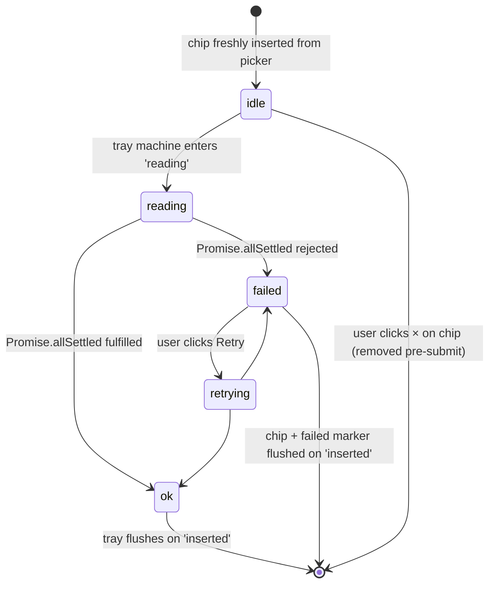

# F53 — MCP resources picker · UI

This feature adds a new inline surface: an **MCP resource picker** anchored inside the composer region of the [F04 chat-sidebar-view](../chat-sidebar-view/feature.md) `ChatView` shell, plus a **staged-resources chip row** anchored to the composer, plus the rendered **resource context block** appended before the user's text in the next outgoing turn. It is NEVER a native Obsidian `Modal` per [FR-UI-08](../../context.md#fr-ui-08). Icons come from Obsidian's bundled Lucide set via [`setIcon`](../../../../standards/tech-stack.md#platform-apis); colours, borders, and focus rings resolve through Obsidian CSS variables ([UI Layer → Styling](../../../../standards/tech-stack.md#ui-layer), [Code style → Styling (Tailwind + Obsidian)](../../../../standards/code-style.md#styling-tailwind--obsidian)). All wireframes sit inside the six-region decomposition owned by [F04](../chat-sidebar-view/feature.md).

## Layout

### Wireframe 1 — Closed state (composer with affordance, no staged resources)

```
 0        10        20        30        40        50
 |---------|---------|---------|---------|---------|   min-width marker: 280 px
+--------------------------------------------------+
| ...MessageList transcript above (from F05)...    |
+--------------------------------------------------+
|  InlineConfirmation region (from F04): (empty)   |
+--------------------------------------------------+
|  StagedResourceTray region (from F04): (hidden)  |   <- tray collapses when empty
+--------------------------------------------------+
|  ComposerInput (from F06)                        |
| +------------------------------------------+ +--+|
| | Type a message...                        | |> ||   <- send
| +------------------------------------------+ +--+|
| [ 🔌 MCP resources ]  [ 📎 Attach ]  ...          |   <- composer toolbar row
+--------------------------------------------------+

affordance      : setIcon(btnEl, "plug")  label "MCP resources"
                  role="button" aria-haspopup="listbox" aria-expanded="false"
                  disabled when MCPClient.listResources() is empty
                  AND no server is connected (F51) — surfaces as
                  dimmed + tooltip "No MCP servers connected"
keyboard        : Tab reaches the affordance in composer-toolbar order;
                  Enter / Space opens the picker (Wireframe 2)
anchor region   : picker mounts ABOVE the composer inside the
                  six-region ChatView shell (F04) — NEVER a
                  native Obsidian Modal per [FR-UI-08](../../context.md#fr-ui-08)
```

### Wireframe 2 — Picker open (inline, per-server grouping, search/filter, multi-select)

```
 0        10        20        30        40        50
 |---------|---------|---------|---------|---------|
+--------------------------------------------------+
| ...MessageList transcript above (from F05)...    |
+--------------------------------------------------+
|  Picker region (inline overlay, anchored above   |
|  composer, inside ChatView shell — NOT a Modal)  |
| ┌──────────────────────────────────────────────┐ |
| │ MCP resources                       [ × ]    │ |   <- header + close
| │                                              │ |
| │ 🔎 [ filter uri, name, mimeType... ]         │ |   <- search input
| │                                              │ |
| │ ── github (2 resources) ──────────────────── │ |   <- per-server group header
| │ [✓] issues://repo/owner                      │ |      row label = uri
| │     name: "Open issues"     mime: text/json  │ |      optional title/mime below
| │ [ ] prs://repo/owner                         │ |
| │     name: "Pull requests"   mime: text/json  │ |
| │                                              │ |
| │ ── docs (3 resources) ─────────────────────  │ |
| │ [✓] file:///notes/spec.md                    │ |
| │     name: "Spec"            mime: text/md    │ |
| │ [ ] file:///notes/adr-01.md                  │ |
| │ [ ] file:///notes/adr-02.md                  │ |
| │                                              │ |
| │ ── offline-server (disconnected) ─────────── │ |   <- dimmed group
| │   (no resources)                             │ |      empty-state row
| │                                              │ |
| │ 2 selected            [ Cancel ] [ Done ]    │ |   <- footer actions
| └──────────────────────────────────────────────┘ |
+--------------------------------------------------+
|  StagedResourceTray region: (hidden until Done)  |
+--------------------------------------------------+
|  ComposerInput (from F06)                        |
| +------------------------------------------+ +--+|
| | Type a message...                        | |> ||
| +------------------------------------------+ +--+|
| [ 🔌 MCP resources ]  [ 📎 Attach ]  ...          |
+--------------------------------------------------+

role / ARIA     : <section role="dialog" aria-modal="false"
                  aria-label="MCP resources picker">
                  <input role="searchbox">
                  <ul role="listbox" aria-multiselectable="true">
                    <li role="group" aria-label="github (2 resources)">
                      <div role="option" aria-selected="true">...</div>
                      <div role="option" aria-selected="false">...</div>
                    </li>
                    ...
                  </ul>
filter          : case-insensitive substring match on
                  { uri, name, title, mimeType } — client-side only,
                  list is from F51's MCPClient.listResources()
grouping        : resources grouped by serverId; group header shows
                  the server's human name + "(<n> resources)" from
                  F51's config entry (never the raw serverId in label)
empty groups    : connected server with no resources OR disconnected
                  server → dim row "(no resources)" so the known
                  surface is visible (AC2 of feature.md)
keyboard        : ArrowDown/Up → move option; Home/End → first/last;
                  Space/Enter → toggle; Esc → close without commit;
                  Tab → moves focus out (footer action); shift-focus-out
                  behaviour inherits F17's focus-trap patterns
selection count : "N selected" live region (aria-live="polite")
close           : × button, Esc key, or click-outside
                  (all three asserted in AC1 of feature.md)
data attributes : data-visual-state="picker-open" on root;
                  data-server-id on each group; data-resource-uri
                  on each option
```

### Wireframe 3 — Staged resources chip row (between picker close and send)

```
 0        10        20        30        40        50
 |---------|---------|---------|---------|---------|
+--------------------------------------------------+
|  Picker region: (closed, unmounted)              |
+--------------------------------------------------+
|  StagedResourceTray region                       |
| ┌──────────────────────────────────────────────┐ |
| │ MCP: 3 resources staged for next message     │ |   <- tray header
| │                                              │ |
| │ [🔌 github · issues://repo/owner      × ]    │ |   <- chip row
| │ [🔌 docs   · file:///notes/spec.md    × ]    │ |      (order = staging order)
| │ [🔌 docs   · file:///notes/adr-01.md  × ]    │ |
| │                                              │ |
| │ [ + Add resources ]              [ Clear all]│ |   <- reopen + bulk-clear
| └──────────────────────────────────────────────┘ |
+--------------------------------------------------+
|  ComposerInput (from F06)                        |
| +------------------------------------------+ +--+|
| | Summarise the linked spec and open issues| |> ||
| +------------------------------------------+ +--+|
| [ 🔌 MCP resources (3) ]  [ 📎 Attach ]  ...      |   <- affordance shows count
+--------------------------------------------------+

tray visibility : mounts when staged.length > 0; unmounts on
                  submit / Clear all / thread switch / plugin
                  unload (no persistence — AC6 of feature.md)
chip content    : [<icon> <serverName> · <uri>  ×]
                  icon: setIcon("plug"); serverName from F51 config
                  uri truncated via CSS text-overflow:ellipsis;
                  full uri in title= tooltip
chip role       : role="listitem"; aria-label="<serverName>:
                  <uri>, click × to remove"
× per chip      : removes from staged; focus moves to next chip,
                  or to "+ Add resources" if last chip removed
Add resources   : reopens picker (Wireframe 2) with prior staged
                  selection pre-checked; intersection logic covered
                  in state machine below
Clear all       : clears staged; tray collapses; composer
                  affordance returns to "[ 🔌 MCP resources ]"
                  without count suffix
error state     : a chip whose resources/read fails (after submit
                  + retry attempt) renders with [F13](../ui-visual-states-notifications/feature.md)
                  error palette — see Wireframe 5
persistence     : ZERO — staged live in ChatView React state only
                  per [Architecture §6 State Ownership](../../../../architecture/architecture.md#6-state-ownership)
                  (AC6 of feature.md — negative Vitest scan)
```

### Wireframe 4 — Composed outgoing turn (how staged content appears to the agent)

```
 0        10        20        30        40        50
 |---------|---------|---------|---------|---------|
+--------------------------------------------------+
| Outgoing message content blocks (in order):      |
|                                                  |
|   Block 0: [type:"text" stable preamble]         |
|   ┌────────────────────────────────────────────┐ |
|   │ <mcp-resources>                            │ |
|   │  <resource uri="issues://repo/owner"       │ |
|   │            server="github"                 │ |
|   │            mimeType="application/json">    │ |
|   │    { ...server-returned JSON verbatim... } │ |
|   │  </resource>                               │ |
|   │  <resource uri="file:///notes/spec.md"     │ |
|   │            server="docs"                   │ |
|   │            mimeType="text/markdown">       │ |
|   │    # Spec\n...                             │ |
|   │  </resource>                               │ |
|   │  <resource uri="file:///notes/adr-01.md"   │ |
|   │            server="docs"                   │ |
|   │            mimeType="text/markdown"        │ |
|   │            failed="true">                  │ |
|   │    [[read failed: ECONNRESET]]             │ |
|   │  </resource>                               │ |
|   │ </mcp-resources>                           │ |
|   └────────────────────────────────────────────┘ |
|                                                  |
|   Block 1: [type:"text"] from F08 focused        |
|            context (if any) — unchanged          |
|                                                  |
|   Block 2: [type:"text"] user's composer text    |
|   ┌────────────────────────────────────────────┐ |
|   │ Summarise the linked spec and open issues  │ |
|   └────────────────────────────────────────────┘ |
|                                                  |
|   Block 3..N: image/document attachments from    |
|               F49 (if any) — unchanged           |
+--------------------------------------------------+

ordering rule  : <mcp-resources> preamble FIRST (before F08 focused
                 context and before user text) so the agent treats
                 staged resources as the most-fresh context; order
                 WITHIN <mcp-resources> is the staging order from
                 Wireframe 3 (AC4 of feature.md, byte-identity Vitest)
preamble shape : stable sentinel <mcp-resources>…</mcp-resources>
                 with per-resource <resource uri=… server=… mimeType=…>
                 envelope so [F42](../compaction-microcompact/feature.md) /
                 [F43](../compaction-autocompact/feature.md) can detect
                 and preserve it (resolves Open question #3 in feature.md)
failed marker  : a failed read stays in the envelope with failed="true"
                 and a human-readable reason; never silently dropped
                 (AC5 of feature.md)
binary handling: image mime types reuse F49's image content-block shape
                 (separate block, not inside <mcp-resources>); other
                 binary payloads are rejected pre-submit with a
                 user-visible error chip (Open question #2 in feature.md)
no persistence : the composed blocks ride on THIS turn only; the next
                 turn starts with staged = [] unless the user stages
                 again (AC6 of feature.md)
```

### Wireframe 5 — Per-chip read-failure + Retry (error palette)

```
 0        10        20        30        40        50
 |---------|---------|---------|---------|---------|
+--------------------------------------------------+
|  StagedResourceTray region (after partial fail)  |
| ┌──────────────────────────────────────────────┐ |
| │ MCP: 3 resources staged · 1 failed           │ |
| │                                              │ |
| │ [🔌 github · issues://repo/owner      ✓ ]    │ |   <- OK, muted tick
| │ [🔌 docs   · file:///notes/spec.md    ✓ ]    │ |
| │ [⚠ docs    · file:///notes/adr-01.md  ↻ × ]  │ |   <- error chip
| │     read failed: ECONNRESET                  │ |      [F13](../ui-visual-states-notifications/feature.md) error palette
| │     [ Retry ]                                │ |      Retry = single re-read
| └──────────────────────────────────────────────┘ |
+--------------------------------------------------+

error visual    : data-visual-state="error" on the chip;
                  amber/red border via [F13](../ui-visual-states-notifications/feature.md)'s
                  error palette (var(--color-red) / var(--color-orange))
                  per [FR-UI-06](../../context.md#fr-ui-06) — never
                  colour-only (also carries ⚠ icon + caption)
caption         : one-line reason; full error in title= tooltip;
                  never leaks payload content at info-or-above log
Retry affordance: invokes MCPClient.readResource(serverId, uri, signal)
                  ONE more time under the same turn's AbortController;
                  success → chip flips to ✓, outgoing turn's failed="true"
                  marker removed before send if it hasn't submitted yet
partial success : the outgoing turn proceeds with ✓ resources PLUS
                  the failed marker on the failed entries — never
                  silently drops (AC5 of feature.md)
log events      : mcp.resource.read.err {serverId, uri, mimeType,
                  durationMs, errorKind} via [F01](../plugin-bootstrap-logging/feature.md);
                  no payload bytes logged
```

Args + preview use Obsidian CSS variables only; zero colour literals per [Code style → Styling (Tailwind + Obsidian)](../../../../standards/code-style.md#styling-tailwind--obsidian).

## State machine

Three coupled machines govern the picker UX. The picker itself is a lightweight React state machine; the staged tray is a session-scoped tray machine; individual stage entries carry a per-entry read/retry lifecycle.

### `ResourcePickerMachine` (per ChatView session)

```mermaid
stateDiagram-v2
    [*] --> closed
    closed --> opening    : user activates [🔌 MCP resources]
    opening --> loading   : mount; snapshot MCPClient.listResources()
    loading --> listed    : resources snapshot ready (sync-ish from F51)
    loading --> emptyAll  : snapshot is empty AND no servers connected
    listed --> filtering  : user types in searchbox
    filtering --> listed  : input cleared / no match / debounced settle
    listed --> selecting  : user toggles an option (Space/Enter/click)
    selecting --> listed  : option toggled; stagedDraft updated
    listed --> committed  : user clicks [ Done ]
    filtering --> committed : user clicks [ Done ] while filtering
    listed --> cancelled  : user clicks [ Cancel ] / Esc / click-outside
    filtering --> cancelled : same
    emptyAll --> cancelled : × / Esc
    committed --> closed  : picker unmounts; stagedDraft -> stagedTray
    cancelled --> closed  : picker unmounts; stagedDraft discarded
    closed --> [*]        : ChatView.onClose / plugin.unload()
```

Adjacency-list equivalent:

- `[*] → closed` on `ChatView.onOpen`; initial `stagedDraft = copy(stagedTray)` is not touched until `opening` so fresh opens pre-check the existing staged set (Wireframe 3: "+ Add resources" flow).
- `closed → opening` on `onClick` / `keydown Enter|Space` on the composer affordance; fires `mcp.resource.picker.open` via [F01 Logger](../plugin-bootstrap-logging/feature.md) (AC7 of [feature.md](./feature.md)).
- `opening → loading` — picker React root mounts into the picker region of [F04](../chat-sidebar-view/feature.md)'s shell (NEVER native `Modal` — Vitest spy per AC1 of [feature.md](./feature.md)).
- `loading → listed` — `MCPClient.listResources()` (F51) returns synchronously from the in-memory snapshot; grouping by `serverId` + alphabetic sort within group happens in a pure selector.
- `loading → emptyAll` — snapshot is empty AND zero servers connected → dedicated empty view with "No MCP servers connected" copy.
- `listed ↔ filtering` — pure case-insensitive substring filter on `{uri, name, title, mimeType}`; debounced ~50 ms to avoid re-layout on each keystroke.
- `listed → selecting → listed` — toggling an option updates `stagedDraft` and fires `mcp.resource.pick { serverId, uri, mimeType, action: "add"|"remove" }` via [F01](../plugin-bootstrap-logging/feature.md) (AC7 of feature.md).
- `listed → committed` — clicking `[ Done ]` copies `stagedDraft` into the tray machine's `staged[]` array; fires nothing on its own (attach event fires only at submit time, see tray machine).
- `listed → cancelled` — `[ Cancel ]` / Esc / click-outside; `stagedDraft` is discarded; `staged[]` in tray is untouched.
- `closed → [*]` — on `ChatView.onClose` / `plugin.unload()`, any in-flight picker unmounts; zero persistence per [Architecture §10 Concurrency & Lifecycle Rules](../../../../architecture/architecture.md#10-concurrency--lifecycle-rules).

### `StagedResourceTrayMachine` (per ChatView session, survives picker close/reopen inside the same turn)

```mermaid
stateDiagram-v2
    [*] --> empty
    empty --> populated : picker commits >= 1 resource
    populated --> populated : picker commits more / user removes one (still >= 1)
    populated --> empty : user Clear all / last chip × / thread switch / plugin unload
    populated --> submitting : user clicks Send on composer
    submitting --> reading : open AbortController from F07 turn
    reading --> allOk : all Promise.allSettled fulfilled
    reading --> partial : at least one rejected, at least one fulfilled
    reading --> allFail : every Promise.allSettled rejected
    reading --> aborted : user pressed Stop (F07) during reads
    allOk --> inserted : content blocks prepended to outgoing turn
    partial --> inserted : content blocks + failed="true" markers inserted
    allFail --> inserted : only failed="true" markers inserted
    aborted --> populated : no content reaches the message; staged[] kept
                          : so user can retry / edit / send again
    inserted --> empty : turn handed off to F10 AgentController;
                       : staged[] cleared; tray unmounts
    empty --> [*] : ChatView.onClose / plugin.unload()
```

Adjacency-list equivalent:

- `[*] → empty` — default state on `ChatView.onOpen`; `staged[] = []`.
- `empty → populated` — `ResourcePickerMachine` reaches `committed` with ≥ 1 resource in `stagedDraft`; chips render in staging order.
- `populated → populated` — reopens of the picker merge prior `staged[]` with `stagedDraft` (intersection-aware: items already staged stay staged; newly picked append; unchecked-in-reopen removes).
- `populated → empty` — user clicks `[ Clear all ]`, removes the last chip via `×`, switches threads via [F37 multi-thread-management](../multi-thread-management/feature.md), or plugin unload fires (AC6 of feature.md).
- `populated → submitting` — user presses Send on the composer ([F06](../chat-composer-input/feature.md)); [F10 AgentController](../agent-controller-core/feature.md) creates the turn's `AbortController` (shared with [F07](../chat-streaming-stop/feature.md)).
- `submitting → reading` — `staged[].map(r => MCPClient.readResource(r.serverId, r.uri, signal))` wrapped in `Promise.allSettled` per [Code style → Async & Concurrency](../../../../standards/code-style.md#async--concurrency); each read fires `mcp.resource.read.ok` / `mcp.resource.read.err` via [F01](../plugin-bootstrap-logging/feature.md).
- `reading → allOk` / `partial` / `allFail` — classification by settled outcomes; partial and allFail paths still build a message (AC5 of feature.md).
- `reading → aborted` — Stop press from [F07](../chat-streaming-stop/feature.md) triggers `AbortController.abort()`; in-flight reads reject with `DOMException("AbortError")`; NO content blocks land in any post-cancel message (AC6 of feature.md).
- `allOk | partial | allFail → inserted` — `buildMcpPreamble(readings)` composes the stable sentinel `<mcp-resources>…</mcp-resources>` block; failed URIs are rendered as `<resource … failed="true">` envelopes per Wireframe 4; fires `mcp.resource.attach { attachedCount, failedCount }` via [F01](../plugin-bootstrap-logging/feature.md) (AC7 of feature.md).
- `aborted → populated` — tray stays populated so the user can retry or edit before re-sending; aligns with [F07](../chat-streaming-stop/feature.md)'s Stop semantics (turn cancelled, but composer + staged state preserved for editing).
- `inserted → empty` — control handed to [F10 AgentController](../agent-controller-core/feature.md)'s turn runner; `staged[] = []`; tray unmounts; composer affordance count suffix removed.

### `StagedEntryLifecycle` (per individual staged resource)



Adjacency-list equivalent:

- `[*] → idle` — chip enters the tray in staging order; `data-visual-state="staged"`.
- `idle → reading` — tray enters `reading`; chip switches to a muted spinner / "reading…" caption reusing [F13](../ui-visual-states-notifications/feature.md)'s `tool-running`-adjacent palette (NOT identical — resources are not tools).
- `reading → ok` — `chip data-visual-state="ok"`; muted tick glyph.
- `reading → failed` — `chip data-visual-state="error"`; red border + ⚠ + caption + `[ Retry ]` affordance reusing [F13](../ui-visual-states-notifications/feature.md) error palette per [FR-UI-06](../../context.md#fr-ui-06) (AC5 of feature.md).
- `failed → retrying → ok|failed` — `[ Retry ]` re-invokes `MCPClient.readResource(serverId, uri, signal)` ONCE under the same turn's `AbortController`; success flips to `ok`; failure stays `failed` (no auto-escalation).
- `idle → [*]` — removing a chip via `×` pre-submit deletes the entry from `staged[]`; fires `mcp.resource.pick { action: "remove" }`.
- `failed → [*]` on `inserted` — the failed envelope `<resource … failed="true">` is inserted into the outgoing turn so the agent is never silently missing context (AC5 of feature.md).

Teardown inherits [Architecture §10 Concurrency & Lifecycle Rules](../../../../architecture/architecture.md#10-concurrency--lifecycle-rules): `ChatView.onClose` / `plugin.unload()` / thread switch via [F37](../multi-thread-management/feature.md) forcibly aborts any in-flight reads via the shared `AbortController`, drops `staged[]`, unmounts the tray, and emits no persistence write. Negative Vitest assertion scans both in-memory state and on-disk thread JSON (AC6 of [feature.md](./feature.md)).

## Event flow

### 0. Discovery (zero-work observation of F51's list)

1. On `Plugin.onload` or later server connects, [F51](../mcp-client-config-transports/feature.md)'s `MCPClient` populates `ServerRuntime.resources` for each connected server via `resources/list` per [FR-MCP-05](../../context.md#fr-mcp-05).
2. This feature does NOT add a discovery call; it observes the live snapshot lazily on picker open only per [Architecture §5.1 Plugin Startup](../../../../architecture/architecture.md#51-plugin-startup) — no startup cost.
3. The composer affordance's `disabled` state is derived from `MCPClient.listResources()` + `MCPClient.connectedServers()` via a cheap React selector; no subscription added.

### 1. User opens the picker

1. User activates the `[ 🔌 MCP resources ]` composer-toolbar button via click or keyboard (Enter/Space while focused); `ResourcePickerMachine`: `closed → opening → loading`.
2. `MCPClient.listResources()` returns the in-memory snapshot `[{ serverId, uri, name?, title?, mimeType? }]` grouped by `serverId`; picker builds a pure `listed` view, merging the tray's existing `staged[]` into `stagedDraft` so already-staged items are pre-checked (AC3 of feature.md — "persists across picker reopen within the same unsent turn").
3. Picker mounts inside [F04](../chat-sidebar-view/feature.md)'s picker region; `aria-expanded="true"` on the composer affordance; focus moves into the searchbox.
4. Structured log `mcp.resource.picker.open { connectedServers, resourceCount }` via [F01 Logger](../plugin-bootstrap-logging/feature.md) (AC7 of feature.md); never carries uris or payloads above `debug` per [Code style → Logging](../../../../standards/code-style.md#logging).
5. Empty path: if `listResources()` is empty AND no servers are connected, `loading → emptyAll` with an inline copy "No MCP servers connected — configure servers in Settings → MCP" and a link back to [F55](../mcp-client-config-transports/feature.md) settings surface (owned by F55, not this feature).

### 2. User multi-selects resources

1. User presses `ArrowDown` to navigate options; on `Space`/`Enter` or click, `ResourcePickerMachine`: `listed → selecting → listed`; `stagedDraft` updates.
2. Each toggle fires `mcp.resource.pick { serverId, uri, mimeType, action: "add" | "remove" }` via [F01](../plugin-bootstrap-logging/feature.md) (AC7 of feature.md).
3. User can type in the search box; `listed → filtering → listed` with case-insensitive substring match; filtered view is pure (`filter(listed, query)`) so typing does not re-fetch anything.
4. Footer count updates via `aria-live="polite"` region; per [NFR-USE-06](../../context.md#nfr-use-06) keyboard operability covers navigation + toggle + close.

### 3. User commits the selection

1. User clicks `[ Done ]` (or `Enter` with focus on Done); `ResourcePickerMachine`: `listed → committed → closed`; picker unmounts.
2. `StagedResourceTrayMachine`: `empty → populated` (or remains `populated`); `staged[]` copied from `stagedDraft` in staging order.
3. Staged tray mounts above the composer (Wireframe 3); composer affordance label flips to `[ 🔌 MCP resources (N) ]` where `N = staged.length`.
4. No read has happened yet — content is fetched only on turn submit (AC4 of feature.md).

### 4. User composes text and presses Send

1. User types the prompt in [F06 ComposerInput](../chat-composer-input/feature.md); presses `Enter` (or clicks Send).
2. `StagedResourceTrayMachine`: `populated → submitting`; [F10 AgentController](../agent-controller-core/feature.md) creates the turn's `AbortController` shared with [F07 chat-streaming-stop](../chat-streaming-stop/feature.md).
3. Tray machine: `submitting → reading`; each staged entry's `StagedEntryLifecycle` flips `idle → reading`; chip shows reading indicator.
4. Reads fan out: `Promise.allSettled(staged.map(r => MCPClient.readResource(r.serverId, r.uri, signal)))` per [Code style → Async & Concurrency](../../../../standards/code-style.md#async--concurrency). For each settled result:
   - fulfilled → `mcp.resource.read.ok { serverId, uri, mimeType, bytes, durationMs }` via [F01](../plugin-bootstrap-logging/feature.md); entry lifecycle `reading → ok`.
   - rejected → `mcp.resource.read.err { serverId, uri, mimeType, durationMs, errorKind }` via [F01](../plugin-bootstrap-logging/feature.md); entry lifecycle `reading → failed` with chip-level [F13](../ui-visual-states-notifications/feature.md) error palette.
5. Once all are settled (or the signal aborts), tray machine classifies: `reading → allOk | partial | allFail | aborted`.
6. For `allOk | partial | allFail`, `buildMcpPreamble(readings)` composes the sentinel block per Wireframe 4 — `<mcp-resources>` envelope with per-resource `<resource>` children in staging order, failed entries marked with `failed="true"`; the block becomes the FIRST content block (before [F08 editor-bridge-focused-context](../editor-bridge-focused-context/feature.md) context and before the user's text) per AC4 of feature.md, byte-identity Vitest snapshot.
7. Fires `mcp.resource.attach { attachedCount, failedCount, totalBytes }` via [F01](../plugin-bootstrap-logging/feature.md) (AC7 of feature.md); no payload / uri logged above `debug`.
8. `inserted → empty`: tray unmounts; `staged[] = []`; composer affordance returns to `[ 🔌 MCP resources ]`.
9. [F10 AgentController](../agent-controller-core/feature.md) streams the assembled turn to the provider per [Architecture §5.5](../../../../architecture/architecture.md#55-mcp-tool-call)'s adjacent pattern (without the tool-confirmation branch — resources are content, not a tool call; see [feature.md](./feature.md) Open question #1 and scope note).

### 5. Stop pressed mid-read

1. User clicks the Stop button from [F07](../chat-streaming-stop/feature.md) while `reading`.
2. `AbortController.abort()` cancels in-flight `readResource()` Promises; each rejects with `DOMException("AbortError")`.
3. `reading → aborted → populated`: NO content blocks land in any message (AC6 of feature.md); `staged[]` is preserved so the user can retry.
4. Fires `mcp.resource.read.err { ... errorKind: "aborted" }` for each in-flight read; fires NO `mcp.resource.attach` (nothing attached).
5. The composer re-enables; user can remove entries, add more, or press Send again.

### 6. User Retries a failed chip

1. With chip in `failed` state, user clicks inline `[ Retry ]` (Wireframe 5).
2. `StagedEntryLifecycle`: `failed → retrying`; `MCPClient.readResource(serverId, uri, signal)` fires once more under the same turn's `AbortController`.
3. `retrying → ok` on success (chip flips to `✓`; any pending outgoing message's failed marker is rebuilt before final composition); `retrying → failed` on another error (chip stays in `failed`).
4. Retry does NOT auto-submit the turn; it is a per-chip affordance only. Partial-success path still proceeds on the original submit unless the user cancelled it per §5 above.

### 7. Thread switch / plugin unload

1. On thread switch via [F37 multi-thread-management](../multi-thread-management/feature.md) or `plugin.unload()`:
   - `StagedResourceTrayMachine: * → [*]` — tray unmounts, `staged[] = []`, in-flight reads aborted via shared `AbortController`, zero disk write.
   - `ResourcePickerMachine: * → [*]` — picker unmounts without committing `stagedDraft`.
2. Negative Vitest assertion per AC6 of [feature.md](./feature.md) scans: (a) in-memory ChatStore has no `pendingMcpResources` entry, (b) on-disk thread JSON owned by [F14 conversation-persistence-v1](../conversation-persistence-v1/feature.md) contains zero resource-picker keys; confirms per [Architecture §6 State Ownership](../../../../architecture/architecture.md#6-state-ownership).

## Component mapping

| UI block | Component / API | Standards reference |
|---|---|---|
| Picker dialog root | New React 18 `<ResourcePicker>` — `<section role="dialog" aria-modal="false" aria-label="MCP resources picker">` mounted into the picker region of [F04](../chat-sidebar-view/feature.md); NEVER a native [Obsidian `Modal`](../../../../standards/tech-stack.md#platform-apis) per [FR-UI-08](../../context.md#fr-ui-08); Modal-not-invoked Vitest spy asserts AC1 of [feature.md](./feature.md) | [Architecture §3.1](../../../../architecture/architecture.md#31-ui-layer-react-mounted-inside-obsidian-views); [Code style → Obsidian Plugin Patterns](../../../../standards/code-style.md#obsidian-plugin-patterns); [tech-stack.md → UI Layer](../../../../standards/tech-stack.md#ui-layer) |
| Picker listbox | `<ul role="listbox" aria-multiselectable="true">` with per-server `<li role="group">` wrappers containing `<div role="option" aria-selected>` entries; keyboard navigation via a small controller hook (`useListboxKeyboard`) covering Arrow / Home / End / Space / Enter / Esc per [NFR-USE-06](../../context.md#nfr-use-06) | [Code style → React 18](../../../../standards/code-style.md#react-18); [tech-stack.md → UI Layer](../../../../standards/tech-stack.md#ui-layer) |
| Searchbox | `<input type="search" role="searchbox">`; pure substring filter on `{uri, name, title, mimeType}` lowercase; debounced ~50 ms; no re-fetch from F51 | [Code style → React 18](../../../../standards/code-style.md#react-18) |
| Composer affordance | New `<button>` in the composer-toolbar row rendered by [F06 ComposerInput](../chat-composer-input/feature.md); `setIcon(btnEl, "plug")` via Obsidian's bundled Lucide icons; label = "MCP resources" (+ count suffix when `staged.length > 0`); `aria-haspopup="listbox"` + `aria-expanded` | [tech-stack.md → Platform APIs](../../../../standards/tech-stack.md#platform-apis); [tech-stack.md → UI Layer](../../../../standards/tech-stack.md#ui-layer) |
| Staged resource tray | New React `<StagedResourceTray>` — `<ul role="list" aria-label="MCP resources staged for next message">`; mounts into the staged-tray region of [F04](../chat-sidebar-view/feature.md) between InlineConfirmation and ComposerInput; unmounts when `staged.length === 0` | [Architecture §3.1](../../../../architecture/architecture.md#31-ui-layer-react-mounted-inside-obsidian-views) |
| Staged resource chip | `<StagedResourceChip>` React component rendering icon + serverName + truncated uri + per-chip × button; `role="listitem"`; `aria-label="<serverName>: <uri>, press Delete to remove"`; per-chip `data-visual-state` drives staged/reading/ok/error transitions from [F13](../ui-visual-states-notifications/feature.md)'s palette | [UI Layer → Styling](../../../../standards/tech-stack.md#ui-layer); [Code style → Styling (Tailwind + Obsidian)](../../../../standards/code-style.md#styling-tailwind--obsidian) |
| Error palette on chip | `data-visual-state="error"` + `aria-live="polite"` caption reusing [F13 ui-visual-states-notifications](../ui-visual-states-notifications/feature.md)'s error tint (`var(--color-red)` / `var(--color-orange)`) per [FR-UI-06](../../context.md#fr-ui-06) — never colour-only (carries ⚠ + caption) per [NFR-USE-04](../../context.md#nfr-use-04) | [tech-stack.md → UI Layer](../../../../standards/tech-stack.md#ui-layer) |
| `[ Retry ]` action | `<button>` inside the failed chip; invokes a single `MCPClient.readResource(serverId, uri, signal)` under the shared turn `AbortController`; no auto-retry-on-mount | [Code style → Async & Concurrency](../../../../standards/code-style.md#async--concurrency); [Code style → Error Handling](../../../../standards/code-style.md#error-handling) |
| `MCPClient.listResources()` | **Observed** — owned by [F51 mcp-client-config-transports](../mcp-client-config-transports/feature.md); read-only snapshot, no subscription or polling added by this feature | [tech-stack.md → Agent / Tool / Skill / MCP Wiring](../../../../standards/tech-stack.md#agent--tool--skill--mcp-wiring); [Architecture §3.2 Agent Layer — MCPClient](../../../../architecture/architecture.md#32-agent-layer) |
| `MCPClient.readResource(serverId, uri, signal)` | **New thin seam** added by this feature on top of [F51](../mcp-client-config-transports/feature.md)'s `ServerRuntime.client`; returns typed `{ok:true, data:{uri, mimeType, text?, blob?}} \| {ok:false, error}` per [Code style → Error Handling](../../../../standards/code-style.md#error-handling); no SDK types leak across the domain boundary per [Architecture §3.2](../../../../architecture/architecture.md#32-agent-layer) | [tech-stack.md → Agent / Tool / Skill / MCP Wiring](../../../../standards/tech-stack.md#agent--tool--skill--mcp-wiring) |
| `AbortController` plumbing | Shared with [F10 agent-controller-core](../agent-controller-core/feature.md) + [F07 chat-streaming-stop](../chat-streaming-stop/feature.md); signal passed through to every `readResource` call; aborted reads reject cleanly per [Architecture §10 Concurrency & Lifecycle Rules](../../../../architecture/architecture.md#10-concurrency--lifecycle-rules) | [Code style → Async & Concurrency](../../../../standards/code-style.md#async--concurrency) |
| Preamble composer | Pure `buildMcpPreamble(readings: ResourceReadResult[]): string` in domain/core; emits stable sentinel `<mcp-resources>…</mcp-resources>` with per-resource `<resource uri=… server=… mimeType=…[ failed="true"]>` envelopes in staging order per Wireframe 4; byte-identity Vitest snapshot for AC4 of [feature.md](./feature.md); detected + preserved by [F42 compaction-microcompact](../compaction-microcompact/feature.md) / [F43 compaction-autocompact](../compaction-autocompact/feature.md) at their existing compaction stages | [Code style → TypeScript](../../../../standards/code-style.md#typescript); [Architecture §4 Key Contracts](../../../../architecture/architecture.md#4-key-contracts) |
| Turn-content composition | Extends [F10 AgentController](../agent-controller-core/feature.md)'s turn assembly to prepend `buildMcpPreamble(...)` as the FIRST content block before [F08 editor-bridge-focused-context](../editor-bridge-focused-context/feature.md) context and before the user's text; image-mime resources route to [F49 attachments-images-files](../attachments-images-files/feature.md)'s existing image content-block shape instead of going into the preamble (Open question #2 of feature.md) | [Architecture §4 Key Contracts](../../../../architecture/architecture.md#4-key-contracts); [Architecture §5.5 MCP Tool Call](../../../../architecture/architecture.md#55-mcp-tool-call) |
| State ownership | `staged[]` + `stagedDraft` live in [F04 ChatView](../chat-sidebar-view/feature.md)-scoped React state ONLY; NO entry is added to [F14 conversation-persistence-v1](../conversation-persistence-v1/feature.md)'s `ConversationStore` / `data.json` / thread JSON per the "next-message only" contract; negative Vitest scan asserts AC6 of [feature.md](./feature.md) | [Architecture §6 State Ownership](../../../../architecture/architecture.md#6-state-ownership); [tech-stack.md → Persistence](../../../../standards/tech-stack.md#persistence) |
| Confirmation handling | NONE — resources are content, not a tool call; [F17 tool-confirmation-flow](../tool-confirmation-flow/feature.md) and [F52 mcp-tool-confirmation](../mcp-tool-confirmation/feature.md) do NOT apply (Open question #1 of feature.md); this feature deliberately does not mount an `InlineConfirmationDialog` — Vitest spy asserts zero confirmation-dialog mounts on the resource-picker path | [tech-stack.md → Agent / Tool / Skill / MCP Wiring](../../../../standards/tech-stack.md#agent--tool--skill--mcp-wiring); [Architecture §5.5 MCP Tool Call](../../../../architecture/architecture.md#55-mcp-tool-call) |
| Structured logging (new) | `mcp.resource.picker.open` `{connectedServers, resourceCount}`, `mcp.resource.pick` `{serverId, uri, mimeType, action}`, `mcp.resource.read.ok` `{serverId, uri, mimeType, bytes, durationMs}`, `mcp.resource.read.err` `{serverId, uri, mimeType, durationMs, errorKind}`, `mcp.resource.attach` `{attachedCount, failedCount, totalBytes}` — all via [F01 Logger](../plugin-bootstrap-logging/feature.md); resource payloads NEVER logged above `debug` per [Code style → Logging](../../../../standards/code-style.md#logging) and [NFR-LOG-04](../../context.md#nfr-log-04); asserted by a log-sniff Vitest (AC7 of feature.md) | [Code style → Logging](../../../../standards/code-style.md#logging) |
| Tests | Vitest + jsdom per [NFR-TEST-01](../../context.md#nfr-test-01) and [NFR-TEST-05](../../context.md#nfr-test-05): picker mount/unmount against [F51](../mcp-client-config-transports/feature.md) stdio fixture server (AC1); per-server grouping + empty-state dim row (AC2); multi-select + keyboard navigation + reopen-preserves-staged (AC3); byte-identity snapshot of `<mcp-resources>…</mcp-resources>` composition in staging order (AC4); failure + Retry + synthetic `failed="true"` marker (AC5); Stop aborts mid-read + negative persistence scan (AC6); log-sniff for `mcp.resource.*` fields (AC7); msw SSE path + Abort-mid-read (AC8); native `Modal` constructor never invoked on the resource-picker path (AC1) | [tech-stack.md → Testing](../../../../standards/tech-stack.md#testing); [Code style → Testing (Vitest + msw)](../../../../standards/code-style.md#testing-vitest--msw) |
| Reduced-motion | `@media (prefers-reduced-motion: reduce)` drops picker mount fade + chip enter/exit animations; state machines unchanged | [Code style → Styling (Tailwind + Obsidian)](../../../../standards/code-style.md#styling-tailwind--obsidian) |
| No external icon fonts | Every icon resolves through Obsidian's bundled Lucide set via [`setIcon`](../../../../standards/tech-stack.md#platform-apis) per [FR-UI-11](../../context.md#fr-ui-11); zero asset loads introduced | [tech-stack.md → UI Layer](../../../../standards/tech-stack.md#ui-layer) |

Accessibility invariants ([Architecture §3.1](../../../../architecture/architecture.md#31-ui-layer-react-mounted-inside-obsidian-views)):

- Picker reachable + operable by keyboard alone: `Tab` reaches the composer affordance, `Enter`/`Space` opens, `Arrow`/`Home`/`End`/`Space`/`Enter`/`Esc` operate the listbox, `Tab` moves focus out to `[ Done ]`; per [NFR-USE-06](../../context.md#nfr-use-06).
- Focus return on close: the composer affordance regains focus on Esc/Cancel/Done/click-outside; per [NFR-USE-05](../../context.md#nfr-use-05).
- Zero colour-only status: every `data-visual-state` pairs a colour tint with a glyph (⚠ / ✓ / spinner) AND a caption; per [NFR-USE-04](../../context.md#nfr-use-04).
- Screen-reader phrasing uses friendly server names in labels (`"<serverName>: <uri>"`), never raw `serverId`; counts announced via `aria-live="polite"` regions.
- Zero colour literals — all tints via Obsidian CSS variables per [Code style → Styling (Tailwind + Obsidian)](../../../../standards/code-style.md#styling-tailwind--obsidian).
- Native Obsidian `Modal` never used — Vitest spy asserts `Modal` constructor is not invoked on the resource-picker path per [FR-UI-08](../../context.md#fr-ui-08) (AC1 of [feature.md](./feature.md)).

See also: [tech-stack.md → Agent / Tool / Skill / MCP Wiring](../../../../standards/tech-stack.md#agent--tool--skill--mcp-wiring), [tech-stack.md → UI Layer](../../../../standards/tech-stack.md#ui-layer), [tech-stack.md → Platform APIs](../../../../standards/tech-stack.md#platform-apis), [tech-stack.md → Testing](../../../../standards/tech-stack.md#testing), [tech-stack.md → Persistence](../../../../standards/tech-stack.md#persistence).

## Back-link

[← feature.md](./feature.md)
