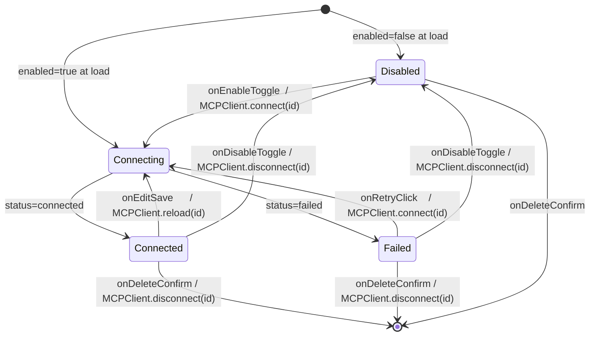
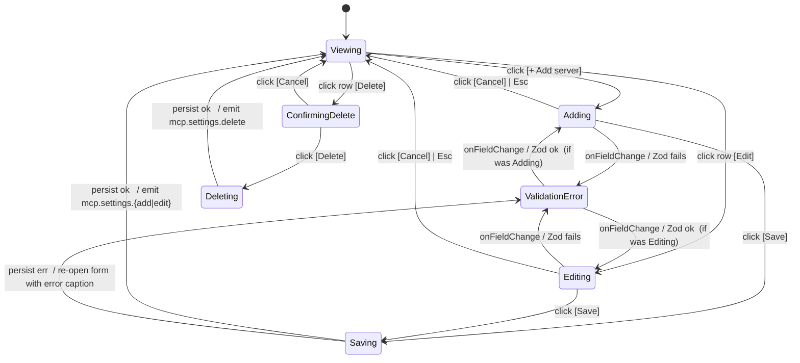

# F55 — MCP Servers settings UI

## Layout

### Wireframe A — Settings → Leo → MCP Servers section (viewing / list)

```
┌──────────────────────────────────────────────────────────────────────────────┐
│ Leo — Settings                                                  [Obsidian]   │
├──────────────────────────────────────────────────────────────────────────────┤
│ ▸ General                                                                    │
│ ▸ Providers                                                                  │
│ ▾ MCP Servers                                       [F03 collapsible host]   │
│   ┌────────────────────────────────────────────────────────────────────────┐ │
│   │ Model Context Protocol servers                                         │ │
│   │ Manage external MCP servers that expose tools / resources / prompts.   │ │
│   │                                                          [+ Add server]│ │
│   ├────────────────────────────────────────────────────────────────────────┤ │
│   │ ● filesystem            stdio     (●) connected     tools 12 · res 3   │ │
│   │   ↳ "node mcp-fs.js"                                 · prompts 0       │ │
│   │   [Edit] [Disable] [Delete]                                            │ │
│   ├────────────────────────────────────────────────────────────────────────┤ │
│   │ ◐ github-mcp           sse       (◐) connecting    tools — · res —    │ │
│   │   ↳ https://mcp.example/sse                          · prompts —       │ │
│   │   [Edit] [Disable] [Delete]                                            │ │
│   ├────────────────────────────────────────────────────────────────────────┤ │
│   │ ⚠ linear-bot           sse       (✖) failed        tools 0  · res 0   │ │
│   │   ↳ https://linear.example/sse                       · prompts 0       │ │
│   │   [Edit] [Disable] [Retry] [Delete]                                    │ │
│   ├────────────────────────────────────────────────────────────────────────┤ │
│   │ ○ local-db             stdio     (○) disabled      tools — · res —    │ │
│   │   ↳ "python db_mcp.py"                               · prompts —       │ │
│   │   [Edit] [Enable]  [Delete]                                            │ │
│   └────────────────────────────────────────────────────────────────────────┘ │
│                                                                              │
│ ▸ Skills                                                                     │
│ ▸ Indexer                                                                    │
└──────────────────────────────────────────────────────────────────────────────┘

Legend / status badges (via F13 iconFor registry, Obsidian CSS vars only):
  (●) connected    — setIcon("plug-zap")     · accent-positive
  (◐) connecting   — setIcon("loader")       · accent-info  (animated spinner)
  (✖) failed       — setIcon("alert-octagon")· accent-warn  ⚠ glyph also shown
  (○) disabled     — setIcon("plug")         · muted
Row anchors: data-server-id, data-transport, data-status (for Vitest asserts).
```

### Wireframe B — Add server form (inline, never a native Modal per FR-UI-08)

```
┌────────────────────────────────────────────────────────────────────────────┐
│ ▾ MCP Servers                                                              │
│   …existing rows…                                                          │
│   ┌──────────────────────────────────────────────────────────────────────┐ │
│   │ + Add MCP server                                              [×]    │ │
│   ├──────────────────────────────────────────────────────────────────────┤ │
│   │ Server id            [ my-server              ]  ← unique, URL-safe  │ │
│   │ Transport            ( ) stdio    (•) sse                            │ │
│   │ Enabled              [x]                                             │ │
│   │ ── stdio fields (hidden when transport=sse) ──                       │ │
│   │ Command              [                        ]  e.g. "node idx.js" │ │
│   │ Args (one per line)  [                        ]                      │ │
│   │                      [                        ]                      │ │
│   │ Env                  ┌────────────────────────┐                      │ │
│   │                      │ KEY      VALUE   secret│                      │ │
│   │                      │ API_KEY  ••••••     [x]│  [-]                 │ │
│   │                      │ DEBUG    1          [ ]│  [-]                 │ │
│   │                      │ [+ Add row]            │                      │ │
│   │                      └────────────────────────┘                      │ │
│   │ ── sse fields (hidden when transport=stdio) ──                       │ │
│   │ URL                  [ https://mcp.example/sse ]                     │ │
│   │ Headers              ┌────────────────────────┐                      │ │
│   │                      │ NAME         VALUE  secret                    │ │
│   │                      │ Authorization ••••••  [x]│ [-]                │ │
│   │                      │ [+ Add row]            │                      │ │
│   │                      └────────────────────────┘                      │ │
│   │ ── validation (live, Zod McpServerConfig) ──                         │ │
│   │  ⚠ id "my server" must be URL-safe (no spaces)    ← inline per-field │ │
│   │                                                                      │ │
│   │                                          [ Cancel ] [ Save ]  ← Save │ │
│   │                                                                disabl│ │
│   │                                                                while │ │
│   │                                                                errors│ │
│   └──────────────────────────────────────────────────────────────────────┘ │
└────────────────────────────────────────────────────────────────────────────┘

Field notes:
  - "Store as secret" checkbox per env / header row opts the value into F38 SafeStorage.
  - Secret cells render `••••••` after save; plaintext is NEVER re-displayed.
  - Zod errors render beneath the offending field, Obsidian accent-warn.
  - Add-server form lives INSIDE the collapsible section; no overlay, no Modal.
```

### Wireframe C — Edit form (id disabled) + Delete inline confirm

```
┌────────────────────────────────────────────────────────────────────────────┐
│   ┌──────────────────────────────────────────────────────────────────────┐ │
│   │ ✎ Edit MCP server — filesystem                                 [×]   │ │
│   ├──────────────────────────────────────────────────────────────────────┤ │
│   │ Server id            [ filesystem           ] (disabled — use Delete│ │
│   │                                                 + re-add to rename) │ │
│   │ Transport            (•) stdio    ( ) sse                            │ │
│   │ …rest same as Add…                                                   │ │
│   │                                          [ Cancel ] [ Save ]          │ │
│   └──────────────────────────────────────────────────────────────────────┘ │
│                                                                            │
│   ┌──────────────────────────────────────────────────────────────────────┐ │
│   │ Delete "linear-bot"?                                           [×]   │ │
│   │ This disconnects the server, unregisters its tools, and removes it   │ │
│   │ from .leo/config.json. Per-thread approvals for mcp.linear-bot.*     │ │
│   │ remain in thread metadata (they simply become unmatchable) and will  │ │
│   │ re-match if you add a server with the same id later.                 │ │
│   │                                            [ Cancel ] [ Delete ]     │ │
│   └──────────────────────────────────────────────────────────────────────┘ │
└────────────────────────────────────────────────────────────────────────────┘

Delete surface reuses F13's inline dialog region — never native Modal per FR-UI-08.
```

## State machine

Two coupled machines: per-server `ServerRowMachine` (observes F51
`ServerRuntime.status` via `MCPClient.onStatusChange`) and section-level
`SettingsFormMachine` (local UI state only; does not own connection lifecycle).

### Per-server row — `ServerRowMachine`



Adjacency-list equivalent (source of truth for Vitest):

- `Disabled     → Connecting`  on `enable.toggle`        / emits `MCPClient.connect(id)`
- `Disabled     → [*]`         on `delete.confirm`       / emits nothing (no runtime)
- `Connecting   → Connected`   on `status.connected`     / emits `row.statusBadge.update`
- `Connecting   → Failed`      on `status.failed`        / emits `row.statusBadge.update` + `mcp.connect.fail` (F51-owned log)
- `Connected    → Connecting`  on `edit.save`            / emits `MCPClient.reload(id)`
- `Connected    → Disabled`    on `disable.toggle`       / emits `MCPClient.disconnect(id)`
- `Connected    → [*]`         on `delete.confirm`       / emits `MCPClient.disconnect(id)` + `ToolRegistry.unregister(mcp.<id>.*)`
- `Failed       → Connecting`  on `retry.click`          / emits `MCPClient.connect(id)`  (Retry visible ONLY in Failed)
- `Failed       → Disabled`    on `disable.toggle`       / emits `MCPClient.disconnect(id)`
- `Failed       → [*]`         on `delete.confirm`       / emits `MCPClient.disconnect(id)` + `ToolRegistry.unregister(mcp.<id>.*)`

Invariants:

- Status transitions are driven by `MCPClient.onStatusChange(id, next)` only; the
  UI never sets status optimistically (prevents drift against F51's truth).
- `[Retry]` is visible iff `state === Failed`; disabled while a prior `connect`
  in-flight has not resolved (guarded by local `pending` flag).
- `[Enable|Disable]` label derives from `enabled` persisted bit in config, NOT from
  live status (a `Failed`+`enabled=true` row still shows `[Disable]`).

### Section form — `SettingsFormMachine`



Adjacency list (invariants below):

- `Viewing → Adding`                    on `add.click`
- `Viewing → Editing(id)`               on `edit.click(id)`               / pre-fills form, disables `id` field
- `Viewing → ConfirmingDelete(id)`      on `delete.click(id)`             / shows inline confirm
- `Adding | Editing → ValidationError`  on `field.change` with Zod fail   / Save disabled
- `ValidationError → Adding | Editing`  on `field.change` with Zod ok     / returns to prior form mode
- `Adding → Saving`                     on `save.click` & Zod ok          / fans out secret persists via F38 then Vault write
- `Editing → Saving`                    on `save.click` & Zod ok          / same, then `MCPClient.reload(id)`
- `Saving → Viewing`                    on `vault.write.ok`               / emits `mcp.settings.{add|edit}`, `mcp.settings.secret.store` per secret field
- `Saving → ValidationError`            on `vault.write.err`              / preserves form state, surfaces caption
- `ConfirmingDelete → Deleting`         on `confirm.click`
- `Deleting → Viewing`                  on `vault.write.ok`               / emits `mcp.settings.delete`, triggers `ToolRegistry.unregister`
- `Adding | Editing → Viewing`          on `cancel.click | Esc`           / discards draft, zero persistence

Invariants:

- `id` field in `Editing` is disabled (preserves `mcp.<id>.*` registry keys for
  F52 `thread.metadata.allowedTools` re-match; users rename via delete + re-add).
- Secret plaintext lives ONLY in `Adding | Editing` form state (React); Save
  moves it through `SafeStorage.set` and the form draft is discarded on
  `Saving → Viewing`, so plaintext never survives past form close.
- No edge writes partial config: `.leo/config.json` is written atomically via
  Vault adapter (code-style Obsidian Plugin Patterns), so `Saving → *` is
  all-or-nothing.

## Event flow

### 1 — Add server

```
[UI] click [+ Add server]           → SettingsFormMachine: Viewing → Adding
[UI] fill fields (live Zod)         → Adding ↔ ValidationError
[UI] click [Save] (Zod ok)          → Adding → Saving
       │
       ├─ for each secret env/header entry:
       │     SafeStorage.set(key, plaintext)    ← F38
       │     log: mcp.settings.secret.store {serverId, field}
       │     draft[field].value := "safestorage:<key>"
       ├─ Vault/VaultAdapter.write(.leo/config.json, merged mcpServers)  ← atomic
       ├─ log: mcp.settings.add {serverId, transport, enabled, durationMs}  ← F01
       └─ MCPClient.connect(serverId)            ← F51 seam (non-blocking)
[UI] Saving → Viewing                (form closes, draft discarded)
[F51] status transitions: connecting → connected | failed
      ServerRowMachine observes via MCPClient.onStatusChange(serverId, next)
      → row badge + tool/res/prompt counts update in-place (no re-mount)
```

### 2 — Edit server

```
[UI] click [Edit]                   → Viewing → Editing (id disabled)
[UI] Save (Zod ok)                  → Editing → Saving
       │
       ├─ resolve secret diff (re-persist changed secrets via SafeStorage.set,
       │     leave unchanged "safestorage:<key>" refs untouched)
       ├─ Vault write .leo/config.json (atomic)
       ├─ log: mcp.settings.edit {serverId, transport, enabled, durationMs}
       └─ MCPClient.reload(serverId)             ← F51 seam
            ├─ disconnect prior ServerRuntime
            └─ reconnect with fresh config
[F51] status: connecting → connected | failed    (row updates in-place)
```

### 3 — Remove server

```
[UI] click [Delete]                 → Viewing → ConfirmingDelete
[UI] click [Delete] in prompt       → ConfirmingDelete → Deleting
       │
       ├─ Vault write .leo/config.json with entry removed (atomic)
       ├─ MCPClient.disconnect(serverId)         ← F51 seam, tears down runtime
       ├─ ToolRegistry.unregister("mcp.<serverId>.*")
       ├─ thread.metadata.allowedTools: LEFT INTACT across threads  (F14)
       │     (unmatchable ids; re-match on same-id re-add, per F52 semantic)
       └─ log: mcp.settings.delete {serverId, transport, durationMs}
[UI] Deleting → Viewing              (row vanishes from list)
```

### 4 — Toggle enabled

```
[UI] click [Enable | Disable]       → no form transition (stays Viewing)
       │
       ├─ Vault write flipping mcpServers[id].enabled  (atomic)
       ├─ log: mcp.settings.toggle {serverId, enabled, durationMs}
       └─ if enabled: MCPClient.connect(serverId)
          if disabled: MCPClient.disconnect(serverId)
[F51] onStatusChange fans out; row badge updates.
```

### 5 — Retry (Failed only)

```
[UI] click [Retry]                  → ServerRowMachine: Failed → Connecting
       │
       ├─ log: mcp.settings.retry {serverId, durationMs}
       └─ MCPClient.connect(serverId)            ← F51 seam
[F51] status: connecting → connected | failed    (row badge updates)
```

F51 reconnect behaviour: every add / edit / toggle-enable / retry funnels
through the SAME `MCPClient.connect(serverId)` / `reload(serverId)` /
`disconnect(serverId)` seams F51 already exposes; this feature never spawns
transports directly. F56's automated exponential-backoff reconnect composes
with manual `[Retry]` via the Open-question seam `cancelReconnect(serverId)`
called before `connect(serverId)` to avoid double-connects.

Log-field invariant (per feature.md AC 7 + code-style Logging): `info` level
and above carry ONLY `{serverId, transport, enabled, field?, durationMs}`;
`command`, `args`, `env`, `headers`, `url` values stay at `debug` or below.

## Component mapping

Every block below is link-only per standards; see
[tech-stack.md](../../../../standards/tech-stack.md) for the authoritative
runtime surface list.

- `McpServersSection.tsx` — React 18 subtree mounted INSIDE F03's
  `PluginSettingTab` collapsible MCP-servers region; no new top-level settings
  surface (one settings tab per NFR-USE-01). Per
  [tech-stack.md — UI Layer](../../../../standards/tech-stack.md#ui-layer).
- Host surface — Obsidian `PluginSettingTab` + `Setting` rows for every field
  (native `Setting.addText`, `Setting.addToggle`, `Setting.addDropdown`,
  `Setting.addButton`). No custom HTML outside `Setting` rows for individual
  fields; form layout is `Setting`-row conventional. Per
  [tech-stack.md — Platform APIs](../../../../standards/tech-stack.md#platform-apis).
- Add/Edit form — INLINE within the section; NEVER a native `Modal` per
  FR-UI-08 (Vitest spy asserts `Modal` constructor is never invoked for this
  feature). Form lifecycle machine drives a local `useReducer`; draft state
  lives in React only until Save.
- Delete confirmation — reuses F13's inline dialog surface; again, never a
  native `Modal`.
- Settings section scaffolding — reuses F03's existing collapsible host and its
  `loadData()` / `saveData()` plumbing for the non-secret mirror; this feature
  adds no new settings-tab top-level section.
- Status badge + icons — `setIcon("plug-zap" | "loader" | "alert-octagon" |
  "plug")` via Obsidian bundled Lucide (F13 `iconFor` registry + F13 visual-state
  palette); NEVER hard-coded colours — Obsidian CSS variables only per
  [code-style — Styling](../../../../standards/code-style.md#styling-tailwind--obsidian).
- Form validation — the SAME Zod `McpServerConfig` schema F51 owns is imported
  once and reused here; per-field errors render inline, Save disabled while
  any error present. Per
  [code-style — Zod & Tool Schemas](../../../../standards/code-style.md#zod--tool-schemas).
- Persistence — `.leo/config.json` written via `Vault` / `VaultAdapter` atomic
  write (NEVER `app.vault.adapter` directly) per
  [code-style — Obsidian Plugin Patterns](../../../../standards/code-style.md#obsidian-plugin-patterns).
  Non-secret mirror + only `"safestorage:<key>"` placeholders stored on disk;
  secret plaintext routes through F38 `SafeStorage.set(key, plaintext)` at
  Save time and is never echoed back into the form after close.
- Live status subscription — `MCPClient.onStatusChange(serverId, cb)` seam on
  top of F51's `ServerRuntime.status` field; registered via
  `Plugin.registerEvent` for auto-disposal on `onunload` per
  [architecture §10 Concurrency & Lifecycle](../../../../architecture/architecture.md#10-concurrency--lifecycle-rules).
- MCP seams consumed — `MCPClient.connect(serverId)` /
  `MCPClient.disconnect(serverId)` / `MCPClient.reload(serverId)` /
  `MCPClient.onStatusChange(serverId, cb)` only; no `@modelcontextprotocol/sdk`
  types leak across this feature. Per
  [tech-stack.md — Agent / Tool / Skill / MCP Wiring](../../../../standards/tech-stack.md#agent--tool--skill--mcp-wiring).
- Tool-registry cleanup — on delete, `ToolRegistry.unregister("mcp.<id>.*")`
  removes every namespaced tool row; `thread.metadata.allowedTools` in F14 is
  NOT mutated (cross-thread re-match recovery per F52 semantic).
- Logging — every `mcp.settings.*` event emitted via F01 `Logger` with
  `{serverId, transport, enabled, field?, durationMs}` shape; `command`,
  `args`, `env`, `headers`, `url` values stay at `debug` or below per
  [code-style — Logging](../../../../standards/code-style.md#logging).
- Error handling — failed `MCPClient.connect` surfaces via the row's status
  badge + optional `Notice`; never silently swallowed per
  [code-style — Error Handling](../../../../standards/code-style.md#error-handling).
- A11y — every action button carries `aria-label` (`Edit <id>`,
  `Enable <id>` / `Disable <id>`, `Retry <id>`, `Delete <id>`); status badge
  uses both icon + textual label for WCAG 1.4.1 (never colour-only); form
  inputs use `Setting`-row native labels so Obsidian's focus ring applies
  unchanged; Esc dismisses Add / Edit / Confirm-delete inline forms.
- Testing — Vitest + `msw` over in-memory `VaultAdapter` + mocked `MCPClient`
  + mocked `SafeStorage`: asserts `.leo/config.json` byte-shape matches F51's
  Zod schema, `SafeStorage.set` is called for every secret field,
  `onStatusChange` triggers row re-render, plaintext-sniff over the written
  file (no secret plaintext ever hits disk), `Modal` constructor never invoked
  for this feature, and `ToolRegistry.unregister` fires on delete. Per
  [tech-stack.md — Testing](../../../../standards/tech-stack.md#testing) and
  [code-style — Testing (Vitest + msw)](../../../../standards/code-style.md#testing-vitest--msw).

Forbidden (Vitest-enforced):

- no native Obsidian `Modal` anywhere in this feature (FR-UI-08),
- no plaintext secret in `.leo/config.json` (NFR-DATA-04),
- no second top-level settings surface (NFR-USE-01),
- no `command` / `args` / `env` / `headers` / `url` values in logs above
  `debug` (NFR-LOG-04, NFR-DATA-04),
- no direct `app.vault.adapter` access for config reads/writes.

## Back-link

[← feature.md](./feature.md)
