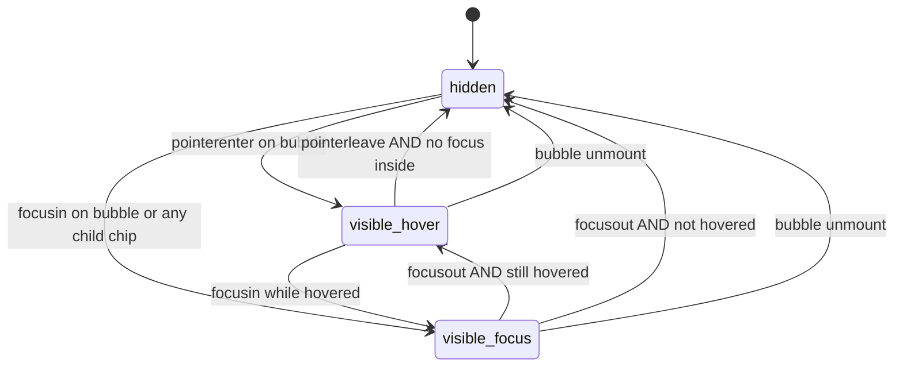

# F15 — Per-message actions · UI

## Layout

### Wireframe 1 — Assistant bubble, action bar on hover (width >= 280 px)

```
 0        10        20        30        40        50
 |---------|---------|---------|---------|---------|    min-width marker: 280 px
+--------------------------------------------------+
| +----------------------------------------------+ |
| | assistant  2026-04-19 09:12                  | |    <- assistant bubble
| |                                               | |       role="listitem"
| |  ## Highlights                                | |       MarkdownRenderer subtree
| |   - shipped F01 logging                       | |       (from F05)
| |   - drafted F04 view shell                    | |
| |                                               | |
| |                        [copy][repeat][trash]  | |    <- MessageActionBar
| +----------------------------------------------+ |       visible on hover/focus
|                                                   |       aligned bottom-right
+--------------------------------------------------+

bubble state: hover OR any child focused     --> action bar visible
bubble state: neither hovered nor focused   --> action bar hidden (display:none)

chip spec (each):  <button type="button" aria-label="…" tabIndex=0>
                      setIcon(glyph)
                   </button>
  copy       : setIcon("copy")          aria-label="Copy message"
  regenerate : setIcon("repeat")        aria-label="Regenerate response"
  delete     : setIcon("trash")         aria-label="Delete message"
```

Bar is a sibling of the `MarkdownRenderer` container injected by [F05](../chat-message-list-markdown/feature.md); it never overlaps content — the bubble grows a reserved trailing row on hover/focus only. Chip glyphs are painted through [`setIcon`](../../../../standards/tech-stack.md#platform-apis); surface / border / focus ring resolve from Obsidian CSS variables only ([Code style -> Styling (Tailwind + Obsidian)](../../../../standards/code-style.md#styling-tailwind--obsidian)).

### Wireframe 2 — User bubble, action bar on hover

```
 0        10        20        30        40        50
 |---------|---------|---------|---------|---------|
+--------------------------------------------------+
|         +------------------------------------+   |
|         | user  2026-04-19 09:11              |   |    <- user bubble
|         |                                     |   |       role="listitem"
|         | summarise the weekly notes please   |   |       align=end
|         |                                     |   |
|         |              [copy][pencil][trash]  |   |    <- MessageActionBar
|         +------------------------------------+   |       visible on hover/focus
+--------------------------------------------------+

chip spec (each):  <button type="button" aria-label="…" tabIndex=0>
                      setIcon(glyph)
                   </button>
  copy           : setIcon("copy")    aria-label="Copy message"
  edit-and-resend: setIcon("pencil")  aria-label="Edit and resend"
  delete         : setIcon("trash")   aria-label="Delete message"
```

User bubbles reuse the same `MessageActionBar` component — only the middle chip differs per role ([Code style -> React 18](../../../../standards/code-style.md#react-18)). No assistant bubble ever renders the pencil chip (role guard), per AC4 of the feature spec.

### Wireframe 3 — User bubble in edit mode (inline textarea)

```
 0        10        20        30        40        50
 |---------|---------|---------|---------|---------|
+--------------------------------------------------+
|         +------------------------------------+   |
|         | user  2026-04-19 09:11 · editing    |   |   <- status line in bubble
|         | +--------------------------------+  |   |
|         | | summarise the weekly notes and |  |   |   <- inline textarea
|         | | include Friday's retro please  |  |   |      reused from ComposerInput (F06)
|         | | |cursor                        |  |   |      autosize, 1..N rows
|         | +--------------------------------+  |   |
|         |                                     |   |
|         |                   [ Cancel ][ Save ] |   |   <- action row (replaces bar)
|         +------------------------------------+   |
+--------------------------------------------------+

Save button: <button type="button" aria-label="Save and resend">
             primary accent, Enter-activated when textarea focused and content non-empty
Cancel button: <button type="button" aria-label="Cancel edit">
             Esc-activated anywhere inside the bubble subtree

keyboard:
  Tab / Shift-Tab inside the textarea stays in the textarea (default browser)
  Tab out of textarea -> Cancel -> Save -> (exits bubble)
  Esc on any focused node inside the bubble -> Cancel
```

Textarea is the `ComposerInput` textarea from [F06](../chat-composer-input/feature.md) mounted in "inline" mode (no send button, no queue indicator); autosize, keybinding precedence, and reduced-motion handling are inherited verbatim ([UI Layer -> Framework](../../../../standards/tech-stack.md#ui-layer)).

### Wireframe 4 — Keyboard-focused action chip with visible focus ring

```
 0        10        20        30        40        50
 |---------|---------|---------|---------|---------|
+--------------------------------------------------+
| +----------------------------------------------+ |
| | assistant  2026-04-19 09:12                  | |
| |                                               | |
| |  answer text...                               | |
| |                                               | |
| |                       [copy]{repeat}[trash]   | |   <- {…} = focus ring via
| +----------------------------------------------+ |      box-shadow 0 0 0 2px
|                                                   |      var(--interactive-accent)
+--------------------------------------------------+

focus source: Tab stepping into the bar
bar visibility: focus-within --> visible (remains visible while any chip focused)
chip focus: native <button>:focus-visible
tab order (assistant): bubble -> copy -> regenerate -> delete -> (exits bubble)
tab order (user):      bubble -> copy -> pencil     -> delete -> (exits bubble)

reduced-motion: prefers-reduced-motion: reduce
  -> action bar has no fade-in transition; shown instantly on hover/focus-within
```

Focus ring is drawn exclusively through `var(--interactive-accent)` on `:focus-visible`; no colour literals. Keyboard reachability and Tab order are asserted by the Vitest suite listed in feature.md ([Code style -> Styling (Tailwind + Obsidian)](../../../../standards/code-style.md#styling-tailwind--obsidian); [Code style -> React 18](../../../../standards/code-style.md#react-18)).

## State machine

Two machines run per bubble.

### `ActionBarVisibilityMachine` (per bubble)



Invariants:
- `visible_*` states are derived from `:hover` and `:focus-within` CSS selectors — no stateful JS is required for the visibility, matching the zero-JS hover pattern allowed by [Code style -> Styling (Tailwind + Obsidian)](../../../../standards/code-style.md#styling-tailwind--obsidian).
- The bar never takes focus itself on hover — focus only arrives on Tab, so it never steals focus from the composer ([Architecture §3.1](../../../../architecture/architecture.md#31-ui-layer-react-mounted-inside-obsidian-views)).
- Unmount path runs through effect cleanup per [Architecture §10](../../../../architecture/architecture.md#10-concurrency--lifecycle-rules).

### `EditModeMachine` (per user message)

```mermaid
stateDiagram-v2
    [*] --> view
    view --> editing: click pencil / Enter on pencil
    editing --> saving: Save click / Enter on Save
    editing --> view: Cancel click / Esc (original text restored)
    saving --> view: ConversationStore.mutate resolved + new turn enqueued
    saving --> editing: ConversationStore.mutate rejected (Notice "Edit failed")
    view --> [*]: bubble unmount
    editing --> [*]: bubble unmount (edits discarded)
    saving --> [*]: bubble unmount (best-effort; mutate result ignored)
```



Invariants:
- `editing` owns a draft string in React state separate from the thread model; Cancel reverts by dropping the draft without mutating the store ([Code style -> React 18](../../../../standards/code-style.md#react-18)).
- `saving` is a single-shot transition — Save is disabled while in `saving` to prevent double-submit.
- Assistant bubbles never enter `editing`; the role guard is asserted in unit tests ([Code style -> Testing (Vitest + msw)](../../../../standards/code-style.md#testing-vitest--msw)).

## Event flow

### 1. Hover / focus reveals the action bar

1. User moves pointer over an assistant or user bubble, OR Tab steps into any chip inside it.
2. CSS selectors `.leo-bubble:hover .leo-action-bar`, `.leo-bubble:focus-within .leo-action-bar` resolve to `display: flex` (from `display: none`).
3. Reduced-motion guard: the fade transition is wrapped in `@media (prefers-reduced-motion: no-preference)` — reduced-motion users see the bar appear instantly ([Code style -> Styling (Tailwind + Obsidian)](../../../../standards/code-style.md#styling-tailwind--obsidian)).
4. `role="listitem"` bubble remains in its [F05](../chat-message-list-markdown/feature.md) lifecycle state — the bar does not participate in the `MessageLifecycleMachine`.

### 2. Copy action (both roles)

1. User clicks a `[copy]` chip OR Tabs to it and presses Enter/Space ([Code style -> Obsidian Plugin Patterns](../../../../standards/code-style.md#obsidian-plugin-patterns)).
2. Handler reads the raw message text from the thread model (NOT from rendered DOM — to avoid markdown decoration text) and calls `navigator.clipboard.writeText(text)` ([Platform APIs](../../../../standards/tech-stack.md#platform-apis)).
3. On resolve: fires [`new Notice("Copied to clipboard")`](../../../../standards/tech-stack.md#platform-apis).
4. On reject: fires `new Notice("Copy failed")` — soft failure, no throw ([Code style -> Obsidian Plugin Patterns](../../../../standards/code-style.md#obsidian-plugin-patterns)).

### 3. Regenerate action (assistant only)

1. User clicks `[repeat]` on an assistant bubble OR Tabs to it and presses Enter/Space.
2. Handler calls `ConversationStore.mutate(threadId, draft => draft.removeAssistantTurn(messageId))` from [F14](../conversation-persistence-v1/feature.md).
3. On resolve, handler dispatches a new turn against the preceding user message through the [`AgentRunner`](../../../../architecture/architecture.md#32-agent-layer) entry point ([Architecture §5.2](../../../../architecture/architecture.md#52-chat-turn-no-tools)).
4. The deleted assistant bubble unmounts; a `pending` assistant bubble appears as the new turn streams ([F07 chat-streaming-stop](../chat-streaming-stop/feature.md) governs the stream UI).
5. No duplication: the old assistant message is replaced, not appended (AC3 of feature.md).

### 4. Edit-and-resend action (user only)

1. User clicks `[pencil]` on a user bubble OR Tabs to it and presses Enter/Space.
2. `EditModeMachine` transitions `view -> editing`; the bubble swaps its text node for a textarea reused from the [F06 composer](../chat-composer-input/feature.md); draft = current text; focus moves into the textarea.
3. User edits the draft. Tab escapes the textarea to Cancel, Shift-Tab returns; Esc cancels from any focused node inside the bubble subtree.
4. User presses Save (or Enter while textarea focused and non-empty).
5. Machine transitions `editing -> saving`. Handler calls `ConversationStore.mutate(threadId, draft => draft.truncateAt(messageId).appendUserTurn(newText))` from [F14](../conversation-persistence-v1/feature.md), then dispatches a fresh turn via `AgentRunner` ([Architecture §5.2](../../../../architecture/architecture.md#52-chat-turn-no-tools)).
6. On resolve: machine transitions `saving -> view`; bubble now shows the edited text; a new assistant turn streams beneath it.
7. On reject: machine returns `saving -> editing`; `new Notice("Edit failed")` is fired; draft remains in the textarea ([Code style -> Obsidian Plugin Patterns](../../../../standards/code-style.md#obsidian-plugin-patterns)).
8. Cancel path: machine transitions `editing -> view`; draft discarded; original text restored byte-for-byte (AC4 of feature.md).

### 5. Delete action (both roles)

1. User clicks `[trash]` on any bubble OR Tabs to it and presses Enter/Space.
2. Handler immediately calls `ConversationStore.mutate(threadId, draft => draft.deleteMessage(messageId))` from [F14](../conversation-persistence-v1/feature.md); on user-message delete the mutation also removes contiguous assistant/tool messages in the same turn chain (AC5 of feature.md).
3. [`new Notice("Message deleted · Undo", 5000)`](../../../../standards/tech-stack.md#platform-apis) is fired — the Notice body contains an "Undo" action chip; the deleted snapshot is held in memory for the 5s Notice window.
4. On Undo click within the 5s window: handler calls `ConversationStore.mutate(threadId, draft => draft.restoreSnapshot(snapshot))` and the removed bubble(s) re-mount.
5. On timeout (5000 ms) or dismiss: the snapshot reference is dropped — the delete is now permanent on disk ([F14](../conversation-persistence-v1/feature.md) debounced atomic write has already flushed).

### 6. Teardown (unmount, thread switch, plugin unload)

1. React cleanup runs on every bubble and every action-bar effect.
2. Click listeners on chips and on the inline textarea are removed via `useEffect` return or `Plugin.registerDomEvent` pairing ([Architecture §10](../../../../architecture/architecture.md#10-concurrency--lifecycle-rules)).
3. Pending Undo snapshot references are dropped on `ChatView.onClose`.
4. `EditModeMachine` in-flight `saving` mutations are not awaited — the store flush is decoupled from the view.
5. No dangling listeners, timers, or DOM nodes remain ([Code style -> React 18](../../../../standards/code-style.md#react-18)).

## Component mapping

| UI block | Component / API | Standards reference |
|---|---|---|
| `MessageActionBar` container | React `<div role="toolbar" aria-label="Message actions">` mounted as a sibling of the bubble body from [F05](../chat-message-list-markdown/feature.md) | [Architecture §3.1](../../../../architecture/architecture.md#31-ui-layer-react-mounted-inside-obsidian-views) |
| Copy chip (both roles) | `<button type="button" aria-label="Copy message">` + [`setIcon(el, "copy")`](../../../../standards/tech-stack.md#platform-apis) | [UI Layer -> Icons](../../../../standards/tech-stack.md#ui-layer) |
| Regenerate chip (assistant) | `<button type="button" aria-label="Regenerate response">` + [`setIcon(el, "repeat")`](../../../../standards/tech-stack.md#platform-apis) | [UI Layer -> Icons](../../../../standards/tech-stack.md#ui-layer) |
| Edit-and-resend chip (user) | `<button type="button" aria-label="Edit and resend">` + [`setIcon(el, "pencil")`](../../../../standards/tech-stack.md#platform-apis) | [UI Layer -> Icons](../../../../standards/tech-stack.md#ui-layer) |
| Delete chip (both roles) | `<button type="button" aria-label="Delete message">` + [`setIcon(el, "trash")`](../../../../standards/tech-stack.md#platform-apis) | [UI Layer -> Icons](../../../../standards/tech-stack.md#ui-layer) |
| Visibility mechanism | CSS `:hover` + `:focus-within` on `.leo-bubble` toggling `.leo-action-bar` `display` — no JS | [Code style -> Styling (Tailwind + Obsidian)](../../../../standards/code-style.md#styling-tailwind--obsidian) |
| Focus ring | `:focus-visible { box-shadow: 0 0 0 2px var(--interactive-accent); outline: none; }` on each chip — zero colour literals | [UI Layer -> Styling](../../../../standards/tech-stack.md#ui-layer); [Code style -> Styling (Tailwind + Obsidian)](../../../../standards/code-style.md#styling-tailwind--obsidian) |
| Inline edit textarea | `HTMLTextAreaElement` reused from [F06 composer](../chat-composer-input/feature.md) in "inline" mode (no send button, no queue indicator) — autosize, keybindings, reduced-motion inherited | [UI Layer -> Framework](../../../../standards/tech-stack.md#ui-layer); [Architecture §3.1](../../../../architecture/architecture.md#31-ui-layer-react-mounted-inside-obsidian-views) |
| Save button | `<button type="button" aria-label="Save and resend">` — primary accent, `Enter` activates while textarea focused and non-empty | [Code style -> Obsidian Plugin Patterns](../../../../standards/code-style.md#obsidian-plugin-patterns) |
| Cancel button | `<button type="button" aria-label="Cancel edit">` — `Esc` activates from any focused node in the bubble subtree | [Code style -> Obsidian Plugin Patterns](../../../../standards/code-style.md#obsidian-plugin-patterns) |
| Clipboard write | `navigator.clipboard.writeText(rawText)` (thread-model text, not DOM text) | [Platform APIs](../../../../standards/tech-stack.md#platform-apis) |
| Copy success feedback | [`new Notice("Copied to clipboard")`](../../../../standards/tech-stack.md#platform-apis) | [Code style -> Obsidian Plugin Patterns](../../../../standards/code-style.md#obsidian-plugin-patterns) |
| Copy failure feedback | [`new Notice("Copy failed")`](../../../../standards/tech-stack.md#platform-apis) — soft failure | [Code style -> Obsidian Plugin Patterns](../../../../standards/code-style.md#obsidian-plugin-patterns) |
| Delete + Undo feedback | [`new Notice("Message deleted · Undo", 5000)`](../../../../standards/tech-stack.md#platform-apis) with an Undo action chip inside the Notice body; snapshot held in memory for the window | [Platform APIs -> `Notice`](../../../../standards/tech-stack.md#platform-apis); [Code style -> Obsidian Plugin Patterns](../../../../standards/code-style.md#obsidian-plugin-patterns) |
| Edit failure feedback | [`new Notice("Edit failed")`](../../../../standards/tech-stack.md#platform-apis) — draft preserved, machine returns to `editing` | [Code style -> Obsidian Plugin Patterns](../../../../standards/code-style.md#obsidian-plugin-patterns) |
| Persistence call | `ConversationStore.mutate(threadId, fn)` from [F14](../conversation-persistence-v1/feature.md) for regenerate / edit-and-resend / delete / undo | [Architecture §6 State Ownership](../../../../architecture/architecture.md#6-state-ownership) |
| Turn dispatch on regenerate / edit-and-resend | `AgentRunner` entry point from [Architecture §3.2](../../../../architecture/architecture.md#32-agent-layer) re-entering the [chat turn path](../../../../architecture/architecture.md#52-chat-turn-no-tools) | [Architecture §3.2](../../../../architecture/architecture.md#32-agent-layer); [Architecture §5.2](../../../../architecture/architecture.md#52-chat-turn-no-tools) |
| Keyboard reachability | Every chip is a real `<button>` in DOM order; Tab / Shift-Tab traverses copy -> (repeat OR pencil) -> trash; Enter / Space activates | [Code style -> Obsidian Plugin Patterns](../../../../standards/code-style.md#obsidian-plugin-patterns) |
| Reduced-motion handling | `@media (prefers-reduced-motion: reduce)` drops the fade-in transition on the action bar; state machines unchanged | [Code style -> Styling (Tailwind + Obsidian)](../../../../standards/code-style.md#styling-tailwind--obsidian) |
| React mount / unmount symmetry | `useEffect` return clears click listeners; `Plugin.registerDomEvent` pairings tracked via the owning Component; Undo snapshots dropped on `ChatView.onClose` | [Architecture §10](../../../../architecture/architecture.md#10-concurrency--lifecycle-rules); [Code style -> React 18](../../../../standards/code-style.md#react-18) |
| Unit tests (role visibility matrix, copy click, regenerate dispatch, edit-and-resend truncate + enqueue, delete cascade, persistence call, keyboard reachability) | Vitest + jsdom | [Testing -> Unit](../../../../standards/tech-stack.md#testing); [Code style -> Testing (Vitest + msw)](../../../../standards/code-style.md#testing-vitest--msw) |

Accessibility invariants ([Architecture §3.1](../../../../architecture/architecture.md#31-ui-layer-react-mounted-inside-obsidian-views)):

- Every chip is Tab-reachable in DOM order, activates on Enter and Space, and renders a visible focus ring using `var(--interactive-accent)`.
- Role guards: assistant bubbles never render the pencil chip; user bubbles never render the repeat chip. Asserted in the Vitest role-visibility matrix.
- Esc cancels the inline editor from any focused node inside the bubble subtree; its precedence runs above the composer Esc per [F06](../chat-composer-input/feature.md) precedence rules.
- `role="toolbar"` on the bar groups the chips for screen readers without stealing focus — chips carry their own `aria-label` strings.
- Status never carries by colour alone: copy success is both a glyph swap (deferred to `MessageList` copy) and a `Notice`; delete is a bubble-removal plus a `Notice` with Undo.
- `prefers-reduced-motion: reduce` suppresses the action-bar fade-in and any inline-editor slide; every state machine still fires.
- No hardcoded colours anywhere — a style audit asserts zero colour literals in `MessageActionBar` styles ([Code style -> Styling (Tailwind + Obsidian)](../../../../standards/code-style.md#styling-tailwind--obsidian)).

## Back-link

[<- feature.md](./feature.md)
