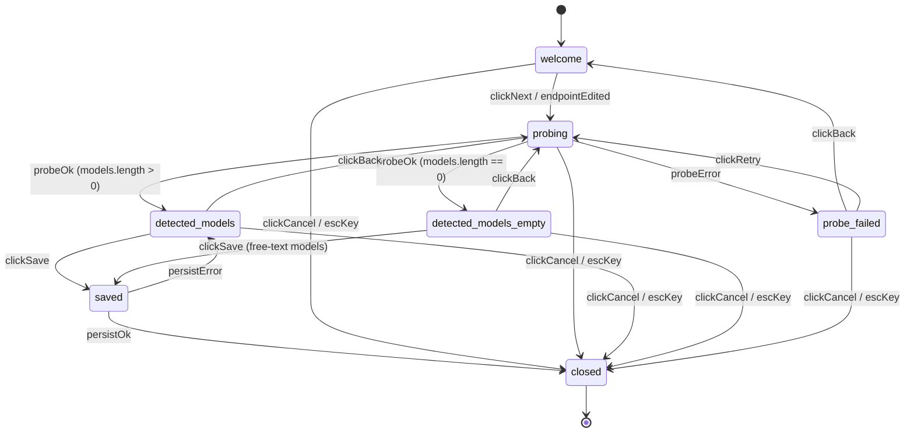
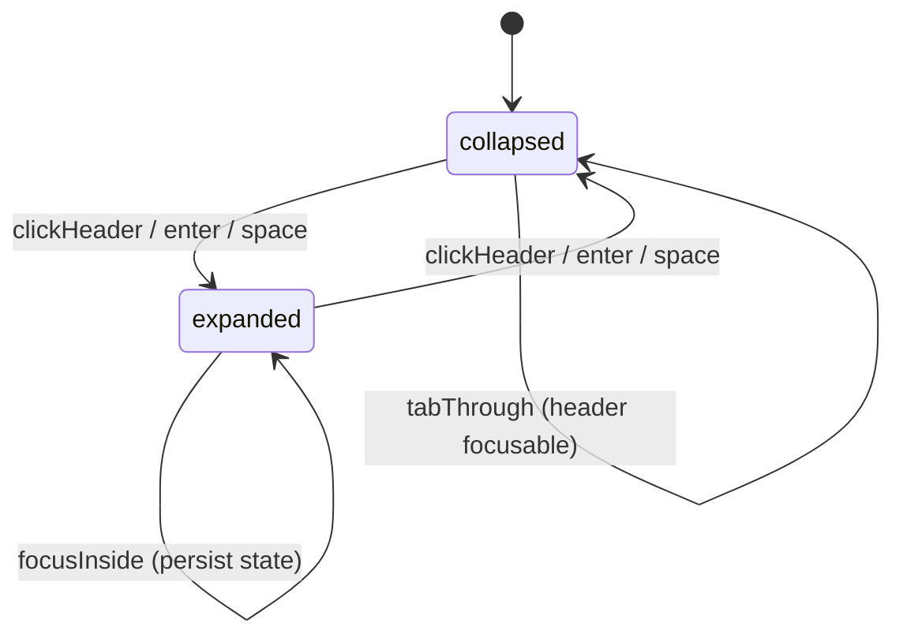

# F03 — Settings tab scaffold & first-run wizard · UI

## Layout

### Wireframe 1 — Settings tab, welcome / first-run empty state (Provider section expanded)

```
 0        10        20        30        40        50        60        70        80
 |---------|---------|---------|---------|---------|---------|---------|---------|
+------------------------------------------------------------------------------+
| Obsidian Settings                                                        [x] |
+----------------+-------------------------------------------------------------+
| Core plugins   | Leo                                                         |
| Community ...  |-------------------------------------------------------------|
| Hotkeys        |                                                             |
| > Leo          | [v] Provider                                  (collapse)    |
|   ...          |  +--------------------------------------------------------+ |
|                |  |  Welcome to Leo                                        | |
|                |  |                                                        | |
|                |  |  Leo needs a local model endpoint to run.              | |
|                |  |  Start LM Studio, load a chat model,                   | |
|                |  |  then finish setup below.                              | |
|                |  |                                                        | |
|                |  |  [  Configure LM Studio  ]   (primary CTA)             | |
|                |  |                                                        | |
|                |  +--------------------------------------------------------+ |
|                |                                                             |
|                | [>] Indexing                                  (expand)      |
|                | [>] Skills                                    (expand)      |
|                | [>] MCP Servers                               (expand)      |
|                | [>] Plan / Todos                              (expand)      |
|                | [>] Appearance                                (expand)      |
|                | [>] Advanced                                  (expand)      |
|                |                                                             |
+----------------+-------------------------------------------------------------+
```

### Wireframe 2 — Settings tab, returning user (Provider populated, all sections collapsed by default except Provider)

```
 0        10        20        30        40        50        60        70        80
 |---------|---------|---------|---------|---------|---------|---------|---------|
+------------------------------------------------------------------------------+
| Obsidian Settings                                                        [x] |
+----------------+-------------------------------------------------------------+
| > Leo          | Leo                                                         |
|                |-------------------------------------------------------------|
|                | [v] Provider                                  (collapse)    |
|                |                                                             |
|                |   Endpoint URL                                              |
|                |   [ http://localhost:1234/v1                              ] |
|                |                                                             |
|                |   Chat model                                                |
|                |   [ qwen2.5-7b-instruct                              v   ]  |
|                |                                                             |
|                |   Embedding model                                           |
|                |   [ nomic-embed-text-v1.5                            v   ]  |
|                |                                                             |
|                |   Temperature                  [====o-----------]  0.7      |
|                |   Max tokens                   [ 2048                     ] |
|                |                                                             |
|                |   Status: connected · 14 models                             |
|                |   [ Re-probe endpoint ]                                     |
|                |                                                             |
|                | [>] Indexing                                  (expand)      |
|                | [>] Skills                                    (expand)      |
|                | [>] MCP Servers                               (expand)      |
|                | [>] Plan / Todos                              (expand)      |
|                | [>] Appearance                                (expand)      |
|                | [>] Advanced                                  (expand)      |
|                |                                                             |
+----------------+-------------------------------------------------------------+
```

### Wireframe 3 — First-run wizard modal (single modal, numbered steps)

```
 0        10        20        30        40        50        60        70
 |---------|---------|---------|---------|---------|---------|---------|
+--------------------------------------------------------------------+
|  Configure LM Studio                                           [x] |
+--------------------------------------------------------------------+
|                                                                    |
|   Step  (1) Endpoint   (2) Probe   (3) Models   (4) Save           |
|                                                                    |
|  -- Step 1 · Endpoint --------------------------------------- ---  |
|   Enter the LM Studio OpenAI-compatible URL.                       |
|                                                                    |
|   [ http://localhost:1234/v1                                  ]    |
|                                                                    |
|   Tip: start LM Studio > Developer > Start Server.                 |
|                                                                    |
|                                                                    |
|                         [ Cancel ]   [ Next: Probe ->  ]  (primary)|
+--------------------------------------------------------------------+
```

```
+--------------------------------------------------------------------+
|  Configure LM Studio                                           [x] |
+--------------------------------------------------------------------+
|   Step  (1) Endpoint   (2) Probe *  (3) Models   (4) Save          |
|                                                                    |
|  -- Step 2 · Probe -----------------------------------------  ---  |
|                                                                    |
|    o  Contacting http://localhost:1234/v1/models ...               |
|       [====================o---------------------------]           |
|                                                                    |
|   (on failure)                                                     |
|    !  Could not reach endpoint.                                    |
|       ECONNREFUSED 127.0.0.1:1234                                  |
|       [ Back: edit endpoint ]   [ Retry ]                          |
|                                                                    |
|                         [ Cancel ]   [ Next ]  (disabled until ok) |
+--------------------------------------------------------------------+
```

```
+--------------------------------------------------------------------+
|  Configure LM Studio                                           [x] |
+--------------------------------------------------------------------+
|   Step  (1) Endpoint   (2) Probe   (3) Models *  (4) Save          |
|                                                                    |
|  -- Step 3 · Pick models -----------------------------------  ---  |
|                                                                    |
|   Chat model                                                       |
|   [ qwen2.5-7b-instruct                                    v ]     |
|                                                                    |
|   Embedding model                                                  |
|   [ nomic-embed-text-v1.5                                  v ]     |
|                                                                    |
|   (picker degrades to free-text input if /v1/models is empty)      |
|                                                                    |
|                         [ Cancel ]   [ <- Back ]  [ Next: Save ]   |
+--------------------------------------------------------------------+
```

```
+--------------------------------------------------------------------+
|  Configure LM Studio                                           [x] |
+--------------------------------------------------------------------+
|   Step  (1) Endpoint   (2) Probe   (3) Models   (4) Save *         |
|                                                                    |
|  -- Step 4 · Save ------------------------------------------  ---  |
|                                                                    |
|   Endpoint   http://localhost:1234/v1                              |
|   Chat       qwen2.5-7b-instruct                                   |
|   Embedding  nomic-embed-text-v1.5                                 |
|                                                                    |
|   [x] Mark first-run complete                                      |
|                                                                    |
|                         [ Cancel ]   [ <- Back ]  [ Save & Close ] |
+--------------------------------------------------------------------+
```

Width markers (top of each wireframe) help verify fit in the stock Obsidian settings pane. Section toggles `[v]` (expanded) and `[>]` (collapsed) are rendered via [`setIcon`](../../../../standards/tech-stack.md#platform-apis) (Lucide chevron), matching Obsidian's native collapsible groups.

## State machine

Two machines run side-by-side: the first-run `WizardMachine` (modal), and one `SectionMachine` per settings section (collapsible).





Cancel / Esc in any wizard state persists partial progress (endpoint text, if any) to plugin data and closes the modal without clearing the first-run flag. The first-run flag only flips false on `saved → closed` via `persistOk`.

## Event flow

**First-time open of Leo settings (fresh install, no plugin data).**

1. User opens Obsidian Settings -> Leo.
2. `SettingsTab.display()` runs; reads plugin data via [`loadData()`](../../../../standards/tech-stack.md#platform-apis); `firstRunComplete` flag is absent.
3. Provider section is rendered expanded; all other sections collapsed; welcome panel inlined into Provider section body.
4. Welcome panel auto-focuses the "Configure LM Studio" CTA (Tab-reachable, `aria-label` matches button text).
5. User presses Enter or clicks CTA -> `SettingsTab` instantiates `WizardModal` (an Obsidian [`Modal`](../../../../standards/tech-stack.md#platform-apis)) and calls `.open()`; `WizardMachine` enters `welcome`.
6. Modal's focus trap activates; Tab cycles inside step 1 controls; Esc mapped to Cancel.
7. User edits the endpoint field (pre-filled with `http://localhost:1234/v1`); value held in local React state.
8. User clicks "Next: Probe" -> `WizardMachine` transitions `welcome -> probing`; step 1 fields become read-only; probe spinner shown.
9. Wizard calls `Provider.listModels()` (F02). On success -> `probing -> detected_models`; response cached in machine context.
10. Step 3 renders two `<select>` pickers populated from the cached list; defaults pre-selected (largest non-embedding for chat; any `embed`-named for embedding). If the list is empty -> `probing -> detected_models_empty`; pickers degrade to free-text inputs.
11. User picks models, clicks "Next: Save" -> step 4 summary.
12. User clicks "Save & Close" -> `detected_models -> saved`; wizard calls the settings store layer which writes `{ endpoint, chatModel, embeddingModel, firstRunComplete: true }` via [`saveData()`](../../../../standards/tech-stack.md#platform-apis).
13. On `persistOk` -> `saved -> closed`; `WizardModal.close()`; a [`Notice`](../../../../standards/tech-stack.md#platform-apis) reading "Leo configured." is shown.
14. `SettingsTab.display()` re-runs (settings tab is still mounted); Provider section now renders the populated live fields from Wireframe 2; welcome panel is gone.
15. Subsequent openings of Leo settings skip step 3–5 entirely because `firstRunComplete === true`; user lands on Wireframe 2.

**Section expand/collapse.**

1. User presses Tab until a section header has focus (headers are `role="button"` with `aria-expanded`).
2. User presses Enter or Space -> `SectionMachine` flips; a re-render is scheduled.
3. New `expandedSections` map is written to plugin data via the settings store layer; no animation runs when `prefers-reduced-motion: reduce` is set (chevron swaps instantly via `setIcon`).

## Component mapping

| UI block | Obsidian / React component | Standards reference |
|---|---|---|
| Whole settings tab container | Obsidian `PluginSettingTab` subclass `SettingsTab` | [Platform APIs -> `PluginSettingTab`](../../../../standards/tech-stack.md#platform-apis) |
| Each field row (endpoint URL, chat model, embedding model, temperature, max tokens) | Obsidian `Setting` builder (`.setName().setDesc().addText()/.addDropdown()/.addSlider()`) | [Platform APIs](../../../../standards/tech-stack.md#platform-apis) |
| Section headers (collapsible Provider / Indexing / Skills / MCP / Plan-Todos / Appearance / Advanced) | `Setting` with `.setHeading()` + chevron icon via `setIcon` + `aria-expanded` / `role=button` | [Platform APIs -> `setIcon`](../../../../standards/tech-stack.md#platform-apis) |
| Welcome empty-state panel ("Configure LM Studio" CTA) | Plain Obsidian DOM nodes (`containerEl.createDiv` + `createEl("button", { cls: "mod-cta" })`) inside Provider section | [Platform APIs -> `PluginSettingTab`](../../../../standards/tech-stack.md#platform-apis); [UI Layer -> Styling](../../../../standards/tech-stack.md#ui-layer) |
| First-run wizard modal shell (overlay, focus trap, Esc to cancel) | Obsidian `Modal` subclass `WizardModal` | [Platform APIs -> `Modal`](../../../../standards/tech-stack.md#platform-apis) (aliased as "`Notice` + `addStatusBarItem`" row / `PluginSettingTab` row covers modal stack) |
| Wizard step bodies (stepper, endpoint form, probe progress, model pickers, summary) | React 18 component tree mounted into modal `contentEl` via `createRoot` | [UI Layer -> Framework](../../../../standards/tech-stack.md#ui-layer) |
| Wizard step-transition state | React local state + reducer in `WizardMachine` hook | [UI Layer -> Framework](../../../../standards/tech-stack.md#ui-layer) |
| Model dropdown in wizard and Provider section | Native `<select>` inside React component (degrades to `<input type="text">` when list empty); icons via `lucide-react` | [UI Layer -> Icons](../../../../standards/tech-stack.md#ui-layer) |
| Toast on save success / probe failure | Obsidian `Notice` | [Platform APIs -> `Notice`](../../../../standards/tech-stack.md#platform-apis) |
| Chevron icons on section headers | `setIcon(el, "chevron-right" \| "chevron-down")` | [Platform APIs -> `setIcon`](../../../../standards/tech-stack.md#platform-apis) |
| Commands registered so rebinding works from Obsidian Hotkeys UI | `Plugin.addCommand()` through a shared `registerCommand` helper; no hardcoded default hotkeys | [Platform APIs -> `Plugin`](../../../../standards/tech-stack.md#platform-apis) |
| Optional ribbon entry for "Open Leo settings" | `Plugin.addRibbonIcon()` routed through the same registry (read-through so user can hide via Obsidian's native ribbon toggle) | [Platform APIs -> `Plugin`](../../../../standards/tech-stack.md#platform-apis) |
| Settings persistence for fields + `expandedSections` + `firstRunComplete` | `this.plugin.loadData()` / `this.plugin.saveData()` wrapped by the settings store layer | [Platform APIs -> `loadData` / `saveData`](../../../../standards/tech-stack.md#platform-apis) |
| Theme colors (panel background, button accent, borders) | Tailwind utilities gated by Obsidian CSS vars (`var(--interactive-accent)`, `var(--background-secondary)`, `var(--text-muted)`) | [UI Layer -> Styling](../../../../standards/tech-stack.md#ui-layer) |

Accessibility invariants applied across all blocks: every interactive element is reachable with Tab / Shift-Tab in visual order; the wizard modal traps focus (first focusable on open, last focusable wraps to first); `Esc` cancels the wizard and closes the modal; `prefers-reduced-motion: reduce` suppresses chevron rotation and probe-spinner animation; color is never the sole status signal (probe state also shows a text label).

## Back-link

[<- feature.md](./feature.md)
