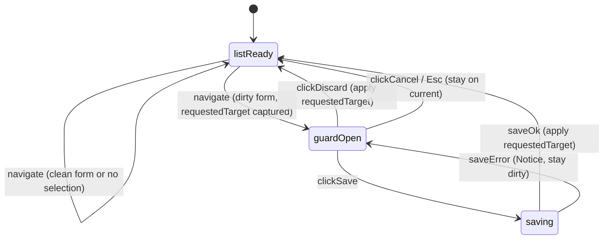

# F39 — In-plugin skill editor · UI

UI layer, Obsidian + React conventions, and platform-API wiring for this spec come from [tech-stack — UI Layer](../../../../standards/tech-stack.md#ui-layer), [tech-stack — Platform APIs](../../../../standards/tech-stack.md#platform-apis), [tech-stack — Agent / Tool / Skill / MCP Wiring](../../../../standards/tech-stack.md#agent--tool--skill--mcp-wiring), [tech-stack — Dependencies — Production](../../../../standards/tech-stack.md#dependencies--production) (`zod`), [architecture §3.1](../../../../architecture/architecture.md#31-ui-layer-react-mounted-inside-obsidian-views), [architecture §3.2](../../../../architecture/architecture.md#32-agent-layer), [architecture §4](../../../../architecture/architecture.md#4-key-contracts), [architecture §6](../../../../architecture/architecture.md#6-state-ownership), [architecture §7](../../../../architecture/architecture.md#7-error-handling-strategy). Mount point is the Skills section of F03's settings tab — see [F03 settings-tab-scaffold UI · Layout](../settings-tab-scaffold/ui.md#layout); parity with [F22 skills-picker-active-skill UI](../skills-picker-active-skill/ui.md) for source-badge style and `SkillsStore` read semantics.

## Layout

### Wireframe 1 — Skills section (list view, collapsed editor)

Mounts inside the Skills accordion placeholder of F03's settings tab. When the accordion is expanded and no skill is selected, only the list + "New skill" CTA render.

```
 0        10        20        30        40        50        60        70        80
 |---------|---------|---------|---------|---------|---------|---------|---------|
+------------------------------------------------------------------------------+
| Obsidian Settings                                                        [x] |
+----------------+-------------------------------------------------------------+
| > Leo          | Leo                                                         |
|                |-------------------------------------------------------------|
|                | [>] Provider                                  (expand)      |
|                | [>] Indexing                                  (expand)      |
|                | [v] Skills                                    (collapse)    |
|                |                                                             |
|                |   Manage prompt presets.  Built-ins are read-only.          |
|                |                                                             |
|                |   +-- Skills ----------------------------------------+      |
|                |   |  General                           [Built-in]   |      |
|                |   |  Default assistant — no allowlist, all tools.   |      |
|                |   |--------------------------------------------------|      |
|                |   |  Write assistant                   [Built-in]   |      |
|                |   |  Clear, concise prose. Read-only tools.         |      |
|                |   |--------------------------------------------------|      |
|                |   |  Research                          [Built-in]   |      |
|                |   |  Deep reads + citations. Read-only tools.       |      |
|                |   |--------------------------------------------------|      |
|                |   |  Code helper                       [Built-in]   |      |
|                |   |  Code explain + edit. read/edit tools.          |      |
|                |   |--------------------------------------------------|      |
|                |   |  My research skill                 [User]       |      |
|                |   |  Custom scaffold for literature reviews.        |      |
|                |   +--------------------------------------------------+      |
|                |                                                             |
|                |   [ + New skill ]                                           |
|                |                                                             |
|                | [>] MCP Servers                               (expand)      |
|                | [>] Plan / Todos                              (expand)      |
|                | [>] Appearance                                (expand)      |
|                | [>] Advanced                                  (expand)      |
+----------------+-------------------------------------------------------------+
```

- Rows are `role="button"` focusable list items; Tab / Shift-Tab enters the list, ↑ / ↓ navigate, Enter opens the editor panel inline below the selected row.
- `[Built-in]` / `[User]` tag mirrors the source-tag style from [F22 UI · Layout 2](../skills-picker-active-skill/ui.md#2-headerbar--picker-open-listbox-anchored-under-badge) so both surfaces agree on provenance signalling (`skill.source` per [architecture §4](../../../../architecture/architecture.md#4-key-contracts)).
- Rows sorted alphabetically by `name`, built-ins and user skills intermixed (same order `SkillsStore.list()` returns).
- `+ New skill` is a standard Obsidian `.mod-cta` button; keyboard-reachable after the last row.

### Wireframe 2 — Editor panel, user skill (editable form)

The selected row expands into an inline editor panel directly beneath it; the rest of the list stays visible so navigation between skills is a single click.

```
 0        10        20        30        40        50        60        70        80
 |---------|---------|---------|---------|---------|---------|---------|---------|
+------------------------------------------------------------------------------+
| [v] Skills                                                    (collapse)     |
|                                                                              |
|  +-- Skills ----------------------------------------+                        |
|  |  General                           [Built-in]   |                        |
|  |  Write assistant                   [Built-in]   |                        |
|  |  Research                          [Built-in]   |                        |
|  |  Code helper                       [Built-in]   |                        |
|  |  > My research skill               [User]  *    |   ← selected + dirty   |
|  +--------------------------------------------------+                        |
|                                                                              |
|  +-- Edit: My research skill ----------------------------------------+       |
|  |                                                                    |     |
|  |  ID          [ my-research-skill                              ]    |     |
|  |              (read-only after create; kebab-case, unique)          |     |
|  |                                                                    |     |
|  |  Name        [ My research skill                              ]    |     |
|  |                                                                    |     |
|  |  Description [ Custom scaffold for literature reviews.        ]    |     |
|  |                                                                    |     |
|  |  System prompt                                                    |     |
|  |  +----------------------------------------------------------+     |     |
|  |  | You are a research assistant. When the user asks about  |     |     |
|  |  | a topic, read cited notes, then summarise with links... |     |     |
|  |  |                                                          |     |     |
|  |  +----------------------------------------------------------+     |     |
|  |                                                                    |     |
|  |  Allowed tools (leave empty = all tools)                          |     |
|  |  [x] read_note     [x] search_vault    [ ] create_note            |     |
|  |  [ ] edit_note     [ ] append_to_note  [ ] read_plan              |     |
|  |                                                                    |     |
|  |  Examples                                                          |     |
|  |  +-- #1 --------------------------------------------------+        |     |
|  |  | User      [ Summarise my inbox notes on topic X   ]   |        |     |
|  |  | Assistant [ Here are the three notes that mention  ]   |  [X]   |     |
|  |  +--------------------------------------------------------+        |     |
|  |  [ + Add example ]                                                 |     |
|  |                                                                    |     |
|  |  Default model   [ qwen2.5-7b-instruct                v ]          |     |
|  |                  (leave empty = use settings default)              |     |
|  |                                                                    |     |
|  |  ! Name must not be empty.                                         |     |
|  |                                                                    |     |
|  |  [ Save ] (primary, disabled when invalid / not dirty)             |     |
|  |  [ Duplicate ]   [ Delete ]   [ Discard changes ]                  |     |
|  +--------------------------------------------------------------------+     |
+------------------------------------------------------------------------------+
```

- `*` glyph next to the row label indicates a dirty form (AC-7 guard reference).
- Inline validation line (`! Name must not be empty.`) renders only when Zod parse fails against F21's shared schema; field-level errors anchor to the offending input and are announced via `aria-live="polite"`.
- Allowed-tools checkboxes are sourced from `ToolRegistry.list()` at mount time (read-only: the editor does not mutate the registry; see [F22 UI · Component mapping](../skills-picker-active-skill/ui.md#component-mapping)).
- `Default model` is an `<input list="...">` datalist pulled from `Provider.listModels()` (F02); falls back to a free-text `<input>` when the provider is unreachable per feature.md open question.
- `Save` is disabled when the form is pristine or when Zod validation fails; `Discard changes` reverts the local draft without touching the store.

### Wireframe 2b — Editor panel, built-in skill (read-only form)

Same panel, but every input is disabled (`aria-disabled="true"`, visual muted via `var(--text-muted)`), `Save` / `Delete` / `Discard changes` are absent, and only `Duplicate` is exposed.

```
+-- View: General ---------------------------------------------------+
|                                                                    |
|  ID          [ general                                    ] *RO    |
|  Name        [ General                                    ] *RO    |
|  Description [ Default assistant — no allowlist...        ] *RO    |
|                                                                    |
|  System prompt                                                     |
|  +----------------------------------------------------------+ *RO  |
|  | You are a helpful assistant...                           |      |
|  +----------------------------------------------------------+      |
|                                                                    |
|  Allowed tools (leave empty = all tools)                           |
|  (all unchecked — empty allowlist = full registry)          *RO    |
|                                                                    |
|  Examples                                                          |
|  (none)                                                      *RO   |
|                                                                    |
|  Default model   (empty — use settings default)              *RO   |
|                                                                    |
|  Built-in skill — read-only. Duplicate to create a user copy.      |
|                                                                    |
|  [ Duplicate ]                                                     |
+--------------------------------------------------------------------+
```

### Wireframe 3 — Confirm-delete prompt (user skill)

Inline-dialog style consistent with [FR-UI-08](../../context.md#fr-ui-08); opens inside the editor panel as a modal overlay above the form (does not replace the panel).

```
+--------------------------------------------------------------------+
|  Delete skill "My research skill"?                             [x] |
+--------------------------------------------------------------------+
|                                                                    |
|  This will remove .leo/skills/my-research-skill.md from disk.      |
|  The built-in list is unaffected.                                  |
|                                                                    |
|  ! 3 thread(s) use this skill and will fall back to "General"      |
|    on their next turn.                                             |
|                                                                    |
|                [ Cancel ]  [ Delete ] (destructive)                |
+--------------------------------------------------------------------+
```

- Warning line shown only when [F14](../conversation-persistence-v1/feature.md) metadata reports one or more threads with `metadata.skillId === skill.id`; text follows AC-5 literal ("N thread(s) will fall back to General").
- `[ Delete ]` uses destructive styling (`.mod-warning`); Esc or `[ Cancel ]` close without mutating the store.
- Focus trap matches the wizard-modal convention in [F03 UI](../settings-tab-scaffold/ui.md#component-mapping); Tab cycles Cancel → Delete → Cancel, Enter on Cancel closes, Enter on Delete confirms.

### Wireframe 4 — Unsaved-changes prompt (guard)

Triggered when: (a) the user selects a different skill row with a dirty form, (b) the user collapses the Skills accordion with a dirty form, (c) the user closes the settings modal with a dirty form.

```
+--------------------------------------------------------------------+
|  Unsaved changes in "My research skill"                        [x] |
+--------------------------------------------------------------------+
|                                                                    |
|  You have unsaved edits. Save, discard, or cancel?                 |
|                                                                    |
|          [ Cancel ]  [ Discard ]  [ Save ] (primary)               |
+--------------------------------------------------------------------+
```

- Esc = `Cancel`; focus returns to whichever element triggered the navigation (consistent with [F22 UI · Event flow C](../skills-picker-active-skill/ui.md#c-esc-closes-menu-precedence) Esc precedence).
- `Save` runs the Save pipeline; only on success does the pending navigation proceed. `Discard` drops the draft silently and proceeds. `Cancel` aborts the navigation.

## State machine

Two machines run side-by-side: `EditorMachine` (per-skill form lifecycle) and `ListMachine` (list selection + unsaved-guard arbitration).

### EditorMachine

```mermaid
stateDiagram-v2
    [*] --> idle
    idle --> creating: clickNewSkill
    idle --> viewing: selectRow(source=builtin)
    idle --> editing: selectRow(source=user)

    viewing --> duplicating: clickDuplicate
    editing --> duplicating: clickDuplicate
    creating --> duplicating: clickDuplicate (disabled in creating — no-op)

    editing --> dirty: fieldChange
    creating --> dirty: fieldChange

    dirty --> dirty: fieldChange
    dirty --> editing: allFieldsRevertedOrDiscarded
    dirty --> validating: clickSave
    validating --> dirty: zodError
    validating --> saving: zodOk
    saving --> editing: saveOk (persisted, form pristine)
    saving --> dirty: saveError (Notice shown, store untouched)

    editing --> deleting: clickDelete
    dirty --> deleting: clickDelete (unsaved-guard fires first via ListMachine)
    deleting --> idle: deleteOk (row unmounts)
    deleting --> editing: deleteCancel
    deleting --> editing: deleteError (Notice shown, store untouched)

    duplicating --> editing: cloneOk (new row, selected as user draft)
    duplicating --> viewing: cloneError (Notice shown; stay on source)

    viewing --> idle: deselect / switchSection
    editing --> idle: deselect (pristine)
    dirty --> dirty: deselectWithGuard (see ListMachine)
```



Validation transitions (inside `dirty`):
- Per-field blur triggers a local `fieldValidate(fieldId)` that runs the narrowed Zod parse; the sticky inline error under the field updates on each parse.
- `clickSave` re-runs the full-schema parse + the duplicate-id guard (`SkillsStore.list().some(s => s.id === draft.id && s !== original)`); both must pass before `validating → saving`.
- `saving` calls `SkillsStore.save(draft)`; `saveOk` is the store ack event; `saveError` surfaces a `Notice` and leaves the draft intact in `dirty`.

### ListMachine (unsaved-guard arbitration)



`requestedTarget` can be: another `skillId`, `null` (collapse accordion / new skill), or `closeSettings`. Same guard shape regardless of trigger (navigation policy unified, consistent with [FR-UI-08](../../context.md#fr-ui-08)).

## Event flow

### A. Create — "New skill" → blank draft → Save

```
[User click "+ New skill"]
       │  onClick
       ▼
 ListMachine.navigate(target=newDraft)
       │
       ├── dirty form? → guardOpen (see ListMachine)
       └── clean → EditorMachine: idle → creating
       ▼
 Draft = {id: generateKebabId("untitled-skill"), name: "", description: "",
          systemPrompt: "", allowedTools: undefined, examples: [],
          defaultModel: undefined, source: "user"}
       │
       ▼
 User fills fields → fieldChange events → EditorMachine: creating → dirty
       │
       ▼
 User clicks Save → validating
       │
       ├─ zod schema parse (F21 shared schema)          → fail → dirty + inline errors
       ├─ duplicate-id guard: SkillsStore.list()         → fail → inline error on ID field,
       │     .some(s => s.id === draft.id)                       store never called
       │
       ▼ zodOk + idUnique
 saving: SkillsStore.save(draft)
       │
       ├─► logger.log("skills.editor.save", {id: draft.id, source: "user"})   (F01 Logger, NFR-LOG-04)
       │
       ├─ok → Notice("Skill saved.")  → EditorMachine: saving → editing
       │      (SkillsStore FS-watch re-emits list; ListMachine re-renders with new row selected)
       │
       └─err → Notice(err.message, "error") → EditorMachine: saving → dirty
              (no logger.log success event; store untouched per architecture §7)
```

### B. Edit + Save (user skill)

```
[User clicks row, source = "user"]
       │
       ▼
 ListMachine.navigate(target=skillId)
       │
       ├── dirty form? → guardOpen
       └── clean → EditorMachine: idle|viewing → editing
       ▼
 Draft initialised from SkillsStore.get(skillId) (shallow clone)
       │
       ▼
 User edits a field → fieldChange → EditorMachine: editing → dirty
       │
       │  Per-field onBlur: run narrowed Zod parse, update inline error
       │
       ▼
 User clicks Save
       │
       ▼ same validating → saving pipeline as Create
 SkillsStore.save(draft)
       │
       ├─► logger.log("skills.editor.save", {id: draft.id, source: "user"})
       │
       ├─ok → Notice("Skill saved.")  → EditorMachine: saving → editing (pristine)
       │      SkillsStore FS-watch (F21) fires cache-refresh event; list row name re-renders
       │      if renamed. Linked F22 HeaderBar badge also re-renders via its own subscription.
       │
       └─err → Notice(err.message, "error") → EditorMachine: saving → dirty
```

### C. Duplicate (any skill, built-in or user)

```
[User clicks Duplicate on row or in editor]
       │
       ▼
 EditorMachine: viewing|editing → duplicating
       │
       ▼
 Compute newId: generateKebabId(source.id) with collision-retry
       │   — e.g. "general" taken → "general-copy" → "general-copy-2" → ...
       │
       ▼
 newName = source.name + " (copy)"
       │
       ▼
 SkillsStore.cloneBuiltin(source.id, newId)   (or user→user clone path)
       │
       ├─► logger.log("skills.editor.duplicate",
       │          {sourceId: source.id, newId, source: "user" (the new row)})
       │
       ├─ok → Notice("Skill duplicated.")
       │      SkillsStore FS-watch re-emits list; ListMachine selects the new row;
       │      EditorMachine: duplicating → editing (on the new user draft)
       │
       └─err → Notice(err.message, "error") → EditorMachine: duplicating → viewing|editing
              (stay on source; no selection change)
```

### D. Delete with confirm (user skill only)

```
[User clicks Delete]
       │
       ▼
 EditorMachine: editing|dirty → deleting  (if dirty, unsaved-guard does NOT fire —
                                          delete implies discarding the draft)
       │
       ▼
 Compute boundThreadCount:
   boundThreadCount = ConversationStore.list()
       .filter(t => t.metadata.skillId === skill.id).length
       (F14 conversation-persistence-v1 read; no mutation)
       │
       ▼
 Render confirm dialog (Wireframe 3); focus on "Cancel"
       │
       ├── Esc / Cancel → EditorMachine: deleting → editing (no store call)
       │
       └── Delete clicked → SkillsStore.delete(skill.id)
              │
              ├─► logger.log("skills.editor.delete", {id: skill.id, source: "user",
              │                                       boundThreadCount})
              │
              ├─ok → Notice("Skill deleted.")
              │      SkillsStore FS-watch re-emits list; row unmounts;
              │      EditorMachine: deleting → idle
              │      Bound threads will self-heal to "General" on next load via
              │      F22's missing-id fallback (see F22 UI · Event flow D).
              │
              └─err → Notice(err.message, "error") → EditorMachine: deleting → editing
                     (store untouched per architecture §7)
```

### E. Discard dirty (unsaved-changes guard)

```
[User navigates away with dirty form]
   navigate trigger ∈ {selectOtherRow, collapseAccordion, closeSettingsModal, clickNewSkill}
       │
       ▼
 ListMachine: listReady → guardOpen (requestedTarget captured)
       │
       ▼
 Render unsaved-changes dialog (Wireframe 4); focus on "Save" (primary)
       │
       ├── Esc / Cancel →
       │     ListMachine: guardOpen → listReady; requestedTarget dropped;
       │     focus returns to the dirty form or the trigger that caused navigation
       │     (matches [FR-UI-08](../../context.md#fr-ui-08) inline-dialog policy)
       │
       ├── Discard →
       │     ListMachine: guardOpen → listReady; EditorMachine: dirty → editing
       │     (reset draft to store-backed clone); apply requestedTarget
       │     (e.g. select new row, or close modal)
       │
       └── Save →
             ListMachine: guardOpen → saving
             EditorMachine: dirty → validating → saving (see flow A Save pipeline)
             ├─ok → apply requestedTarget after saveOk
             └─err → back to guardOpen (Notice; draft preserved)
```

### F. Teardown

```
Settings modal closes (clean):
       │
       ▼
 SettingsTab.hide() → React root containing <SkillEditor/> unmounts
       │
       ├─► unsubscribe SkillsStore cache-refresh listener
       ├─► unsubscribe ConversationStore (bound-thread count query caches)
       ├─► remove document keydown (Esc) handler for inline dialogs
       └─► registered via useEffect cleanup + Plugin.registerDomEvent
              (per [code-style — React 18](../../../../standards/code-style.md#react-18),
               [code-style — Obsidian Plugin Patterns](../../../../standards/code-style.md#obsidian-plugin-patterns))
```

## Component mapping

| UI block | Implementation | Standards / contract link |
|---|---|---|
| Skills accordion section host | Obsidian `Setting` with `.setHeading()` + chevron via `setIcon`; body slot rendered via `createDiv` — the React `<SkillEditor/>` mounts into this slot with `createRoot` from F03's settings-tab scaffold | [Platform APIs — `PluginSettingTab` / `setIcon`](../../../../standards/tech-stack.md#platform-apis); [UI Layer — Framework (React 18)](../../../../standards/tech-stack.md#ui-layer); [F03 UI — Component mapping](../settings-tab-scaffold/ui.md#component-mapping) |
| List container | `<ul role="listbox" aria-label="Skills">` (or `<div role="list">` if multi-select semantics not needed) holding rows sorted by `name` | [UI Layer — Framework](../../../../standards/tech-stack.md#ui-layer); [architecture §3.1](../../../../architecture/architecture.md#31-ui-layer-react-mounted-inside-obsidian-views) |
| Row | `<li role="option" aria-selected>` with `id`, name, description, source-tag; hover `var(--background-modifier-hover)`, selected `var(--interactive-accent)` (background), dirty marker `*` in text | [UI Layer — Styling (Obsidian CSS variables)](../../../../standards/tech-stack.md#ui-layer); [code-style — Styling (Tailwind + Obsidian)](../../../../standards/code-style.md#styling-tailwind--obsidian) |
| `[Built-in]` / `[User]` tag | `<span class="tag">` rendered from `skill.source`; identical style to [F22 UI · Layout 2](../skills-picker-active-skill/ui.md#2-headerbar--picker-open-listbox-anchored-under-badge) for consistency | [architecture §4](../../../../architecture/architecture.md#4-key-contracts) (`Skill.source`); [UI Layer](../../../../standards/tech-stack.md#ui-layer) |
| `+ New skill` button | Obsidian `.mod-cta` button; keyboard-reachable after the last row; calls `EditorMachine: idle → creating` | [Platform APIs — `PluginSettingTab`](../../../../standards/tech-stack.md#platform-apis) |
| Editor panel container | React `<form role="form" aria-label="Edit skill">` mounted directly below the selected row; uses Tailwind + Obsidian CSS vars for inner layout (no custom color literals) | [UI Layer — Styling](../../../../standards/tech-stack.md#ui-layer); [code-style — Styling (Tailwind + Obsidian)](../../../../standards/code-style.md#styling-tailwind--obsidian) |
| Text inputs (`id`, `name`, `description`) | Native `<input type="text">`; `id` has `readonly` after create + title `"ID is immutable after create"`; kebab-case hint below | [UI Layer](../../../../standards/tech-stack.md#ui-layer); Zod schema source: [code-style — Zod & Tool Schemas](../../../../standards/code-style.md#zod--tool-schemas) (reuses F21's schema, no redeclare) |
| System prompt | Native `<textarea>` with `rows=10`, vertical resize only, monospace via `var(--font-monospace)` | [UI Layer — Styling](../../../../standards/tech-stack.md#ui-layer); [code-style — Styling (Tailwind + Obsidian)](../../../../standards/code-style.md#styling-tailwind--obsidian) |
| `allowedTools?` multiselect | React checkboxes rendered from `ToolRegistry.list()` (read-only snapshot at mount) — empty `allowedTools` ≡ undefined; explicit array when any box is checked | [tech-stack — Agent / Tool / Skill / MCP Wiring](../../../../standards/tech-stack.md#agent--tool--skill--mcp-wiring); [architecture §3.2](../../../../architecture/architecture.md#32-agent-layer); [architecture §4](../../../../architecture/architecture.md#4-key-contracts) |
| `examples?` inline rows | Ordered list of React rows, each with two `<input>`s (`user`, `assistant`) and a `[X]` remove button (`setIcon("x")`); `+ Add example` appends; empty list serialises to undefined | [UI Layer](../../../../standards/tech-stack.md#ui-layer); [architecture §4](../../../../architecture/architecture.md#4-key-contracts) |
| `defaultModel?` picker | `<input list="leo-model-suggestions">` + `<datalist>` populated from `Provider.listModels()` (F02); degrades to free-text `<input>` when provider unreachable | [tech-stack — UI Layer](../../../../standards/tech-stack.md#ui-layer); [tech-stack — Dependencies — Production](../../../../standards/tech-stack.md#dependencies--production) |
| Inline validation messages | `<p class="mod-error" role="alert" aria-live="polite">` under offending field, driven by F21's shared Zod schema output | [code-style — Zod & Tool Schemas](../../../../standards/code-style.md#zod--tool-schemas); [tech-stack — Dependencies — Production (zod)](../../../../standards/tech-stack.md#dependencies--production) |
| Save / Duplicate / Delete / Discard buttons | Obsidian `.mod-cta` (Save), `.mod-warning` (Delete), plain buttons for Duplicate / Discard; built-in skills render only Duplicate (see Wireframe 2b) | [Platform APIs](../../../../standards/tech-stack.md#platform-apis); [UI Layer — Styling](../../../../standards/tech-stack.md#ui-layer) |
| Confirm-delete dialog | Obsidian `Modal` subclass `ConfirmDeleteSkillModal` mounted above the editor panel; body rendered via React; focus trap follows F03 `WizardModal` conventions | [Platform APIs — `Modal`](../../../../standards/tech-stack.md#platform-apis); [F03 UI — Component mapping](../settings-tab-scaffold/ui.md#component-mapping) |
| Unsaved-changes dialog | Same `Modal` pattern, distinct subclass `UnsavedChangesModal`; primary button `Save`; Esc = Cancel; reuses the ListMachine `requestedTarget` | [Platform APIs — `Modal`](../../../../standards/tech-stack.md#platform-apis); [FR-UI-08](../../context.md#fr-ui-08) |
| Toasts on save / delete / duplicate success & error | Obsidian `Notice` — success ≤ 4s, error ≤ 8s; error variant uses `.mod-warning` styling | [Platform APIs — `Notice`](../../../../standards/tech-stack.md#platform-apis); [code-style — Error Handling](../../../../standards/code-style.md#error-handling) |
| Skills source (list / get / save / delete / cloneBuiltin) | `SkillsStore` from [F21 skills-loader-builtin](../skills-loader-builtin/feature.md); editor never touches `app.vault.adapter` directly | [architecture §3.2](../../../../architecture/architecture.md#32-agent-layer); [code-style — Obsidian Plugin Patterns](../../../../standards/code-style.md#obsidian-plugin-patterns) |
| Bound-thread count query | `ConversationStore.list()` from [F14 conversation-persistence-v1](../conversation-persistence-v1/feature.md) (read-only); results cached for the dialog lifetime | [architecture §6](../../../../architecture/architecture.md#6-state-ownership) |
| Live re-render on cache refresh | `useEffect` subscribes to `SkillsStore`'s change event (F21 FS-watch); list + (if selection still valid) editor re-render; stale-selection cleared when the selected skill id disappears | [architecture §3.1](../../../../architecture/architecture.md#31-ui-layer-react-mounted-inside-obsidian-views); [code-style — React 18](../../../../standards/code-style.md#react-18) |
| Keyboard model | Tab/Shift-Tab between list + form + buttons; ↑/↓ inside list; Enter opens a row; Esc closes confirm / unsaved-changes dialog (inline-dialog precedence per [F22 UI · Event flow C](../skills-picker-active-skill/ui.md#c-esc-closes-menu-precedence)) | [UI Layer](../../../../standards/tech-stack.md#ui-layer); [FR-UI-08](../../context.md#fr-ui-08) |
| Focus ring | `:focus-visible` outline using `var(--interactive-accent)` on all interactive elements; zero color literals | [UI Layer — Styling](../../../../standards/tech-stack.md#ui-layer); [code-style — Styling (Tailwind + Obsidian)](../../../../standards/code-style.md#styling-tailwind--obsidian) |
| Icons | `setIcon("plus")` on New skill; `setIcon("copy")` on Duplicate; `setIcon("trash-2")` on Delete; `setIcon("x")` on example-remove and modal close; all Lucide glyphs matching Obsidian's set | [Platform APIs — `setIcon`](../../../../standards/tech-stack.md#platform-apis); [UI Layer — Icons](../../../../standards/tech-stack.md#ui-layer) |
| Reduced motion | Accordion / dialog open/close transitions gated by `matchMedia("(prefers-reduced-motion: reduce)")`; under reduced motion, instant swap — no fade or slide | [UI Layer — Styling](../../../../standards/tech-stack.md#ui-layer); parity with [F22 UI — Reduced motion row](../skills-picker-active-skill/ui.md#component-mapping) |
| Structured logs | `logger.log("skills.editor.save" | "skills.editor.delete" | "skills.editor.duplicate", {id, source, ...})` via F01 Logger on every successful mutation; failure paths surface a `Notice` and leave the store untouched per [architecture §7](../../../../architecture/architecture.md#7-error-handling-strategy) | [architecture §3.1](../../../../architecture/architecture.md#31-ui-layer-react-mounted-inside-obsidian-views); [NFR-LOG-04](../../context.md#nfr-log-04); [code-style — Logging](../../../../standards/code-style.md#logging) |

Accessibility invariants applied across all blocks: every interactive element reachable with Tab / Shift-Tab in visual order; modals (confirm-delete, unsaved-changes) trap focus and restore focus to the trigger on close; `Esc` cancels any open modal before propagating; `prefers-reduced-motion: reduce` suppresses modal fade and accordion slide; color is never the sole validation signal (inline `role="alert"` text accompanies red outlines); disabled built-in form inputs carry `aria-disabled="true"` in addition to the `disabled` attribute so assistive tech announces the state correctly.

## Back-link

[<- feature.md](./feature.md)
