# UI — F07 Storybook fixtures for openfang config block

Companion to [`./feature.md`](./feature.md). Specifies the four new Storybook stories' layouts, state machine, event flow, component mapping, and Storybook coverage. UI binds to the existing `ExternalAgentsSection` component (shipped by F11 of the prior slice) plus the openfang `configSchema` (F01 of this slice).

## Layout

### `OpenfangConfigured` (default render with openfang selected + populated)

```
┌─ External Agents ─────────────────────────────────────────────────────────┐
│ Configure adapters that the assistant can call when no built-in tool fits │
│ a request. Concrete adapters are added in code — see SRS §13.             │
│                                                                           │
│ Default adapter: ⌄ openfang                                               │
│                                                                           │
│ ─────────────────────────────────────────────────────────────────────  ▾  │
│ ▼ openfang  ·  ☑ Enabled                                                  │
│   Base URL          [ https://openfang.example.com:4200       ]           │
│   API key  🔒       [ ••••••••••••••••••                       ] 👁       │
│   Session ID        [ leo-thread-001                            ]         │
│   Poll timeout (ms) [ 1800000                                  ]          │
│   Initial interval  [ 2000                                     ]          │
│   Max interval      [ 15000                                    ]          │
│   HTTP timeout (ms) [ 30000                                    ]          │
│   Allow insecure    ☐                                                     │
└───────────────────────────────────────────────────────────────────────────┘
```

### `OpenfangSecretRevealed`

```
│   API key  🔒       [ demo-key-redacted-123                    ] 👁‍🗨      │
```

(Toggle 👁 → 👁‍🗨 reveals plaintext from the in-Story state. Reveal does not change persistence.)

### `OpenfangDisabled`

```
┌─ External Agents ─────────────────────────────────────────────────────────┐
│ Default adapter: ⌄ openfang  ⚠ disabled — falling back to (none)          │
│                                                                           │
│ ▼ openfang  ·  ☐ Enabled                                                  │
│   …  (form fields read-only or grayed)                                    │
└───────────────────────────────────────────────────────────────────────────┘
```

### `OpenfangInvalidBaseUrl`

```
│   Base URL          [ not-a-url                                ]          │
│                     ⚠ Must be a valid URL.                                │
│   API key  🔒       [ ••••••••••••••••••                       ] 👁       │
│   …                                                                       │
```

The inline error appears beneath the offending field; previous valid value remains persisted (per F11 §"Event flow").

## State machine

The settings section's state machine is owned by F11 of the prior slice (see [`../../../external-agent_slice_20260427-022536/features/settings-ui/ui.md`](../../../external-agent_slice_20260427-022536/features/settings-ui/ui.md) §"State machine"). The openfang stories exercise four nodes of that machine, not new states:

```mermaid
stateDiagram-v2
    [*] --> Loaded: section mounts (with openfang in registry)
    Loaded --> Loaded: OpenfangConfigured story — populated, valid
    Loaded --> Revealed: OpenfangSecretRevealed story — reveal pre-clicked
    Revealed --> Loaded: click 👁‍🗨 to re-mask (manual)
    Loaded --> Loaded: OpenfangDisabled story — enabled=false; dropdown shows fallback
    Loaded --> Editing: OpenfangInvalidBaseUrl story — invalid input on Base URL
    Editing --> Loaded: blur → inline error rendered, previous value retained
```



No new transitions or triggers — only new entry points into the existing state graph, parameterized by openfang's schema.

## Event flow

```
Storybook mounts <ExternalAgentsSection registry={mockRegistryWithOpenfang} settings={fixtureSettings} />
  └─► section reads registry.list() → finds 'openfang'
        └─► renders header + dropdown (openfang selected) + openfang block

User (story automation) views the populated form
  └─► every field type-dispatches via F11's `AdapterConfigField` against `openfangConfigSchema`:
        baseUrl       → text input
        apiKey        → password input + reveal toggle (.describe('secret') marker)
        sessionId     → text input
        pollTimeoutMs → number input
        pollInitialIntervalMs → number input
        pollMaxIntervalMs → number input
        httpTimeoutMs → number input
        allowInsecureHttp → checkbox

User clicks reveal on apiKey (OpenfangSecretRevealed)
  └─► local state.toggleReveal()
        └─► <input type="password"> → <input type="text">  (plaintext from local state, no decrypt call in Storybook fixture)

User toggles enabled=false (OpenfangDisabled)
  └─► fixture settings store updated
        └─► dropdown shows fallback warning since openfang was the configured default

Story sets baseUrl='not-a-url' (OpenfangInvalidBaseUrl)
  └─► onBlur fires field-level openfangConfigSchema.shape.baseUrl.parse('not-a-url')
        └─► Zod throws → renders inline error; settings store NOT updated
```

## Component mapping

| UI block | Component | File | Storybook |
|---|---|---|---|
| Section root | `ExternalAgentsSection` (existing) | `src/settings/ExternalAgentsSection.tsx` | `OpenfangConfigured`, `OpenfangSecretRevealed`, `OpenfangDisabled`, `OpenfangInvalidBaseUrl` |
| Default-adapter dropdown | inline `<select>` in `ExternalAgentsSection` | same | covered by `OpenfangConfigured` + `OpenfangDisabled` |
| Openfang adapter block | `AdapterConfigBlock` (internal to F11) | `src/settings/ExternalAgentsSection.tsx` | covered by all four stories |
| `Base URL` text input | `AdapterConfigField` type-dispatched on `z.string().url()` | same | `OpenfangConfigured`, `OpenfangInvalidBaseUrl` |
| `API key` password input + reveal | `AdapterConfigField` on `.describe('secret')` | same | `OpenfangSecretRevealed`, `OpenfangConfigured` |
| Numeric inputs | `AdapterConfigField` on `z.number().int()` | same | `OpenfangConfigured` |
| `Allow insecure HTTP` checkbox | `AdapterConfigField` on `z.boolean()` | same | `OpenfangConfigured` |
| Inline validation error | inline in `ExternalAgentsSection` | same | `OpenfangInvalidBaseUrl` |

Tailwind utilities scoped under `.leo-root` per [`.agent/standards/code-style.md`](../../../../standards/code-style.md) §Styling. Obsidian theme variables for borders, text, backgrounds.

## Storybook

Story matrix (mandatory per Constraint **C-06** of the prior slice)

| Story name | Variant | Notes |
|---|---|---|
| `OpenfangConfigured` | Single openfang adapter, populated valid config, enabled, default | Demonstrates form auto-generation against `openfangConfigSchema`; covers the `Loaded` state |
| `OpenfangSecretRevealed` | Same as above; reveal toggle pre-clicked | Verifies `.describe('secret')` routes to password+reveal; covers the `Revealed` state |
| `OpenfangDisabled` | Openfang present but `enabled=false`; was previous default | Visual confirms F11 fallback-warning branch operates against openfang too; covers the `Loaded` (disabled-default) state |
| `OpenfangInvalidBaseUrl` | `baseUrl='not-a-url'`, others valid | Visual confirms F11 per-field validation runs against openfang's Zod schema; covers the `Editing → Loaded` transition with rejection path |

All stories use either the real `OpenfangAdapter` or a config-only stub; concrete adapter implementation is under F05 of this slice. Stories use the existing Obsidian theme decorator from `.storybook/preview.ts`; no new decorators or globals required.

State-machine coverage check (every state in §"State machine" maps to ≥ 1 variant):

| State | Covered by |
|---|---|
| `Loaded` (populated) | `OpenfangConfigured` |
| `Revealed` | `OpenfangSecretRevealed` |
| `Loaded` (disabled-default fallback) | `OpenfangDisabled` |
| `Editing → Loaded` (validation reject) | `OpenfangInvalidBaseUrl` |

## Back-link

[`./feature.md`](./feature.md)
