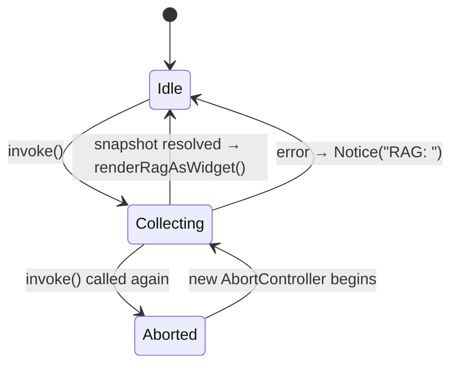

# F03 · rag-slash-command — UI

## Layout

There is no new visual surface in this feature — `/rag` reuses the existing composer + slash picker + message list. The visual outcome is the F02 widget message; this UI doc captures only the slash entry surfaces.

Slash picker entry (existing `SlashPicker` UI, no changes — auto-populated from `registry.list()`):

```
┌─────────────────────────────────────────────────────────┐
│ /clear     Clear current thread                         │
│ /compact   Compact conversation now                     │
│ /context   Show context usage breakdown                 │
│ /rag       Show RAG / index status                      │  ← new entry
└─────────────────────────────────────────────────────────┘
```

Command palette entry (existing Obsidian palette UI):

```
┌─────────────────────────────────────────────────────────┐
│ Leo: Show context                                       │
│ Leo: Show RAG status                                    │  ← new entry
└─────────────────────────────────────────────────────────┘
```

After invocation, the rendered widget itself is fully described by [F02 ui.md](../rag-widget/ui.md).

## State machine



The handle exposes `invoke()` (reentrant — cancels prior in-flight) and `cancel()` (used during `ChatView.onClose`). The command is stateless from the user's perspective: each invocation produces at most one new widget message in the thread.

## Event flow

```
User                     SlashRegistry           RagCommandHandle        F01 Collector       MessageStore        F02 Widget
 │  type "/rag" + Enter      │                          │                       │                  │                  │
 │ ────────────────────────► │                          │                       │                  │                  │
 │                           │ tryHandle("/rag")        │                       │                  │                  │
 │                           │ ───────────────────────► │ invoke()              │                  │                  │
 │                           │                          │ collect(signal)       │                  │                  │
 │                           │                          │ ────────────────────► │ read store/      │                  │
 │                           │                          │                       │ indexer/graph    │                  │
 │                           │                          │ ◄──── snapshot ────── │                  │                  │
 │                           │                          │ append({role:'widget',                  │                  │
 │                           │                          │  widget:{kind:'rag',                    │                  │
 │                           │                          │  props:{snapshot}}})                    │                  │
 │                           │                          │ ───────────────────────────────────────►│                  │
 │                           │                          │                                          │ render(           │
 │                           │                          │                                          │  lookupWidget('rag'),
 │                           │                          │                                          │  props)            │
 │                           │                          │                                          │ ─────────────────►│
 │  see widget appear        │                          │                                          │                  │
 │ ◄─────────────────────────────────────────────────────────────────────────────────────────────────────────────────  │
```

Error path: F01 collector rejects (non-abort) → handle catches → calls `onError(err)` → `ChatView` shows `new Notice('RAG: ' + err.message)` → no message appended.

Cancellation path: a second `/rag` while the first is in flight aborts the first signal; the first promise short-circuits in the handle's `if (controller.signal.aborted) return` branch, and the second invocation proceeds normally. Only the second invocation appends a widget.

Lifecycle: `ChatView.onClose` calls `handle.cancel()` to release any in-flight collection.

## Component mapping

- `createRagCommand(deps)` — new function in `src/ui/ragCommand.ts`. Mirrors `createContextCommand` (same `Promise` + `AbortSignal` shape).
- `ChatView` — registers `/rag` in its slash registry (around the existing `/context` block in `chatView.tsx:534–548`) and a private `renderRagAsWidget(snapshot)` helper that calls `messageStore.append({ role: 'widget', widget: { kind: 'rag', props: { snapshot } } })`.
- `main.ts` — builds the F01 collector using the existing `IndexerRagWiring` exports and passes it via `ChatView.deps`. Registers the palette command via `addCommand({ id: 'leo-show-rag', name: 'Leo: Show RAG status', callback: () => handle.invoke() })`. See [§5.1 Plugin Startup](../../../../architecture/architecture.md#51-plugin-startup) for startup ordering.
- Slash registry contract — same `SlashCommand` shape used by `/context`, `/compact`, `/clear`. See [tech-stack.md UI Layer](../../../../standards/tech-stack.md#ui-layer) for the React/Obsidian view boundary.
- Notice / palette plumbing follows [tech-stack.md Platform APIs](../../../../standards/tech-stack.md#platform-apis).

## Back-link

- [F03 feature.md](./feature.md)
