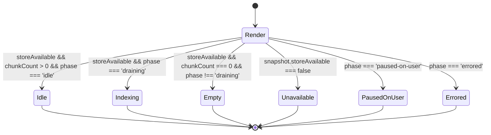

# F02 · rag-widget — UI

## Layout

Default (idle populated) — stat-table inside the same chat message area used by `ContextWidget`.

```
┌─────────────────────────────────────────────────────────────┐
│ RAG · index status                          [available]     │  ← header row
├─────────────────────────────────────────────────────────────┤
│ Files indexed              1,284                            │
│ Chunks                    12,930                            │
│ Embedding model           nomic-embed-text-v1.5             │
│ Vector dimension          768                               │
│ Vector bytes (approx)     ≈ 39.7 MB                         │
│ Graph nodes               1,210                             │
│ Exclude patterns          7                                 │
└─────────────────────────────────────────────────────────────┘
```

Indexing-in-progress variant — appends a progress row below the header, before the stat table.

```
┌─────────────────────────────────────────────────────────────┐
│ RAG · index status                          [indexing]      │
├─────────────────────────────────────────────────────────────┤
│ Indexing… 137 files left · daily/2026-04-26.md              │  ← data-slot="rag-progress"
├─────────────────────────────────────────────────────────────┤
│ Files indexed              1,147                            │
│ … (rest of stat table, dimmed slightly)                     │
└─────────────────────────────────────────────────────────────┘
```

Unavailable variant — replaces the stat table entirely.

```
┌─────────────────────────────────────────────────────────────┐
│ RAG · index status                          [unavailable]   │
├─────────────────────────────────────────────────────────────┤
│ ⚠ RAG unavailable — open-failed                             │  ← data-slot="rag-unavailable"
│   The vector store could not be opened. Try reindex from    │
│   Settings → Leo → Index.                                   │
└─────────────────────────────────────────────────────────────┘
```

Empty-vault variant.

```
┌─────────────────────────────────────────────────────────────┐
│ RAG · index status                          [empty]         │
├─────────────────────────────────────────────────────────────┤
│ No notes indexed yet.                                       │  ← data-slot="rag-empty"
│ Files indexed              0                                │
│ Chunks                     0                                │
│ Embedding model           nomic-embed-text-v1.5             │  ← shown only if header exists
│ Vector dimension          768                               │
└─────────────────────────────────────────────────────────────┘
```

Header right-side badge text drives the visible state (`available` / `indexing` / `unavailable` / `empty` / `paused` / `error`).

## State machine



The component is a pure function over its `RagSnapshot` prop — no internal state transitions; each render picks the variant from the input. Re-issuing `/rag` produces a new widget message with a new snapshot, which is rendered as a fresh component instance.

## Event flow

User invokes `/rag` (handled in F03) → F03 collector resolves → F03 appends a `widget` message with `kind: 'rag'`, `props: { snapshot }` to the message store → `MessageList` looks up `'rag'` in the widget registry → `RagWidget` renders the snapshot.

```
User                     Composer                MessageStore                  WidgetRegistry          RagWidget
 │   types `/rag`           │                          │                              │                     │
 │ ───────────────────────► │                          │                              │                     │
 │                          │ slash dispatch (F03)     │                              │                     │
 │                          │ ───── collect (F01) ──── │                              │                     │
 │                          │ ◄── snapshot ──────────  │                              │                     │
 │                          │ append({role:'widget',   │                              │                     │
 │                          │   widget:{kind:'rag',    │                              │                     │
 │                          │   props:{snapshot}}})    │                              │                     │
 │                          │ ───────────────────────► │                              │                     │
 │                          │                          │ render → lookupWidget('rag') │                     │
 │                          │                          │ ───────────────────────────► │                     │
 │                          │                          │ ◄── component ────────────── │                     │
 │                          │                          │ render(component, props)     │                     │
 │                          │                          │ ───────────────────────────────────────────────►   │
 │ visible widget message   │                          │                              │                     │
 │ ◄────────────────────────┘                          │                              │                     │
```

The widget itself emits no events — it is read-only. Re-running `/rag` produces a separate widget message; the existing one stays in the thread until the thread is cleared.

## Component mapping

- `RagWidget` — top-level functional component in `src/ui/chat/widgets/RagWidget.tsx`. Wraps internal sections.
- `RagWidgetHeader` — colocated helper rendering title + status badge.
- `RagProgressRow` — colocated helper rendering `Indexing… N files left · <basename>` when the snapshot is in `draining` state.
- `RagStatTable` — colocated helper rendering the labeled count rows.
- `RagUnavailable` / `RagEmpty` — colocated helpers for the alternate variants.
- Component layer choice (React 18, function component, no class) follows [tech-stack.md UI Layer](../../../../standards/tech-stack.md#ui-layer).
- Widget registry mechanism (`registerWidget`, `lookupWidget`) is the same one consumed by `ContextWidget` per [tech-stack.md Chat UI](../../../../standards/tech-stack.md#ui-layer).
- Storybook entry uses the existing `*.stories.tsx` pattern wired via `.storybook/main.ts` per [tech-stack.md Tooling & Quality](../../../../standards/tech-stack.md#tooling--quality).
- Styling layer is Tailwind + obsidian CSS variables per [tech-stack.md UI Layer](../../../../standards/tech-stack.md#ui-layer).

## Back-link

- [F02 feature.md](./feature.md)
