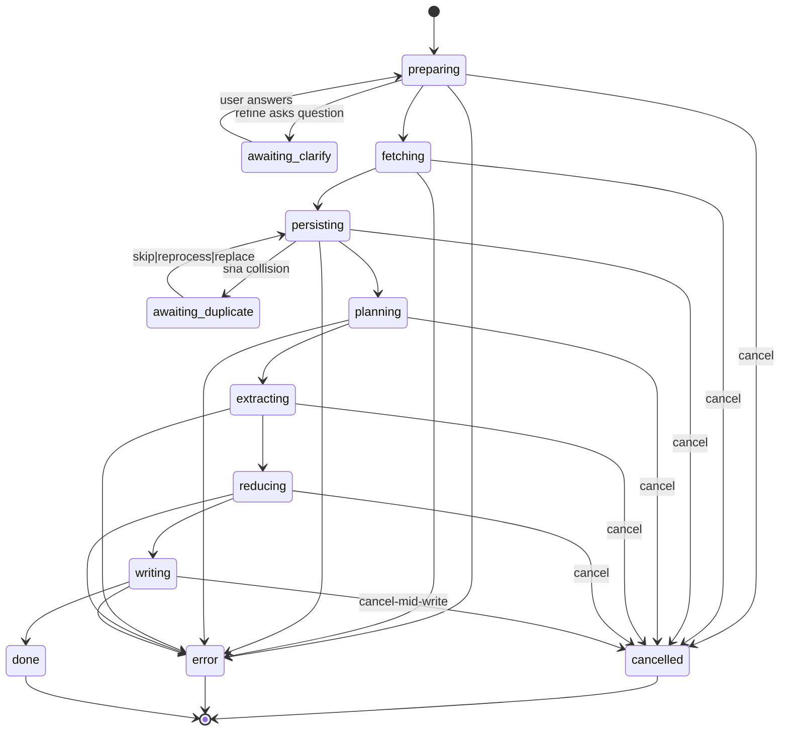

# F06 — UI

## Layout

Live block (active run, ingest):

```
┌─ assistant message bubble ──────────────────────────────────┐
│ ▼ Wiki ingest · runId 20260428-101433-ab12cd · WRITING       │
│                                                              │
│  ┌── live phase content ──────────────────────────────────┐ │
│  │ refining transcript / fetch progress / dup prompt /     │ │
│  │ plan summary / extractor n/N / reducer n/N /            │ │
│  │ writer file k/M / lint confirm list                     │ │
│  └─────────────────────────────────────────────────────────┘ │
│                                                              │
│  [Cancel]                                                    │
└─────────────────────────────────────────────────────────────┘
```

Terminal block (post-terminal, collapsed):

```
┌─ collapsed terminal summary ───────────────────────────────┐
│ ▶ Wiki ingest · DONE · 3 sources · 2 pages created · 12.4s │
└────────────────────────────────────────────────────────────┘
```

Terminal block (expanded):

```
┌─ expanded terminal block ──────────────────────────────────┐
│ Wiki ingest · DONE · runId 20260428-101433-ab12cd          │
│ sources:                                                   │
│   • https://...   → wiki/raw/... · sources/...  [ok]       │
│   • file://...    → wiki/raw/... · sources/...  [ok]       │
│   • attach://...  → wiki/raw/... · sources/...  [skipped]  │
│ pages created: pages/foo.md, pages/bar.md                  │
│ pages edited:  pages/baz.md                                │
│ log: ## [2026-04-28T10:14:45Z] ingest | runId=...          │
└────────────────────────────────────────────────────────────┘
```

## State machine



Lint variant overlays on the same controller:

```
scanning → checking → proposing → awaiting_confirm → writing → done
```

with cancel at every phase (≤ 2 s) and error at every phase. `awaiting_confirm` is interactive: per-finding toggle + Accept all / Reject all / Apply selected; schema patches each have a per-finding confirm overlay.

Reload-rehydrate: any non-terminal snapshot at plugin reload is replaced with `error.code='reload'` (NFR-02).

## Event flow

1. Subgraph emits state transition → controller updates view-model → `useSyncExternalStore` re-renders.
2. User clicks **Cancel** → controller calls `runHandle.abort()` → subgraph transitions per FR-42/43.
3. User answers a clarifying question → controller calls `clarifyAnswer(text)` → LangGraph `interrupt()` resolves.
4. User picks a duplicate resolution (Skip / Re-process / Replace) → controller calls `resolveDuplicate(rawPath, choice)` → subgraph resumes.
5. Lint user picks Apply selected with `acceptedPatchIds[]` → controller calls `confirmFindings(ids)` → CONFIRMING `interrupt()` resolves; WRITING runs.
6. On terminal: controller emits `WikiTerminalSnapshot` → block kind switches to `WIKI_TERMINAL_KIND` → live registry releases the controller.
7. On thread reopen post plugin reload: any non-terminal snapshot rehydrates as `error.code='reload'`.

## Component mapping

| Block | Component | Source |
|---|---|---|
| Live block | `WikiLiveBlock.tsx` registered under `WIKI_LIVE_KIND` | mirrors `src/ui/chat/blocks/ExternalAgentLiveBlock.tsx` per [project-structure.md](../../../../standards/project-structure.md) |
| Terminal block | `WikiTerminalBlock.tsx` registered under `WIKI_TERMINAL_KIND` | mirrors `src/ui/chat/blocks/ExternalAgentTerminalBlock.tsx` |
| Controller | `WikiWidgetController` | mirrors `src/agent/externalAgent/widgetController.ts` |
| Snapshot | `WikiTerminalSnapshot` Zod schema, `schemaVersion:1` | mirrors `src/agent/externalAgent/terminalSnapshot.ts` |
| Block registry | hookup at `src/ui/chat/blocks/index.ts` | per [project-structure.md](../../../../standards/project-structure.md) |
| Theming | Obsidian CSS vars + Tailwind utilities scoped under `.leo-root` | per [code-style.md `Styling (Tailwind + Obsidian)`](../../../../standards/code-style.md) |

`useSyncExternalStore` + function components per [code-style.md `React 18`](../../../../standards/code-style.md).

## Storybook

| component | story file | variants | mocks |
|---|---|---|---|
| `WikiLiveBlock` (ingest) | `src/agent/wiki/widget/WikiLiveBlock.stories.tsx` | preparing-idle, awaiting_clarify, fetching, persisting (no dup), persisting (awaiting_duplicate), planning, extracting (1/3), reducing (2/4), writing (file k/M), cancelled, error-reload, error-other | new `wikiControllerMocks.ts` under `src/ui/chat/__stories__/mocks/` |
| `WikiLiveBlock` (lint) | same file | scanning, checking, proposing, awaiting_confirm-empty, awaiting_confirm-multi, awaiting_confirm-with-schema-drift, writing, cancelled, error | same |
| `WikiTerminalBlock` | `src/agent/wiki/widget/WikiTerminalBlock.stories.tsx` | done-collapsed, done-expanded, error-collapsed, error-expanded, cancelled-collapsed, cancelled-expanded, reload-collapsed | same |

Decorator: existing Obsidian theme decorator from `.storybook/preview.ts`. No new globals or controls.

Every state in `## State machine` is covered by ≥ 1 variant: ingest (preparing↔awaiting_clarify, fetching, persisting↔awaiting_duplicate, planning, extracting, reducing, writing, done, cancelled, error) and lint (scanning, checking, proposing, awaiting_confirm, writing, done, cancelled, error).

## Back-link

[./feature.md](./feature.md)
