# Leo — External Agent Delegation (SRS)

Companion to `srs.md` and `architecture.md`. Specifies the External Agent Delegation feature: the main assistant escalates work it cannot do (no matching tool / long-running research / web access) to a user-confirmed external agent through a dedicated LangGraph subgraph rendered as an inline chat widget.

This SRS is the contract. Every requirement (`FR-EXT-*` / `NFR-EXT-*`) maps to at least one module in §10.

---

## 1. Purpose & Scope

### 1.1 Purpose

Give the main assistant a structured, user-controlled escape hatch for tasks outside its tool set. The escape hatch:

- runs as a per-thread subgraph independent of the main agent loop;
- uses an LLM-driven refine step (with optional user clarifications) before the external call;
- delegates execution to a pluggable, code-defined `ExternalAgentAdapter` (e.g. Claude Code over stdio, OpenAI-compatible HTTP, Perplexity, …);
- streams progress through an inline widget the user can edit, cancel, retime;
- persists request + response + auxiliary files to the vault under a RAG-excluded folder;
- returns a single tool result to the main agent so it can resume reasoning from the produced files.

### 1.2 In Scope (v1)

- Built-in trigger tool `delegate_external`.
- Subgraph state machine (PREPARING → READY → RUNNING → WRITING → DONE/CANCELLED/ERROR).
- Inline widget block (mirrors `PlanApprovalDialog` lifecycle).
- Abstract `ExternalAgentAdapter` base class + `AdapterRegistry`.
- Per-adapter config persistence shape (endpoints, models, secrets) via Settings tab + `SafeStorage`. Settings UI must render gracefully when zero adapters are registered.
- Result folder writer + RAG exclude wiring.

### 1.3 Out of Scope (v1)

- **Concrete built-in adapter implementations** (e.g. Claude Code stdio, OpenAI-compatible HTTP, Perplexity). The contract + registry ship in v1; concrete adapters are added as additive contributions in a follow-up phase. Until at least one adapter is registered, the widget picker shows an empty state with a "Configure adapter" link.
- User-supplied adapter modules (loading arbitrary `.js` from the vault). Tracked under §14.
- Cross-thread / parallel external calls (one slot per thread).
- Resuming an in-flight RUNNING subgraph across plugin reloads.
- Auto-attaching produced files to the next user turn (main agent reads them via existing `read_note` / `read_file`).

---

## 2. Glossary

| Term | Meaning |
|---|---|
| **Main agent** | The thread's primary LangGraph (`src/agent/graph.ts`). |
| **Subgraph** | The external-agent LangGraph defined under `src/agent/externalAgent/`. |
| **Adapter** | A subclass of `ExternalAgentAdapter` that knows how to call one external system. |
| **Refine sub-agent** | An LLM loop inside the subgraph that turns the user's original ask into a final, well-scoped prompt. Uses the thread's provider + a core-owned system prompt. |
| **Refined prompt** | The output of the refine phase. The exact text sent to the adapter. |
| **Widget** | The inline chat message block that surfaces the subgraph state and accepts user input. |
| **Result folder** | `externalAgentResults/<isoTimestamp>/` (vault-relative). Holds `request.md`, `response.md`, optional adapter-produced files, and `error.md` on failure. |

---

## 3. Functional Requirements

### 3.1 Trigger & Confirmation

| ID | Requirement |
|---|---|
| **FR-EXT-01** | A built-in tool `delegate_external` is registered in `ToolRegistry` at plugin load. Its `description` instructs the main agent to use it only when no other tool fits the user's request and the task plausibly needs an external system (research, web search, long-running computation, third-party agent). |
| **FR-EXT-02** | `delegate_external` declares `requiresConfirmation: true`. The confirmation surface is the existing `confirmationController` inline prompt with two actions: **Prepare external agent request** and **Deny**. |
| **FR-EXT-03** | Deny → tool returns `{ ok: false, denied: true }`. The main agent receives this as a tool result and continues normally (no subgraph started). |
| **FR-EXT-04** | Prepare → the subgraph mounts an inline widget block in the same thread (assistant-side message), and the `delegate_external` tool call enters a **suspended** state until the subgraph completes. |

### 3.2 One-Slot Concurrency

| ID | Requirement |
|---|---|
| **FR-EXT-05** | At most one external-agent subgraph may be active per thread. Multiple threads may each have one. |
| **FR-EXT-06** | A second `delegate_external` call in the same thread while one is active returns immediately with `{ ok: false, error: 'busy', activeRunId }` — no new widget is mounted. |

### 3.3 Refine Phase

| ID | Requirement |
|---|---|
| **FR-EXT-07** | The subgraph enters `PREPARING`. A refine sub-agent runs an LLM loop using the thread's current provider + the core-owned refine system prompt (`src/agent/externalAgent/refinePrompt.ts`). The adapter has no influence on this prompt. |
| **FR-EXT-08** | The refine sub-agent may either (a) emit a clarifying question, or (b) emit a `final_prompt`. Clarifying questions trigger LangGraph `interrupt()`. The widget renders the question inside its own conversation area; user replies in the widget. |
| **FR-EXT-09** | Refine iterations are budgeted. Default budget = 3. Budget is configurable in the widget before any iteration completes. Reaching the budget without `final_prompt` forces a transition to `READY` using the sub-agent's current best draft. |
| **FR-EXT-10** | The refine sub-agent **never** calls vault tools, web tools, or `delegate_external` recursively. Its allowed action set is limited to `ask_clarifying_question` and `emit_final_prompt`. |

### 3.4 Ready Phase

| ID | Requirement |
|---|---|
| **FR-EXT-11** | On `READY`, the widget displays the refined prompt in an editable textarea plus three actions: **Send**, **Edit**, **Cancel**. Adapter picker and timeout control are visible and modifiable. |
| **FR-EXT-12** | **Edit** transitions back to `PREPARING`. The user's edited prompt becomes the next refine input; refine budget is **not** reset. (Prevents loops via repeated edits.) |
| **FR-EXT-13** | **Cancel** transitions to `CANCELLED`; tool returns `{ ok: false, cancelled: true, phase: 'ready' }`. |
| **FR-EXT-14** | **Send** transitions to `RUNNING`. The adapter selected in the widget picker (defaulting to the global default from settings) is invoked with the refined prompt. |

### 3.5 Running Phase

| ID | Requirement |
|---|---|
| **FR-EXT-15** | Adapter is invoked via `adapter.start({ refinedAsk, systemPrompt, signal, timeoutMs, config })` and yields `AsyncIterable<ExternalEvent>`. |
| **FR-EXT-16** | Each event updates the widget: `text` chunks append to a streaming response panel; `log` events render in a collapsible log; `file` events show a placeholder until written. |
| **FR-EXT-17** | Timeout: `timeoutMs` (default = `adapter.defaultTimeoutMs`, overridable in widget) starts when `start()` is called. Reaching it triggers the `AbortSignal` and a transition to `ERROR` with `error.code = 'timeout'`. |
| **FR-EXT-18** | **Cancel** during `RUNNING` triggers the `AbortSignal`. The adapter must terminate within ≤ 2 s wall-clock (NFR-EXT-01); partial output is discarded — no result folder is written. Tool returns `{ ok: false, cancelled: true, phase: 'running' }`. |

### 3.6 Writing Phase

| ID | Requirement |
|---|---|
| **FR-EXT-19** | On `done`, the subgraph transitions to `WRITING`. `ResultWriter` creates `externalAgentResults/<isoTimestamp>/` via `VaultAdapter`. |
| **FR-EXT-20** | Always written: `request.md` (the refined prompt + adapter id + start/end times) and `response.md` (the streamed text buffer). Adapter-produced `file` events are written under the same folder using the event's `relPath` (sanitized; absolute paths or `..` segments rejected). |
| **FR-EXT-21** | The folder prefix `externalAgentResults/` is added to the default RAG exclude list in `excludeListStore` on plugin load (idempotent), and is filtered out at `dirtyQueue` intake so it never enters the indexer. |
| **FR-EXT-22** | After `WRITING` succeeds, the subgraph transitions to `DONE` and the `delegate_external` tool resumes with result `{ ok: true, folder, files: string[], summary: string, adapterId, durationMs }`. `summary` = first 500 characters of `response.md`. |

### 3.7 Error Handling

| ID | Requirement |
|---|---|
| **FR-EXT-23** | Any adapter `error` event, an unhandled throw inside the subgraph, or a timeout transitions to `ERROR`. `ResultWriter` writes `error.md` (code, message, timestamps, adapter id, refined prompt) to the result folder; partial `response.md` is also flushed. |
| **FR-EXT-24** | On `ERROR`, the tool returns `{ ok: false, error: { code, message }, folder, files }`. The main agent sees the structured error and may apologize / suggest retry. |

### 3.8 Widget Lifecycle

| ID | Requirement |
|---|---|
| **FR-EXT-25** | The widget is rendered as an inline assistant message block in the thread (mirrors `PlanApprovalDialog`). It is part of the conversation record. |
| **FR-EXT-26** | After `DONE`, `CANCELLED`, or `ERROR`, the widget collapses to a one-line summary (status icon + adapter label + folder link + duration) but remains visible in chat history when the thread is reopened. The collapsed view is expandable to show the recorded refine transcript and final prompt. |
| **FR-EXT-27** | The widget exposes: adapter picker (default from settings), timeout input (default from selected adapter), refine-budget input (default 3), Send / Edit / Cancel buttons (state-dependent), live event log, response stream panel. |

### 3.9 Adapters & Registry

| ID | Requirement |
|---|---|
| **FR-EXT-28** | All adapters are concrete subclasses of `ExternalAgentAdapter` (see §7). Built-in adapters are imported and registered statically at plugin load. |
| **FR-EXT-29** | An `AdapterRegistry` (mirrors `ToolRegistry` shape) exposes `list()`, `get(id)`, `defaultId()`, with the default id stored in plugin settings (`externalAgents.defaultAdapterId`). |
| **FR-EXT-30** | An adapter must declare a Zod `configSchema`. The Settings tab renders one section per adapter, parsing/saving config under `data.json: externalAgents.<id>.config`. Secret fields (`format: 'secret'` in schema metadata) are persisted via `SafeStorage`. |
| **FR-EXT-31** | An adapter MUST NOT receive a `VaultAdapter`, `EditorBridge`, or any vault handle. Its only inputs are `ExternalAgentInput` (refined ask, system prompt, signal, timeout, config). All file persistence is done by core via `ResultWriter`. |
| **FR-EXT-32** | **Deferred from v1.** Concrete built-in adapter implementations (e.g. `claude-code` stdio, `openai-compatible` HTTP/SSE) are out-of-scope for the v1 plan and will be added incrementally in a follow-up phase. v1 ships the contract + registry + UI + settings such that registering an adapter is purely additive. |

### 3.10 Configuration & Settings

| ID | Requirement |
|---|---|
| **FR-EXT-33** | Settings tab gains a section "External Agents" with: global default adapter dropdown, per-adapter config blocks (rendered from `configSchema`), and per-adapter `enabled: boolean`. |
| **FR-EXT-34** | Disabled adapters do not appear in the widget picker. If the global default is disabled, the first enabled adapter (alphabetical by id) becomes the runtime default. |

---

## 4. Non-Functional Requirements

| ID | Requirement |
|---|---|
| **NFR-EXT-01** | Cancel surfaces within ≤ 2 s wall-clock from button press to subgraph terminal state. Adapters must respect the `AbortSignal` and surface abort as a non-error termination. |
| **NFR-EXT-02** | Adapter implementations have no access to vault, editor, or other plugin state. Enforced by passing only `ExternalAgentInput` to `start()` (no ambient `LeoContext`). |
| **NFR-EXT-03** | Result folder writes are atomic per-file. A failure mid-write must still produce `error.md` describing what was/was not flushed. |
| **NFR-EXT-04** | Subgraph state is in-memory only. A plugin reload during `RUNNING` discards the request; the widget transitions to `ERROR { code: 'reload' }` on rehydrate. Document this in the widget's collapsed summary view. |
| **NFR-EXT-05** | Logging: every state transition + adapter event logged at `debug`; errors at `error`. Do **not** log refined-prompt or response content above `debug` level — research content may be sensitive. |
| **NFR-EXT-06** | Bundle: external-agent contract + registry + widget + settings together add ≤ 30 KB minified to `main.js`. No new top-level dependency. (When concrete adapters are added in a later phase, each adapter's bundle impact is tracked separately.) |
| **NFR-EXT-07** | All subgraph nodes that touch IO are wrapped in `try/finally` to ensure `AbortController` cleanup, `child_process` kill, and HTTP body cancellation. |
| **NFR-EXT-08** | The subgraph is unit-testable end-to-end with a mock adapter (`AsyncIterable` of canned events) — no msw or real provider required for the state machine tests. |

---

## 5. State Machine

```
                       Deny
                        ▲
                        │
   delegate_external ──►(confirm)──Prepare──► PREPARING ◄─── Edit ───┐
                                              │   ▲                  │
                                              │   │ interrupt()      │
                                              │   ▼                  │
                                              │  user clarifies      │
                                              │                      │
                                              ▼                      │
                              final_prompt OR budget hit             │
                                              │                      │
                                              ▼                      │
                                            READY  ──────────────────┘
                                              │
                                ┌─── Cancel ──┴── Send ───┐
                                ▼                         ▼
                            CANCELLED                  RUNNING ──── Cancel ──► CANCELLED
                                                          │
                                            done ◄────────┼───────► error / timeout
                                              │                          │
                                              ▼                          ▼
                                           WRITING                     ERROR
                                              │                          │
                                              ▼                          ▼
                                            DONE                      (writes error.md
                                                                       then terminal)
```

Terminal states: `DONE`, `CANCELLED`, `ERROR`. The `delegate_external` tool resumes with the corresponding result object on entry to a terminal state.

---

## 6. Subgraph State Shape

```ts
// src/agent/externalAgent/state.ts
import { z } from 'zod';
import type { BaseMessage } from '@langchain/core/messages';

export type ExternalPhase =
  | 'preparing' | 'ready' | 'running' | 'writing'
  | 'done' | 'cancelled' | 'error';

export interface ExternalAgentState {
  runId: string;                        // ULID; used as folder timestamp suffix
  threadId: string;
  phase: ExternalPhase;

  // Refine
  originalAsk: string;
  refineHistory: readonly BaseMessage[];
  refineIterations: number;
  refineBudget: number;
  refinedPrompt: string | null;

  // Run
  selectedAdapterId: string;
  timeoutMs: number;
  startedAt: number | null;
  endedAt: number | null;

  // Output buffers (in-memory; flushed in WRITING)
  textBuffer: string;
  pendingFiles: ReadonlyArray<{ relPath: string; content: string | Uint8Array; mime?: string }>;
  logEvents: ReadonlyArray<{ level: 'debug'|'info'|'warn'; msg: string; ts: number }>;

  // Result
  resultFolder: string | null;
  writtenFiles: readonly string[];
  error: { code: string; message: string } | null;
}
```

State is the single source of truth for the widget — the widget controller projects `ExternalAgentState` into UI state, no parallel store.

---

## 7. Adapter Contract

```ts
// src/agent/externalAgent/adapters/base.ts
import { z } from 'zod';

export interface ExternalAgentInput {
  readonly refinedAsk: string;
  readonly systemPrompt: string;        // core-owned base; adapter MAY prepend/append
  readonly signal: AbortSignal;
  readonly timeoutMs: number;
  readonly config: unknown;             // already validated against this.configSchema
}

export type ExternalEvent =
  | { type: 'log'; level: 'debug' | 'info' | 'warn'; msg: string }
  | { type: 'text'; chunk: string }
  | { type: 'file'; relPath: string; content: string | Uint8Array; mime?: string }
  | { type: 'done' }
  | { type: 'error'; error: { code: string; message: string } };

export abstract class ExternalAgentAdapter {
  abstract readonly id: string;                 // 'claude-code', 'openai-compatible', ...
  abstract readonly label: string;              // display name for the widget picker
  abstract readonly defaultTimeoutMs: number;
  abstract readonly capabilities: { files: boolean; stream: boolean };
  abstract readonly configSchema: z.ZodType;    // metadata: secret fields tagged `.describe('secret')`
  abstract start(input: ExternalAgentInput): AsyncIterable<ExternalEvent>;
}
```

Rules enforced by code review and lint (architecture.md §1):

- Adapter file imports nothing from `src/agent/`, `src/chat/`, `src/ui/`, `src/storage/`, `src/editor/`. Allowed: `zod`, `node:child_process`, `fetch`, adapter-local helpers.
- Adapter never throws. Errors are surfaced as `{ type: 'error', error }` events.
- Adapter must terminate the iterable on `signal.aborted` within 2 s.

---

## 8. Result Folder Layout

Vault-relative path: `externalAgentResults/<runId>/`

`<runId>` = `YYYYMMDD-HHmmss-<6-char-ulid-tail>` (sortable, collision-resistant).

```
externalAgentResults/
└── 20260427-141503-a1b2c3/
    ├── request.md           # always: refined prompt + adapter id + timing
    ├── response.md          # always: streamed text buffer (may be partial on error)
    ├── error.md             # only on ERROR: { code, message, ts, adapterId, refinedPrompt }
    └── <adapter-files>      # zero or more, paths sanitized
```

`request.md` template:

```markdown
---
runId: 20260427-141503-a1b2c3
adapter: claude-code
threadId: <thread>
startedAt: 2026-04-27T14:15:03Z
endedAt: 2026-04-27T14:18:42Z
status: done
---

# Refined Prompt

<refinedAsk>
```

The folder is excluded from RAG (FR-EXT-21) and indexer intake — the user can still open and read it manually.

---

## 9. Data Flow

```mermaid
sequenceDiagram
    participant U as User
    participant MA as Main Agent
    participant TR as ToolRegistry
    participant CC as ConfirmationController
    participant SG as ExternalAgent Subgraph
    participant W as Widget
    participant PM as ProviderManager
    participant AD as Adapter
    participant RW as ResultWriter
    participant V as VaultAdapter
    participant EX as ExcludeListStore

    MA->>TR: tool_call(delegate_external, { ask })
    TR->>CC: requestConfirmation
    CC-->>U: inline Prepare / Deny
    alt Deny
        U-->>CC: Deny
        CC->>MA: tool_result { ok:false, denied:true }
    else Prepare
        U-->>CC: Prepare
        CC->>SG: start(runId, ask, threadId)
        SG->>W: mount widget (PREPARING)
        loop refine (≤ budget)
            SG->>PM: stream(refine sub-agent prompt)
            PM-->>SG: ask_clarifying OR emit_final_prompt
            opt clarifying
                SG->>W: interrupt(question)
                U-->>W: answer
                W->>SG: resume(answer)
            end
        end
        SG->>W: READY (refinedPrompt)
        alt Edit
            U-->>W: Edit + new text
            W->>SG: re-enter PREPARING
        else Cancel
            U-->>W: Cancel
            SG->>MA: tool_result { ok:false, cancelled:true }
        else Send
            U-->>W: Send
            SG->>AD: start(input)
            loop adapter stream
                AD-->>SG: ExternalEvent
                SG->>W: progress
            end
            AD-->>SG: done | error | (timeout via signal)
            SG->>EX: ensure 'externalAgentResults/' excluded (idempotent)
            SG->>RW: write(folder, request.md, response.md, files...)
            RW->>V: create folder + writeFiles
            RW-->>SG: { folder, writtenFiles }
            SG->>W: collapse to summary
            SG->>MA: tool_result { ok:true, folder, files, summary }
        end
    end
```



---

## 10. Module Map (architecture.md compliance)

All new modules respect the `UI → Agent → Domain/Adapters → Platform` rule (architecture.md §1, §2). No back-edges.

| Module | Layer | Responsibility |
|---|---|---|
| `tools/builtin/delegateExternal.ts` | Agent (tool) | Trigger tool. `requiresConfirmation: true`. On Prepare, hands off to subgraph and suspends until terminal state. |
| `agent/externalAgent/subgraph.ts` | Agent | LangGraph `StateGraph` defining the state machine in §5. Pure node functions where possible; IO isolated. |
| `agent/externalAgent/state.ts` | Agent (Domain) | Typed state shape + Zod. Pure. |
| `agent/externalAgent/refinePrompt.ts` | Agent (Domain) | Pure. Returns the refine sub-agent system prompt (file/return contract instructions). |
| `agent/externalAgent/adapterRegistry.ts` | Agent | Registry mirroring `ToolRegistry`. `list / get / defaultId`. |
| `agent/externalAgent/widgetController.ts` | Agent ↔ UI bridge | Projects `ExternalAgentState` → widget store events; resolves widget actions back into the subgraph. Same pattern as `confirmationController` / `planApprovalController`. |
| `agent/externalAgent/resultWriter.ts` | Adapter | Writes folder + files via `VaultAdapter`. Sanitizes `relPath`. Emits `error.md` on failure paths. |
| `agent/externalAgent/adapters/base.ts` | Agent (contract) | `ExternalAgentAdapter` abstract class + types from §7. |
| `agent/externalAgent/adapters/claudeCode.ts` | Adapter | Built-in. Spawns `claude` CLI via `child_process.spawn`, parses stream-json output. |
| `agent/externalAgent/adapters/openAICompatible.ts` | Adapter | Built-in. POSTs `/v1/chat/completions` with `stream: true`, parses SSE. |
| `ui/chat/blocks/ExternalAgentWidget.tsx` | UI | Inline message block. Live view + collapsed history view. Subscribes to `widgetController`. |
| `ui/chat/blocks/ExternalAgentWidget.stories.tsx` | UI (stories) | Storybook fixtures: each phase + error variant. |
| `settings/externalAgentsSection.ts` | UI (settings) | Settings tab section: default-picker + per-adapter config rendered from `configSchema`. |
| `storage/safeStorage.ts` | Adapter (existing) | Reused for adapter secret fields (no changes). |
| `rag/excludeMatcher.ts` (existing) + `settings/excludeListStore.ts` (existing) | Domain / Settings | `externalAgentResults/` added to defaults at plugin load. |
| `indexer/dirtyQueue.ts` (existing) | Domain | Filter at intake: paths under `externalAgentResults/` are dropped. |
| `chat/messageStore.ts` (existing) | Chat | New block kind `external_agent_widget` recorded in thread JSON so widget rehydrates as collapsed summary. |

### 10.1 Touchpoints to existing modules

| Module | Change |
|---|---|
| `tools/toolRegistry.ts` | Register `delegateExternal` at load. |
| `agent/confirmationController.ts` | Two-action variant ("Prepare" / "Deny") supported (existing pattern allows arbitrary action labels). |
| `agent/graph.ts` | No structural change. The subgraph runs **outside** the main graph; the main graph only sees the suspended tool call and its eventual result. |
| `chat/messageStore.ts` | New persisted block type `external_agent_widget` with payload = `{ runId, phase: terminal, adapterId, folder, files, durationMs, refineTranscript, refinedPrompt, error? }`. |
| `chat/types.ts` | Add `ExternalAgentBlock` to the chat block union. |
| `settings/SettingsTab.ts` | Mount `externalAgentsSection`. |
| `settings/excludeListStore.ts` | Default list includes `externalAgentResults/` (idempotent on load). |
| `indexer/dirtyQueue.ts` | Drop paths matching `externalAgentResults/**` at `add()`. |
| `platform/Logger.ts` | New log namespace `externalAgent.*`. No new sink. |

---

## 11. Settings & Configuration

`data.json` excerpt:

```json
{
  "externalAgents": {
    "defaultAdapterId": "claude-code",
    "claude-code": {
      "enabled": true,
      "config": {
        "binaryPath": "claude",
        "extraArgs": []
      }
    },
    "openai-compatible": {
      "enabled": true,
      "config": {
        "baseUrl": "https://api.perplexity.ai",
        "model": "sonar-pro",
        "apiKeyRef": "safeStorage:externalAgents.openai-compatible.apiKey"
      }
    }
  }
}
```

`apiKeyRef` follows the existing `SafeStorage` indirection convention. The Settings tab displays the field as a password input and writes through `SafeStorage.encrypt`.

---

## 12. Error Handling

| Failure | Handling |
|---|---|
| Adapter throws synchronously inside `start()` | Caught by subgraph IO node → ERROR with `error.code='adapter_throw'`. |
| Adapter emits `{type:'error'}` event | ERROR with adapter-supplied code/message. |
| Adapter never yields and timeout fires | AbortSignal triggered → adapter must terminate; ERROR with `error.code='timeout'`. |
| Adapter ignores AbortSignal beyond 2 s | Subgraph forces transition to ERROR with `error.code='abort_timeout'`; for `child_process` adapters, `SIGKILL` after 2 s grace. |
| `VaultAdapter.create` fails (path collision, permissions) | ResultWriter retries once with a `-retry` suffix on the folder; second failure → ERROR with `error.code='write_failed'`. Tool result still includes `folder: null`. |
| `ExcludeListStore` write fails | Logged at `warn`. Does not block subgraph success — `dirtyQueue` filter is the safety net. |
| Plugin unload during RUNNING | AbortSignal fires from `onunload`. No partial write. Widget rehydrates as ERROR `{code:'reload'}`. |
| Refine sub-agent times out / errors | Subgraph transitions to ERROR with `error.code='refine_failed'`; no adapter call is made; no result folder is written. |
| User denies confirmation prompt | No subgraph started; tool result `{ok:false, denied:true}`. |

---

## 13. Built-in Adapters

**v1 ships zero concrete adapters.** Only the `ExternalAgentAdapter` contract, the `AdapterRegistry`, and the surrounding plumbing (subgraph, widget, result writer, settings UI) ship in v1.

When concrete adapters are added (follow-up phase), each lands as a self-contained additive contribution:

- a single file under `src/agent/externalAgent/adapters/<id>.ts`;
- registration call wired into `main.ts` plugin load;
- corresponding entry under `data.json: externalAgents.<id>`;
- Storybook fixture under the adapter's directory or alongside `ExternalAgentWidget.stories.tsx`;
- unit test under `tests/unit/externalAgent/adapters/<id>.test.ts`.

Strawman targets for the follow-up phase (non-binding sketches):

- **`claude-code`** — spawns Claude Code CLI via `child_process.spawn`; line-delimited JSON stream → `ExternalEvent`s.
- **`openai-compatible`** — POSTs `${baseUrl}/v1/chat/completions` with `stream: true`; SSE deltas → `text` events; secret `apiKey` via `SafeStorage`.

---

## 14. Out of Scope (v1) — Explicit Deferrals

| Topic | Defer to | Rationale |
|---|---|---|
| Concrete built-in adapter implementations (`claude-code`, `openai-compatible`, …) | Follow-up phase | v1 plan slices the contract + plumbing first; adapters land as additive PRs once the platform is solid. Strawman targets sketched in §13. |
| User-supplied adapter `.js` modules in `.leo/adapters/` | Phase 2 | Same `Function`-constructor sandbox concerns as user tools (tech-stack §"Open Decisions"). Decide loader + permission model first. |
| Cross-thread parallel external calls | Phase 2 | UI surface for tracking N widgets is non-trivial; one-slot keeps scope tight. |
| Resume in-flight RUNNING across plugin reload | Phase 3 | Requires checkpoint store for subgraph state + adapter-side resumption protocol. Most adapters can't resume anyway. |
| Auto-attaching produced files to next user turn | — | The main agent has `read_note` / `read_file` and the folder path; explicit attachment is over-eager and breaks user agency. |
| Tool ACL prompts on file writes from external agents | Phase 2 | All writes already go through `ResultWriter` into a single excluded folder; no broader vault touch possible. Revisit if adapters gain write-anywhere capability. |
| Adapters that need access to vault context | — | Out of scope by design (NFR-EXT-02). If an adapter needs note content, the refine sub-agent must inline it into the refined prompt. |

---

## 15. Open Decisions

| # | Decision | Notes |
|---|---|---|
| OD-1 | Refine sub-agent model: same as thread provider, or pinned per-adapter? | Default v1: same as thread. Add per-adapter override later if needed. |
| OD-2 | Refine sub-agent control surface: tool calls (`ask_clarifying_question`, `emit_final_prompt`) or structured-output JSON? | Tool calls reuse existing LangGraph machinery and stream nicely. Lean tool calls. |
| OD-3 | Widget rendering inside main thread vs in a dedicated tab. | SRS picks inline-block per FR-EXT-25. Revisit only if widgets grow large enough to dominate the viewport. |
| OD-4 | `runId` format. | ISO + 6-char ULID tail balances readability vs collision safety. |
| OD-5 | Retry button on ERROR widget. | v1 = no. User can re-issue the message; the refine transcript is preserved in `messageStore` for re-use. |

---

## 16. SRS → Module Mapping

| FR / NFR | Modules |
|---|---|
| FR-EXT-01..04 | `tools/builtin/delegateExternal.ts`, `tools/toolRegistry.ts`, `agent/confirmationController.ts` |
| FR-EXT-05..06 | `agent/externalAgent/subgraph.ts`, `agent/externalAgent/widgetController.ts` |
| FR-EXT-07..10 | `agent/externalAgent/subgraph.ts`, `agent/externalAgent/refinePrompt.ts`, `providers/providerManager.ts` |
| FR-EXT-11..14 | `agent/externalAgent/subgraph.ts`, `ui/chat/blocks/ExternalAgentWidget.tsx`, `agent/externalAgent/widgetController.ts` |
| FR-EXT-15..18 | `agent/externalAgent/subgraph.ts`, `agent/externalAgent/adapters/base.ts`, `agent/externalAgent/adapters/*.ts` |
| FR-EXT-19..22 | `agent/externalAgent/resultWriter.ts`, `storage/vaultAdapter.ts`, `settings/excludeListStore.ts`, `indexer/dirtyQueue.ts` |
| FR-EXT-23..24 | `agent/externalAgent/subgraph.ts`, `agent/externalAgent/resultWriter.ts` |
| FR-EXT-25..27 | `ui/chat/blocks/ExternalAgentWidget.tsx`, `chat/messageStore.ts`, `chat/types.ts` |
| FR-EXT-28..32 | `agent/externalAgent/adapterRegistry.ts`, `agent/externalAgent/adapters/base.ts`, `agent/externalAgent/adapters/claudeCode.ts`, `agent/externalAgent/adapters/openAICompatible.ts` |
| FR-EXT-33..34 | `settings/externalAgentsSection.ts`, `settings/SettingsTab.ts`, `storage/safeStorage.ts` |
| NFR-EXT-01 | `agent/externalAgent/subgraph.ts`, all adapters |
| NFR-EXT-02 | `agent/externalAgent/adapters/base.ts` (contract), ESLint `no-restricted-imports` for adapter files |
| NFR-EXT-03 | `agent/externalAgent/resultWriter.ts` |
| NFR-EXT-04 | `agent/externalAgent/widgetController.ts`, `chat/messageStore.ts` |
| NFR-EXT-05 | `platform/Logger.ts` (namespace `externalAgent.*`) |
| NFR-EXT-06 | esbuild bundle check |
| NFR-EXT-07 | All IO nodes in `agent/externalAgent/subgraph.ts` and adapters |
| NFR-EXT-08 | `tests/unit/externalAgent/*.test.ts` with mock `AsyncIterable` adapter |

Every requirement maps to ≥ 1 module. Any orphan FR or adapter without an FR is a gap — fix here before implementation.
