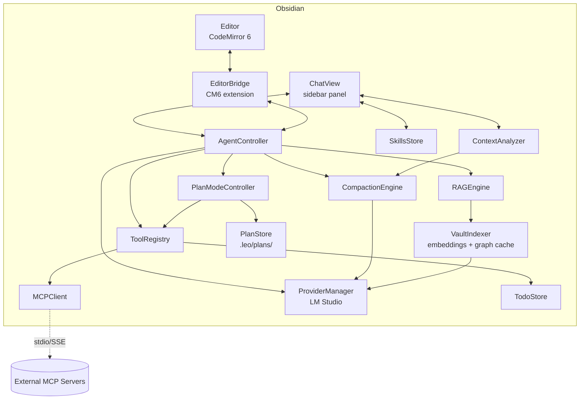

# Leo - Software Requirements Specification

## 1. Introduction

### 1.1 Purpose

Leo is an Obsidian plugin that embeds an AI chat assistant directly into the editor. The agent has real-time access to the active note, cursor context, and the entire vault through a lazily-updated RAG/GraphRAG index. It can read, create, and modify notes on the fly while the user watches changes appear in real time.

### 1.2 Scope

Leo is a desktop-only Obsidian community plugin. It operates local-first — all indexing, embedding, and inference run on the user's machine via LM Studio (or any OpenAI-compatible local server). Cloud providers may be added in later phases.

### 1.3 Definitions

| Term | Definition |
|---|---|
| Vault | The root directory of an Obsidian knowledge base |
| Active note | The markdown file currently open and focused in the editor |
| Focused context | The union of: (a) the currently visible viewport line range, (b) the current selection, (c) the cursor line. All three are sent to the agent; the cursor line is flagged as the focal point. |
| RAG | Retrieval-Augmented Generation — augmenting LLM prompts with relevant retrieved content |
| GraphRAG | RAG enhanced with the vault's link graph to improve retrieval relevance |
| Dirty queue | A set of files that have been modified since last indexing and are awaiting re-embedding |
| LM Studio | A local application that serves LLMs via an OpenAI-compatible HTTP API |
| Edit lock | A CM6 readonly decoration placed over a range currently being modified by the agent |
| Index header | Metadata record `{model, dim, version}` stored alongside the embedding index; mismatch triggers reindex |
| Tool | A typed function the agent can call: built-in, user-defined, or MCP-exposed |
| Tool confirmation | A UI prompt requiring user approval before executing a destructive tool call |
| Skill | A reusable prompt preset: `{name, description, systemPrompt, defaultTools?, examples?}` selectable in the chat view |
| MCP | Model Context Protocol — open protocol for LLM agents to consume external tools, resources, and prompts from standalone servers |
| MCP server | External process (stdio / HTTP+SSE) exposing tools/resources/prompts to Leo |
| MCP host | Leo itself when connecting to and aggregating MCP servers |
| Context window | Max token budget the LLM accepts per request; resolved per-model |
| Compact boundary | System marker inserted where prior messages have been summarized |
| Microcompaction | Lightweight pre-API pruning that clears old tool-result content without summarization |
| Autocompaction | Threshold-triggered full-conversation summarization via secondary LLM call |
| Plan mode | Read-only agent mode for exploration + plan authoring before approval |
| Plan file | Markdown file on disk (`.leo/plans/<slug>.md`) containing the agent's proposed plan |
| Todo list | Per-session mutable checklist maintained by the agent via TodoWrite |

### 1.4 Design Principles

- **Local-first**: All data stays on the user's machine. No telemetry, no cloud calls unless explicitly configured.
- **Lazy and incremental**: Indexing only processes what changed, when it's needed.
- **Non-intrusive**: The plugin must never block the editor or corrupt note content.
- **Single responsibility per module**: Each subsystem (chat UI, editor bridge, indexer, RAG engine, provider, skills, MCP) is independently testable.
- **Safe by default**: Destructive tool calls require explicit user confirmation unless the user has pre-approved the tool for the current thread.

---

## 2. System Overview

### 2.1 Core Subsystems

| Subsystem | Responsibility |
|---|---|
| **ChatView** | Sidebar panel rendering the conversation UI; skill picker; tool-confirmation prompts |
| **EditorBridge** | CM6 extension that tracks cursor, selection, viewport and injects AI edits |
| **AgentController** | Orchestrates the conversation loop: receives user messages, gathers context, calls provider, applies actions |
| **ToolRegistry** | Aggregates built-in tools, user-defined tools, and MCP-exposed tools; supplies them to the agent graph |
| **SkillsStore** | Loads/persists skill definitions; applies selected skill's system prompt and tool allowlist |
| **MCPClient** | Connects to configured MCP servers; discovers and relays tools/resources/prompts |
| **VaultIndexer** | Maintains the embedding index and graph cache; processes the dirty queue |
| **RAGEngine** | Retrieves relevant vault content for a given query using vector search + graph boost |
| **ProviderManager** | Abstracts LLM communication; handles streaming, retries, and provider-specific adapters |
| **CompactionEngine** | Microcompaction, autocompaction, full/partial/session-memory compaction; PTL retry loop (see compact.md) |
| **ContextAnalyzer** | Token counting + per-category breakdown powering `/context` (see context.md) |
| **PlanModeController** | Manages plan/default mode transitions; enforces read-only write-gate; mode-transition attachments (see plan.md) |
| **TodoStore** | In-memory per-agent todo list backing the TodoWrite tool; reminder injection |
| **PlanStore** | Slug-keyed plan file storage under `.leo/plans/` with path-traversal guard |

---

## 3. Functional Requirements

### 3.1 Chat Interface

| ID | Requirement |
|---|---|
| FR-CHAT-01 | The plugin SHALL register a sidebar view (`ItemView`) accessible via a ribbon icon and command palette. |
| FR-CHAT-02 | The chat view SHALL display a scrollable message history with distinct user and assistant message styles. |
| FR-CHAT-03 | The chat view SHALL provide a text input area with multi-line support and send on Enter (Shift+Enter for newline). |
| FR-CHAT-04 | The chat view SHALL stream assistant responses token-by-token as they arrive. |
| FR-CHAT-05 | The user SHALL be able to stop a streaming response mid-generation via `AbortController`. In-flight tool calls complete atomically; remaining queued tool calls are skipped. UI SHALL indicate "cancelled after N tools". |
| FR-CHAT-06 | The chat view SHALL render assistant messages as full markdown using Obsidian's `MarkdownRenderer.render`. Code blocks SHALL have syntax highlighting and a copy-to-clipboard button. |
| FR-CHAT-07 | Each message SHALL expose per-message actions: copy content, regenerate (assistant only), edit-and-resend (user only), delete. Assistant messages are not inline-editable. |
| FR-CHAT-08 | Conversation history SHALL be persisted to `.leo/conversations/` so it survives plugin reloads. |
| FR-CHAT-09 | The chat view SHALL display a context indicator showing active note, viewport range, and selection currently included as context. |
| FR-CHAT-10 | The chat view SHALL queue user messages submitted while a prior request is in-flight (FIFO). |
| FR-CHAT-11 | Token usage per message (input / output / total) SHALL be shown. Cost in $ is shown only when a cloud provider is configured (phase 5). |
| FR-CHAT-12 | The chat view SHALL expose a **skill picker** (dropdown or command) to select the active skill for the current thread. The selected skill's name SHALL be visible in the thread header. |
| FR-CHAT-13 | When the agent requests a tool call that requires confirmation (FR-AGENT-10), the chat view SHALL render an inline confirmation prompt with: tool name, arguments (pretty-printed), Allow once / Allow for thread / Deny buttons. |

### 3.2 Editor Bridge

| ID | Requirement |
|---|---|
| FR-EDIT-01 | The plugin SHALL register a CM6 extension tracking cursor position, selection range, and visible viewport line range. |
| FR-EDIT-02 | The editor bridge SHALL expose Focused Context to the AgentController on every change, debounced to ≤ 1/300ms. |
| FR-EDIT-03 | Listen for `workspace.on('active-leaf-change')` and `workspace.on('file-open')`. |
| FR-EDIT-04 | Listen for `workspace.on('editor-change')` for user edit detection. |
| FR-EDIT-05 | Apply programmatic edits via `Editor.replaceRange()` / `EditorTransaction`, grouped under a single "Leo edit" undo step. |
| FR-EDIT-06 | Install an **edit lock** (CM6 readonly decoration + highlight) over the range being modified. User keystrokes in the locked range are blocked with a Notice. |
| FR-EDIT-07 | Edit locks SHALL release on accept / reject / cancel / failure. |
| FR-EDIT-08 | Modified region highlighted for 3s after edit completes. |
| FR-EDIT-09 | User SHALL accept or reject AI edits via inline diff UI or undo. Reject reverts atomically. |

### 3.3 Agent Controller

| ID | Requirement |
|---|---|
| FR-AGENT-01 | Receive user message + current Focused Context. |
| FR-AGENT-02 | Query RAGEngine before constructing the LLM prompt. |
| FR-AGENT-03 | Construct system prompt from: active skill's system prompt (FR-SKILL-*), active note content, retrieved RAG context, conversation history. Priority on truncation: active note > RAG > history > skill examples. |
| FR-AGENT-04 | Support tool-use via the ToolRegistry. Built-in tools: |
|  | - `read_note(path)` |
|  | - `create_note(path, content)` |
|  | - `edit_note(path, line_start, line_end, new_content)` |
|  | - `append_to_note(path, content)` |
|  | - `search_vault(query, tags?)` |
| FR-AGENT-05 | Active-note modifying tools SHALL apply via EditorBridge (under edit lock). |
| FR-AGENT-06 | Non-active-note tools SHALL apply via Vault API. |
| FR-AGENT-07 | One agent request in-flight at a time. Tool calls serial within a request. |
| FR-AGENT-08 | Context window overflow handled by CompactionEngine (FR-COMPACT-*). Pre-compaction fallback: truncate oldest history first, then RAG context, preserving active note context. |
| FR-AGENT-09 | Each request cancellable via `AbortController`. Cancel finishes current tool (atomicity), skips remaining. |
| FR-AGENT-10 | Each tool SHALL declare a `requiresConfirmation` flag (default: true for write/destructive, false for read). Before calling such a tool, the agent SHALL pause and emit a confirmation event handled by FR-CHAT-13. Resumes on Allow; aborts with a tool-error message on Deny. |
| FR-AGENT-11 | Tools allowed via "Allow for thread" SHALL be remembered in the thread's metadata until thread deletion. |
| FR-AGENT-12 | Tool allowlist: when a Skill defines `allowedTools`, only those tools are exposed to the LLM for the thread. Default skill = all registered tools. |

### 3.4 Vault Indexer

| ID | Requirement |
|---|---|
| FR-IDX-01 | On load, verify Index Header `{model, dim, version}` matches settings. Mismatch prompts reindex (now / later / revert model). |
| FR-IDX-02 | Diff vault state against index to determine files needing (re-)indexing. |
| FR-IDX-03 | Listen to `vault.on('create'/'modify'/'delete'/'rename')` → add to dirty queue. |
| FR-IDX-04 | Process dirty queue lazily: idle timer (default 30s) or on-demand RAG query. |
| FR-IDX-05 | v1 indexes markdown files only. Canvas files added phase 4. PDFs/images deferred post-v1. Binaries skipped. |
| FR-IDX-06 | Chunking: heading-based (default), fallback fixed-size ~512-token overlapping. |
| FR-IDX-07 | Chunk metadata: `{path, line_start, line_end, heading_path, frontmatter_tags, inline_tags}`. |
| FR-IDX-08 | Embed chunks via ProviderManager's embedding model. |
| FR-IDX-09 | Store embeddings + metadata in IndexedDB with Index Header. |
| FR-IDX-10 | Graph cache from `metadataCache.resolvedLinks` as undirected graph (forward + back symmetric). |
| FR-IDX-11 | Incremental graph updates via `metadataCache.on('resolved')`. |
| FR-IDX-12 | Indexing yields to main thread (`requestIdleCallback` chunked loops); never blocks editor. |
| FR-IDX-13 | Manual "re-index vault" command via command palette. |
| FR-IDX-14 | Status bar progress (files remaining, current file). |

### 3.5 RAG Engine

| ID | Requirement |
|---|---|
| FR-RAG-01 | Embed query; cosine similarity search against chunk index. |
| FR-RAG-02 | 1-hop graph boost (default 1.5x) for chunks in notes linked to active note. |
| FR-RAG-03 | 2-hop graph boost (default 1.2x). |
| FR-RAG-04 | Tag-shared boost (default 1.1x, additive with graph boost). |
| FR-RAG-05 | Optional tag filter: only chunks whose note carries any requested tag returned. |
| FR-RAG-06 | Top-K return (default K=10) with `{path, line_start, line_end, score}`. |
| FR-RAG-07 | Merge overlapping chunks from same file. |
| FR-RAG-08 | Respect exclude list (glob patterns). |

### 3.6 Provider Manager

| ID | Requirement |
|---|---|
| FR-PROV-01 | Support LM Studio via OpenAI-compatible API `http://localhost:<port>/v1`. |
| FR-PROV-02 | Auto-detect models via `/v1/models`. |
| FR-PROV-03 | SSE streaming (`stream: true`). |
| FR-PROV-04 | Tool-use via OpenAI-compatible `tools` parameter. |
| FR-PROV-05 | FIFO request queue per provider. Timeout 120s/request. |
| FR-PROV-06 | Retry on connection failure with exponential backoff (max 3). Persistent failure surfaces Notice + status bar indicator. |
| FR-PROV-07 | Provider interface for future providers (OpenAI, Anthropic, Ollama, custom). |
| FR-PROV-08 | Embedding model configurable separately. |
| FR-PROV-09 | Settings tab: endpoint URL, model, temperature, max tokens. |
| FR-PROV-10 | Cloud API keys via Electron `safeStorage` (OS-keyring). Fallback obfuscated with user warning. Never plaintext in vault. |

### 3.7 Skills

| ID | Requirement |
|---|---|
| FR-SKILL-01 | A **Skill** is defined as JSON/markdown with fields: `{id, name, description, systemPrompt, allowedTools?, examples?, defaultModel?}`. |
| FR-SKILL-02 | Skills SHALL be stored in `.leo/skills/` as individual files (one per skill). User-editable. |
| FR-SKILL-03 | Leo SHALL ship a set of **built-in skills** (bundled, non-editable but clonable): "General", "Write assistant", "Research", "Code helper". |
| FR-SKILL-04 | The user SHALL be able to create, edit, delete, duplicate skills from a settings page or dedicated skill-editor view. |
| FR-SKILL-05 | Each thread SHALL have one active skill. Default is "General". The skill can be changed mid-thread. |
| FR-SKILL-06 | Changing a skill mid-thread SHALL apply the new system prompt from the next turn onward; prior turns are not re-sent. |
| FR-SKILL-07 | If a skill declares `allowedTools`, the ToolRegistry SHALL restrict agent-visible tools to that allowlist. |
| FR-SKILL-08 | If a skill declares `defaultModel`, that model overrides the global chat model for threads using the skill. |

### 3.8 Context Compaction

Conversation context management to stay within model window. Full spec: [compact.md](./compact.md).

| ID | Requirement |
|---|---|
| FR-COMPACT-01 | AgentController SHALL implement layered compaction: microcompaction (tool-result clearing), autocompaction (threshold-based summarization), full/partial compaction, session-memory compaction. See compact.md §5–§9. |
| FR-COMPACT-02 | Token counting SHALL follow 3-tier strategy (API usage → hybrid estimation → rough `len/4`). See compact.md §4. |
| FR-COMPACT-03 | Autocompact threshold, buffers, retry limits, and circuit breaker SHALL match constants in compact.md §3. |
| FR-COMPACT-04 | Summarization prompt SHALL use verbatim text from compact.md §10 (analysis + summary XML blocks). |
| FR-COMPACT-05 | Post-compaction message assembly order: boundary marker → summary → preserved → attachments → hook results. See compact.md §11. |
| FR-COMPACT-06 | Prompt-too-long recovery via group-based head truncation with max 3 retries. See compact.md §13. |
| FR-COMPACT-07 | API invariants (tool_use/tool_result pairing, thinking-block continuity) SHALL be preserved on all slicing ops. See compact.md §15. |

### 3.9 Context Visualization (`/context`)

Command/view showing token usage breakdown. Full spec: [context.md](./context.md).

| ID | Requirement |
|---|---|
| FR-CTX-01 | ChatView SHALL expose a `/context` command rendering category breakdown + grid visualization. See context.md §10. |
| FR-CTX-02 | Data pipeline: post-compact-boundary filter → microcompact → `analyzeContextUsage()`. See context.md §3. |
| FR-CTX-03 | Category ordering, colors, and deferred-category handling per context.md §8. |
| FR-CTX-04 | Grid sizing responsive to terminal/panel width per context.md §9.1; partial-square fullness per §9.3. |
| FR-CTX-05 | Suggestions generated with thresholds from context.md §12 (near-capacity, large-tool-results, memory-bloat, etc.). |
| FR-CTX-06 | Token warning state and status-line integration per context.md §13–§14. |

### 3.10 Plan Mode & Todos

Agent-side task tracking and plan/approval flow. Full spec: [plan.md](./plan.md).

| ID | Requirement |
|---|---|
| FR-PLAN-01 | ToolRegistry SHALL expose `TodoWrite` tool with in-memory per-agent storage, keyed by `agentId ?? sessionId`. See plan.md §3. |
| FR-PLAN-02 | TodoWrite prompt text SHALL be copied verbatim from plan.md §3.3. |
| FR-PLAN-03 | Stale-todo reminder SHALL be injected at turn boundaries per plan.md §3.8, rate-limited. |
| FR-PLAN-04 | ToolRegistry SHALL expose `EnterPlanMode` and `ExitPlanMode`; forbidden in subagent contexts per plan.md §4.3. |
| FR-PLAN-05 | Permission system SHALL block all write-capable tools while `mode === 'plan'`; only Read/Grep/Glob/WebFetch/plan-file-write allowed. See plan.md §4.5. |
| FR-PLAN-06 | Plan files stored under `.leo/plans/<slug>.md`; slug cached per session; path-traversal guard required. See plan.md §2.2. |
| FR-PLAN-07 | ExitPlanMode SHALL present plan via approval dialog (Approve / Edit / Reject) per plan.md §5.6; edited plans synced to disk. |
| FR-PLAN-08 | Mode-transition attachments (enter/exit reminders) injected on next turn per plan.md §6. |
| FR-PLAN-09 | Session resume recovers todos from transcript and plan slug/content per plan.md §8. |

### 3.11 MCP Integration

| ID | Requirement |
|---|---|
| FR-MCP-01 | Leo SHALL act as an **MCP host**, connecting to one or more configured MCP servers. |
| FR-MCP-02 | Transports supported: stdio (spawn child process) and HTTP+SSE. |
| FR-MCP-03 | MCP server config stored in `.leo/config.json` under `mcpServers`, shape compatible with standard MCP host config (`{ command, args, env }` for stdio; `{ url }` for SSE). |
| FR-MCP-04 | On plugin load, MCPClient SHALL connect to all enabled servers in parallel. Failed connections log a warning but do not block plugin startup. |
| FR-MCP-05 | MCPClient SHALL discover and register: tools (via `tools/list`), resources (via `resources/list`), prompts (via `prompts/list`). |
| FR-MCP-06 | MCP-exposed tools SHALL be added to the ToolRegistry with namespace prefix `mcp.<serverId>.<toolName>` to avoid collisions. |
| FR-MCP-07 | All MCP tool calls SHALL default to `requiresConfirmation: true` (FR-AGENT-10) unless the user has pre-approved the tool for the thread. |
| FR-MCP-08 | MCP-exposed **resources** SHALL be surfacable in the chat view via a resource picker, inserting their content as context for the next message. |
| FR-MCP-09 | MCP-exposed **prompts** SHALL appear in the skill picker (FR-CHAT-12) as a separate section "From MCP", selectable per-thread. |
| FR-MCP-10 | Settings tab SHALL provide UI to add/edit/remove MCP servers, toggle enabled state, and view connection status per server. |
| FR-MCP-11 | MCP client SHALL reconnect with exponential backoff on disconnect (max 5 attempts, then surface error). |
| FR-MCP-12 | On plugin unload, all MCP stdio child processes SHALL be terminated cleanly (`SIGTERM`, fallback `SIGKILL` after 2s). |

### 3.12 UI Composition & Visual

| ID | Requirement |
|---|---|
| FR-UI-01 | ChatView SHALL decompose into: `HeaderBar` (skill picker, thread title, token indicator), `ContextIndicator` (active note, viewport, selection), `MessageList` (virtualized scroll), `ComposerInput` (multi-line textarea + send/stop button), `InlineConfirmation` (tool prompts), `InlineDialog` (plan approval). |
| FR-UI-02 | ChatView SHALL mount in Obsidian's right sidebar by default; user can move to left sidebar or main workspace leaf via Obsidian's native view APIs. |
| FR-UI-03 | Styling SHALL use Obsidian CSS variables (`--background-primary`, `--text-normal`, `--interactive-accent`, etc.) so light/dark/custom themes apply automatically. No hardcoded colors. |
| FR-UI-04 | A ribbon icon (Obsidian ribbon API) SHALL toggle ChatView. Command palette entries: "Leo: Open chat", "Leo: New thread", "Leo: Toggle plan mode", "Leo: Re-index vault", "Leo: Show context". |
| FR-UI-05 | Per-tool icons SHALL be provided for built-in tools (read/write/search/edit) and rendered in confirmation prompts and message tool-use blocks. MCP tools get a generic MCP icon + server-name label. |
| FR-UI-06 | Visual states SHALL be defined for: idle, streaming (animated cursor), tool-running (spinner + tool name), awaiting-confirmation (amber), error (red), cancelled, edit-locked (editor highlight). |
| FR-UI-07 | Empty / onboarding states SHALL render: first-launch welcome with "Configure LM Studio" CTA; empty thread with example prompts; no-index state with "Index vault" CTA. |
| FR-UI-08 | Notifications policy: transient success/info via `Notice`; persistent state via status bar; blocking errors via inline modal; tool confirmation via inline dialog inside chat (never native modal). |
| FR-UI-09 | Plan approval dialog SHALL render the plan as Obsidian markdown, with an editable textarea for "Edit" mode, buttons: Approve / Edit / Reject. Dialog focus-trapped; Esc = reject. |
| FR-UI-10 | Settings tab hierarchy: Provider → Indexing → Skills → MCP Servers → Plan/Todos → Appearance → Advanced. Each section collapsible. |
| FR-UI-11 | All icons SHALL come from Obsidian's built-in icon set (`setIcon`) or be bundled SVG; no external icon font requests. |
| FR-UI-12 | Animations SHALL respect `prefers-reduced-motion`; streaming cursor, edit-lock pulse, diff transitions disabled when set. |

---

## 4. Non-Functional Requirements

### 4.1 Performance

| ID | Requirement |
|---|---|
| NFR-PERF-01 | Editor context updates add ≤ 5ms latency. |
| NFR-PERF-02 | Indexing off main thread. |
| NFR-PERF-03 | RAG queries ≤ 200ms for vaults up to 10k notes. |
| NFR-PERF-04 | Initial index resumable across Obsidian restarts. |
| NFR-PERF-05 | Chat streaming target 60fps. |
| NFR-PERF-06 | MCP server startup (stdio spawn) SHALL not block plugin `onload` — connect asynchronously. |
| NFR-PERF-07 | Autocompact summarization call SHALL run with keep-alive and ≤ 2 streaming retries; ≤ 3 PTL truncation retries. |
| NFR-PERF-08 | `/context` analysis SHALL run seven counting ops in parallel (`Promise.all`); skill counting error-isolated. |

### 4.2 Data & Privacy

| ID | Requirement |
|---|---|
| NFR-DATA-01 | All data local unless user opts into cloud provider or cloud-backed MCP server. |
| NFR-DATA-02 | Embedding index at `.leo/index/` (configurable). |
| NFR-DATA-03 | No telemetry or analytics. |
| NFR-DATA-04 | MCP server configs that include secrets (API keys in `env`) SHALL be stored via `safeStorage`, not vault plaintext. |

### 4.3 Reliability

| ID | Requirement |
|---|---|
| NFR-REL-01 | LM Studio unreachable → connection indicator; chat disabled; indexing paused. |
| NFR-REL-02 | AI edits atomic. |
| NFR-REL-03 | Corrupt index detected on load; user prompted to rebuild. |
| NFR-REL-04 | Edit lock released on any failure path. |
| NFR-REL-05 | MCP server crash during a tool call SHALL surface as a tool error; agent continues. |
| NFR-REL-06 | Autocompact failures SHALL increment a circuit-breaker counter; 3 consecutive failures disable autocompact for the session. |
| NFR-REL-07 | Plan mode enforcement SHALL be implemented in the permission system (not prompt-only); write tools MUST be blocked while `mode === 'plan'`. |
| NFR-REL-08 | `plansDirectory` SHALL be resolved relative to vault root with path-traversal guard; violating config falls back to default. |

### 4.4 Usability & Accessibility

| ID | Requirement |
|---|---|
| NFR-USE-01 | All config in Obsidian settings tab. |
| NFR-USE-02 | First-time setup wizard for LM Studio. |
| NFR-USE-03 | All hotkeys configurable. |
| NFR-USE-04 | Tool confirmation prompts SHALL clearly distinguish read vs write tools (icon/color). |
| NFR-USE-05 | All interactive elements reachable via keyboard (Tab/Shift-Tab); visible focus ring using Obsidian focus styles. |
| NFR-USE-06 | Chat input: Enter sends; Shift+Enter newline; Cmd/Ctrl+K opens command palette within chat; Esc stops streaming / closes inline confirmations. |
| NFR-USE-07 | ARIA roles on ChatView: `log` for message list, `status` for streaming indicator, `dialog` + `aria-modal` for confirmations and plan approval. |
| NFR-USE-08 | Screen reader SHALL announce: new assistant message (polite live region), tool-confirmation requests (assertive), errors (assertive), streaming start/stop. |
| NFR-USE-09 | Minimum ChatView width 280px; below that, HeaderBar collapses into overflow menu, ContextIndicator collapses to single-line summary. |
| NFR-USE-10 | Colors SHALL maintain WCAG AA contrast against Obsidian default light and dark themes. |
| NFR-USE-11 | z-index layering (top → bottom): Notices → modals (plan approval, settings) → inline dialogs → tooltips → edit-lock decorations → message content. |

### 4.5 Logging & Observability

| ID | Requirement |
|---|---|
| NFR-LOG-01 | `console.{debug,info,warn,error}` gated by `logLevel` setting (default `info`). |
| NFR-LOG-02 | Persistent log at `.leo/logs/leo.log`, rotated 1 MB × 5. |
| NFR-LOG-03 | User errors via `Notice` + status bar. |
| NFR-LOG-04 | Indexing, provider calls, tool invocations, MCP events logged with structured key/value fields. |

### 4.6 Testing

| ID | Requirement |
|---|---|
| NFR-TEST-01 | Vitest unit coverage: chunking, RAG scoring, graph boost, queue, truncation, skill system-prompt assembly, tool-confirmation state machine. |
| NFR-TEST-02 | `msw` fixture server for LM Studio provider tests. |
| NFR-TEST-03 | CM6 code validated via manual integration in dev vault. |
| NFR-TEST-04 | Release smoke: load → index tiny vault → RAG question → agent edit → accept. |
| NFR-TEST-05 | MCP client tested against a reference MCP server fixture (e.g., bundled stdio test server). |
| NFR-TEST-06 | Vitest coverage for CompactionEngine: token estimator tiers, PTL truncation, message grouping, tool_use/tool_result pairing preservation, circuit breaker. |
| NFR-TEST-07 | Vitest coverage for PlanModeController: mode transitions, write-tool blocking, slug generation + path-traversal guard, transcript-recovery fallback chain. |
| NFR-TEST-08 | Vitest coverage for ContextAnalyzer: category ordering, grid allocation (partial-square fullness), suggestion thresholds. |

---

## 5. Development Phases

### Phase 1 — Foundation (MVP)

**Goal**: Chat sidebar + LM Studio + active note context. Single thread.

- ChatView: markdown rendering, streaming, stop, per-message actions
- ProviderManager: LM Studio, FIFO queue, streaming, retries, timeout
- EditorBridge: Focused Context tracking (cursor, selection, viewport)
- AgentController: prompt construction (no tools yet)
- Settings: endpoint, chat model, temperature, max tokens, logLevel
- Logging with rotation

**Deliverable**: Chat with LM Studio, seeing active note + selection.

### Phase 2 — Vault Actions + Tool Confirmation + Basic Skills

**Goal**: Agent reads/modifies notes safely; users pick reusable prompts.

- Built-in tools: `read_note`, `create_note`, `edit_note`, `append_to_note`
- EditorBridge: real-time edit injection, edit lock, accept/reject UI
- AbortController cancel through provider + tool loop
- Conversation persistence (single thread)
- **Tool confirmation prompts** (FR-AGENT-10, FR-CHAT-13). Per-thread allowlist.
- **Basic skills** (FR-SKILL-01..08): built-in skills bundled; skill picker in chat header; `.leo/skills/` load. No skill editor UI yet — edit files manually.
- **Todos + Plan mode** (FR-PLAN-01..09): TodoWrite tool, EnterPlanMode/ExitPlanMode, `.leo/plans/` storage, approval dialog, write-tool gating.

**Deliverable**: Agent edits notes under lock with confirmation; user switches skills per thread; agent tracks todos and proposes plans.

### Phase 3 — RAG

**Goal**: Vault-grounded answers.

- VaultIndexer: dirty queue, markdown-only, heading chunks, frontmatter/tag metadata
- Local embeddings via LM Studio
- IndexedDB vector store + Index Header
- RAGEngine: cosine + exclude list
- `search_vault` tool (with tag filter)
- Status bar progress
- Reindex-on-model-switch flow

**Deliverable**: Vault-grounded Q&A.

### Phase 4 — GraphRAG + Canvas

**Goal**: Graph-boosted retrieval; canvas indexable.

- Graph cache (symmetric)
- Incremental graph updates
- 1-hop + 2-hop + tag-shared boosts
- Graph-aware context assembly
- Canvas file parsing (JSON node text)

**Deliverable**: Better retrieval on linked vaults; canvases searchable.

### Phase 5 — Polish, Skill Editor, User Tools, More Providers

**Goal**: Quality + extensibility.

- Multiple conversation threads (FR-CHAT-06 thread CRUD)
- Token/cost UI ($ column for cloud providers)
- Smart context-window truncation
- Provider adapters: OpenAI, Anthropic, Ollama, custom
- API keys via `safeStorage`
- **Skill editor UI** (in-plugin GUI for FR-SKILL-04, not just file editing)
- **User-defined tools** (sandboxed JS snippet or config-driven tool declarations registered into ToolRegistry)
- **CompactionEngine** (FR-COMPACT-01..07): microcompaction, autocompaction, partial/session-memory compaction, PTL retry
- **ContextAnalyzer + `/context`** (FR-CTX-01..06): token breakdown, grid visualization, suggestions, status-line integration
- Attachments: image paste → vision model; file drop → quote path
- 10k+ vault perf optimization
- Reindex command polish

### Phase 6 — MCP

**Goal**: External tool/resource/prompt ecosystem via MCP.

- MCPClient: stdio + HTTP+SSE transports
- `.leo/config.json mcpServers` config (compatible with standard host shape)
- Parallel server startup, non-blocking
- Tool discovery + namespaced registration (`mcp.<server>.<tool>`)
- Resource picker (insert resource content as context)
- Prompts surfaced in skill picker
- Server management UI in settings (add/edit/remove/enable/status)
- Reconnect w/ backoff
- Clean shutdown on plugin unload
- Secret storage via `safeStorage`

**Deliverable**: Leo consumes arbitrary MCP servers (Filesystem, Git, Slack, custom, etc.) with confirmation gating.

---

## 6. Constraints

| Constraint | Detail |
|---|---|
| Platform | Obsidian desktop (Electron) only. |
| Obsidian min version | 1.5.0. Pinned in `manifest.json`. |
| Language | TypeScript |
| Build | esbuild |
| Editor | CodeMirror 6 |
| Local inference | LM Studio running on user machine |
| Storage | IndexedDB for embeddings; vault filesystem for conversations, logs, config, skills, plans |
| Obsidian API | Public plugin API only |
| MCP | `@modelcontextprotocol/sdk` client; stdio requires Node `child_process` (available in Electron renderer via Obsidian) |
| Testing | Vitest + `msw`; manual integration for CM6 |
